# Visão geral — arquitetura do `.claude/`

## O que este repositório gera

`claude-spring-architect` transforma um diretório vazio em um projeto Spring Boot com
arquitetura declarada, boundaries executáveis (hooks) e uma pipeline de design→código
já instalada. Ele mesmo não compila nada — não tem `pom.xml`, não tem testes Maven. O
produto são arquivos de instrução.

Essa ideia central molda tudo: o próprio `.claude/` deste repositório é organizado como
uma Clean Architecture, com dependências apontando em uma única direção. Isso não é
metáfora — é a regra real de quem pode citar quem (`CLAUDE.md` § Invariants 1 e 2).

## Diagrama geral

```mermaid
flowchart TB
    subgraph L0["Enforcement — determinístico"]
        SETTINGS["settings.json"]:::hook
        HOOK["ArchHook.java\n(check · format · tests · schema\nguard · audit · compose · doctor)"]:::hook
    end

    subgraph L1["Procedimento — skills"]
        CLAUDEMD["CLAUDE.md\n(raiz — índice e roteamento)"]:::claudemd
        SK_INIT["skill: init-project"]:::skill
        SK_BOOT["skill: project-bootstrap"]:::skill
        SK_DESIGNER["skill: claude-code-architect-designer\n(desenha este .claude/ — fica aqui)"]:::skill
        SK_AUDIT["skill: audit-usage"]:::skill
        SK_PAT["skill: java-patterns"]:::skill
        SK_NF["skill: new-feature"]:::skill
        SK_UC["skill: use-case-design"]:::skill
        SK_DOM["skill: domain-modeling"]:::skill
        SK_PERS["skill: persistence-architect"]:::skill
        SK_REST["skill: rest-api-architect"]:::skill
        SK_TEST["skill: test-architect"]:::skill
        SK_DOCKER["skill: docker-architect"]:::skill
        SK_MSG["skill: messaging-architect"]:::skill
        SK_DOCTOR["skill: arch-doctor"]:::skill
        SK_GIT["skill: git-publish"]:::skill
    end

    subgraph L2["Execução isolada — agents"]
        AG_INITZR["agent: project-initializer\n(model: opus)"]:::agent
        AG_DEV["agent: java-spring-boot-developer\n(model: sonnet, effort: max)"]:::agent
        AG_ARCH["agent: archunit-installer\n(model: sonnet, effort: medium)"]:::agent
        AG_LOG["agent: commons-logging-installer\n(model: sonnet, effort: medium)"]:::agent
    end

    subgraph L3["Normas e dados — folhas"]
        RULES["rules/*.md\n(architecture-ddd, naming, error-handling,\ncode-quality, api-rest, lombok,\nvalue-objects, persistence, testing,\nobservability, logging, messaging)"]:::rule
        BLUEPRINTS["blueprints/*/*.yaml\n(_schema.md define o contrato)"]:::blueprint
    end

    CLAUDEMD -->|roteia por tabela| SK_INIT
    CLAUDEMD -->|roteia por tabela| SK_NF
    CLAUDEMD -->|roteia por tabela| SK_DOCTOR
    CLAUDEMD -->|roteia por tabela| SK_DESIGNER
    CLAUDEMD -->|roteia por tabela| SK_AUDIT

    SK_INIT -->|Agent tool: contexto + tools restritos + model opus| AG_INITZR
    AG_INITZR -->|segue o procedimento de| SK_BOOT
    SK_BOOT -->|lê e valida| BLUEPRINTS
    SK_BOOT -->|lê e copia para o projeto gerado| RULES
    SK_BOOT -->|instala, com guard + audit ligados| SETTINGS
    SK_BOOT -->|copia verbatim| HOOK
    SK_BOOT -->|copia| SK_UC & SK_DOM & SK_PERS & SK_REST & SK_TEST & SK_DOCKER & SK_MSG & SK_DOCTOR & SK_NF & SK_GIT & SK_AUDIT & SK_PAT
    SK_BOOT -->|copia| AG_DEV & AG_ARCH & AG_LOG
    SK_DESIGNER -.->|propõe e escreve, após aprovação| SK_UC & AG_DEV & RULES
    AG_DEV -.->|skills: pré-carregada| SK_PAT
    SK_NF -->|Agent tool, pre-flight, se commons vazio| AG_LOG
    AG_LOG -->|escreve| LOGOUT["commons.logging/** + AutoConfiguration.imports"]:::out
    SK_AUDIT -->|Bash, audit summary, sem model| HOOK

    SK_NF -->|Skill tool, em sequência| SK_UC
    SK_UC --> SK_DOM
    SK_DOM --> SK_PERS
    SK_DOM --> SK_REST
    SK_DOM -.->|se evento pede entrega externa| SK_MSG
    SK_PERS -.->|encadeia, sob demanda| SK_DOCKER
    SK_MSG -.->|encadeia, sob demanda| SK_DOCKER
    SK_TEST -.->|encadeia, sob demanda| SK_DOCKER
    SK_PERS --> SK_TEST
    SK_MSG --> SK_TEST
    SK_REST --> SK_TEST
    SK_NF -->|Agent tool, opcional, após consolidar| AG_DEV
    AG_DEV -->|escreve| SRC["src/** do projeto gerado"]:::out
    AG_INITZR -.->|Skill tool, se build verde| SK_GIT
    SK_NF -.->|Skill tool, se DEV reporta sucesso| SK_GIT
    SK_GIT -->|escreve| GITOUT[".git/ + repo remoto (gh)"]:::out

    SK_TEST -->|Agent tool, modo setup, sem argumento| AG_ARCH
    AG_ARCH -->|escreve| ARCHTEST["ArchitectureTest.java + gate JaCoCo"]:::out

    SK_DOCTOR -->|Bash, sem model| HOOK

    SETTINGS -->|UserPromptSubmit / PreToolUse / PostToolUse / Stop / SubagentStop / SessionEnd …| HOOK
    HOOK -->|bloqueia ou avisa sobre| SRC
    HOOK -->|audit: escreve, no projeto gerado| TRAIL[".claude/audit-usage/*.md + history.jsonl + nodes.jsonl"]:::out

    RULES -.->|citadas por path, nunca copiadas| SK_UC & SK_DOM & SK_PERS & SK_REST & SK_TEST & SK_MSG
    BLUEPRINTS -.->|citado por path| SK_BOOT

    classDef hook fill:#5c1a1a,stroke:#ff6b6b,color:#fff,stroke-width:2px
    classDef skill fill:#123a5c,stroke:#5aa9e6,color:#fff,stroke-width:2px
    classDef agent fill:#3a1a5c,stroke:#b98aff,color:#fff,stroke-width:2px
    classDef rule fill:#1a4d2e,stroke:#5ad17a,color:#fff,stroke-width:2px
    classDef blueprint fill:#5c4a1a,stroke:#e6b45a,color:#fff,stroke-width:2px
    classDef claudemd fill:#333,stroke:#ccc,color:#fff,stroke-width:2px
    classDef out fill:#222,stroke:#999,color:#eee,stroke-dasharray: 4 3
```

## Legenda

| Símbolo/cor | Tipo | O que significa aqui |
|---|---|---|
| 🟥 Vermelho | **Hook** (`settings.json` + `ArchHook.java`) | Enforcement determinístico. Roda sempre que o evento dispara, independente da decisão do modelo. Ver [01-tipos-de-arquivo.md](01-tipos-de-arquivo.md#hook) |
| 🟦 Azul | **Skill** (`SKILL.md`) | Procedimento. Vira parte do repertório do modelo; pode ser invocado por comando ou automaticamente. Ver [§ Skill](01-tipos-de-arquivo.md#skill) |
| 🟪 Roxo | **Agent** (`.claude/agents/*.md`) | Execução isolada — contexto próprio, tools restritas, model diferente. Ver [§ Agent](01-tipos-de-arquivo.md#agent-subagent) |
| 🟩 Verde | **Rule** (`.claude/rules/*.md`) | Norma. Folha do grafo — nunca menciona skill, agent ou comando. Ver [§ Rule](01-tipos-de-arquivo.md#rule) |
| 🟧 Laranja | **Blueprint** (`.claude/blueprints/*/*.yaml`) | Dado declarativo de arquitetura. Folha, como as rules, mas em YAML, não em prosa. Ver [05-blueprints.md](05-blueprints.md) |
| ⬛ Cinza | **`CLAUDE.md`** | Índice e tabela de roteamento. Carrega sempre no início da sessão. Ver [§ CLAUDE.md](01-tipos-de-arquivo.md#claudemd) |
| Linha sólida | Chamada ativa | Uma peça invoca a outra via Skill tool, Agent tool, ou exec direto |
| Linha tracejada | Citação/leitura | Uma peça lê ou cita a outra por path, sem invocá-la |

## Por que a direção das setas importa

A regra estrutural do repositório (`CLAUDE.md` § Invariants 1, 4 e 6) é: **rules nunca
mencionam skills, agents ou comandos**. Se uma rule precisasse invocar algo, ela
deixaria de ser norma e passaria a ser procedimento — e procedimento é skill. É por
isso que, no diagrama, as setas de `rules/` e `blueprints/` são sempre tracejadas e
saem de quem as lê, nunca o contrário.

Da mesma forma, um agent só existe por um dos três motivos válidos (`CLAUDE.md` §
Invariant 5): preservar contexto, restringir tools, ou trocar de modelo. `project-initializer`
e `java-spring-boot-developer` atendem aos três motivos simultaneamente;
`archunit-installer` e `commons-logging-installer` atendem só ao primeiro (preservar
contexto — nenhum dos dois tem entrevista, e isolar o `curl`/`./mvnw` que rodam evita
que esse ruído fique permanente na conversa principal). Um motivo já basta pelo
Invariant 5. Cada agent documenta o próprio motivo na seção `## Why this is an agent`
(ou `## Why this is Form 3`).

O hook é a única peça fora desse grafo de citações: `settings.json` o dispara em
eventos do ciclo de vida, e o que ele lê (`forbidden-imports.txt`, `extensions.json`)
é dado, não prosa. No projeto gerado ele ganha dois modos que aqui ficam inertes —
`guard`, que bloqueia uma skill de design de escrever em `src/` e congela specs
aprovados, e `audit`, que grava a trilha de execução de toda skill e agent. Ver
[08-audit-usage.md](08-audit-usage.md).

## Os comandos, em uma frase cada

| Comando | O que faz | Detalhes |
|---|---|---|
| `/init-project` | Interview → escolhe blueprint → gera estrutura completa do projeto Spring Boot, sem código de negócio | [02-init-project.md](02-init-project.md) |
| `/new-feature <descrição>` | Desenha um caso de uso por execução (caso de uso → domínio → REST → persistência → testes) num spec único, pede aprovação e oferece o executor | [03-new-feature.md](03-new-feature.md) |
| `/arch-doctor` | Diagnostica hooks ativos, boundaries carregadas, wrapper do Maven, `java` no PATH, schema, trilha de auditoria, serviços do compose | [04-arch-doctor.md](04-arch-doctor.md) |
| `/audit-usage` | Lê a trilha de auditoria do projeto gerado: gasto por skill e agent entre execuções, taxa de falha, qual relatório abrir. Aqui reporta que a trilha está desligada | [08-audit-usage.md](08-audit-usage.md) |
| `/claude-code-architect-designer` | Decide qual forma (skill, agent, rule, seção do `CLAUDE.md`, MCP — ou nada) resolve um cenário, e escreve o arquivo após aprovação. Só neste meta-repo | [06-claude-code-architect-designer.md](06-claude-code-architect-designer.md) |

`git-publish` não é um quarto comando de topo — é uma skill Forma 1 (sem
`disable-model-invocation`) encadeada automaticamente por `project-initializer` (fim do
`/init-project`, se o build passou) e por `/new-feature` (todo fim de fluxo com spec aprovado — depois
que o executor reporta sucesso, ou só os docs quando o usuário não implementa agora), e também invocável diretamente pelo usuário. Dois portões de
`AskUserQuestion` no corpo da skill substituem a flag como guarda — mesmo padrão do D17
(`@.claude/decisions/0007-pipeline-skills-invocation.md`), documentado em
`@.claude/decisions/0034-git-publish-skill.md`.
