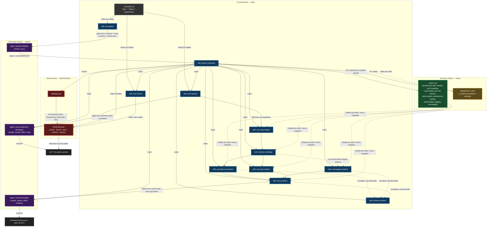

# Visão geral — arquitetura do `.claude/`

## O que este repositório gera

`ai-spring-setup` transforma um diretório vazio em um projeto Spring Boot com
arquitetura declarada, boundaries executáveis (hooks) e uma pipeline de design→código
já instalada. Ele mesmo não compila nada — não tem `pom.xml`, não tem testes Maven. O
produto são arquivos de instrução.

Essa ideia central molda tudo: o próprio `.claude/` deste repositório é organizado como
uma Clean Architecture, com dependências apontando em uma única direção. Isso não é
metáfora — é a regra real de quem pode citar quem (`CLAUDE.md` § Invariants 1 e 2).

## Diagrama geral

## Legenda

| Símbolo/cor | Tipo | O que significa aqui |
|---|---|---|
| 🟥 Vermelho | **Hook** (`settings.json` + `ArchHook.java`) | Enforcement determinístico. Roda sempre que o evento dispara, independente da decisão do modelo. Ver [01-tipos-de-arquivo.md](01-tipos-de-arquivo.md#hook) |
| 🟦 Azul | **Skill** (`SKILL.md`) | Procedimento. Vira parte do repertório do modelo; pode ser invocado por comando ou automaticamente. Ver [§ Skill](01-tipos-de-arquivo.md#skill) |
| 🟪 Roxo | **Agent** (`.claude/agents/*.md`) | Execução isolada — contexto próprio, tools restritas, model diferente. Ver [§ Agent](01-tipos-de-arquivo.md#agent-subagent) |
| 🟩 Verde | **Rule** (`.claude/rules/*.md`) | Norma. Folha do grafo — nunca menciona skill, agent ou comando. Ver [§ Rule](01-tipos-de-arquivo.md#rule) |
| 🟧 Laranja | **Blueprint** (`.claude/blueprints/*/*.yaml`) | Dado declarativo de arquitetura. Folha, como as rules, mas em YAML, não em prosa. Ver [05-blueprints.md](05-blueprints.md) |
| ⬛ Cinza | **`CLAUDE.md`** | Índice e tabela de roteamento. Carrega sempre no início da sessão. Ver [§ CLAUDE.md](01-tipos-de-arquivo.md#claudemd) |
| Linha sólida | Chamada ativa | Uma peça invoca a outra via Skill tool, Agent tool, ou exec direto |
| Linha tracejada | Citação/leitura | Uma peça lê ou cita a outra por path, sem invocá-la |

## Por que a direção das setas importa

A regra estrutural do repositório (`CLAUDE.md` § Invariants 1, 4 e 6) é: **rules nunca
mencionam skills, agents ou comandos**. Se uma rule precisasse invocar algo, ela
deixaria de ser norma e passaria a ser procedimento — e procedimento é skill. É por
isso que, no diagrama, as setas de `rules/` e `blueprints/` são sempre tracejadas e
saem de quem as lê, nunca o contrário.

Da mesma forma, um agent só existe por um dos três motivos válidos (`CLAUDE.md` §
Invariant 5): preservar contexto, restringir tools, ou trocar de modelo. `project-initializer`
e `java-spring-boot-developer` atendem aos três motivos simultaneamente;
`archunit-installer` atende só ao primeiro (preservar contexto — o modo setup da
`test-architect` não tem entrevista, e isolar o `curl`/`./mvnw` que ele roda evita que
esse ruído fique permanente na conversa principal). Um motivo já basta pelo Invariant 5.
Cada agent documenta o próprio motivo na seção `## Why this is an agent` (ou `## Why
this is Form 3`).

## Os três comandos, em uma frase cada

| Comando | O que faz | Detalhes |
|---|---|---|
| `/init-project` | Interview → escolhe blueprint → gera estrutura completa do projeto Spring Boot, sem código de negócio | [02-init-project.md](02-init-project.md) |
| `/new-feature UC-NNN-slug` | Orquestra 5 skills de design (caso de uso → domínio → persistência → REST → testes) em um spec único, e opcionalmente aciona o executor | [03-new-feature.md](03-new-feature.md) |
| `/arch-doctor` | Diagnostica hooks ativos, boundaries carregadas, wrapper do Maven, `java` no PATH | [04-arch-doctor.md](04-arch-doctor.md) |
