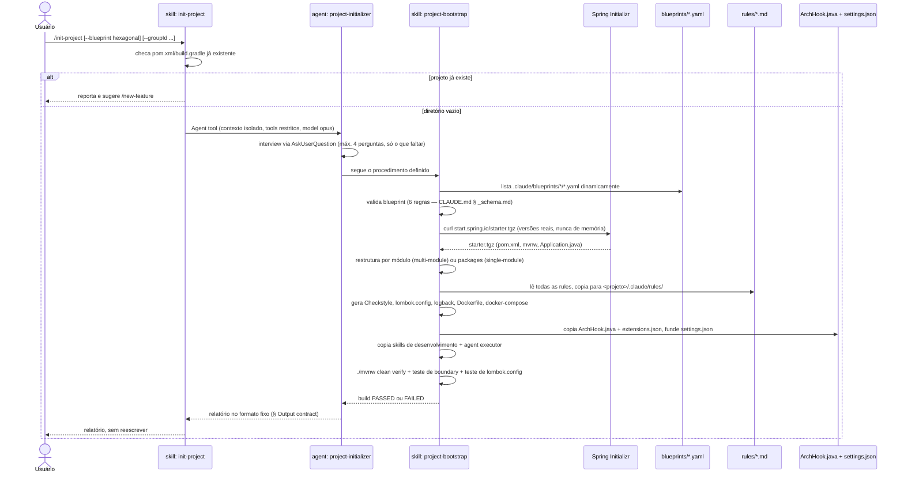

# `/init-project` — criar um projeto do zero

Fonte primária: `.claude/skills/init-project/SKILL.md`,
`.claude/agents/project-initializer.md`, `.claude/skills/project-bootstrap/SKILL.md`.

## O que faz

Transforma um diretório vazio em um projeto Spring Boot com arquitetura declarada,
boundaries executáveis e build verde — **sem código de negócio**. Nenhum exemplo, seed
ou aggregate de demonstração: o bootstrap gera estrutura, e a primeira feature vem do
pipeline `/new-feature`, de uma spec real
(`.claude/decisions/0011-bootstrap-without-business-code.md`, citado em
`project-bootstrap/SKILL.md`).

## Por que é uma skill que delega para um agent

`init-project/SKILL.md` é `disable-model-invocation: true` — ritual manual, nunca
disparado pelo modelo sozinho. Ela mesma não faz o trabalho: delega via `Agent tool`
para `project-initializer`, que existe como agent por dois dos três motivos válidos
(`CLAUDE.md` § Invariant 5) — geração produz saída verbosa que não deveria encher a
conversa, e roda com um conjunto restrito de tools. `project-initializer` usa
`model: opus` porque validar um grafo de dependências e reestruturar módulos falha
caro se o modelo errar.

`project-initializer`, por sua vez, **não reimplementa o procedimento** — ele segue
`.claude/skills/project-bootstrap/SKILL.md` passo a passo. A skill `project-bootstrap`
tem `disable-model-invocation` ausente (portanto invocável pelo modelo também), mas na
prática só é acionada por este caminho e por `/new-feature` quando um projeto ainda
não existe.

## Diagrama de sequência



## Passos do procedimento (`project-bootstrap`, resumo)

| # | Passo | O que grava |
|---|---|---|
| 1 | Seleciona o blueprint | — |
| 2 | Valida o blueprint | — |
| 3 | Gera a base via Spring Initializr | `pom.xml`, `mvnw`, `Application.java` |
| 4 | Reestrutura por módulo/packages | `*/pom.xml`, `package-info.java` |
| 4.6 | Gera Checkstyle | `config/checkstyle/checkstyle.xml` |
| 4.7 | Materializa packages + config de features ativas | `package-info.java`, `application-actuator.yml`, `db/migration/` vazio |
| 4.8 | Gera `lombok.config` | `lombok.config` na raiz |
| 4.9 | Gera `logback-spring.xml` | `<módulo-main>/src/main/resources/logback-spring.xml` |
| 4.10 | Gera Dockerfile + docker-compose base | `Dockerfile`, `docker-compose.yml` (só serviço `app`) |
| 5 | Gera o mapa de boundaries | `.claude/forbidden-imports.txt` |
| 6 | Gera `CLAUDE.md` raiz + por módulo | `CLAUDE.md`, `*/CLAUDE.md` |
| 6.5 | Gera CI | `.github/workflows/build.yml` |
| 6.6 | Copia as rules | `.claude/rules/*.md` |
| 6.7 | Copia as skills de desenvolvimento | `.claude/skills/{arch-doctor,use-case-design,domain-modeling,persistence-architect,rest-api-architect,test-architect,new-feature,docker-architect,messaging-architect,java-patterns}/**` |
| 6.8 | Copia os agents de desenvolvimento | `.claude/agents/{java-spring-boot-developer,archunit-installer}.md` |
| 7 | Instala os hooks | `ArchHook.java`, `extensions.json`, funde `settings.json` |
| 8 | Verifica | `./mvnw clean verify`, teste de boundary, teste de `lombok.config`, teste de autonomia |

O passo 8 é o único portão de qualidade: se o build falhar, **corrige antes de
reportar** — um bootstrap que entrega build vermelho não está terminado.

## Exemplo de invocação (fictício)

```
/init-project --blueprint hexagonal --groupId com.acme --name pedidos-api --build maven
```

Como `--blueprint`, `--groupId` e `--name` já vieram nos argumentos, `project-initializer`
não pergunta de novo sobre eles — só entrevista o que falta: build (já veio, também
pula) e **features** (REST, JPA+Flyway, Kafka, SQS, OpenAPI, Testcontainers, Actuator).
Suponha que o usuário responde: REST, JPA+Flyway, OpenAPI, Testcontainers, Actuator
(sem Kafka/SQS).

## Relatório de saída (exemplo, formato fixo de `project-bootstrap/SKILL.md`)

```
✅ Project pedidos-api created — blueprint hexagonal

Modules:
  domain                    → depends on []
  application                → depends on [domain]
  adapters/adapter-in-rest       → depends on [application, domain]
  adapters/adapter-out-persistence → depends on [application, domain]
  bootstrap                  → depends on [*]

Versions (resolved by the Initializr): Java 21 · Spring Boot 3.4.1 · maven
Active features: rest, validation, persistence-jpa, uuid-v7, flyway, openapi,
  testcontainers, actuator, observability
Business code: none — by design. 9 package-info.java written
Boundaries: 9 rules in .claude/forbidden-imports.txt — blocking verified ✓
Checkstyle: config/checkstyle/checkstyle.xml — plugin 3.5.0 · tool 10.20.2, validate phase
Lombok: lombok.config at the root — @Data and @Setter stop compilation
ArchUnit: to be installed — `test-architect` skill, setup mode (delegates to `archunit-installer`, see Next steps)
Coverage: JaCoCo generates a report; the 80%/70% gate comes in with `test-architect`
Self-contained: 11 rules + 9 skills + 2 agents + ArchHook.java + extensions.json copied — no dead paths ✓
Docker: base Dockerfile + docker-compose.yml (app service only) — extend with `docker-architect` when a feature needs one
Build: PASSED

Next steps:
  1. /use-case-design <first-use-case-name>
  2. Install the architecture tests (ArchUnit) and wire up the coverage gate with the
     test-architect skill as soon as business classes exist. Until then boundaries
     are guaranteed only by the hook (inside Claude Code), and by the POMs'
     depends_on (in the build) — only if layout: multi-module.
```

> Os números de versão (Java, Spring Boot, Checkstyle, plugin) são **sempre resolvidos
> em runtime** contra o Spring Initializr e o Maven Central — nunca escritos de
> memória (`CLAUDE.md` § Invariant 8). Os valores acima são ilustrativos para este
> exemplo fictício, não uma promessa de versão fixa.

## O que acontece depois

O projeto gerado é **autocontido** (`CLAUDE.md` § Invariant 9): quem clona
`pedidos-api` não tem `ai-spring-setup` na máquina. Tudo que o `CLAUDE.md` do projeto
cita já foi copiado para dentro dele — rules, skills de desenvolvimento, o agent
executor, `ArchHook.java`, `extensions.json`. As skills de criação
(`project-bootstrap`, `init-project`) e os `blueprints/` ficam de fora de propósito:
só fazem sentido antes do projeto existir.

A partir daqui, o fluxo natural é `/new-feature` — ver
[03-new-feature.md](03-new-feature.md).
