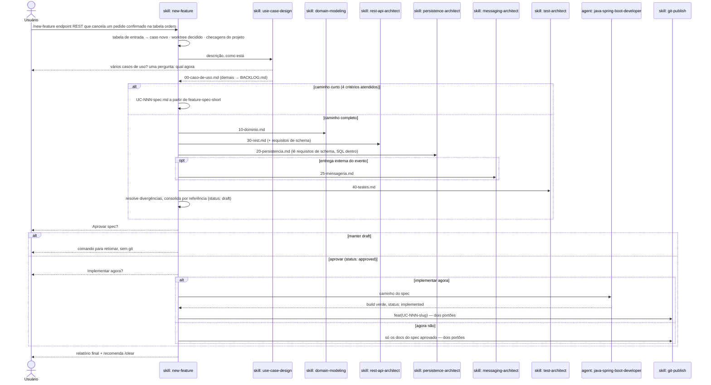

# `/new-feature` — pipeline de design de uma feature

Fonte primária: `.claude/skills/new-feature/SKILL.md`,
`.claude/agents/java-spring-boot-developer.md`, as skills de design (`use-case-design`,
`domain-modeling`, `rest-api-architect`, `persistence-architect`, `messaging-architect`,
`test-architect`) e o modo `guard` de `.claude/hooks/ArchHook.java`.

## O que faz

Desenha **um caso de uso por execução** e o consolida num único `UC-NNN-spec.md` —
pronto para o agent executor implementar depois que o usuário aprovar. **Este comando só
existe dentro de um projeto já gerado** por `/init-project`: lê `pom.xml`,
`.claude/forbidden-imports.txt` e descobre o package de domínio no projeto real.

Três fronteiras valem em toda execução:

- **Design escreve só em `docs/`.** O SQL da migration fica dentro de
  `20-persistencia.md`; todo arquivo em `src/` vem do executor. O hook `guard` bloqueia o
  resto.
- **Git só via `git-publish`**, atrás das duas confirmações — em todo fim de fluxo,
  inclusive o sem executor. `git push` é sempre `ask`.
- **Spec aprovado é imutável.** Um caso posterior registra a mudança necessária na
  própria seção `## Impact on approved use cases`. O hook `guard` congela os arquivos.

## Por que é uma skill manual, não um agent

`new-feature/SKILL.md` documenta a própria decisão: eixo 2 (disparo manual) + eixo 5
(procedural) + eixo 8 (ambos). A forma "agent" foi rejeitada — nenhum dos três motivos
válidos se aplica (contexto, tools, model). `disable-model-invocation: true` impede o
modelo de chamá-la: o usuário digita o comando.

## Entrada — tabela fechada

O argumento é classificado por comando (`grep -E`, `test -d`, `grep '^status:'`), nunca
interpretado. Vale a primeira linha que casar; qualquer outra coisa é erro.

| Entrada | Resultado |
|---|---|
| vazia | lista os casos de uso com o `status` de cada um |
| `UC-NNN-slug`, pasta existe, spec `draft` ou ausente | retoma: só os partials que faltam, depois consolidação |
| `UC-NNN-slug`, spec `approved` ou `implemented` | ❌ spec aprovado é imutável |
| `UC-NNN-slug`, pasta não existe | ❌ não encontrado — descreva a feature para criar |
| contém `UC-` + dígito mas não é exato | ❌ argumento ambíguo |
| texto livre, algum caso ainda aberto | ❌ retome ou aprove antes |
| texto livre, nenhum caso aberto | caso novo — o texto vai como está para `use-case-design` |

Erro imprime o motivo e o uso, e encerra: nenhuma chamada de skill, escrita ou pergunta.

## Diagrama de sequência

## Peças e o que cada uma escreve

| Ordem | Skill/Agent | Depende de | Arquivo que produz |
|---|---|---|---|
| 1 | `use-case-design` | — | `00-caso-de-uso.md`, entradas em `BACKLOG.md` — dona de número e slug |
| 2 | `domain-modeling` | 1 | `10-dominio.md` — dona dos nomes de exceção |
| 3 | `rest-api-architect` | 1, 2 | `30-rest.md` — inclusive os requisitos de schema que o transporte cria |
| 4 | `persistence-architect` | 1, 2, 3 | `20-persistencia.md` — SQL da migration dentro |
| opcional | `messaging-architect` | 2, se houver entrega externa | `25-mensageria.md` |
| 5 | `test-architect` | 1–4 | `40-testes.md` |
| — | `new-feature` (consolidação) | todas acima | `UC-NNN-spec.md` |
| 6 | `java-spring-boot-developer` (agent) | spec `approved` | código e migrations em `src/**` |
| — | `git-publish` | fim do fluxo | commit + push, atrás de dois portões |

**Por que REST antes de persistência.** REST gera requisito de schema
(`Idempotency-Key` precisa da tabela compartilhada de chaves); persistência não gera
requisito de REST. Na ordem antiga a tabela era descoberta depois do partial de
persistência escrito, e persistência rodava duas vezes.

`docker-architect` é encadeada sob demanda por `persistence-architect`, `test-architect`
ou `messaging-architect`. `java-patterns` viaja pré-carregado dentro do executor.

## Ciclo de vida do spec

| `status:` | Escrito por | Quando |
|---|---|---|
| `draft` | `new-feature` | na consolidação |
| `approved` | `new-feature` | só com aprovação explícita do usuário |
| `implemented` | `java-spring-boot-developer` | com `./mvnw verify` verde |

Defeito de spec encontrado pelo executor num spec aprovado: o usuário muda `status:
draft` à mão, e `/new-feature UC-NNN-slug` retoma e reaprova.

## Caminho curto

Quando o caso reusa um agregado aprovado, não precisa de tabela, coluna ou migration
nova, nem de exceção nova, nem de pergunta ao usuário, `new-feature` pula os partials e
escreve um spec único em que cada linha cita a fonte — um spec aprovado ou uma regra.

## Regra de precedência na consolidação

| Fato | Quem vence |
|---|---|
| Path, verbo, status HTTP, formato do corpo | `30-rest.md` |
| Tabela, coluna, chave, índice, migration | `20-persistencia.md` |
| Tópico, garantia de entrega, retry/DLQ | `25-mensageria.md` |
| Nome do agregado, value object, port, evento | `10-dominio.md` |
| Classe de exceção e `errorCode` | `10-dominio.md` |
| Fronteira do caso de uso, invariantes, situações de erro | `00-caso-de-uso.md` |
| Nome e nível de cada teste | `40-testes.md` |

O spec é consolidado **por referência**: cada bloco traz as decisões finais e o caminho
do partial, nunca a cópia das tabelas. Valores descartados vão para
`## Resolved divergences`.

## Disciplina de custo

Uma execução real custou ~USD 15 para um agregado de dois campos, 70% em cache read: a
alavanca é turnos × tamanho do contexto. Por isso: sem mensagens de progresso entre
passos, escritas independentes no mesmo turno, versões lidas do `pom.xml`, um caso de
uso por execução e `/clear` entre execuções.

## Nota operacional — trabalho longo em background

Um executor em background **não sobrevive à máquina dormir**. Antes de delegar em
background, `new-feature/SKILL.md` manda oferecer manter a máquina acordada
(`caffeinate -i` no macOS) ou rodar na thread principal, que é retomável.

## Entrada em projetos gerados

`/new-feature` viaja para todo projeto gerado por `/init-project` (passo 6.7 do
`project-bootstrap`), junto com o hook `guard` (passo 7). Com `pedidos-api` existindo,
`/new-feature <descrição>` roda **dentro** dele, sem `claude-spring-architect` na
máquina.
