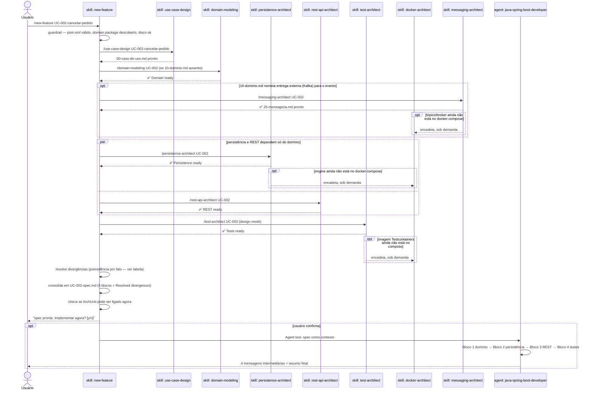

# `/new-feature` — pipeline de design de uma feature

Fonte primária: `.claude/skills/new-feature/SKILL.md`,
`.claude/agents/java-spring-boot-developer.md`, e as cinco skills de design
(`use-case-design`, `domain-modeling`, `persistence-architect`, `rest-api-architect`,
`test-architect`).

## O que faz

Orquestra 5 skills de design, em ordem de dependência, até consolidar um único arquivo
`UC-NNN-spec.md` — pronto para o agent executor implementar. **Este comando só existe
dentro de um projeto já gerado** por `/init-project`: ele lê `pom.xml`,
`.claude/forbidden-imports.txt`, e descobre o package de domínio no projeto real.

## Por que é uma skill manual, não um agent

`new-feature/SKILL.md` documenta a própria decisão: eixo 2 (disparo manual) + eixo 5
(procedural) + eixo 8 (ambos). Forma "agent" foi rejeitada — nenhum dos três motivos
válidos se aplica (contexto, tools, model): o procedimento é uma sequência fixa, e uma
sequência fixa descarta rule e `CLAUDE.md` também, sobrando skill.

## Diagrama de sequência



## As 5 skills + o executor, o que cada uma escreve

| Ordem | Skill/Agent | Depende de | Arquivo que produz |
|---|---|---|---|
| 1 | `use-case-design` | — | `00-caso-de-uso.md` |
| 2 | `domain-modeling` | 1 | `10-dominio.md` |
| 3 | `persistence-architect` | 1, 2 | `20-persistencia.md` |
| 4 | `rest-api-architect` | 1, 2 | `30-rest.md` |
| 5 | `test-architect` | 1, 2, 3, 4 | `40-testes.md` |
| opcional | `messaging-architect` | 1, 2 (se 10-dominio.md nomear entrega externa) | `25-mensageria.md` |
| opcional | `docker-architect` | encadeada sob demanda por 3, 5 ou messaging-architect | `docker-compose.yml` |
| — | `new-feature` (consolidação) | 1–5 (+ messaging-architect se presente) | `UC-NNN-spec.md` |
| 6 | `java-spring-boot-developer` (agent) | spec completa | código em `src/**` |

`docker-architect` **não é um passo da pipeline** — é encadeada sob demanda por
`persistence-architect`, `test-architect` ou `messaging-architect` quando o engine de
banco, a imagem do Testcontainers, ou o broker ainda não estão no `docker-compose.yml`.
`messaging-architect` também não é um passo fixo: entra só se `10-dominio.md` nomear
entrega externa (Kafka) para o evento — se o evento for só in-process, o pipeline segue
sem ela. Escreve `25-mensageria.md`, lida na consolidação como parte do bloco de
domínio. `java-patterns` também não é um passo: seu catálogo viaja pré-carregado dentro
do executor (campo `skills:` do frontmatter de `java-spring-boot-developer.md`) e é
aplicado diretamente, nunca invocado como turno separado.

`new-feature` só **propõe** ligar o ArchUnit e o gate de cobertura depois da primeira
feature (passo 3 do `SKILL.md` — detecção é mecânica, autorizar é do usuário); não
aciona o modo setup sozinho. Se o usuário aceitar e rodar `/test-architect` sem
argumento depois, esse modo delega a execução para o agent `archunit-installer` —
ver [01-tipos-de-arquivo.md § Agent](01-tipos-de-arquivo.md#agent-subagent).

## Regra de precedência na consolidação

Skills diferentes escrevem partials diferentes, e quem vem depois corrige quem veio
antes. Quando o mesmo fato aparece em dois partials com valores diferentes, quem
decide é:

| Fato | Quem vence |
|---|---|
| Path, verbo, status HTTP, formato do corpo | `30-rest.md` |
| Tabela, coluna, chave, índice, migration | `20-persistencia.md` |
| Nome do agregado, value object, port, evento | `10-dominio.md` |
| Fronteira do caso de uso, invariantes, erros de negócio | `00-caso-de-uso.md` |
| Nome e nível de cada teste | `40-testes.md` |

A versão descartada não desaparece — vai para a seção `## Resolved divergences` no
fim de `UC-NNN-spec.md`, uma linha por fato. Uma divergência que a tabela não resolve
(dois fatos do mesmo dono, ou contradição de regra de negócio) **para o pipeline e
pergunta** — não é inventada nem empilhada.

## Exemplo de invocação (fictício)

Projeto: `pedidos-api` (gerado no exemplo de [02-init-project.md](02-init-project.md),
blueprint `hexagonal`). Feature: cancelamento de um pedido já confirmado.

```
/new-feature UC-002-cancelar-pedido
```

Sequência real do exemplo:

```
▶ Validando projeto — pom.xml ok, domain package: com/acme/pedidosapi/domain, disco ok

▶ Passo 1/5 — use-case-design
✅ 00-caso-de-uso.md — gatilho: PATCH /pedidos/{id}/cancelamento
   payload: motivo (opcional), resposta: 200 com pedido atualizado
   invariante: só cancela se status ∈ {CONFIRMADO, PENDENTE_PAGAMENTO}

▶ Passo 2/5 — domain-modeling
✅ 10-dominio.md — aggregate Pedido.cancelar(motivo), evento PedidoCancelado,
   invariante: CONFLICT se status já for CANCELADO ou ENTREGUE

▶ Passo 3/5 — persistence-architect
✅ 20-persistencia.md — UPDATE em pedidos.status + pedidos.motivo_cancelamento,
   sem migration nova (coluna já existe desde UC-001)

▶ Passo 4/5 — rest-api-architect
✅ 30-rest.md — PATCH /pedidos/{id}/cancelamento → 200 OK | 404 | 409 | 422

▶ Passo 5/5 — test-architect
✅ 40-testes.md — 9 casos: 3 unit (domínio), 2 integration (repository), 4 contract (controller)

▶ Consolidando — nenhuma divergência não resolvida

UC-002-spec.md consolidado. 5/5 specs prontos.
Next: hand off to the executor or test the specs.
Implementar agora? [y/n]
```

Se o usuário responde `y`, o agent `java-spring-boot-developer` assume, bloco a
bloco (formato real do agent, adaptado ao exemplo):

```
✅ Block 1: Domain complete (steps 1-7)
- Aggregate: Pedido — método cancelar(motivo), 1 invariante nova
- Events: 1 (PedidoCancelado)
- Files: 2 classes, 0 errors

Next: Persistence (steps 8-12)

✅ Block 2: Persistence complete (steps 8-12)
- Adapter: PedidoRepositoryAdapter — método update reaproveitado
- Migration: nenhuma nova (coluna reaproveitada de UC-001)
- Files: 1 classe alterada, 0 errors

Next: REST (steps 13-15)

✅ Block 3: REST complete (steps 13-15)
- Controller: 1 endpoint (PATCH 200)
- Exception handler: reaproveitado de UC-001
- Files: 2 classes, 0 errors

Next: Tests (steps 16-19)

✅ Block 4: Tests complete (steps 16-19)
- Unit: PedidoTest — 3 casos novos, 100% pass
- Integration: PedidoRepositoryIT — 2 casos novos, 100% pass
- Contract: PedidoControllerTest — 4 casos novos, 100% pass
- Coverage: 83% lines, 76% branches (gate ✅ 80/70)

═══════════════════════════════════════════════════════════════
UC-002-cancelar-pedido implemented ✅ COMPLETE

📊 Summary:
- Files created/changed: 5 Java classes
✅ Tests: 9 cases, 100% pass
✅ Build: ./mvnw verify — green
✅ Checklist: 19/19 complete

🔧 Next step:
git add .; git commit -m "feat(UC-002-cancelar-pedido): cancelamento de pedido"; git push
```

## Nota operacional — execução longa em background

Implementar uma feature completa leva dezenas de minutos. Um executor rodando em
background **não sobrevive à máquina dormindo** — o watchdog corta o stream e a
execução morre onde estava. Antes de delegar em background, `new-feature/SKILL.md`
manda avisar e oferecer as duas opções: manter a máquina acordada (`caffeinate -i` no
macOS) ou rodar na thread principal, que é retomável. O executor grava por checkpoint
exatamente para isso — mas nenhum checkpoint ajuda se a execução morre antes do
primeiro `Write`.

## Entrada no projeto gerado

`/new-feature` viaja para dentro de todo projeto gerado por `/init-project` (passo 6.7
de `project-bootstrap`). Depois que `pedidos-api` existe, `/new-feature
UC-003-<slug>` roda **dentro** do próprio `pedidos-api`, sem depender de
`ai-spring-setup` estar clonado na máquina.
