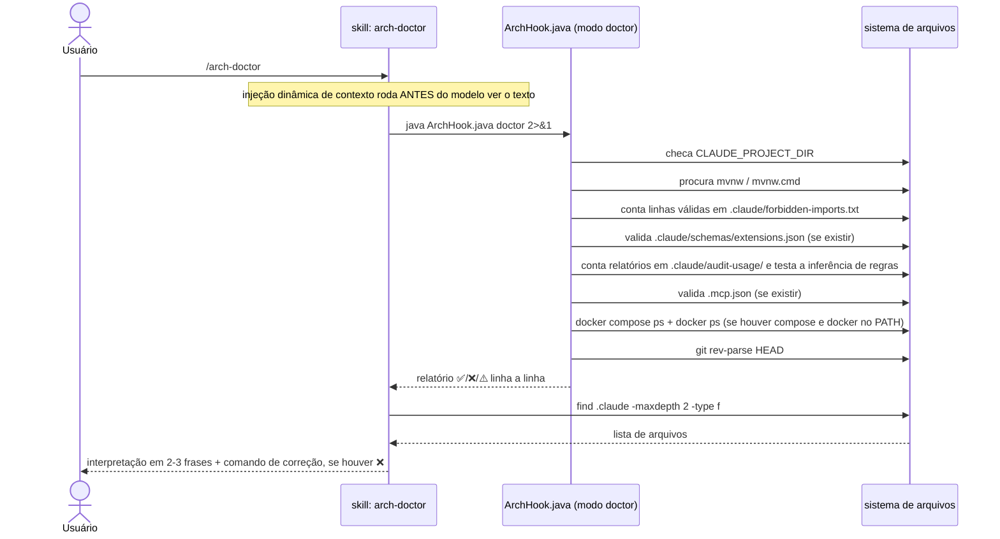

# `/arch-doctor` — diagnóstico do setup

Fonte primária: `.claude/skills/arch-doctor/SKILL.md`,
`.claude/hooks/ArchHook.java` (método `doctor()`).

## O que faz

Diagnostica se o enforcement de arquitetura está realmente funcionando na máquina
atual: hooks ativos, boundaries carregadas, wrapper do Maven, `java` no PATH, schema de
frontmatter válido, trilha de auditoria, servidores MCP declarados, e se todo serviço
do `docker-compose.yml` está de fato `running` sem um container de outro projeto nas
mesmas portas. Não corrige nada por conta própria — só relata, e sugere o comando
exato para corrigir cada item marcado com ❌.

## Por que é a skill mais simples das três

`arch-doctor/SKILL.md` não delega para nenhum agent — não há saída volumosa a esconder
nem tools sensíveis a restringir (`CLAUDE.md` § Invariant 5, nenhum dos três motivos se
aplica). O corpo da skill só embute, via injeção dinâmica de contexto (`` !`comando` ``,
ver [01-tipos-de-arquivo.md § Skill](01-tipos-de-arquivo.md#skill)), a saída real de
dois comandos:

```markdown
## Diagnosis
!`java "${CLAUDE_PROJECT_DIR:-.}/.claude/hooks/ArchHook.java" doctor 2>&1`

## AI files
!`find .claude -maxdepth 2 -type f | sort`
```

O modelo então lê o resultado já pronto e o interpreta em 2-3 frases — não roda nada
por decisão própria durante a invocação, os comandos já rodaram antes de o modelo ver
o texto.

## Diagrama de sequência



## O que cada linha do diagnóstico verifica

| Linha | Condição de ✅ | Condição de ❌/⚠️ |
|---|---|---|
| `OS` | — informativo | No Windows, nota que roda em exec form (sem shell) |
| `Java` | — informativo | versão da JVM em uso |
| `Project root` | — informativo | resolvido de `CLAUDE_PROJECT_DIR` ou diretório atual |
| `CLAUDE_PROJECT_DIR` | variável setada | ⚠️ não setada — hooks usam o diretório atual |
| `Maven wrapper` | `mvnw`/`mvnw.cmd` encontrado | ❌ ausente — rodar `/init-project` (o `starter.tgz` já traz o wrapper) |
| `Boundaries` | ≥ 1 regra válida em `.claude/forbidden-imports.txt` | ❌ 0 regras — enforcement OFF, gerado por `/init-project` |
| `Schema` | todos os arquivos de extensão passam | ❌ N arquivos com frontmatter inválido, ou ⚠️ sem `extensions.json` — validação OFF |
| `Audit` | N execuções registradas em `.claude/audit-usage/` (avisa se `pricing.json` falta) | ⚪ sem o diretório — trilha OFF (opcional; é o caso deste meta-repo) |
| `Audit rule inference` | a inferência de regras renderiza sem erro para um `.java` sintético | ❌ `auditRules()` lança — todo relatório congelaria assim que uma execução tocasse `src/**` |
| `MCP` | N servidores declarados em `.mcp.json`, todos válidos | ❌ N problemas — rodar `java ArchHook.java schema`; ou "no .mcp.json" (opcional) |
| `Compose` | todo serviço do compose `running`, nenhuma porta declarada ocupada por container alheio | ❌ serviço em `created`/`exited`, ou porta publicada por outro projeto — detalhe linha a linha; sem compose ou sem `docker`, "not checked (optional)" |
| `git HEAD` | existe pelo menos 1 commit | ❌ sem commits — o hook `tests` não roda (`git diff HEAD` falha) |

A linha final resume: `✅ Setup operational.` só aparece quando **ao mesmo tempo**
`Boundaries` tem regras > 0 **e** o wrapper do Maven foi encontrado. Qualquer outra
combinação vira `⚠️ Setup incomplete — see marked lines above.`

## Exemplo de invocação e saída (fictício, projeto `pedidos-api`)

```
/arch-doctor
```

```
ArchHook doctor
  OS ................ Mac OS X
  Java .............. 21.0.4
  Project root ...... /Users/dev/projetos/pedidos-api
  CLAUDE_PROJECT_DIR  ✅ set
  Maven wrapper       ✅ ./mvnw
  Boundaries          ✅ 9 active rules
  Schema              ✅ all extension files pass
  Audit ............. ✅ 3 execution(s) recorded — pricing.json missing, no cost estimate
  Audit rule inference ✅ renders without error on a touched .java file
  MCP ................ no .mcp.json — nothing declared (optional)
  Compose ........... ✅ 3/3 services running · no foreign container on declared ports
  git HEAD            ✅ exists

✅ Setup operational.

AI files
.claude/audit-usage/GENESIS.md
.claude/forbidden-imports.txt
.claude/hooks/ArchHook.java
.claude/schemas/extensions.json
.claude/settings.json
```

Interpretação que o modelo devolve ao usuário (2-3 frases, conforme instruído no corpo
da skill):

> Setup operacional — wrapper do Maven presente, 9 regras de boundary ativas, schema de
> frontmatter validando sem erros, três serviços do compose de pé. A trilha de auditoria
> tem 3 execuções mas `pricing.json` está vazio, então os relatórios não mostram custo.

## Exemplo de saída com problema

Se o projeto ainda não tivesse passado por `/init-project` (ou o arquivo de boundaries
tivesse sido apagado por engano):

```
ArchHook doctor
  OS ................ Mac OS X
  Java .............. 21.0.4
  Project root ...... /Users/dev/projetos/pedidos-api
  CLAUDE_PROJECT_DIR  ✅ set
  Maven wrapper       ✅ ./mvnw
  Boundaries          ❌ 0 rules — ENFORCEMENT OFF. Generated by /init-project
  Schema              ✅ all extension files pass
  git HEAD            ✅ exists

⚠️  Setup incomplete — see marked lines above.
```

Resposta esperada do modelo — nomeando o comando concreto, não descrevendo o problema
em termos gerais (regra explícita do corpo da skill):

> Boundaries desligadas — `.claude/forbidden-imports.txt` está vazio ou ausente. Rode
> `/init-project` novamente sobre este projeto para regenerá-lo, ou restaure o arquivo
> a partir do blueprint original se foi apagado por engano.

`arch-doctor` **não corrige nada sem o usuário pedir** — essa é a última linha do
corpo da skill, e vale tanto para o arquivo de boundaries quanto para qualquer outro
item marcado com ❌.
