# `/claude-code-architect-designer` — decide e cria extensões do `.claude/`

Fonte primária: `.claude/skills/claude-code-architect-designer/SKILL.md`,
`.claude/skills/claude-code-architect-designer/references/decision-matrix.md`,
`.claude/skills/claude-code-architect-designer/references/frontmatter-fields.md`.

## O que faz

Decide **qual das cinco formas** de extensão do Claude Code resolve um cenário
concreto — skill auto-invocável, skill manual, subagent, rule ou seção do `CLAUDE.md` —
e só escreve o arquivo depois de aprovação explícita. Uma sexta resposta, legítima e a
mais barata, é **não criar nada**: ou já existe peça cobrindo o cenário, ou o problema é
de compliance e pertence a um hook/`permissions.deny`, que esta skill propõe mas nunca
escreve.

Invocação manual apenas (`disable-model-invocation: true`) — o modelo nunca decide
sozinho criar uma nova skill, agent ou rule.

```
/claude-code-architect-designer [cenário em uma frase]
```

## Por que é skill e não rule

Interview → classifica → propõe → escreve é procedimento de múltiplos passos — vira
rule quebraria o invariante 1 do `@CLAUDE.md` (`rules/` é folha: uma rule nunca cita
skill, agent ou comando). Uma rule que explicasse quando criar skills e agents estaria
citando skills e agents dentro de si mesma.

## As cinco formas

| # | Forma | Arquivo |
|---|---|---|
| 1 | Skill auto-invocável | `.claude/skills/<name>/SKILL.md` |
| 2 | Skill de invocação manual (`/name`) | mesmo arquivo, com `disable-model-invocation: true` |
| 3 | Subagent | `.claude/agents/<name>.md` |
| 4 | Rule | `.claude/rules/<name>.md` |
| 5 | Seção do `CLAUDE.md` | `CLAUDE.md` na raiz |

## Fora de escopo — propõe, não escreve

- **Hooks e `permissions.deny`.** Se a interview conclui no eixo 7 que a regra precisa
  valer sempre, a resposta é hook — enforcement deste repo está concentrado em
  `ArchHook.java`, mudar isso é infraestrutura com teste e commit próprios.
- **`.claude/commands/`.** Nunca — invariante 4, comandos viraram skills com
  `disable-model-invocation`.
- **Blueprints.** Arquitetura é dado, não extensão (`@.claude/blueprints/_schema.md`).
- **Plugin `skill-creator`.** Desabilitado de propósito em `.claude/settings.json`: gera
  skills genéricas, sem conhecimento dos invariantes deste repo.

## Diagrama de sequência

```mermaid
sequenceDiagram
    actor U as Usuário
    participant CMD as skill: claude-code-architect-designer
    participant DM as decision-matrix.md
    participant FM as frontmatter-fields.md
    participant FS as sistema de arquivos

    U->>CMD: /claude-code-architect-designer "cenário em 1 frase"
    Note over CMD: injeção dinâmica lista skills/agents/rules/decisions ANTES do modelo ver o texto
    CMD->>FS: ls .claude/skills .claude/agents .claude/rules .claude/decisions
    FS-->>CMD: inventário atual

    rect rgb(235,235,245)
    Note over CMD,U: Fase 1 · Interview
    CMD->>DM: lê matriz antes de perguntar
    CMD->>U: AskUserQuestion — até 4 perguntas por chamada, 2-3 chamadas
    U-->>CMD: respostas dos 10 eixos
    end

    rect rgb(235,245,235)
    Note over CMD: Fase 2 · Classifica
    CMD->>DM: aplica tabela de decisão
    CMD->>CMD: roda os 9 invariantes do CLAUDE.md como veto
    end

    rect rgb(245,240,225)
    Note over CMD,U: Fase 3 · Propõe — nada é escrito
    CMD-->>U: 2-4 opções ordenadas por score + tabela de referências
    end

    opt Fase 3.5 · só se houve escolha real
        CMD->>FS: .claude/decisions/NNNN-<slug>.md (rascunho, sem State)
    end

    Note over CMD,U: para aqui — espera aprovação explícita

    U->>CMD: aprova opção N
    rect rgb(250,230,230)
    Note over CMD: Fase 4 · Escreve
    CMD->>FM: confirma campos nativos do frontmatter
    CMD->>FS: gera a partir de templates/*.example
    CMD->>FS: seção "## Why this is <form>" no corpo
    CMD->>FS: propaga — CLAUDE.md, 00-index.md, project-bootstrap, conforme a forma
    CMD->>FS: java claude plugin validate .claude/skills
    end
    CMD-->>U: Fase 5 · relatório — arquivos criados/alterados, decisão, validate, aviso de restart
```



## Fase 1 · Interview

**Regra de entrada: nenhuma proposta sem interview.** Classificar a partir de uma frase
produz a peça errada, e peça errada custa mais que nenhuma peça — fica em contexto toda
sessão, ou nunca dispara.

Dez eixos, cada um elimina formas candidatas. Sem resposta em um eixo, a decisão está
adivinhando:

| # | Eixo | O que decide |
|---|---|---|
| 1 | Sintoma concreto — que erro se repete, que prompt é colado de novo | Se há caso, ou é antecipação |
| 2 | Gatilho — `/comando`, decisão do modelo, tocar um arquivo, evento de runtime | Formas 1 · 2 · 4 · fora de escopo |
| 3 | Frequência — toda sessão, semanal, raro | Sempre carregado vs sob demanda |
| 4 | Território — quais globs de arquivo, ou nenhum | `paths` na forma 4; `paths` na forma 1 |
| 5 | Natureza — fato declarativo ou sequência de passos | Formas 4/5 vs 1/2/3 |
| 6 | Isolamento — saída verbosa, tools a restringir, modelo diferente | Forma 3, e só ela |
| 7 | Obrigatoriedade — pode falhar às vezes, ou é build/segurança/compliance | Fora de escopo (hook) |
| 8 | Destino — só este repo, também o projeto gerado, ou ambos | Passos 6.6/6.7/7 do `project-bootstrap` |
| 9 | Integração — o que lê, o que escreve, com qual peça existente colide | Conflito de ownership |
| 10 | Custo de errar | minutos ou dias | Peso no score |

O eixo 9 é checado contra o inventário injetado no topo da skill (`ls .claude/skills`,
`.claude/agents`, `.claude/rules`, `.claude/decisions`), nunca de memória. Duas peças
escrevendo no mesmo caminho é bug de ownership, não decisão de estilo.

## Fase 2 · Classifica

Aplica a tabela de decisão de `decision-matrix.md` (resumo abaixo), depois roda os nove
invariantes de `@CLAUDE.md` como veto — os mais comumente violados são o 1 (rule que
cita skill) e o 5 (agent sem um dos três motivos). Uma proposta que falha um invariante
**não é apresentada como viável**: aparece com o score que merece e o motivo da rejeição.

### A linha divisória

```
   ┌─ CLAUDE.md ──── fato, sempre em contexto             │
   ├─ rules/ ─────── fato, por território (paths)         │  PERSUASÃO
   ├─ skills/ ────── procedimento, sob demanda            │  (o modelo pode falhar)
   └─ agents/ ────── execução isolada                     │
  ═════════════════════════════════════════════════════
   ┌─ permissions ── allow / ask / deny                   │  GARANTIA
   └─ hooks ──────── eventos de lifecycle                 │  (sempre executa)
```

Tudo acima da linha é lido pelo modelo: pode ser ignorado, mal interpretado, ou perdido
num `/compact`. Tudo abaixo executa independente do que o modelo decidir. Consequência:
se quebrar a regra é bug de compliance/segurança/build, a resposta não está entre as
cinco formas.

### Tabela de decisão (primeira linha que casa decide)

| Pergunta | Se sim |
|---|---|
| Precisa acontecer sempre, sem depender do julgamento do modelo? | **Hook** ou `permissions.deny` — fora de escopo |
| Precisa acessar sistema externo (Jira, banco, S3)? | **MCP server** — fora de escopo |
| É fato declarativo que vale toda sessão e repo inteiro? | **Forma 5** — seção do `CLAUDE.md` |
| É fato declarativo que só vale para parte dos arquivos? | **Forma 4** — rule com `paths` |
| É procedimento de múltiplos passos, ou referência longa e rara? | **Forma 1 ou 2** — skill |
| … e usuário quer disparar na mão, ou tem efeito colateral? | **Forma 2** — `disable-model-invocation: true` |
| … e deve disparar sozinho pela descrição, sem o usuário pedir? | **Forma 1** |
| Precisa de contexto isolado, tools restritas, ou modelo diferente? | **Forma 3** — subagent, e mesmo assim ver § 5 da matriz |

Nenhuma linha casa → resposta é **não criar nada**.

### Forma 1 vs Forma 2

Mesmo arquivo, uma linha de diferença. Regra prática deste repo:

- **Escreve arquivos no projeto do usuário e é disparada por decisão dele → Forma 2.**
  Ex.: `arch-doctor`, `init-project`, `project-bootstrap`, `java-patterns`, e esta
  própria skill.
- **Parte de um pipeline que outra peça encadeia → Forma 1**, mesmo escrevendo
  arquivos. `disable-model-invocation` esconde a skill do modelo, e o que o modelo não
  vê o orquestrador não chama. As cinco peças de `/new-feature` são assim desde D17
  (`@.claude/decisions/0007-pipeline-skills-invocation.md`).

### Forma 3 — os três motivos, e só esses

1. **Preservar contexto** — exploração verbosa fica no subagent, só o resumo volta.
2. **Restringir tools** — um reviewer com `tools: Read, Grep, Glob` não escreve.
3. **Controlar custo ou capacidade** — `model: haiku` para triagem, `opus` onde falhar
   é caro.

Nenhum se aplica → é skill. Este é o anti-padrão #1, e o mais caro: mais uma peça pra
manter, nenhum ganho. Contra-teste: se a interview com o usuário é o coração da tarefa,
se o contexto cabe num `references/` da própria skill, ou se a saída final é curta de
qualquer jeito — qualquer "sim" aponta pra skill, não agent. Único precedente neste
repo: `init-project` → `project-initializer`.

### Forma 4 vs Forma 5

| | Forma 5 (`CLAUDE.md`) | Forma 4 (`rules/`) |
|---|---|---|
| Custo | Todo prompt, toda sessão | Só quando um `paths` casa |
| Escopo | Repo inteiro | Território de arquivo |
| Sobrevive a `/compact` | Sim, reinjetado | Recarrega ao tocar os arquivos |
| Meta de tamanho | < 200 linhas no total | Um tema por arquivo |

Duas vias de carregamento pra Forma 4, a primeira preferível: `paths` (auto-carrega,
não depende de ninguém lembrar) e citação explícita por caminho, pra rules
cross-cutting que glob nenhum captura.

## Fase 3 · Propõe — nada é escrito

Duas a quatro opções, ordenadas por score, sempre incluindo a hipótese "não criar nada"
quando defensável. Cada opção nesta forma, nesta ordem:

1. **Título** — nome de arquivo proposto, kebab-case
2. **Motivador** — o eixo da interview que justifica
3. **Prós**
4. **Contras** — inclui o invariante que tensiona, se houver
5. **Score 0-10** — rubrica abaixo
6. **Visual** — árvore de arquivo ou grafo ASCII de quem chama quem

E no final, uma **tabela de referências**: para cada decisão, a fonte concreta
(`@claude-help.md` § N, `@CLAUDE.md` invariante N, ou arquivo do repo que serve de
precedente). Afirmação sobre o runtime sem fonte é decoração — corta.

### Rubrica de score (0-10)

Sete critérios, peso igual, ~1.43 pontos cada:

| # | Critério | Perde ponto quando |
|---|---|---|
| 1 | Adequação de forma | Tabela da § 2 aponta pra outra forma |
| 2 | Conformidade com invariantes | Tensiona um dos nove; violar um trava o score em ≤ 4 |
| 3 | Custo de contexto | Conhecimento raramente usado fica sempre carregado |
| 4 | Enforcement | Depende de persuasão onde garantia estava disponível |
| 5 | Custo de manutenção | Adiciona peça ou indireção sem ganho proporcional |
| 6 | Precedente no repo | Nenhuma forma similar já em uso; design novo |
| 7 | Propagação completa | Não fecha routing, `00-index`, passos 6.6/6.7/7, ou registro de decisão |

Violar invariante trava o score em **≤ 4**, independente do resto. Score **≥ 8** é
recomendação; **5 a 7** é viável com ressalva escrita; **≤ 4** só aparece pra registrar
por que foi rejeitado.

## Fase 3.5 · Salva o rascunho da decisão

O que a Fase 3 produziu — opções, scores, alternativas rejeitadas, tabela de
referências — evapora no fim da sessão. Sem registro, a mesma interview de dez eixos
recomeça do zero daqui a seis meses.

**Quando salvar arquivo.** Só se pelo menos um for verdade:

- Duas ou mais opções pontuaram ≥ 5 — houve escolha real.
- A opção de maior score tensiona um invariante do `@CLAUDE.md`.
- Eixo 8 respondeu "ambos" — a peça também vai pro projeto gerado.

Nenhum desses → nenhum arquivo é salvo. A justificativa vive na seção `## Why this is
<form>` do arquivo que a Fase 4 cria, e isso basta.

**Como.** Gera a partir de `templates/decision.md.example` para
`.claude/decisions/NNNN-<slug>.md`, `NNNN` = maior número existente + 1, lido do
inventário injetado no topo — nunca de memória. Salva com **todas** as opções e sem a
linha `State`: a decisão ainda não foi tomada.

**Para aqui. Espera aprovação explícita.** "Ficou bom" não é aprovação de qual opção.

Se o usuário rejeita tudo, fecha o rascunho com `State: rejected — no option approved`
e para. Não apaga: o valor está em evitar repetir a mesma interview.

## Fase 4 · Escreve — só depois de aprovação

1. Gera a partir do exemplar em `templates/` que casa com a forma aprovada.
2. Frontmatter: só campos nativos, lista em `references/frontmatter-fields.md`. Campo
   inventado é silenciosamente ignorado pelo runtime — parece comportamento, é
   decoração.
3. Nenhum `metadata:` no frontmatter. Ownership, `reads`, handoff vão na seção
   `## Contract` do corpo.
4. Boilerplate de código vai para `templates/<name>.example` dentro da skill que o
   emite, nunca colado no corpo — invariante 3.
5. **Seção `## Why this is <form>` no corpo do arquivo criado, sempre.** Três frases: a
   forma escolhida, o eixo da interview que motivou, e a forma rejeitada mais próxima
   com o motivo. É o único registro que viaja com o arquivo — sobrevive a quem nunca
   leu `.claude/decisions/`, e à cópia pro projeto gerado. Precedente:
   `.claude/agents/project-initializer.md`, seção "Why this is an agent and not a
   skill". Pra Forma 5 não há corpo onde colocar: a justificativa vive só no registro
   de decisão, e se não houver registro, na mensagem de commit.
6. **Propaga.** Arquivo novo que ninguém referencia não é encontrado:

   | Você criou | Também atualiza |
   |---|---|
   | Skill | Tabela de routing do `@CLAUDE.md` |
   | Skill de desenvolvimento (válida dentro do projeto gerado) | Tabela do passo 6.7 de `project-bootstrap/SKILL.md` e a lista `## Skill contract` |
   | Rule | `@.claude/rules/00-index.md` (tabela de rules escritas; remove de "planned") **e** a tabela do passo 6.6 de `project-bootstrap/SKILL.md` |
   | Agent | Tabela de routing do `@CLAUDE.md`, se invocável por nome |
   | Seção do `CLAUDE.md` | Nada mais — mas confirma que o total continua abaixo de ~200 linhas |

   Skill de criação (só útil antes do projeto existir) fica **fora** do passo 6.7,
   como `project-bootstrap` e `init-project`. Isso é declarado explicitamente no
   relatório.

   **Delegação, e só neste caso.** Se o eixo 8 respondeu "ambos", a propagação cresce —
   passos 6.6/6.7/7 do `project-bootstrap`, mais seu `templates/`. Aí, delega **só este
   passo 6, nenhum outro** pro agent genérico com `model: sonnet`, passando o caminho
   do registro da Fase 3.5 e a lista exata de arquivos a tocar. São edições mecânicas de
   tabela com destino fixado por escrito. Sem registro salvo, não delega: o subagent não
   vê a conversa, e a interview é o que justifica cada linha.

   Passos 1 a 5 **nunca** são delegados. Escrever a `description` decide se a skill
   dispara, e o `## Contract` decide ownership — isso é design, não transcrição.

7. Se salvou rascunho na Fase 3.5, promove: preenche `Decision`, `State` (aprovado por
   quem, em que data), e a tabela `Propagation` com os arquivos que o passo 6 tocou.
8. Roda `claude plugin validate .claude/skills` e reporta a saída sem reescrevê-la.

## Fase 5 · Relatório

Arquivos criados, arquivos alterados, caminho do registro de decisão (ou a frase
explicando por que não houve), a saída de `validate`, e o aviso de restart se tocou
`settings.json` — só é lido no início da sessão.

## Campos de frontmatter — resumo por forma

Fonte completa: `references/frontmatter-fields.md`, derivada de
`.claude/schemas/extensions.json` (dono único da lista — `ArchHook.java schema` é quem
lê e bloqueia).

### Skill

| Campo | Para quê |
|---|---|
| `name` | Identificador. Minúsculo e hífens |
| `description` | **Decide se a skill é invocada.** Caso de uso concreto primeiro, frases-gatilho depois. Truncado em 1536 caracteres na listagem |
| `when_to_use` | Frases-gatilho extras |
| `argument-hint` | Dica de autocomplete, ex. `"[usecase-name]"` |
| `arguments` | Nomes posicionais, pra substituição `$name` |
| `disable-model-invocation` | `true` = só o usuário invoca, via `/name`. Pra efeitos colaterais |
| `user-invocable` | `false` = só o modelo invoca; some do menu `/` |
| `allowed-tools` | Pré-aprova tools **durante o turno** que invoca a skill |
| `disallowed-tools` | Remove tools do pool enquanto a skill está ativa |
| `model` · `effort` | Override de modelo/effort enquanto a skill está ativa |
| `paths` | Globs que limitam ativação automática |
| `context: fork` | Roda a skill num subagent isolado |
| `agent` | Qual tipo de subagent usar com `context: fork` |
| `background` | Com `fork`, `false` = espera o resultado no mesmo turno |
| `hooks` | Hooks registrados ao invocar a skill |

O **nome da pasta** vira o comando: `.claude/skills/arch-doctor/` → `/arch-doctor`. O
`name` do frontmatter segue a pasta; divergir é confusão garantida no diagnóstico.

### Subagent

| Campo | Obrigatório | Para quê |
|---|---|---|
| `name` | ✅ | Minúsculo e hífens. Não pode conter `:` |
| `description` | ✅ | Quando delegar. Curto — soma das descriptions tem teto de 15k tokens |
| `tools` | ➖ | Lista separada por vírgula. Sem o campo, herda tudo |
| `disallowedTools` | ➖ | Remove da lista herdada. Aceita `mcp__*` |
| `model` | ➖ | `sonnet`, `opus`, `haiku`, ID completo, ou `inherit` |
| `permissionMode` | ➖ | `default`, `acceptEdits`, `auto`, `dontAsk`, `bypassPermissions`, `plan` |
| `maxTurns` | ➖ | Turnos máximos antes de parar |
| `skills` | ➖ | Skills pré-carregadas **por completo** no início |
| `mcpServers` | ➖ | MCP servers só pra este subagent |
| `hooks` | ➖ | Hooks só enquanto o subagent roda |
| `memory` | ➖ | `user`, `project`, ou `local` |
| `background` | ➖ | `true` mantém em background |
| `effort` | ➖ | `low` … `max` |
| `isolation` | ➖ | `worktree` = roda em git worktree isolada |
| `color` | ➖ | Cor de exibição |

Atenção ao **camelCase** aqui (`disallowedTools`, `permissionMode`, `maxTurns`) contra
o **kebab-case** de skills (`disallowed-tools`, `disable-model-invocation`). Trocar as
convenções produz campo silenciosamente ignorado — o modo de falha mais caro desta
lista.

### Rule

| Campo | Para quê |
|---|---|
| `paths` | Globs que fazem a rule auto-carregar quando os arquivos casados são tocados |
| `status` | `active` vale agora · `draft` é proposta, não aplica · `deprecated` só pra ler código antigo |

Rule sem `paths` só entra em contexto por citação explícita
(`@.claude/rules/<file>.md`).

### `CLAUDE.md`

Sem frontmatter. Só conteúdo. `@path/file.md` importa outro arquivo — mas o import
carrega no início da sessão, então **não economiza contexto**: é organização, não
otimização.

### O que nunca vai em frontmatter

**`metadata:`** e tudo que ele carregava antes — ownership, `reads`, handoff,
contratos. Não é campo nativo: custa tokens toda invocação e não obriga nada. Nesse
repo esse conteúdo vive na seção `## Contract` do **corpo** do arquivo, onde o modelo
lê como instrução.

## Anti-padrões — rejeitados na Fase 2

| # | Anti-padrão | Sinal | Redireciona pra |
|---|---|---|---|
| 1 | Agent onde skill bastava | Nenhum dos três motivos da Forma 3 | Skill |
| 2 | Prosa onde tinha que ser hook | "Sempre rode X antes de terminar" repetido | Hook — fora de escopo |
| 3 | `CLAUDE.md` obeso | Passou de ~200 linhas | Extrai pra `rules/` com `paths` |
| 4 | Rule que fala de skills | Quebra invariante 1 | Move o procedimento pra skill |
| 5 | Rule duplicada | Mesmo tema em dois arquivos | Dono único + citação |
| 6 | `commands/` novo | Invariante 4 | Skill + `disable-model-invocation` |
| 7 | Frontmatter inventado | Campo que o runtime ignora | `frontmatter-fields.md` |
| 8 | Código no corpo da skill | Boilerplate colado em markdown | `templates/*.example` |
| 9 | Peça construída por antecipação | Sem sintoma no eixo 1 da interview | Não criar nada |
| 10 | Skill de criação copiada pro projeto gerado | Fora do passo 6.7 | Deixa de fora, e diz isso |

## Exemplo de invocação (fictício)

```
/claude-code-architect-designer o modelo esquece de rodar os testes de contrato antes de reportar a feature pronta
```

Interview (resumida — perguntas reais via `AskUserQuestion`, 2-3 chamadas):

| Eixo | Resposta do usuário |
|---|---|
| 1. Sintoma | Aconteceu 3x no `/new-feature`: reporta "pronto" sem `./mvnw verify` ter rodado |
| 2. Gatilho | Fim do pipeline `/new-feature`, não um comando novo |
| 3. Frequência | Toda vez que `/new-feature` termina |
| 4. Território | `**/adapter/in/rest/**`, `**/domain/**` — onde teste de contrato mora |
| 5. Natureza | Passo de procedimento ("antes de reportar, rode X"), não fato declarativo |
| 6. Isolamento | Não precisa de tools restritas nem modelo diferente |
| 7. Obrigatoriedade | Pode falhar — é convenção de processo, não build gate |
| 8. Destino | Só este repo — é sobre como a skill `new-feature` se comporta |
| 9. Integração | Toca o corpo de `.claude/skills/new-feature/SKILL.md` |
| 10. Custo de errar | Baixo-médio — feature "pronta" sem prova de que passa |

Classificação: eixo 7 responde "não, pode falhar" → não é hook. Eixo 5 é procedimento,
não fato → não é rule nem `CLAUDE.md`. É correção de um passo que já existe dentro de
uma skill existente, não peça nova.

Proposta devolvida (resumo):

1. **"Não criar nada — editar `new-feature/SKILL.md`"** — Score 9. Motivador: eixo 5 +
   9 (peça já existe). O passo final da skill já reporta "pronto"; falta uma linha
   explícita "rode `./mvnw verify` antes de declarar pronto, cole a saída". Prós: zero
   peça nova, zero propagação. Contras: nenhum.
2. **"rule `contract-tests-gate.md`"** — Score 3. Motivador: eixo 4 (território
   existe). Contras: quebra invariante 1 se mencionar a skill `new-feature` pra dizer
   quando rodar; sem mencionar, vira regra solta sem gatilho de execução — persuasão
   fraca pra algo que devia ser passo de pipeline.

Com score 9 vs 3, e sem "escolha real" (uma opção só claramente viável), a Fase 3.5 não
salva registro — a Fase 4 edita `new-feature/SKILL.md` direto e a seção `## Why this is
<form>` nem se aplica (edição, não peça nova).

## Contract da skill

**Lê** `@claude-help.md`, `@CLAUDE.md` (os nove invariantes), `@.claude/rules/00-index.md`,
`@.claude/blueprints/_schema.md` quando a decisão toca blueprints, e o inventário
injetado no topo. Lê o `references/` desta própria skill antes de classificar — a
matriz é deliberadamente não embutida no corpo.

**Escreve** `.claude/skills/**`, `.claude/agents/**`, `.claude/rules/**`, e o
`CLAUDE.md` raiz **deste repositório**. Só depois de aprovação explícita.

**Também escreve** `.claude/decisions/NNNN-<slug>.md` — e este é o único caminho que
toca *antes* da aprovação, como rascunho da Fase 3.5. É dona exclusiva do diretório:
nenhuma outra peça escreve lá, e nada dentro dele é rule.

**Não escreve** `.claude/settings.json`, `.claude/hooks/**`, `.claude/blueprints/**`,
nem código Java de projeto. Não cria `.claude/commands/`.

**Delega** no máximo o passo 6 da Fase 4 (propagação), e só quando o eixo 8 é "ambos" e
um registro de decisão foi salvo. Classificar, propor e escrever o corpo ficam sempre
nesta thread.

**Fica fora do projeto gerado.** É skill de criação, como `project-bootstrap` e
`init-project`: quem clona um projeto já gerado não tem extensões pra desenhar. O mesmo
vale pra `.claude/decisions/` — registra decisões sobre este meta-repositório.

## Referências

| Onde ver mais | O quê |
|---|---|
| `.claude/skills/claude-code-architect-designer/SKILL.md` | Corpo completo da skill, as cinco fases |
| `.claude/skills/claude-code-architect-designer/references/decision-matrix.md` | Tabela de decisão completa, rubrica de score, anti-padrões |
| `.claude/skills/claude-code-architect-designer/references/frontmatter-fields.md` | Lista completa de campos nativos por tipo de arquivo |
| `.claude/skills/claude-code-architect-designer/templates/` | Exemplares usados na Fase 4 — `SKILL.md.example`, `SKILL.command.md.example`, `agent.md.example`, `rule.md.example`, `claude-md-section.md.example`, `decision.md.example` |
| `.claude/decisions/README.md` | Regras do diretório de registros de decisão |
| `@CLAUDE.md` | Os nove invariantes usados como veto na Fase 2 |
| [01-tipos-de-arquivo.md](01-tipos-de-arquivo.md) | Como cada forma funciona segundo o runtime do Claude Code |
