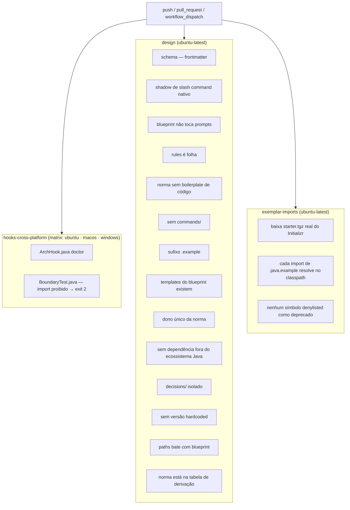

# `validate.yml` — CI dos invariantes

Fonte primária: `.github/workflows/validate.yml`, `.claude/hooks/ArchHook.java`
(método `schema()`), `CLAUDE.md` § Invariantes.

## Por que existe

Os invariantes de `CLAUDE.md` e as normas em `rules/` são prosa, não código — nada
impede que uma edição viole um deles em silêncio. `ArchHook.java check` só guarda a
fronteira Java de um projeto **gerado**; nunca roda contra o próprio grafo de prompts
deste repositório. `validate.yml` é o que transforma cada invariante numa verificação
determinística e cobrindo o repositório inteiro, a cada `push` e `pull_request`, em vez
de uma alegação que só se sustenta enquanto quem escreve a próxima skill lembra dela.

## Diagrama dos jobs



## O que cada verificação cobre

| Job / passo | Verifica | Contra o quê |
|---|---|---|
| `hooks-cross-platform` | `ArchHook.java doctor` e `BoundaryTest` nas três OSes | Decisão D8 — "cross-platform" como fato, não alegação |
| `frontmatter schema` | `java .claude/hooks/ArchHook.java schema` | Invariante 10 — `extensions.json` é o dono único do frontmatter reconhecido; campo inventado ou `metadata:` falha alto em vez de ser ignorado em silêncio pelo runtime |
| `skill name doesn't shadow a native slash command` | nome de pasta de skill contra uma denylist (`doctor`, `init`, `context`, `memory`, …) | Uma skill substituir um comando nativo em silêncio, sem erro |
| `new blueprint doesn't touch prompts` | adicionar um blueprint deixa `.claude/skills` e `.claude/agents` intactos | Invariante 7 — arquiteturas são dados |
| `rules is a leaf of the graph` | nenhuma rule menciona "skill", "agent", "subagent" | Invariante 1 |
| `norm contains no code boilerplate` | nenhuma declaração de `class`/`record`/`interface`/`enum` dentro de `rules/` | Invariante 3 |
| `no new commands/` | `.claude/commands/` não existe | Invariante 4 |
| `exemplar imports have the .example suffix at the end` | todo arquivo sob `skills/*/templates/` | Globs de precondição que dependem do sufixo |
| `blueprint-declared templates exist on disk` | todo `templates.<role>` de um blueprint resolve a um arquivo real | Blueprint apontando para template renomeado ou apagado |
| `each norm has a single owner` | lista fixa de termos conhecidos aparece em no máximo um arquivo sob `rules/` | Invariante 2 — estreito por construção, ver nota abaixo |
| `no dependencies outside the Java ecosystem` | nenhum `pip install`, `npm install`, `node `, `python` solto em `.claude/` | Decisão D7 |
| `every norm paths matches some blueprint` / `norm is in the bootstrap's derivation table` | o glob `paths` de uma rule nomeia um pacote que algum blueprint declara, e o passo 6.6 de `project-bootstrap` sabe reescrevê-lo | Gap 8 de `decisions/0024-lessons-learned-001-remediation.md` — rule que nunca carrega sozinha, em silêncio |
| `decisions/ doesn't grow paths or enter 00-index.md` | nenhum arquivo em `decisions/` declara `paths:`; nenhum está listado em `rules/00-index.md` | `decisions/` é histórico, não é rule — ver Known pitfalls |
| `no hardcoded Spring/Java version outside decisions/` | nenhum `Spring Boot X.Y` / `Java NN` escrito como fato em `rules/`, `skills/`, `blueprints/`, `CLAUDE.md` | Invariante 8 — versão é resolvida via Spring Initializr, nunca escrita de memória. Exclui a linha de requisito mínimo `JDK 21+` e notas datadas de "Tested to compile" em exemplares, que registram uma verificação passada, não uma versão a usar |
| `exemplar-imports` (job inteiro) | todo `import` de um `.java.example` resolve contra JARs de uma request real ao `start.spring.io`, e nenhum usa nome na denylist de deprecados | Gaps 4, 5, 9 de `decisions/0024-lessons-learned-001-remediation.md` — exemplar que "compila na cabeça de quem escreveu" |

Nota sobre "each norm has a single owner": o teste checa uma lista fixa de frases
literais (`Constructor injection`, `Zero framework`, `RuntimeException`), não um
detector geral de duplicação. Pega regressão de termos que já se sabe terem divergido
uma vez; uma rule nova sem frase nova adicionada a essa lista não é coberta.

## O que ainda não está aqui

- Invariante 9 (o projeto gerado é self-contained) só é verificado manualmente, pelo
  bloco de comandos em `project-bootstrap/SKILL.md` § 8 ("Verify") — exige gerar um
  projeto de verdade contra o Initializr, e não foi automatizado em CI por causa desse
  custo.
- `claude plugin validate .claude/skills` — o CLI não está instalado no runner do
  GitHub Actions, e instalá-lo puxaria uma dependência fora de `java`/`git`/`curl`
  (ver `CLAUDE.md` § Dependencies). Rode à mão antes de abrir um PR; é uma checagem
  barata e complementar ao passo `schema` acima, pega YAML malformado.

## Como rodar localmente

```bash
# Os mesmos comandos que o job `design` roda, um a um:
java .claude/hooks/ArchHook.java schema
claude plugin validate .claude/skills   # não roda em CI — CLI ausente no runner
java .claude/hooks/ArchHook.java doctor
java .claude/.ci/BoundaryTest.java
```

Um `git push` sem rodar isso antes ainda passa pelo hook local (`settings.json`), mas
só o CI roda os passos do job `design` e `exemplar-imports` — esses dois não têm hook
equivalente local.
