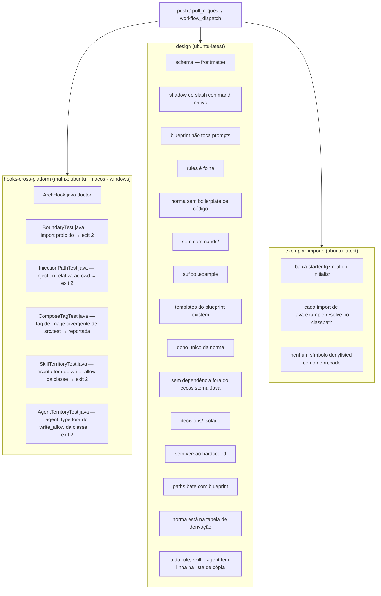

# `validate.yml` — CI dos invariantes

Fonte primária: `.github/workflows/validate.yml`, `.claude/hooks/ArchHook.java`
(método `schema()`), `CLAUDE.md` § Invariantes.

## Por que existe

Os invariantes de `CLAUDE.md` e as normas em `rules/` são prosa, não código — nada
impede que uma edição viole um deles em silêncio. `ArchHook.java check` só guarda a
fronteira Java de um projeto **gerado**; nunca roda contra o próprio grafo de prompts
deste repositório. `validate.yml` é o que transforma cada invariante numa verificação
determinística e cobrindo o repositório inteiro, a cada `push` e `pull_request`, em vez
de uma alegação que só se sustenta enquanto quem escreve a próxima skill lembra dela.

## Diagrama dos jobs


```mermaid
flowchart TD
    T[push / pull_request / workflow_dispatch] --> J1
    T --> J2
    T --> J3

    subgraph J1["hooks-cross-platform (matrix: ubuntu · macos · windows)"]
        H1[ArchHook.java doctor]
        H2[BoundaryTest.java — import proibido → exit 2]
        H3[InjectionPathTest.java — injection relativa ao cwd → exit 2]
        H4[ComposeTagTest.java — tag de image divergente de src/test → reportada]
        H5[SkillTerritoryTest.java — escrita fora do write_allow da classe → exit 2]
        H6[AgentTerritoryTest.java — agent_type fora do write_allow da classe → exit 2]
    end

    subgraph J2["design (ubuntu-latest)"]
        D1[schema — frontmatter]
        D3[shadow de slash command nativo]
        D4[blueprint não toca prompts]
        D5[rules é folha]
        D6[norma sem boilerplate de código]
        D7[sem commands/]
        D8[sufixo .example]
        D9[templates do blueprint existem]
        D10[dono único da norma]
        D11[sem dependência fora do ecossistema Java]
        D12[decisions/ isolado]
        D13[sem versão hardcoded]
        D14[paths bate com blueprint]
        D15[norma está na tabela de derivação]
        D16[toda rule, skill e agent tem linha na lista de cópia]
    end

    subgraph J3["exemplar-imports (ubuntu-latest)"]
        E1[baixa starter.tgz real do Initializr]
        E2[cada import de .java.example resolve no classpath]
        E3[nenhum símbolo denylisted como deprecado]
    end
```

## O que cada verificação cobre

| Job / passo | Verifica | Contra o quê |
|---|---|---|
| `hooks-cross-platform` | `ArchHook.java doctor`, `BoundaryTest`, `InjectionPathTest`, `ComposeTagTest`, `SkillTerritoryTest` e `AgentTerritoryTest` nas três OSes | Decisão D8 — "cross-platform" como fato, não alegação |
| `guard keeps each skill inside its class's territory` | `SkillTerritoryTest.java` roda o modo `guard` sobre o `extensions.json` real em 13 casos: sem fase aberta nada restringe, dentro e fora do `write_allow`, o `agent_type` prevalecendo sobre a fase aberta, a recusa de `Skill(<build>)` com fase de design aberta, o território mais estreito do callee, e a fase sobrevivendo a uma chamada `Agent` até o próximo prompt | O território ser allowlist é o tipo de alegação que apodrece em silêncio: vale até alguém alargar uma entrada de `write_allow` sem perceber. O caso que motivou tudo — um run de design escrevendo `docker-compose.yml`, arquivo que nenhuma denylist nomeava — é um dos 13 |
| `guard keeps each agent inside its class's territory` | `AgentTerritoryTest.java` roda o mesmo modo sobre `agent_classes` em 18 casos: cada installer dentro e fora da sua lista estreita, as grafias single- e multi-module do mesmo caminho, o executor alcançando a única linha de spec que ele fecha, o driver escrevendo qualquer coisa, e um agent sem classe caindo na fase do chamador | Cada agent prometia o próprio território em prosa (`**Does not write:** docker-compose.yml`) enquanto o guard dava bypass irrestrito aos quatro. A promessa agora é dado, e os dois bloqueios que mais importam — `archunit-installer` recusado no `docker-compose.yml`, e recusado no source principal — são casos deste arquivo |
| `hook reports a compose image tag that disagrees with src/test` | `ComposeTagTest.java` monta um projeto descartável com `docker-compose.yml` e um `DockerImageName.parse(...)` em `src/test`, e exige que `ArchHook.java compose` reporte a divergência, expanda `${VAR:-default}` e fique calado quando as tags batem | A suíte passar contra uma versão de engine que ninguém roda. Roda nas três OSes porque a pergunta 3 do modo `compose` compara dois arquivos e não precisa de Docker — o que também prova que o casamento de `src/test/` sobrevive ao separador do Windows |
| `frontmatter schema` | `java .claude/hooks/ArchHook.java schema` | Invariante 10 — `extensions.json` é o dono único do frontmatter reconhecido; campo inventado ou `metadata:` falha alto em vez de ser ignorado em silêncio pelo runtime. O mesmo modo exige que toda injection `` !`command` `` resolva caminho a partir de `${CLAUDE_PROJECT_DIR}` — uma relativa reporta arquivo ausente sempre que o cwd do shell derivou |
| `skill name doesn't shadow a native slash command` | nome de pasta de skill contra uma denylist (`doctor`, `init`, `context`, `memory`, …) | Uma skill substituir um comando nativo em silêncio, sem erro |
| `new blueprint doesn't touch prompts` | adicionar um blueprint deixa `.claude/skills` e `.claude/agents` intactos | Invariante 7 — arquiteturas são dados |
| `rules is a leaf of the graph` | nenhuma rule menciona "skill", "agent", "subagent" | Invariante 1 |
| `norm contains no code boilerplate` | nenhuma declaração de `class`/`record`/`interface`/`enum` dentro de `rules/` | Invariante 3 |
| `no new commands/` | `.claude/commands/` não existe | Invariante 4 |
| `exemplar imports have the .example suffix at the end` | todo arquivo sob `skills/*/templates/` | Globs de precondição que dependem do sufixo |
| `blueprint-declared templates exist on disk` | todo `templates.<role>` de um blueprint resolve a um arquivo real | Blueprint apontando para template renomeado ou apagado |
| `each norm has a single owner` | lista fixa de termos conhecidos aparece em no máximo um arquivo sob `rules/` | Invariante 2 — estreito por construção, ver nota abaixo |
| `no dependencies outside the Java ecosystem` | nenhum `pip install`, `npm install`, `node `, `python` solto em `.claude/` | Decisão D7 |
| `every norm paths matches some blueprint` / `norm is in the bootstrap's derivation table` | o glob `paths` de uma rule nomeia um pacote que algum blueprint declara, e o passo 6.6 de `project-bootstrap` sabe reescrevê-lo | Gap 8 de `decisions/0024-lessons-learned-001-remediation.md` — rule que nunca carrega sozinha, em silêncio |
| `every rule, skill and agent has a row in the bootstrap copy list` | todo arquivo de `rules/` tem linha em § 6.6 de `project-bootstrap/SKILL.md`, e toda skill e agent tem linha marcada ✅ ou ❌ em § 6.7/6.8 | Invariante 9 — essas tabelas **são** as listas de cópia que tornam o projeto gerado self-contained. Uma norma nova ausente de § 6.6 não quebra nada na geração: quebra para quem clona o projeto depois e segue uma citação para um arquivo que nunca foi copiado |
| `decisions/ doesn't grow paths or enter 00-index.md` | nenhum arquivo em `decisions/` declara `paths:`; nenhum está listado em `rules/00-index.md` | `decisions/` é histórico, não é rule — ver Known pitfalls |
| `no hardcoded Spring/Java version outside decisions/` | nenhum `Spring Boot X.Y` / `Java NN` escrito como fato em `rules/`, `skills/`, `blueprints/`, `CLAUDE.md` | Invariante 8 — versão é resolvida via Spring Initializr, nunca escrita de memória. Exclui a linha de requisito mínimo `JDK 21+` e notas datadas de "Tested to compile" em exemplares, que registram uma verificação passada, não uma versão a usar |
| `exemplar-imports` (job inteiro) | todo `import` de um `.java.example` resolve contra JARs de uma request real ao `start.spring.io`, e nenhum usa nome na denylist de deprecados | Gaps 4, 5, 9 de `decisions/0024-lessons-learned-001-remediation.md` — exemplar que "compila na cabeça de quem escreveu" |

Nota sobre "each norm has a single owner": o teste checa uma lista fixa de frases
literais (`Constructor injection`, `Zero framework`, `RuntimeException`), não um
detector geral de duplicação. Pega regressão de termos que já se sabe terem divergido
uma vez; uma rule nova sem frase nova adicionada a essa lista não é coberta.

## Postura do workflow

Quatro decisões que não verificam invariante nenhum — são o custo e a superfície do
próprio CI:

- **`permissions: contents: read`** no topo. Nenhum job escreve: todos leem o checkout e
  rodam `java`. Sem isso o `GITHUB_TOKEN` herda o default do repositório, que é write.
- **`concurrency` com `cancel-in-progress`**. `push: [main]` e `pull_request` disparam no
  mesmo head quando se empurra um branch de PR; o run superado é cancelado em vez de
  disputar a mesma conclusão.
- **`timeout-minutes` em todo job** — 15 nos dois de hook e prompt, 30 no
  `exemplar-imports`, que depende de rede. O default é 6h.
- **Actions fixadas por commit SHA**, com a tag como comentário ao lado. `@v7` é um ref
  móvel que o dono da action pode reapontar — uma tag torna irreproduzível o que o CI
  rodou. Subir os dois juntos. Ambas estão no major atual (`checkout` v7.0.1,
  `setup-java` v6.0.1): v1–v4 de `setup-java` estão deprecadas, e os majors intermediários
  só apertam o que este workflow não usa — node24 (exige runner ≥ v2.327.1, que os
  runners hospedados no GitHub são), o bloqueio de checkout de PR de fork, que vale para
  `pull_request_target`/`workflow_run` e não para o gatilho `pull_request` daqui, e a
  remoção das distribuições `adopt` legadas no `setup-java` v6, sendo `temurin` a usada.

Os jobs `design` e `exemplar-imports` declaram `defaults.run.shell: bash` para ganhar
`pipefail`, que o shell default (`bash -e {0}`) não tem. Por job, nunca no nível do
workflow: a matriz `hooks-cross-platform` tem uma perna `windows-latest` cujo shell
default é pwsh.

## O workflow vizinho: `release.yml`

Fonte primária: `.github/workflows/release.yml`, `.github/PULL_REQUEST_TEMPLATE.md`
§ Release bump.

`validate.yml` prova que o que entrou em `main` está correto. `release.yml` responde a
outra pergunta: **com que nome esse estado passa a ser citável**. Todo merge em `main`
ganha uma tag anotada, porque quem adota a arquitetura fixa um ref — o
`.plugin-source.json` do marketplace e o selo de procedência de cada projeto gerado
guardam exatamente isso. Um merge sem tag é um estado que ninguém consegue apontar.

| Job | Quando roda | O que faz |
|---|---|---|
| `bump-declared` | todo evento de PR (`opened`, `edited`, `synchronize`, …) | Lê § Release bump do corpo do PR e exige **exatamente um** nível marcado: `major`, `minor` ou `patch`. Publica o nível como output |
| `tag` | uma vez, no `closed` de um PR **merged** com base `main` | Roda `schema` e `doctor` no commit de merge, calcula o próximo semver a partir da última tag e cria e empurra a tag anotada |

Três decisões que não são óbvias no arquivo:

- **O nível vive no corpo do PR, não numa label nem num commit.** O campo é obrigatório
  no template e o job `bump-declared` falha enquanto o PR está aberto — a decisão
  acontece na revisão, não depois do merge, quando já não há onde registrá-la.
- **Um parser, um arquivo.** A checagem de PR e a criação da tag leem o mesmo corpo; duas
  regex em dois workflows divergem silenciosamente. Por isso são dois jobs do mesmo
  `release.yml`, e o segundo consome o output do primeiro.
- **A tag nasce do `merge_commit_sha`, não de `main`.** `main` pode já carregar o merge
  seguinte quando o job roda. E o job revalida esse commit: `validate.yml` passou na head
  do PR, que é outra árvore sempre que `main` andou por baixo — um conflito semântico em
  `extensions.json` falha ali em vez de virar um ref que o marketplace pode fixar.

Duas coisas continuam manuais, de propósito: o GitHub Release, quando um ref merece mais
prosa do que a mensagem que o workflow escreve (a mensagem aponta para o PR), e o
marketplace, que fixa o ref com `./sync.sh vX.Y.Z` — publicar é uma decisão, não
consequência de um merge.

**O que torna o campo obrigatório não está no arquivo:** é `bump-declared` como *required
status check* na branch protection de `main`. Sem isso, o job falha e o merge acontece
de todo jeito.

## O que ainda não está aqui

- Invariante 9 (o projeto gerado é self-contained) está coberto **pela metade**: o passo
  `every rule, skill and agent has a row in the bootstrap copy list` prova que as
  tabelas de §§ 6.6/6.7/6.8 cobrem o disco — a parte cujo modo de falha era silencioso.
  Que o projeto gerado *de fato* compile e não tenha caminho morto continua verificado à
  mão, pelo bloco de comandos em `project-bootstrap/SKILL.md` § 8 ("Verify"): exige gerar
  um projeto de verdade contra o Initializr, e esse custo não foi automatizado.
- `claude plugin validate .claude/skills` — o CLI não está instalado no runner do
  GitHub Actions, e instalá-lo puxaria uma dependência fora de `java`/`git`/`curl`
  (ver `CLAUDE.md` § Dependencies). Rode à mão antes de abrir um PR; é uma checagem
  barata e complementar ao passo `schema` acima, pega YAML malformado.

## Como rodar localmente

```bash
# Os mesmos comandos que o job `design` roda, um a um:
java .claude/hooks/ArchHook.java schema
claude plugin validate .claude/skills   # não roda em CI — CLI ausente no runner
java .claude/hooks/ArchHook.java doctor
java .claude/.ci/BoundaryTest.java
java .claude/.ci/InjectionPathTest.java
java .claude/.ci/ComposeTagTest.java
java .claude/.ci/SkillTerritoryTest.java
java .claude/.ci/AgentTerritoryTest.java
```

Um `git push` sem rodar isso antes ainda passa pelo hook local (`settings.json`), mas
só o CI roda os passos do job `design` e `exemplar-imports` — esses dois não têm hook
equivalente local.
