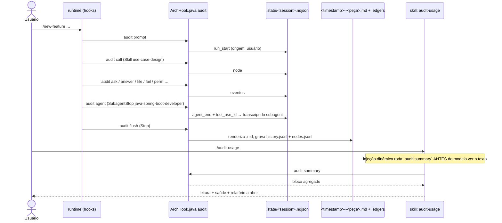

# Trilha de auditoria — hook `audit`, hook `guard` e `/audit-usage`

Fonte primária: `.claude/hooks/ArchHook.java` (métodos `audit()` e `guard()`),
`.claude/schemas/extensions.json` (blocos `audit` e `guard`),
`.claude/skills/project-bootstrap/templates/settings.json.example`,
`.claude/skills/audit-usage/SKILL.md`.

## O que é

Dois modos do mesmo hook, ambos ligados **só no projeto gerado** (o
`settings.json.example` que o passo 7 do bootstrap instala), nunca neste meta-repo:

| Modo | Pergunta que responde | Bloqueia? |
|---|---|---|
| `audit` | "Quanto custou esta execução, o que ela encadeou, o que tocou, o que falhou?" | Nunca |
| `guard` | "Uma skill de design tentou escrever em `src/`? Alguém tentou editar um spec aprovado?" | Sim (`exit 2`) |

A skill `/audit-usage` é o leitor da trilha: consolida gasto por peça entre execuções
e aponta qual relatório abrir. Ela não escreve nada.

## Por que é hook, e não skill

A decisão (`0035`, depois estendida em `0038`) foi tomada pelo eixo 7 da matriz de
decisão: **precisa acontecer sempre**, mesmo que o modelo esqueça, a sessão morra ou o
usuário dê Ctrl+C. Só um evento do ciclo de vida entrega isso. Uma skill que "renderiza
o relatório no fim" é persuasão onde havia garantia — e uma execução que morre no meio
não deixaria registro nenhum.

Consequência de custo: **zero tokens** para produzir o relatório. Nenhum corpo de skill
ou agent ganhou instrução de "registre-se"; o hook lê os eventos e o transcript.

## O interruptor

A trilha liga e desliga pela **existência do diretório** `.claude/audit-usage/`:

- `project-bootstrap` cria o diretório no passo 7.4 e escreve `GENESIS.md` no passo 8.6
  (o registro da própria geração, reconstruído a partir dos dados do bootstrap — não é
  um relatório do hook, e diz isso no cabeçalho).
- Sem o diretório, cada fase do hook retorna imediatamente. É assim que este meta-repo
  não paga nada por um modo que não usa: aqui `.claude/audit-usage/` não existe, e
  `/audit-usage` reporta corretamente que a trilha está desligada.
- Para desligar num projeto gerado: apagar o diretório. Para religar: `mkdir -p
  .claude/audit-usage` e garantir `.claude/audit-usage/.state/` no `.gitignore`.

## Eventos ligados (`settings.json.example`)

| Evento | Fase | O que registra |
|---|---|---|
| `UserPromptSubmit` | `audit prompt` | Abre uma execução se o prompt é `/<skill auditada>`; guarda o último prompt livre (redigido) para atribuir tokens à peça que o modelo abrir em seguida |
| `PreToolUse` `Skill\|Task\|Agent` | `audit call` | Nó de encadeamento; abre uma execução implícita (`origem: modelo`) se nenhuma está aberta |
| `PreToolUse` `AskUserQuestion` / `PostToolUse` `AskUserQuestion` | `audit ask` / `audit answer` | Espera pelo usuário, descontada da duração ativa |
| `PostToolUse` `Write\|Edit` | `audit file` | Arquivo tocado |
| `PostToolUseFailure` | `audit fail` | Ferramenta que falhou (retrabalho) |
| `PermissionRequest` / `PermissionDenied` | `audit perm` | Permissão pedida ou negada |
| `SubagentStop` | `audit agent` | Fim de um agent; seus tokens vêm do transcript do próprio subagent |
| `PreCompact` | `audit compact` | Incidente de compactação de contexto |
| `StopFailure` | `audit stopfail` | Falha ao parar |
| `Stop` | `audit flush` | **Renderiza o `.md`** a partir do log append-only e grava a linha do ledger |
| `SessionEnd` | `audit close` | Fecha a execução em aberto |

O log de uma execução em andamento é `.claude/audit-usage/.state/<session>.ndjson`
(append-only, gitignored). Um `kill -9` durante uma escrita perde no máximo a última
linha; o Markdown é sempre reconstruído do log inteiro.

## O que é auditado

Qualquer nome que resolva para `.claude/skills/<n>/SKILL.md` ou
`.claude/agents/<n>.md` **do projeto**, invocado por `/comando` ou pela chamada
`Skill`/`Agent` do modelo. Skills de plugin (`caveman:*`) e agents do runtime
(`Explore`, `general-purpose`) ficam de fora por construção — não têm arquivo. Skills
pré-carregadas via `skills:` no frontmatter de um agent aparecem sob esse agent como
`pré-carregada`, sem tokens próprios.

Duas exceções, listadas em `extensions.json` → `audit.exclude_skills`: `audit-usage` e
`arch-doctor`. São observadores — invocar um deles **fecha** a execução em andamento
(que é o único jeito, dentro de uma sessão viva, de obter um relatório que não esteja
`⏳ em andamento`) e não abre execução própria. Sem isso, ler a trilha geraria um
relatório sobre ler a trilha.

## Anatomia de um relatório

Um `.md` por invocação de topo, em `.claude/audit-usage/<timestamp>--<peça>.md`. Trecho
de um relatório real, gerado no projeto de demonstração:

```text
# 🧾 Auditoria de execução — `/new-feature crie um novo endpoint rest para criacao da entidade account …`

| 🎯 Peça | `/new-feature` · skill |
| 🙋 Origem | usuário — `/comando` |
| ⏱️ Duração | 2h55m35s |
| ⏸️ Espera pelo usuário | 2h44m33s |
| ⚙️ Duração ativa | 11m01s |
| ✅ Status | sucesso |
| 🌿 HEAD | 871d25c → 871d25c |

## 🔗 Encadeamento

/new-feature                                  ████████████████████ 11m01s   100%
├─ 📘 use-case-design (crie um novo endpoint  ████░░░░░░░░░░░░░░░░ 2m17s    21%
├─ 📘 domain-modeling (UC-002)                ██░░░░░░░░░░░░░░░░░░ 1m15s    11%
├─ 📘 rest-api-architect (UC-002)             ███░░░░░░░░░░░░░░░░░ 1m43s    16%
├─ 📘 persistence-architect (UC-002)          ██░░░░░░░░░░░░░░░░░░ 1m06s    10%
├─ 📘 test-architect (UC-002)                 ████░░░░░░░░░░░░░░░░ 2m25s    22%
└─ 🤖 java-spring-boot-developer              ██░░░░░░░░░░░░░░░░░░ 1m12s    11%
     📎 java-patterns (pré-carregada)

## 🧩 Tokens por peça

| Peça | Origem | 🧮 Faturável próprio | ⏱️ Duração |
| `📘 test-architect` | aninhada | 242.813 | 2m25s |
| `🤖 java-spring-boot-developer` | aninhada | 88.517 | 1m12s |
…
```

Seções, na ordem: cabeçalho · comando inicial (redigido, com `sha256` do original) ·
etapas mais caras · encadeamento · tokens por peça · tokens agregados (input, output,
cache read, cache write, faturável, custo estimado, cache hit) · permissões adicionadas
(diff de `settings.local.json` entre início e fim) · regras carregadas · arquivos
tocados · retrabalho.

Três decisões de desenho que o relatório declara em si mesmo:

- **Regras são inferidas, não observadas.** Nenhum evento de hook expõe qual `rule`
  entrou em contexto. O relatório cruza os arquivos tocados com o `paths` de cada norma
  e rotula a seção "inferidas por território" — as regras que *deveriam* ter carregado.
- **Duração de nó é atribuição por janela**: do início do nó até o próximo nó de mesma
  profundidade ou menor, com espera por `AskUserQuestion` descontada.
- **Tokens de agent vêm do transcript do próprio subagent**; tokens de skill no thread
  principal são as mensagens desde a chamada até a próxima peça. Somados, fecham o
  agregado — sem dupla contagem.

## Redação e preço

- **Redação é obrigatória.** O prompt vai para um arquivo versionado; um token colado
  nele seria irreversível no histórico do git (invariante 11). Os padrões vivem em
  `extensions.json` → `audit.redact`: `authorization|token|api_key|secret|password` como
  chave, prefixos `Bearer `, `ghp_`, `github_pat_`, `sk-`, `xoxb-`, `AKIA`, e blocos
  `PRIVATE KEY`.
- **Preço é dado com default nulo.** `pricing.json` chega sem valores e o relatório
  imprime "custo: não configurado" em vez de um `US$ 0,00` confiante — a mesma razão
  pela qual o invariante 8 proíbe versões de memória. Preencha o arquivo e o custo
  aparece por modelo (um subagent em outro modelo é precificado na própria taxa).

## Os ledgers e o `audit summary`

| Arquivo | Uma linha por | Versionado? |
|---|---|---|
| `history.jsonl` | execução de topo (`kind`, `origin`, `status`, `tokens_billable`, `cost_usd`, …) | sim |
| `nodes.jsonl` | peça encadeada dentro de uma execução (`run`, `parent`, `skill`, `tokens_self`, `duration_ms`) | sim |
| `.state/*.ndjson`, `.state/*.prompt.json` | evento bruto da execução em andamento | não |

`java .claude/hooks/ArchHook.java audit summary` agrega os dois ledgers **na JVM** e
imprime um bloco compacto. É esse bloco que `/audit-usage` injeta no próprio corpo —
não o JSON cru, que cresce sem limite e deixaria a aritmética para o modelo. Saída real
do projeto de demonstração:

```text
execuções fechadas: 4 · período: 2026-09-17T11:06:26Z → 2026-09-17T17:31:14Z · peças distintas: 10

### Últimas execuções
| # | 🎯 Peça | 🙋 Origem | Status | ⏱️ Duração | 🧮 Faturável | 📁 Arq. | 🔁 Falhas |
| 1 | `Skill(git-publish)` | modelo | ✅ | 41s | 229.493 | 0 | 0 |
| 2 | `/new-feature` | usuário | ✅ | 11m01s | 530.831 | 11 | 0 |
| 3 | `Skill(domain-modeling)` | modelo | ⚠️ | 47m55s | 1.223.409 | 85 | 1 |
| 4 | `/new-feature` | usuário | ⚠️ | 1m39s | 68.633 | 1 | 1 |

### Gasto por peça (tokens próprios — raiz + aninhada, sem dupla contagem)
📘 test-architect                 ███████░░░░░░░░░░░░░░░░░░ 27%  282.316 tok   3× (0 raiz · 3 aninhada)
📘 git-publish                    ██████░░░░░░░░░░░░░░░░░░░ 23%  243.169 tok   2× (1 raiz · 1 aninhada)
📘 domain-modeling                ███░░░░░░░░░░░░░░░░░░░░░░ 11%  109.946 tok   2× (1 raiz · 1 aninhada)
🤖 java-spring-boot-developer     ██░░░░░░░░░░░░░░░░░░░░░░░ 9%   88.517 tok    1× (0 raiz · 1 aninhada)
…

### Saúde
taxa de falha: 2/4 (50%) · pior: 📘 domain-modeling (1/1)

### Abrir
mais recente: `.claude/audit-usage/2026-09-17T17-31-14--git-publish.md`
mais recente com falha: `.claude/audit-usage/2026-09-17T11-11-27--domain-modeling.md`
```

## `/audit-usage` — o leitor

| Argumento | Faz |
|---|---|
| vazio | Visão consolidada: o bloco acima, mais uma linha de leitura, a peça com pior taxa de falha e o relatório a abrir |
| `last` / `último` | Resume o relatório mais recente em até seis linhas |
| nome de skill ou agent | Linha dessa peça + seu relatório mais novo (o de uma peça aninhada é o do pai) |
| fragmento de nome de arquivo | O único relatório que casa; dois ou mais, lista e pergunta |

O que a skill nunca faz: recalcular um número que o bloco imprimiu, ler `.state/`,
editar ou apagar relatórios, inventar um preço, citar um valor redigido.

## Diagrama de sequência



## Hook `guard` — as duas fronteiras que deixaram de ser prosa

Configuração em `extensions.json` → `guard`:

```json
"design_skills": ["new-feature", "use-case-design", "domain-modeling", "rest-api-architect",
                  "persistence-architect", "messaging-architect", "test-architect"],
"executor_agents": ["java-spring-boot-developer", "archunit-installer", "commons-logging-installer"],
"design_forbidden_paths": ["src/**", "**/src/**"],
"use_cases_dir": "docs/use-cases",
"frozen_statuses": ["approved", "implemented"]
```

| Fase | Evento | Efeito |
|---|---|---|
| `guard prompt` | `UserPromptSubmit` | Fecha a fase anterior; abre uma fase de design se o prompt é `/<design_skill>` |
| `guard call` | `PreToolUse` `Skill\|Task\|Agent` | `Skill(<design_skill>)` abre a fase; `Agent(<executor_agent>)` fecha |
| `guard write` | `PreToolUse` `Write\|Edit` em `**/src/**` ou `docs/use-cases/**` | Regra 1: fase aberta + caminho em `design_forbidden_paths` + chamada não vem de um executor → `exit 2`. Regra 2: pasta `UC-*` cujo spec está em `frozen_statuses` → `exit 2`, exceto a única edição do executor de `status: approved` para `status: implemented` |

Por que existe: uma skill de design escreveu migrations em `src/`, e um caso de uso
posterior reescreveu os specs de um anterior — as duas coisas enquanto as skills
proibiam em prosa (`lessons-learned-005`). Reabrir um spec nunca implementado é
deliberado: `status: draft` à mão.

**Armadilha conhecida:** `Skill(test-architect)` abre uma fase e
`Agent(commons-logging-installer)` fecha uma. Disparadas no mesmo turno, são dois hooks
`PreToolUse` sem ordem garantida, e o perdedor bloqueia toda escrita em `src/` do outro
agent pelo resto da execução. `/new-feature` roda as duas em turnos separados por isso.

## O que `doctor` mostra

`/arch-doctor` traz duas linhas sobre a trilha: `Audit` (quantas execuções registradas,
e se `pricing.json` existe) e `Audit rule inference` (um arquivo sintético que casa com
o `paths` de uma norma real — a forma exata que uma vez lançou
`ArrayIndexOutOfBoundsException` dentro da inferência e congelou todo relatório dali
em diante, em silêncio). Sem o diretório: `⚪ no .claude/audit-usage/ — execution trail
OFF (optional)`.
