# Overview — `.claude/` architecture

## What this repository generates

`claude-spring-architect` turns an empty directory into a Spring Boot project with declared
architecture, executable boundaries (hooks), and an already-installed design→code
pipeline. It doesn't compile anything itself — no `pom.xml`, no Maven tests. The
product is instruction files.

That central idea shapes everything: this repository's own `.claude/` is organized as
a Clean Architecture, with dependencies pointing in a single direction. That's not a
metaphor — it's the real rule of who may cite whom (`CLAUDE.md` § Invariants 1 and 2).

## General diagram

```mermaid
flowchart TB
    subgraph L0["Enforcement — deterministic"]
        SETTINGS["settings.json"]:::hook
        HOOK["ArchHook.java\n(check · format · tests · schema\nguard · audit · compose · doctor)"]:::hook
    end

    subgraph L1["Procedure — skills"]
        CLAUDEMD["CLAUDE.md\n(root — index and routing)"]:::claudemd
        SK_INIT["skill: init-project"]:::skill
        SK_BOOT["skill: project-bootstrap"]:::skill
        SK_DESIGNER["skill: claude-code-architect-designer\n(designs this .claude/ — stays here)"]:::skill
        SK_AUDIT["skill: audit-usage"]:::skill
        SK_PAT["skill: java-patterns"]:::skill
        SK_NF["skill: new-feature"]:::skill
        SK_UC["skill: use-case-design"]:::skill
        SK_DOM["skill: domain-modeling"]:::skill
        SK_PERS["skill: persistence-architect"]:::skill
        SK_REST["skill: rest-api-architect"]:::skill
        SK_TEST["skill: test-architect"]:::skill
        SK_DOCKER["skill: docker-architect"]:::skill
        SK_MSG["skill: messaging-architect"]:::skill
        SK_DOCTOR["skill: arch-doctor"]:::skill
        SK_GIT["skill: git-publish"]:::skill
    end

    subgraph L2["Isolated execution — agents"]
        AG_INITZR["agent: project-initializer\n(model: opus)"]:::agent
        AG_DEV["agent: java-spring-boot-developer\n(model: sonnet, effort: max)"]:::agent
        AG_ARCH["agent: archunit-installer\n(model: sonnet, effort: medium)"]:::agent
        AG_LOG["agent: commons-logging-installer\n(model: sonnet, effort: medium)"]:::agent
    end

    subgraph L3["Norms and data — leaves"]
        RULES["rules/*.md\n(architecture-ddd, naming, error-handling,\ncode-quality, api-rest, lombok,\nvalue-objects, persistence, testing,\nobservability, logging, messaging)"]:::rule
        BLUEPRINTS["blueprints/*/*.yaml\n(_schema.md defines the contract)"]:::blueprint
    end

    CLAUDEMD -->|routes via table| SK_INIT
    CLAUDEMD -->|routes via table| SK_NF
    CLAUDEMD -->|routes via table| SK_DOCTOR
    CLAUDEMD -->|routes via table| SK_DESIGNER
    CLAUDEMD -->|routes via table| SK_AUDIT

    SK_INIT -->|Agent tool: context + restricted tools + model opus| AG_INITZR
    AG_INITZR -->|follows the procedure of| SK_BOOT
    SK_BOOT -->|reads and validates| BLUEPRINTS
    SK_BOOT -->|reads and copies into the generated project| RULES
    SK_BOOT -->|installs, with guard + audit wired| SETTINGS
    SK_BOOT -->|copies verbatim| HOOK
    SK_BOOT -->|copies| SK_UC & SK_DOM & SK_PERS & SK_REST & SK_TEST & SK_DOCKER & SK_MSG & SK_DOCTOR & SK_NF & SK_GIT & SK_AUDIT & SK_PAT
    SK_BOOT -->|copies| AG_DEV & AG_ARCH & AG_LOG
    SK_DESIGNER -.->|proposes and writes, after approval| SK_UC & AG_DEV & RULES
    AG_DEV -.->|skills: preloaded| SK_PAT
    SK_NF -->|Agent tool, pre-flight, if commons is empty| AG_LOG
    AG_LOG -->|writes| LOGOUT["commons.logging/** + AutoConfiguration.imports"]:::out
    SK_AUDIT -->|Bash, audit summary, no model| HOOK

    SK_NF -->|Skill tool, in sequence| SK_UC
    SK_UC --> SK_DOM
    SK_DOM --> SK_PERS
    SK_DOM --> SK_REST
    SK_DOM -.->|if the event needs external delivery| SK_MSG
    SK_PERS -.->|chains, on demand| SK_DOCKER
    SK_MSG -.->|chains, on demand| SK_DOCKER
    SK_TEST -.->|chains, on demand| SK_DOCKER
    SK_PERS --> SK_TEST
    SK_MSG --> SK_TEST
    SK_REST --> SK_TEST
    SK_NF -->|Agent tool, optional, after consolidating| AG_DEV
    AG_DEV -->|writes| SRC["src/** of the generated project"]:::out
    AG_INITZR -.->|Skill tool, if build green| SK_GIT
    SK_NF -.->|Skill tool, if DEV reports success| SK_GIT
    SK_GIT -->|writes| GITOUT[".git/ + remote repo (gh)"]:::out

    SK_TEST -->|Agent tool, setup mode, no argument| AG_ARCH
    AG_ARCH -->|writes| ARCHTEST["ArchitectureTest.java + JaCoCo gate"]:::out

    SK_DOCTOR -->|Bash, no model| HOOK

    SETTINGS -->|UserPromptSubmit / PreToolUse / PostToolUse / Stop / SubagentStop / SessionEnd …| HOOK
    HOOK -->|blocks or warns about| SRC
    HOOK -->|audit: writes, in the generated project| TRAIL[".claude/audit-usage/*.md + history.jsonl + nodes.jsonl"]:::out

    RULES -.->|cited by path, never copied| SK_UC & SK_DOM & SK_PERS & SK_REST & SK_TEST & SK_MSG
    BLUEPRINTS -.->|cited by path| SK_BOOT

    classDef hook fill:#5c1a1a,stroke:#ff6b6b,color:#fff,stroke-width:2px
    classDef skill fill:#123a5c,stroke:#5aa9e6,color:#fff,stroke-width:2px
    classDef agent fill:#3a1a5c,stroke:#b98aff,color:#fff,stroke-width:2px
    classDef rule fill:#1a4d2e,stroke:#5ad17a,color:#fff,stroke-width:2px
    classDef blueprint fill:#5c4a1a,stroke:#e6b45a,color:#fff,stroke-width:2px
    classDef claudemd fill:#333,stroke:#ccc,color:#fff,stroke-width:2px
    classDef out fill:#222,stroke:#999,color:#eee,stroke-dasharray: 4 3
```

## Legend

| Symbol/color | Type | What it means here |
|---|---|---|
| 🟥 Red | **Hook** (`settings.json` + `ArchHook.java`) | Deterministic enforcement. Runs whenever the event fires, regardless of the model's decision. See [01-file-types.md](01-file-types.md#hook) |
| 🟦 Blue | **Skill** (`SKILL.md`) | Procedure. Becomes part of the model's repertoire; can be invoked by command or automatically. See [§ Skill](01-file-types.md#skill) |
| 🟪 Purple | **Agent** (`.claude/agents/*.md`) | Isolated execution — own context, restricted tools, different model. See [§ Agent](01-file-types.md#agent-subagent) |
| 🟩 Green | **Rule** (`.claude/rules/*.md`) | Norm. A leaf of the graph — never mentions a skill, agent, or command. See [§ Rule](01-file-types.md#rule) |
| 🟧 Orange | **Blueprint** (`.claude/blueprints/*/*.yaml`) | Declarative architecture data. A leaf like rules, but in YAML, not prose. See [05-blueprints.md](05-blueprints.md) |
| ⬛ Gray | **`CLAUDE.md`** | Index and routing table. Always loads at session start. See [§ CLAUDE.md](01-file-types.md#claudemd) |
| Solid line | Active call | One piece invokes another via Skill tool, Agent tool, or direct exec |
| Dashed line | Citation/read | One piece reads or cites another by path, without invoking it |

## Why the direction of the arrows matters

This repository's structural rule (`CLAUDE.md` § Invariants 1, 4, and 6) is: **rules
never mention skills, agents, or commands**. If a rule needed to invoke something, it
would stop being a norm and become a procedure — and a procedure is a skill. That's
why, in the diagram, arrows from `rules/` and `blueprints/` are always dashed and
always point outward from whoever reads them, never the other way.

Likewise, an agent only exists for one of three valid reasons (`CLAUDE.md` § Invariant
5): preserving context, restricting tools, or switching model. `project-initializer`
and `java-spring-boot-developer` meet all three reasons at once;
`archunit-installer` and `commons-logging-installer` meet only the first (preserving
context — neither has an interview, and isolating the `curl`/`./mvnw` they run keeps
that noise from becoming permanent in the main conversation). One reason is already
enough under Invariant 5. Each agent documents its own reason in the `## Why this is an
agent` (or `## Why this is Form 3`) section.

The hook is the only piece outside that citation graph: `settings.json` fires it on
lifecycle events, and what it reads (`forbidden-imports.txt`, `extensions.json`) is
data, not prose. In the generated project it gains two modes that stay inert here —
`guard`, which blocks a design skill from writing under `src/` and freezes approved
specs, and `audit`, which records the execution trail of every skill and agent. See
[08-audit-usage.md](08-audit-usage.md).

## The commands, in one line each

| Command | What it does | Details |
|---|---|---|
| `/init-project` | Interview → picks a blueprint → generates the complete Spring Boot project structure, with no business code | [02-init-project.md](02-init-project.md) |
| `/new-feature <description>` | Designs one use case per run (use case → domain → REST → persistence → tests) into a single spec, asks approval, and offers the executor | [03-new-feature.md](03-new-feature.md) |
| `/arch-doctor` | Diagnoses active hooks, loaded boundaries, Maven wrapper, `java` on PATH, schema, audit trail, compose services | [04-arch-doctor.md](04-arch-doctor.md) |
| `/audit-usage` | Reads the generated project's audit trail: spend per skill and agent across runs, failure rate, which report to open. Here it reports the trail is off | [08-audit-usage.md](08-audit-usage.md) |
| `/claude-code-architect-designer` | Decides which form (skill, agent, rule, `CLAUDE.md` section, MCP — or nothing) solves a scenario, and writes the file after approval. Meta-repo only | [06-claude-code-architect-designer.md](06-claude-code-architect-designer.md) |

`git-publish` isn't a fourth top-level command — it's a Form 1 skill (no
`disable-model-invocation`) chained automatically by `project-initializer` (end of
`/init-project`, if the build passed) and by `/new-feature` (every end of the flow with an approved spec —
after the executor succeeds, or docs-only when the user declines implementing), and also directly invocable by the user. Two `AskUserQuestion` gates
in the skill's body replace the flag as the guard — the same D17 pattern
(`@.claude/decisions/0007-pipeline-skills-invocation.md`), documented in
`@.claude/decisions/0034-git-publish-skill.md`.
