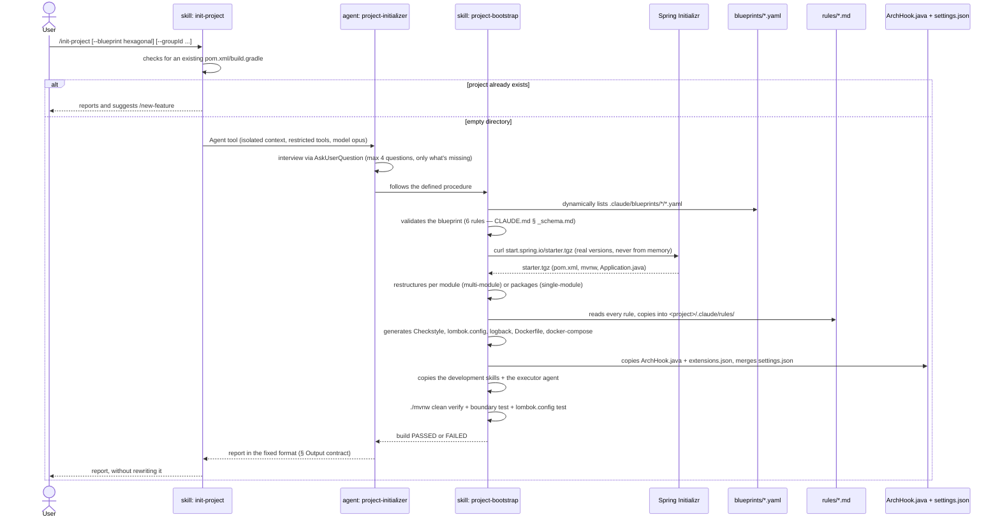

# `/init-project` — creating a project from scratch

Primary source: `.claude/skills/init-project/SKILL.md`,
`.claude/agents/project-initializer.md`, `.claude/skills/project-bootstrap/SKILL.md`.

## What it does

Turns an empty directory into a Spring Boot project with declared architecture,
executable boundaries, and a green build — **with no business code**. No example, seed,
or demo aggregate: the bootstrap generates structure, and the first feature comes from
the `/new-feature` pipeline, from a real spec
(`.claude/decisions/0011-bootstrap-without-business-code.md`, cited in
`project-bootstrap/SKILL.md`).

## Why it's a skill that delegates to an agent

`init-project/SKILL.md` is `disable-model-invocation: true` — a manual ritual, never
triggered by the model on its own. It doesn't do the work itself: it delegates via the
`Agent tool` to `project-initializer`, which exists as an agent for two of the three
valid reasons (`CLAUDE.md` § Invariant 5) — generation produces verbose output that
shouldn't fill the conversation, and it runs with a restricted set of tools.
`project-initializer` uses `model: opus` because validating a dependency graph and
restructuring modules fails expensively if the model gets it wrong.

`project-initializer`, in turn, **doesn't reimplement the procedure** — it follows
`.claude/skills/project-bootstrap/SKILL.md` step by step. The `project-bootstrap`
skill has no `disable-model-invocation` (so it's invocable by the model too), but in
practice it's only triggered through this path and by `/new-feature` when a project
doesn't yet exist.

## Sequence diagram



## Procedure steps (`project-bootstrap`, summary)

| # | Step | What it writes |
|---|---|---|
| 1 | Selects the blueprint | — |
| 2 | Validates the blueprint | — |
| 3 | Generates the base via Spring Initializr | `pom.xml`, `mvnw`, `Application.java` |
| 4 | Restructures per module/packages | `*/pom.xml`, `package-info.java` |
| 4.6 | Generates Checkstyle | `config/checkstyle/checkstyle.xml` |
| 4.7 | Materializes packages + active feature config | `package-info.java`, `application-actuator.yml`, empty `db/migration/` |
| 4.8 | Generates `lombok.config` | `lombok.config` at the root |
| 4.9 | Generates `logback-spring.xml` | `<main-module>/src/main/resources/logback-spring.xml` |
| 4.10 | Generates base Dockerfile + docker-compose | `Dockerfile`, `docker-compose.yml` (`app` service only) |
| 5 | Generates the boundary map | `.claude/forbidden-imports.txt` |
| 6 | Generates root `CLAUDE.md` + per-module ones | `CLAUDE.md`, `*/CLAUDE.md` |
| 6.5 | Generates CI | `.github/workflows/build.yml` |
| 6.6 | Copies the rules | `.claude/rules/*.md` |
| 6.7 | Copies the development skills | `.claude/skills/{arch-doctor,use-case-design,domain-modeling,persistence-architect,rest-api-architect,test-architect,new-feature,docker-architect,messaging-architect,java-patterns}/**` |
| 6.8 | Copies the development agents | `.claude/agents/{java-spring-boot-developer,archunit-installer}.md` |
| 7 | Installs the hooks | `ArchHook.java`, `extensions.json`, merges `settings.json` |
| 8 | Verifies | `./mvnw clean verify`, boundary test, `lombok.config` test, autonomy test |

Step 8 is the only quality gate: if the build fails, **fix it before reporting** — a
bootstrap that delivers a red build isn't finished.

## Example invocation (fictional)

```
/init-project --blueprint hexagonal --groupId com.acme --name pedidos-api --build maven
```

Since `--blueprint`, `--groupId`, and `--name` are already in the arguments,
`project-initializer` doesn't ask about them again — it only interviews what's
missing: build (already given, also skipped) and **features** (REST, JPA+Flyway,
Kafka, SQS, OpenAPI, Testcontainers, Actuator). Suppose the user answers: REST,
JPA+Flyway, OpenAPI, Testcontainers, Actuator (no Kafka/SQS).

## Output report (example, fixed format from `project-bootstrap/SKILL.md`)

```
✅ Project pedidos-api created — blueprint hexagonal

Modules:
  domain                    → depends on []
  application                → depends on [domain]
  adapters/adapter-in-rest       → depends on [application, domain]
  adapters/adapter-out-persistence → depends on [application, domain]
  bootstrap                  → depends on [*]

Versions (resolved by the Initializr): Java 21 · Spring Boot 3.4.1 · maven
Active features: rest, validation, persistence-jpa, uuid-v7, flyway, openapi,
  testcontainers, actuator, observability
Business code: none — by design. 9 package-info.java written
Boundaries: 9 rules in .claude/forbidden-imports.txt — blocking verified ✓
Checkstyle: config/checkstyle/checkstyle.xml — plugin 3.5.0 · tool 10.20.2, validate phase
Lombok: lombok.config at the root — @Data and @Setter stop compilation
ArchUnit: to be installed — `test-architect` skill, setup mode (delegates to `archunit-installer`, see Next steps)
Coverage: JaCoCo generates a report; the 80%/70% gate comes in with `test-architect`
Self-contained: 11 rules + 9 skills + 2 agents + ArchHook.java + extensions.json copied — no dead paths ✓
Docker: base Dockerfile + docker-compose.yml (app service only) — extend with `docker-architect` when a feature needs one
Build: PASSED

Next steps:
  1. /use-case-design <first-use-case-name>
  2. Install the architecture tests (ArchUnit) and wire up the coverage gate with the
     test-architect skill as soon as business classes exist. Until then boundaries
     are guaranteed only by the hook (inside Claude Code), and by the POMs'
     depends_on (in the build) — only if layout: multi-module.
```

> Version numbers (Java, Spring Boot, Checkstyle, plugin) are **always resolved at
> runtime** against the Spring Initializr and Maven Central — never written from
> memory (`CLAUDE.md` § Invariant 8). The values above are illustrative for this
> fictional example, not a promise of a fixed version.

## What happens next

The generated project is **self-contained** (`CLAUDE.md` § Invariant 9): whoever
clones `pedidos-api` doesn't have `ai-spring-setup` on their machine. Everything the
project's `CLAUDE.md` cites has already been copied inside it — rules, development
skills, the executor agent, `ArchHook.java`, `extensions.json`. The creation skills
(`project-bootstrap`, `init-project`) and `blueprints/` are left out on purpose: they
only make sense before the project exists.

From here, the natural next step is `/new-feature` — see
[03-new-feature.md](03-new-feature.md).
