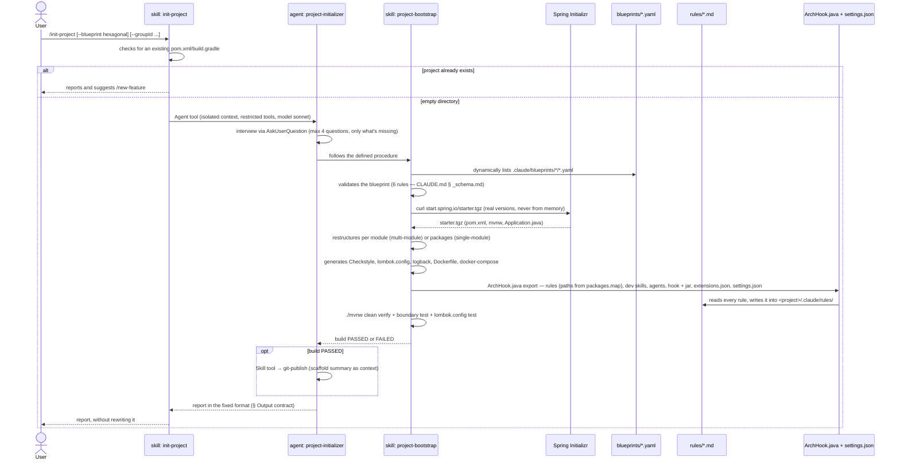

# `/init-project` — creating a project from scratch

Primary source: `.claude/skills/init-project/SKILL.md`,
`.claude/agents/project-initializer.md`, `.claude/skills/project-bootstrap/SKILL.md`.

## What it does

Turns an empty directory into a Spring Boot project with declared architecture,
executable boundaries, and a green build — **with no business code**. No example, seed,
or demo aggregate: the bootstrap generates structure, and the first feature comes from
the `/new-feature` pipeline, from a real spec
(`.claude/decisions/0011-bootstrap-without-business-code.md`, cited in
`project-bootstrap/SKILL.md`).

## Why it's a skill that delegates to an agent

`init-project/SKILL.md` is `disable-model-invocation: true` — a manual ritual, never
triggered by the model on its own. It doesn't do the work itself: it delegates via the
`Agent tool` to `project-initializer`, which exists as an agent for two of the three
valid reasons (`CLAUDE.md` § Invariant 5) — generation produces verbose output that
shouldn't fill the conversation, and it runs with a restricted set of tools.
`project-initializer` uses `model: sonnet` with `effort: high`: the procedure is driven
by the blueprint, the Initializr and the templates, not by judgment (decision 0078).

`project-initializer`, in turn, **doesn't reimplement the procedure** — it follows
`.claude/skills/project-bootstrap/SKILL.md` step by step. The `project-bootstrap`
skill has no `disable-model-invocation` (so it's invocable by the model too), but in
practice it's only triggered through this path and by `/new-feature` when a project
doesn't yet exist.

## Sequence diagram


```mermaid
sequenceDiagram
    actor U as User
    participant CMD as skill: init-project
    participant AG as agent: project-initializer
    participant BOOT as skill: project-bootstrap
    participant INIT as Spring Initializr
    participant BP as blueprints/*.yaml
    participant RULES as rules/*.md
    participant HOOK as ArchHook.java + settings.json

    U->>CMD: /init-project [--blueprint hexagonal] [--groupId ...]
    CMD->>CMD: checks for an existing pom.xml/build.gradle
    alt project already exists
        CMD-->>U: reports and suggests /new-feature
    else empty directory
        CMD->>AG: Agent tool (isolated context, restricted tools, model sonnet)
        AG->>AG: interview via AskUserQuestion (max 4 questions, only what's missing)
        AG->>BOOT: follows the defined procedure
        BOOT->>BP: dynamically lists .claude/blueprints/*/*.yaml
        BOOT->>BOOT: validates the blueprint (6 rules — CLAUDE.md § _schema.md)
        BOOT->>INIT: curl start.spring.io/starter.tgz (real versions, never from memory)
        INIT-->>BOOT: starter.tgz (pom.xml, mvnw, Application.java)
        BOOT->>BOOT: restructures per module (multi-module) or packages (single-module)
        BOOT->>BOOT: generates Checkstyle, lombok.config, logback, Dockerfile, docker-compose
        BOOT->>HOOK: ArchHook.java export — rules (paths from packages.map), dev skills, agents, hook + jar, extensions.json, settings.json
        HOOK->>RULES: reads every rule, writes it into <project>/.claude/rules/
        BOOT->>BOOT: ./mvnw clean verify + boundary test + lombok.config test
        BOOT-->>AG: build PASSED or FAILED
        opt build PASSED
            AG->>AG: Skill tool → git-publish (scaffold summary as context)
        end
        AG-->>CMD: report in the fixed format (§ Output contract)
        CMD-->>U: report, without rewriting it
    end
```

## Procedure steps (`project-bootstrap`, summary)

| # | Step | What it writes |
|---|---|---|
| 1 | Selects the blueprint | — |
| 2 | Validates the blueprint | — |
| 3 | Generates the base via Spring Initializr | `pom.xml`, `mvnw`, `Application.java` |
| 4 | Restructures per module/packages | `*/pom.xml`, `package-info.java` |
| 4.6 | Generates Checkstyle | `config/checkstyle/checkstyle.xml` and `checkstyle-test.xml` |
| 4.7 | Materializes packages + active feature config | `package-info.java`, `application-actuator.yml`, empty `db/migration/` |
| 4.8 | Generates `lombok.config` | `lombok.config` at the root |
| 4.9 | Generates `logback-spring.xml` | `<main-module>/src/main/resources/logback-spring.xml` |
| 4.10 | Generates base Dockerfile + docker-compose | `Dockerfile`, `docker-compose.yml` (`app` service only) |
| 5 | Generates the boundary map | `.claude/forbidden-imports.txt` |
| 6 | Generates root `CLAUDE.md` + per-module ones | `CLAUDE.md`, `*/CLAUDE.md` |
| 6.5 | Generates CI | `.github/workflows/build.yml` |
| 6.6 | Writes the project's `.claude/` in one command — `ArchHook.java export <project> --blueprint <id>`, driven by the `export` manifest of `extensions.json` | Every rule (package `paths` rewritten from `packages.map`); `.claude/skills/{arch-adopt,arch-doctor,audit-usage,docker-architect,domain-modeling,git-publish,gof-design-patterns,jobs-architect,messaging-architect,new-feature,persistence-architect,rest-api-architect,test-architect,use-case-design}/**`; `.claude/agents/{java-spring-boot-developer,archunit-installer,commons-logging-installer}.md`; `ArchHook.java` + `ArchHook.jar`, `extensions.json`, `settings.json` (with `guard`, `audit` and `context` wired); the active blueprint; `.claude/audit-usage/` + `pricing.json`; `.claude/.arch-provenance.json`; `.mcp.json` + `MCP-SETUP.md` only if a server was designed for the generated project |
| 7 | Nothing to run — what the enforcement just installed does, for the final report | — |
| 7.5 | Decides transport security — chains `transport-security-setup`, which asks where TLS terminates and the local profile or local edge | transport lines in `application.yml`, the HSTS filter when no security chain exists, the transport IT, the `**Transport:` paragraph of the root `CLAUDE.md`; the `edge` service or the `Dockerfile` port, via `docker-architect` |
| 8 | Verifies | `./mvnw clean verify`, boundary test, `lombok.config` test, autonomy test |
| 8.4 | Configures SonarQube — chains `sonarqube-setup`, which asks whether a server exists | scanner + `sonar.*` properties in the root build file; CI step for an external server; a `sonarqube` compose service (via `docker-architect`) otherwise |
| 8.5 | Generates the project README | `README.md` (English) + `README.pt-br.md` |
| 8.6 | Writes the trail's genesis record | `.claude/audit-usage/GENESIS.md` |

Step 8 is the only quality gate: if the build fails, **fix it before reporting** — a
bootstrap that delivers a red build isn't finished.

## Example invocation (fictional)

```
/init-project --blueprint hexagonal --groupId com.acme --name pedidos-api --build maven --bounded-context orders
```

Since `--blueprint`, `--groupId`, `--name`, and `--bounded-context` are already in the
arguments, `project-initializer` doesn't ask about them again — it only interviews what's
missing: build (already given, also skipped) and **features** (REST, JPA+Flyway,
Kafka, SQS, OpenAPI, Testcontainers, Actuator). Suppose the user answers: REST,
JPA+Flyway, OpenAPI, Testcontainers, Actuator (no Kafka/SQS).

The **bounded context** (`--bounded-context`) is a field of the same coordinates question,
defaulting to the artifactId. It is a project fact, not a per-use-case answer: it is the
first segment of every Kafka topic name, and choosing it inside one use case would give a
system two namespaces. That is why it is asked once here and written into the generated
project's root `CLAUDE.md`, even when there is no messaging.

## Output report (example, fixed format from `project-bootstrap/SKILL.md`)

```
✅ Project pedidos-api created — blueprint hexagonal

Modules:
  domain                    → depends on []
  application                → depends on [domain]
  adapters/adapter-in-rest       → depends on [application, domain]
  adapters/adapter-out-persistence → depends on [application, domain]
  bootstrap                  → depends on [*]

Versions (resolved by the Initializr): Java 21 · Spring Boot 3.4.1 · maven
Active features: rest, validation, persistence-jpa, uuid-v7, flyway, openapi,
  testcontainers, actuator, observability
Business code: none — by design. 9 package-info.java written
Boundaries: 9 rules in .claude/forbidden-imports.txt — blocking verified ✓
Checkstyle: config/checkstyle/checkstyle.xml — plugin 3.5.0 · tool 10.20.2, validate phase · checkstyle-test.xml over src/test
Spotless: check bound to the build (verify / check) — formatting and unused imports, main and test
Lombok: lombok.config at the root — @Data and @Setter stop compilation
ArchUnit: to be installed — `test-architect` skill, setup mode (delegates to `archunit-installer`, see Next steps)
Coverage: JaCoCo generates a report; the 80%/70% gate comes in with `test-architect`
Self-contained: 19 rules + 20 skills + 3 agents + ArchHook.java + extensions.json written by `ArchHook.java export` — no dead paths ✓
Audit trail: .claude/audit-usage/ active — one report per skill or agent invocation from now on, by `/command` or by the model. GENESIS.md records this run itself. Fill pricing.json to see cost
Docker: Dockerfile + docker-compose.yml — app, postgres (persistence-jpa), otel-collector (observability) — extend with `docker-architect` for anything a future use case adds
Observability UI: none — the collector exports to `debug`. Run `/docker-architect` to add Jaeger or Grafana + Tempo + Prometheus
Transport: topology A edge — HTTP/2 on, HSTS by Spring Security, ForwardedHeadersIT
MCP: none — no server designed for this project yet
Build: PASSED
Docs: README.md (English, default) + README.pt-br.md — origin, blueprint, stack, skills/agents, this report

Next steps:
  1. /use-case-design <first-use-case-name>
  2. Install the architecture tests (ArchUnit) and wire up the coverage gate with the
     test-architect skill as soon as business classes exist. Until then boundaries
     are guaranteed only by the hook (inside Claude Code), and by the POMs'
     depends_on (in the build) — only if layout: multi-module.
```

Since the build passed, `project-initializer` already invoked `git-publish` (via the
`Skill` tool, with the scaffold summary as context) right before writing this report.
Nothing gets committed or pushed without `git-publish`'s two confirmation gates — see
[03-new-feature.md § Operational note](03-new-feature.md) and
`@.claude/decisions/0034-git-publish-skill.md`.

> Version numbers (Java, Spring Boot, Checkstyle, plugin) are **always resolved at
> runtime** against the Spring Initializr and Maven Central — never written from
> memory (`CLAUDE.md` § Invariant 8). The values above are illustrative for this
> fictional example, not a promise of a fixed version.

## What happens next

The generated project is **self-contained** (`CLAUDE.md` § Invariant 9): whoever
clones `pedidos-api` doesn't have Nerviz on their machine. Everything the
project's `CLAUDE.md` cites has already been copied inside it — rules, development
skills, the three executor agents, `ArchHook.java` and its `ArchHook.jar`, `extensions.json`.
The creation skills (`project-bootstrap`, `init-project`, `claude-code-architect-designer`),
the `project-initializer` agent, and the blueprint **catalog** are left out on purpose: they
only make sense before the project exists. The **active** blueprint does travel — the
provenance stamp records its id, and `/arch-adopt` has to resolve it on the next update.

From the first session opened inside the project, the `audit` hook writes one report
per skill or agent invocation into `.claude/audit-usage/` — the `GENESIS.md` from step
8.6 is the only record that doesn't come from the hook, and its header says so. See
[08-audit-usage.md](08-audit-usage.md).

From here, the natural next step is `/new-feature` — see
[03-new-feature.md](03-new-feature.md).
