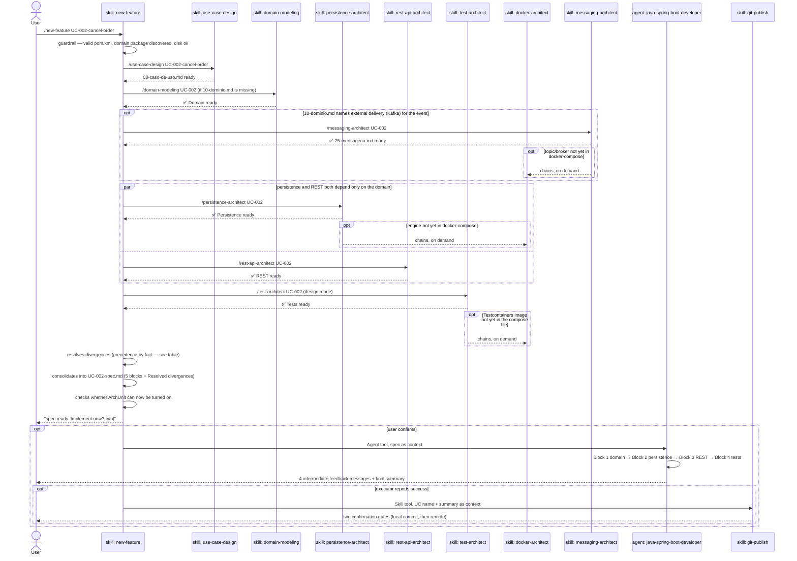

# `/new-feature` — feature design pipeline

Primary source: `.claude/skills/new-feature/SKILL.md`,
`.claude/agents/java-spring-boot-developer.md`, and the five design skills
(`use-case-design`, `domain-modeling`, `persistence-architect`, `rest-api-architect`,
`test-architect`).

## What it does

Orchestrates 5 design skills, in dependency order, until it consolidates a single
`UC-NNN-spec.md` file — ready for the executor agent to implement. **This command only
makes sense inside an already-generated project**, created by `/init-project`: it
reads `pom.xml`, `.claude/forbidden-imports.txt`, and discovers the domain package in
the real project.

## Why it's a manual skill, not an agent

`new-feature/SKILL.md` documents the decision itself: axis 2 (manual trigger) + axis 5
(procedural) + axis 8 (both). The "agent" form was rejected — none of the three valid
reasons applies (context, tools, model): the procedure is a fixed sequence, and a
fixed sequence also rules out rule and `CLAUDE.md`, leaving skill.

## Sequence diagram



## The 5 skills + the executor, what each one writes

| Order | Skill/Agent | Depends on | File it produces |
|---|---|---|---|
| 1 | `use-case-design` | — | `00-caso-de-uso.md` |
| 2 | `domain-modeling` | 1 | `10-dominio.md` |
| 3 | `persistence-architect` | 1, 2 | `20-persistencia.md` |
| 4 | `rest-api-architect` | 1, 2 | `30-rest.md` |
| 5 | `test-architect` | 1, 2, 3, 4 | `40-testes.md` |
| optional | `messaging-architect` | 1, 2 (if 10-dominio.md names external delivery) | `25-mensageria.md` |
| optional | `docker-architect` | chained on demand by 3, 5, or messaging-architect | `docker-compose.yml` |
| — | `new-feature` (consolidation) | 1–5 (+ messaging-architect if present) | `UC-NNN-spec.md` |
| 6 | `java-spring-boot-developer` (agent) | complete spec | code in `src/**` |
| optional | `git-publish` | chained by `new-feature` only if 6 reports success | commit + push, behind two gates |

`docker-architect` is **not a pipeline step** — it's chained on demand by
`persistence-architect`, `test-architect`, or `messaging-architect` when the database
engine, the Testcontainers image, or the broker isn't yet in `docker-compose.yml`.
`messaging-architect` isn't a fixed step either: it only runs if `10-dominio.md` names
external delivery (Kafka) for the event — if the event stays in-process, the pipeline
moves on without it. It writes `25-mensageria.md`, read during consolidation as part of
the domain block. `java-patterns` isn't a step either: its catalog travels preloaded
inside the executor (`skills:` field in `java-spring-boot-developer.md`'s frontmatter)
and is applied directly, never invoked as a separate turn. `git-publish` isn't a
numbered design-pipeline step either — it's chained by `new-feature` **after**
`java-spring-boot-developer` reports success, never by the executor itself (which keeps
its restricted tool set per invariant 5/reason 2 — see
[01-file-types.md § Agent](01-file-types.md#agent-subagent)). `git-publish`'s two
confirmation gates decide whether anything actually gets committed or pushed; the
orchestrator only triggers the offer. If the executor reports a failure, the invocation
is skipped entirely. Details: `@.claude/decisions/0034-git-publish-skill.md`.

`new-feature` only **proposes** turning on ArchUnit and the coverage gate after the
first feature (step 3 of `SKILL.md` — detection is mechanical, authorizing it is the
user's call); it doesn't trigger setup mode itself. If the user accepts and runs
`/test-architect` with no argument afterward, that mode delegates execution to the
`archunit-installer` agent — see
[01-file-types.md § Agent](01-file-types.md#agent-subagent).

## Precedence rule during consolidation

Different skills write different partials, and whoever comes later corrects whoever
came before. When the same fact appears in two partials with different values, the
winner is decided by:

| Fact | Who wins |
|---|---|
| HTTP path, verb, status, body shape | `30-rest.md` |
| Table, column, key, index, migration | `20-persistencia.md` |
| Aggregate name, value object, port, event | `10-dominio.md` |
| Use case boundary, invariants, business errors | `00-caso-de-uso.md` |
| Name and level of each test | `40-testes.md` |

The discarded version doesn't disappear — it goes into the `## Resolved divergences`
section at the end of `UC-NNN-spec.md`, one line per fact. A divergence the table
doesn't resolve (two facts from the same owner, or a business-rule contradiction)
**stops the pipeline and asks** — it isn't invented or stacked.

## Example invocation (fictional)

Project: `pedidos-api` (generated in the [02-init-project.md](02-init-project.md)
example, `hexagonal` blueprint). Feature: canceling an already-confirmed order.

```
/new-feature UC-002-cancel-order
```

Actual flow of the example:

```
▶ Validating project — pom.xml ok, domain package: com/acme/pedidosapi/domain, disk ok

▶ Step 1/5 — use-case-design
✅ 00-caso-de-uso.md — trigger: PATCH /orders/{id}/cancellation
   payload: reason (optional), response: 200 with the updated order
   invariant: only cancels if status ∈ {CONFIRMED, PENDING_PAYMENT}

▶ Step 2/5 — domain-modeling
✅ 10-dominio.md — aggregate Order.cancel(reason), event OrderCanceled,
   invariant: CONFLICT if status is already CANCELED or DELIVERED

▶ Step 3/5 — persistence-architect
✅ 20-persistencia.md — UPDATE on orders.status + orders.cancellation_reason,
   no new migration (column already exists since UC-001)

▶ Step 4/5 — rest-api-architect
✅ 30-rest.md — PATCH /orders/{id}/cancellation → 200 OK | 404 | 409 | 422

▶ Step 5/5 — test-architect
✅ 40-testes.md — 9 cases: 3 unit (domain), 2 integration (repository), 4 contract (controller)

▶ Consolidating — no unresolved divergences

UC-002-spec.md consolidated. 5/5 specs ready.
Next: hand off to the executor or test the specs.
Implement now? [y/n]
```

If the user answers `y`, the `java-spring-boot-developer` agent takes over, block by
block (real agent format, adapted to the example):

```
✅ Block 1: Domain complete (steps 1-7)
- Aggregate: Order — method cancel(reason), 1 new invariant
- Events: 1 (OrderCanceled)
- Files: 2 classes, 0 errors

Next: Persistence (steps 8-12)

✅ Block 2: Persistence complete (steps 8-12)
- Adapter: OrderRepositoryAdapter — update method reused
- Migration: none new (column reused from UC-001)
- Files: 1 class changed, 0 errors

Next: REST (steps 13-15)

✅ Block 3: REST complete (steps 13-15)
- Controller: 1 endpoint (PATCH 200)
- Exception handler: reused from UC-001
- Files: 2 classes, 0 errors

Next: Tests (steps 16-19)

✅ Block 4: Tests complete (steps 16-19)
- Unit: OrderTest — 3 new cases, 100% pass
- Integration: OrderRepositoryIT — 2 new cases, 100% pass
- Contract: OrderControllerTest — 4 new cases, 100% pass
- Coverage: 83% lines, 76% branches (gate ✅ 80/70)

═══════════════════════════════════════════════════════════════
UC-002-cancel-order implemented ✅ COMPLETE

📊 Summary:
- Files created/changed: 5 Java classes
✅ Tests: 9 cases, 100% pass
✅ Build: ./mvnw verify — green
✅ Checklist: 19/19 complete

🔧 Next step: the caller (`/new-feature`) offers `git-publish` next — commit and push
happen there, not in this agent.
```

Since the executor reported success, `new-feature` invokes `git-publish` next (via the
`Skill` tool, passing `UC-002-cancel-order` + the summary above as context). Two
`AskUserQuestion` gates, in this order:

```
Gate 1 — local commit
"Commit these changes now?" → Yes, commit now / No, skip

✅ Committed a1b2c3d — "feat(UC-002-cancel-order): order cancellation"

Gate 2 — remote
"Create a new GitHub repo (gh) and push" / "Push to an existing remote" / "Skip, keep local only"

✅ Pushed to https://github.com/acme/pedidos-api (branch main)
```

No `git push` runs without these two explicit answers.

## Operational note — long-running background work

Implementing a full feature takes dozens of minutes. An executor running in the
background **doesn't survive the machine sleeping** — the watchdog cuts the stream and
execution dies where it was. Before delegating in the background,
`new-feature/SKILL.md` says to warn and offer both options: keep the machine awake
(`caffeinate -i` on macOS) or run on the main thread, which is resumable. The executor
writes by checkpoint precisely for this — but no checkpoint helps if execution dies
before the first `Write`.

## Entry into generated projects

`/new-feature` travels into every project generated by `/init-project`
(`project-bootstrap` step 6.7). Once `pedidos-api` exists, `/new-feature
UC-003-<slug>` runs **inside** `pedidos-api` itself, without depending on
`claude-spring-architect` being cloned on the machine.
