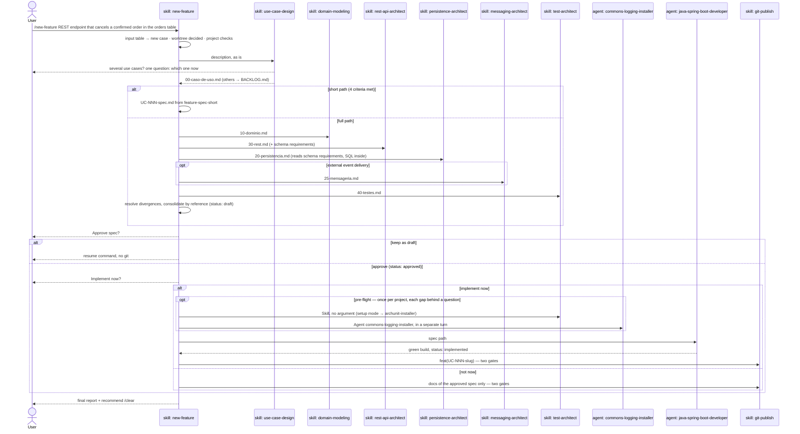

# `/new-feature` — feature design pipeline

Primary source: `.claude/skills/new-feature/SKILL.md`,
`.claude/agents/java-spring-boot-developer.md`, the design skills (`use-case-design`,
`domain-modeling`, `rest-api-architect`, `persistence-architect`, `messaging-architect`,
`test-architect`), and the `guard` mode of `.claude/hooks/ArchHook.java`.

## What it does

Designs **one use case per run** and consolidates it into a single `UC-NNN-spec.md` —
ready for the executor agent to implement once the user approves it. **This command
only makes sense inside an already-generated project**, created by `/init-project`: it
reads `pom.xml`, `.claude/forbidden-imports.txt`, and discovers the domain package in the
real project.

Three boundaries hold on every run:

- **Design writes only under `docs/`.** Migration SQL lives inside `20-persistencia.md`;
  every file under `src/` comes from the executor. The `guard` hook blocks the rest.
- **Git goes only through `git-publish`**, behind its two confirmations — on every end
  of the flow, including the one without the executor. `git push` is always `ask`.
- **An approved spec is immutable.** A later case records the change it needs in its
  own `## Impact on approved use cases` section. The `guard` hook freezes the files.

## Why it's a manual skill, not an agent

`new-feature/SKILL.md` documents the decision itself: axis 2 (manual trigger) + axis 5
(procedural) + axis 8 (both). The "agent" form was rejected — none of the three valid
reasons applies (context, tools, model). `disable-model-invocation: true` means the model
can't call it: the user types the command.

## Input — a closed table

The argument is classified by command (`grep -E`, `test -d`, `grep '^status:'`), never
interpreted. First matching row wins; anything else is an error.

| Input | Result |
|---|---|
| empty | lists the use cases with their `status` |
| `UC-NNN-slug`, folder exists, spec `draft` or missing | resumes: only the missing partials, then consolidation |
| `UC-NNN-slug`, spec `approved` or `implemented` | ❌ approved spec is immutable |
| `UC-NNN-slug`, no folder | ❌ not found — describe the feature to create one |
| contains `UC-` + digit but isn't exact | ❌ ambiguous argument |
| free text, some case still open | ❌ resume or approve it first |
| free text, no open case | new use case — the text goes as is to `use-case-design` |

An error prints the reason and the usage, and ends the run: no skill call, no write, no
question.

## Sequence diagram

## Pieces and what each writes

| Order | Skill/Agent | Depends on | File it produces |
|---|---|---|---|
| 1 | `use-case-design` | — | `00-caso-de-uso.md`, `BACKLOG.md` entries — owns number and slug |
| 2 | `domain-modeling` | 1 | `10-dominio.md` — owns exception names |
| 3 | `rest-api-architect` | 1, 2 | `30-rest.md` — including the schema requirements transport creates |
| 4 | `persistence-architect` | 1, 2, 3 | `20-persistencia.md` — migration SQL inside it |
| optional | `messaging-architect` | 2, if external delivery | `25-mensageria.md` |
| 5 | `test-architect` | 1–4 | `40-testes.md` |
| — | `new-feature` (consolidation) | all above | `UC-NNN-spec.md` |
| 6 | `java-spring-boot-developer` (agent) | `approved` spec | code and migrations in `src/**` |
| — | `git-publish` | end of flow | commit + push, behind two gates |

**Why REST before persistence.** REST generates schema requirements (`Idempotency-Key`
needs the shared key table); persistence generates none for REST. In the old order the
table was discovered after the persistence partial was written, and persistence ran
twice.

`docker-architect` is chained on demand by `persistence-architect`, `test-architect`, or
`messaging-architect`. `java-patterns` travels preloaded inside the executor.

## Pre-flight — infrastructure installed once, on the first "implement now"

Before delegating to the executor, `new-feature` detects (by command, never by
assumption) two gaps that only matter when the first `.java` is about to be written
under `src/`:

| Gap | How it's detected | Installed via |
|---|---|---|
| ArchUnit missing | `grep -rl "ArchRule\|ArchTest" src/test/` is empty | `Skill(test-architect)` with no argument — setup mode, which delegates to `archunit-installer` (ArchUnit + JaCoCo gate) |
| Logging/masking classes missing | no `commons` folder, or only `package-info.java` in it | `Agent(commons-logging-installer)` — thirteen exemplars from `new-feature/templates/commons/` translated into the real package, plus `AutoConfiguration.imports` and the AOP dependencies |

Each gap found becomes an `AskUserQuestion` (**Install now** / **Skip for this run**);
no gap, no question. The two never fire in the same turn: `Skill(test-architect)`
opens a design phase in the `guard` hook and `Agent(commons-logging-installer)` closes
one — with no ordering guarantee between the two `PreToolUse` hooks, the loser would
block every write under `src/` by the other agent (it happened: 138k tokens, zero
files written).

## Spec lifecycle

| `status:` | Written by | When |
|---|---|---|
| `draft` | `new-feature` | at consolidation |
| `approved` | `new-feature` | only after explicit user approval |
| `implemented` | `java-spring-boot-developer` | with `./mvnw verify` green |

A spec defect found by the executor in an approved spec: the user sets `status: draft`
by hand, then `/new-feature UC-NNN-slug` resumes and re-approves.

## Short path

When the case reuses an approved aggregate, needs no new table, column, or migration,
no new exception, and no question to the user, `new-feature` skips the partials and
writes one spec where every row names its source — an approved spec or a rule.

## Precedence rule during consolidation

| Fact | Who wins |
|---|---|
| HTTP path, verb, status, body shape | `30-rest.md` |
| Table, column, key, index, migration | `20-persistencia.md` |
| Topic, delivery guarantee, retry/DLQ | `25-mensageria.md` |
| Aggregate name, value object, port, event | `10-dominio.md` |
| Exception class and `errorCode` | `10-dominio.md` |
| Use case boundary, invariants, error situations | `00-caso-de-uso.md` |
| Name and level of each test | `40-testes.md` |

The spec is consolidated **by reference**: each block holds the final decisions and
the partial's path, never a copy of its tables. Discarded values go to
`## Resolved divergences`.

## Cost discipline

A real run cost ~USD 15 for a two-field aggregate, 70% of it cache reads: the lever is
turns × context size. So: no progress messages between steps, independent writes in one
turn, versions read from `pom.xml`, one use case per run, and `/clear` between runs.

## Operational note — long-running background work

An executor running in the background **doesn't survive the machine sleeping**. Before
delegating in the background, `new-feature/SKILL.md` says to offer keeping the machine
awake (`caffeinate -i` on macOS) or running on the main thread, which is resumable.

## Entry into generated projects

`/new-feature` travels into every project generated by `/init-project`
(`project-bootstrap` step 6.7), with the `guard` hook (step 7). Once `pedidos-api`
exists, `/new-feature <description>` runs **inside** it, without
`claude-spring-architect` on the machine.

Every run leaves a report under `.claude/audit-usage/` — active duration, time waiting
on the user, tokens per chained skill and for the executor, files touched, failures.
That's how the cost discipline above stops being an estimate: `/audit-usage` shows
which piece is eating the budget. See [08-audit-usage.md](08-audit-usage.md).
