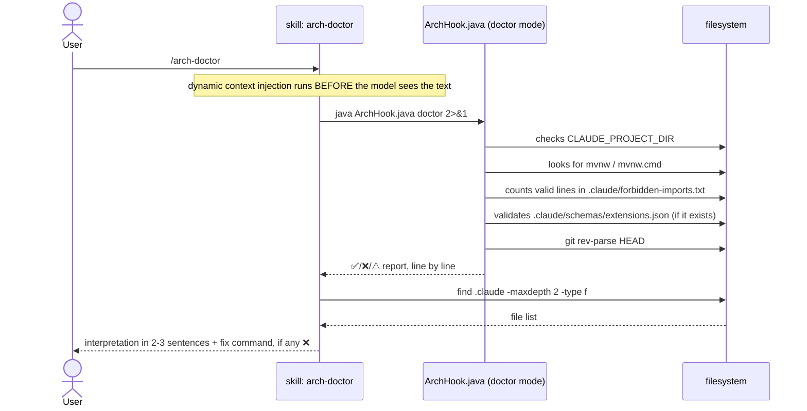

# `/arch-doctor` — setup diagnostics

Primary source: `.claude/skills/arch-doctor/SKILL.md`,
`.claude/hooks/ArchHook.java` (`doctor()` method).

## What it does

Diagnoses whether architecture enforcement is actually working on the current
machine: active hooks, loaded boundaries, Maven wrapper, `java` on PATH, valid
frontmatter schema. It doesn't fix anything on its own — it only reports, and suggests
the exact command to fix each item marked ❌.

## Why it's the simplest of the three skills

`arch-doctor/SKILL.md` doesn't delegate to any agent — there's no verbose output to
hide and no sensitive tools to restrict (`CLAUDE.md` § Invariant 5, none of the three
reasons applies). The skill body only embeds, via dynamic context injection
(`` !`command` ``, see [01-file-types.md § Skill](01-file-types.md#skill)), the real
output of two commands:

```markdown
## Diagnosis
!`java "${CLAUDE_PROJECT_DIR:-.}/.claude/hooks/ArchHook.java" doctor 2>&1`

## AI files
!`find .claude -maxdepth 2 -type f | sort`
```

The model then reads the already-ready result and interprets it in 2-3 sentences — it
doesn't run anything by its own decision during the invocation, both commands already
ran before the model saw the text.

## Sequence diagram



## What each diagnostic line checks

| Line | ✅ condition | ❌/⚠️ condition |
|---|---|---|
| `OS` | — informational | On Windows, notes it runs in exec form (no shell) |
| `Java` | — informational | JVM version in use |
| `Project root` | — informational | resolved from `CLAUDE_PROJECT_DIR` or current directory |
| `CLAUDE_PROJECT_DIR` | variable set | ⚠️ not set — hooks use the current directory |
| `Maven wrapper` | `mvnw`/`mvnw.cmd` found | ❌ missing — run `/init-project` (`starter.tgz` already brings the wrapper) |
| `Boundaries` | ≥ 1 valid rule in `.claude/forbidden-imports.txt` | ❌ 0 rules — enforcement OFF, generated by `/init-project` |
| `Schema` | every extension file passes | ❌ N files with invalid frontmatter, or ⚠️ no `extensions.json` — validation OFF |
| `git HEAD` | at least 1 commit exists | ❌ no commits — the `tests` hook doesn't run (`git diff HEAD` fails) |

The final line summarizes: `✅ Setup operational.` only appears when **both**
`Boundaries` has rules > 0 **and** the Maven wrapper was found. Any other combination
becomes `⚠️ Setup incomplete — see marked lines above.`

## Example invocation and output (fictional, `pedidos-api` project)

```
/arch-doctor
```

```
ArchHook doctor
  OS ................ Mac OS X
  Java .............. 21.0.4
  Project root ...... /Users/dev/projects/pedidos-api
  CLAUDE_PROJECT_DIR  ✅ set
  Maven wrapper       ✅ ./mvnw
  Boundaries          ✅ 9 active rules
  Schema              ✅ all extension files pass
  git HEAD            ✅ exists

✅ Setup operational.

AI files
.claude/forbidden-imports.txt
.claude/hooks/ArchHook.java
.claude/schemas/extensions.json
.claude/settings.json
```

Interpretation the model returns to the user (2-3 sentences, as instructed in the
skill body):

> Setup operational — Maven wrapper present, 9 active boundary rules, frontmatter
> schema validating with no errors. Nothing to fix.

## Example output with a problem

If the project hadn't gone through `/init-project` yet (or the boundaries file had
been deleted by mistake):

```
ArchHook doctor
  OS ................ Mac OS X
  Java .............. 21.0.4
  Project root ...... /Users/dev/projects/pedidos-api
  CLAUDE_PROJECT_DIR  ✅ set
  Maven wrapper       ✅ ./mvnw
  Boundaries          ❌ 0 rules — ENFORCEMENT OFF. Generated by /init-project
  Schema              ✅ all extension files pass
  git HEAD            ✅ exists

⚠️  Setup incomplete — see marked lines above.
```

Expected model response — naming the concrete command, not describing the problem in
general terms (explicit rule in the skill body):

> Boundaries are off — `.claude/forbidden-imports.txt` is empty or missing. Run
> `/init-project` again over this project to regenerate it, or restore the file from
> the original blueprint if it was deleted by mistake.

`arch-doctor` **fixes nothing without the user asking** — that's the last line of the
skill body, and it applies to the boundaries file just as much as to any other item
marked ❌.
