# `/claude-code-architect-designer` — decides and creates `.claude/` extensions

Primary source: `.claude/skills/claude-code-architect-designer/SKILL.md`,
`.claude/skills/claude-code-architect-designer/references/decision-matrix.md`,
`.claude/skills/claude-code-architect-designer/references/frontmatter-fields.md`.

## What it does

Decides **which of the five forms** of Claude Code extension resolves a concrete
scenario — auto-invocable skill, manual skill, subagent, rule, or `CLAUDE.md` section —
and only writes the file after explicit approval. A sixth answer, legitimate and the
cheapest one, is **create nothing**: either a piece already covers the scenario, or the
problem is a compliance issue and belongs in a hook/`permissions.deny`, which this
skill proposes but never writes.

Manual invocation only (`disable-model-invocation: true`) — the model never decides on
its own to create a new skill, agent, or rule.

```
/claude-code-architect-designer [scenario in one sentence]
```

## Why it's a skill and not a rule

Interview → classify → propose → write is a multi-step procedure — as a rule it would
break invariant 1 of `@CLAUDE.md` (`rules/` is a leaf: a rule never mentions a skill,
agent, or command). A rule explaining when to create skills and agents would be
mentioning skills and agents inside itself.

## The five forms

| # | Form | File |
|---|---|---|
| 1 | Auto-invocable skill | `.claude/skills/<name>/SKILL.md` |
| 2 | Manually-invoked skill (`/name`) | same file, with `disable-model-invocation: true` |
| 3 | Subagent | `.claude/agents/<name>.md` |
| 4 | Rule | `.claude/rules/<name>.md` |
| 5 | `CLAUDE.md` section | root `CLAUDE.md` |

## Out of scope — proposes, doesn't write

- **Hooks and `permissions.deny`.** If the interview concludes on axis 7 that the rule
  must always hold, the answer is a hook — this repo's enforcement is concentrated in
  `ArchHook.java`, changing that is infrastructure with its own test and commit.
- **`.claude/commands/`.** Never — invariant 4, commands became skills with
  `disable-model-invocation`.
- **Blueprints.** Architecture is data, not extension (`@.claude/blueprints/_schema.md`).
- **`skill-creator` plugin.** Disabled on purpose in `.claude/settings.json`: it
  generates generic skills, with no knowledge of this repo's invariants.

## Sequence diagram

```mermaid
sequenceDiagram
    actor U as User
    participant CMD as skill: claude-code-architect-designer
    participant DM as decision-matrix.md
    participant FM as frontmatter-fields.md
    participant FS as filesystem

    U->>CMD: /claude-code-architect-designer "scenario in 1 sentence"
    Note over CMD: dynamic injection lists skills/agents/rules/decisions BEFORE the model sees the text
    CMD->>FS: ls .claude/skills .claude/agents .claude/rules .claude/decisions
    FS-->>CMD: current inventory

    rect rgb(235,235,245)
    Note over CMD,U: Phase 1 · Interview
    CMD->>DM: reads the matrix before asking
    CMD->>U: AskUserQuestion — up to 4 questions per call, 2-3 calls
    U-->>CMD: answers across the 10 axes
    end

    rect rgb(235,245,235)
    Note over CMD: Phase 2 · Classify
    CMD->>DM: applies the decision table
    CMD->>CMD: runs the 9 CLAUDE.md invariants as a veto
    end

    rect rgb(245,240,225)
    Note over CMD,U: Phase 3 · Propose — nothing written
    CMD-->>U: 2-4 options ordered by score + references table
    end

    opt Phase 3.5 · only if there was a real choice
        CMD->>FS: .claude/decisions/NNNN-<slug>.md (draft, no State)
    end

    Note over CMD,U: stops here — waits for explicit approval

    U->>CMD: approves option N
    rect rgb(250,230,230)
    Note over CMD: Phase 4 · Write
    CMD->>FM: confirms native frontmatter fields
    CMD->>FS: generates from templates/*.example
    CMD->>FS: "## Why this is <form>" section in the body
    CMD->>FS: propagates — CLAUDE.md, 00-index.md, project-bootstrap, per the form
    CMD->>FS: runs claude plugin validate .claude/skills
    end
    CMD-->>U: Phase 5 · report — files created/changed, decision, validate output, restart warning
```



## Phase 1 · Interview

**Entry rule: no proposal without an interview.** Classifying from one sentence
produces the wrong piece, and the wrong piece costs more than no piece at all — it
stays in context every session, or it never fires.

Ten axes, each eliminates candidate forms. An unanswered axis leaves the decision
guessing:

| # | Axis | What it decides |
|---|---|---|
| 1 | Concrete symptom — what error repeats, what prompt gets pasted again | Whether there's a case, or it's anticipation |
| 2 | Trigger — `/command`, model decision, touching a file, runtime event | Forms 1 · 2 · 4 · out of scope |
| 3 | Frequency — every session, weekly, rare | Always loaded vs on demand |
| 4 | Territory — which file globs, or none | `paths` in form 4; `paths` in form 1 |
| 5 | Nature — declarative fact or sequence of steps | Forms 4/5 vs 1/2/3 |
| 6 | Isolation — verbose output, tools to restrict, different model | Form 3, and only it |
| 7 | Mandatoriness — can it fail sometimes, or is it build/security/compliance | Out of scope (hook) |
| 8 | Destination — this repo only, also the generated project, or both | Steps 6.6/6.7/7 of `project-bootstrap` |
| 9 | Integration — what it reads, what it writes, which existing piece it collides with | Ownership conflict |
| 10 | Cost of getting it wrong | minutes or days | Weight in the score |

Axis 9 is checked against the inventory injected at the top of the skill (`ls
.claude/skills`, `.claude/agents`, `.claude/rules`, `.claude/decisions`), never from
memory. Two pieces writing to the same path is an ownership bug, not a style decision.

## Phase 2 · Classify

Applies the decision table from `decision-matrix.md` (summarized below), then runs the
nine invariants of `@CLAUDE.md` as a veto — the most commonly violated are 1 (a rule
that mentions a skill) and 5 (an agent with none of the three reasons). A proposal that
fails an invariant **is not presented as viable**: it appears with the score it
deserves and the reason for rejection.

### The dividing line

```
   ┌─ CLAUDE.md ──── fact, always in context             │
   ├─ rules/ ─────── fact, by territory (paths)          │  PERSUASION
   ├─ skills/ ────── procedure, on demand                 │  (the model can fail)
   └─ agents/ ────── isolated execution                   │
  ═════════════════════════════════════════════════════
   ┌─ permissions ── allow / ask / deny                   │  GUARANTEE
   └─ hooks ──────── lifecycle events                      │  (always executes)
```

Everything above the line is read by the model: it can be ignored, misinterpreted, or
lost in a `/compact`. Everything below executes regardless of what the model decides.
Consequence: if breaking the rule is a compliance/security/build bug, the answer isn't
among the five forms.

### Decision table (first matching row decides)

| Question | If yes |
|---|---|
| Must it happen always, without depending on the model's judgment? | **Hook** or `permissions.deny` — out of scope |
| Does it need to access an external system (Jira, database, S3)? | **MCP server** — out of scope |
| Is it a declarative fact that holds in every session and across the whole repo? | **Form 5** — `CLAUDE.md` section |
| Is it a declarative fact that only holds for part of the files? | **Form 4** — rule with `paths` |
| Is it a multi-step procedure, or long, rarely-needed reference? | **Form 1 or 2** — skill |
| … and does the user want to trigger it by hand, or does it have a side effect? | **Form 2** — `disable-model-invocation: true` |
| … and should it fire on its own from the description, without the user asking? | **Form 1** |
| Does it need isolated context, restricted tools, or a different model? | **Form 3** — subagent, and even then see § 5 of the matrix |

No row matches → the answer is **create nothing**.

### Form 1 vs Form 2

Same file, one line of difference. This repo's practical rule:

- **Writes files in the user's project and is triggered by their decision → Form 2.**
  E.g. `arch-doctor`, `init-project`, `project-bootstrap`, `java-patterns`, and this
  skill itself.
- **Part of a pipeline another piece chains → Form 1**, even when writing files.
  `disable-model-invocation` hides the skill from the model, and what the model
  doesn't see the orchestrator doesn't call. The five pieces of `/new-feature` have
  been this way since D17
  (`@.claude/decisions/0007-pipeline-skills-invocation.md`).

### Form 3 — the three reasons, and only those

1. **Preserve context** — verbose exploration stays in the subagent, only the summary
   comes back.
2. **Restrict tools** — a reviewer with `tools: Read, Grep, Glob` can't write.
3. **Control cost or capability** — `model: haiku` for triage, `opus` where failure is
   expensive.

None applies → it's a skill. This is anti-pattern #1, and the most expensive one: one
more piece to maintain, no gain. Counter-test: if the interview with the user is the
heart of the task, if the context fits in a `references/` of the skill itself, or if
the final output is short anyway — any "yes" points to skill, not agent. Sole
precedent in this repo: `init-project` → `project-initializer`.

### Form 4 vs Form 5

| | Form 5 (`CLAUDE.md`) | Form 4 (`rules/`) |
|---|---|---|
| Cost | Every prompt, every session | Only when a `paths` matches |
| Scope | Whole repo | File territory |
| Survives `/compact` | Yes, re-injected | Reloads on touching the files |
| Size target | < 200 lines total | One theme per file |

Two loading paths for Form 4, the first preferable: `paths` (auto-loads, doesn't
depend on anyone remembering) and explicit citation by path, for cross-cutting rules
no glob captures.

## Phase 3 · Propose — nothing written

Two to four options, ordered by score, always including the "create nothing"
hypothesis when defensible. Each option in this form, in this order:

1. **Title** — proposed filename, kebab-case
2. **Motivator** — the interview axis that justifies it
3. **Pros**
4. **Cons** — includes the invariant it strains, if any
5. **Score 0-10** — rubric below
6. **Visual** — file tree or ASCII graph of who calls whom

And at the end, a **references table**: for each decision, the concrete source
(`@claude-help.md` § N, `@CLAUDE.md` invariant N, or the repo file that serves as
precedent). A claim about the runtime without a source is decoration — cut it.

### Score rubric (0-10)

Seven criteria, equal weight, ~1.43 points each:

| # | Criterion | A point is lost when |
|---|---|---|
| 1 | Form fit | The § 2 table points to another form |
| 2 | Compliance with the invariants | Strains one of the nine; violating one caps the score at ≤ 4 |
| 3 | Context cost | Rarely-used knowledge stays always loaded |
| 4 | Enforcement | Relies on persuasion where a guarantee was available |
| 5 | Maintenance cost | Adds pieces or indirection without proportional gain |
| 6 | Precedent in the repo | No similar form already in use; novel design |
| 7 | Complete propagation | Doesn't close routing, `00-index`, steps 6.6/6.7/7, or the decision record |

Violating an invariant caps the score at **≤ 4**, regardless of the rest. A score
**≥ 8** is a recommendation; **5 to 7** is viable with a written caveat; **≤ 4** appears
only to record why it was rejected.

## Phase 3.5 · Save the decision draft

What Phase 3 produced — options, scores, rejected alternatives, references table —
evaporates at the end of the session. Without a record, the same ten-axis interview
starts over from scratch six months from now.

**When to save a file.** Only if at least one is true:

- Two or more options scored ≥ 5 — there was a real choice.
- The top-scoring option strains an invariant of `@CLAUDE.md`.
- Axis 8 answered "both" — the piece also goes to the generated project.

None of these → no file is saved. The justification lives in the `## Why this is
<form>` section of the file Phase 4 creates, and that's enough.

**How.** Generates from `templates/decision.md.example` to
`.claude/decisions/NNNN-<slug>.md`, `NNNN` = highest existing plus one, read from the
inventory injected at the top — never from memory. Saves with **all** options and
without the `State` line: the decision hasn't been made yet.

**Stops here. Waits for explicit approval.** "Looks good" is not approval of which
option.

If the user rejects everything, closes the draft with
`State: rejected — no option approved` and stops. Doesn't delete it: its value is
avoiding the same interview again.

## Phase 4 · Write — only after approval

1. Generates from the `templates/` exemplar matching the approved form.
2. Frontmatter: native fields only, listed in `references/frontmatter-fields.md`. An
   invented field is silently ignored by the runtime — it looks like behavior, it's
   decoration.
3. No `metadata:` in frontmatter. Ownership, `reads`, and handoff go in the
   `## Contract` section of the body.
4. Code boilerplate goes to `templates/<name>.example` inside the skill that emits it,
   never pasted in the body — invariant 3.
5. **A `## Why this is <form>` section in the body of the created file, always.**
   Three sentences: the form chosen, the interview axis that motivated it, and the
   closest rejected form with the reason. It's the only record that travels with the
   file — it survives whoever never read `.claude/decisions/`, and the copy into the
   generated project. Precedent: `.claude/agents/project-initializer.md`, section "Why
   this is an agent and not a skill". For Form 5 there's no body to put it in: the
   justification lives only in the decision record, and if there's no record, in the
   commit message.
6. **Propagates.** A new file nobody routes to isn't found:

   | You created | Also update |
   |---|---|
   | Skill | `@CLAUDE.md` routing table |
   | Development skill (valid inside the generated project) | Table in step 6.7 of `project-bootstrap/SKILL.md` and the `## Skill contract` list |
   | Rule | `@.claude/rules/00-index.md` (written-rules table; remove from planned) **and** the table in step 6.6 of `project-bootstrap/SKILL.md` |
   | Agent | `@CLAUDE.md` routing table, if invocable by name |
   | `CLAUDE.md` section | Nothing else — but confirm the total stays under ~200 lines |

   A creation skill (only useful before the project exists) stays **outside** step
   6.7, like `project-bootstrap` and `init-project`. This is stated explicitly in the
   report.

   **Delegation, and only in this case.** If axis 8 answered "both," propagation
   grows — steps 6.6/6.7/7 of `project-bootstrap`, plus its `templates/`. There,
   delegates **this step 6 and no other** to the generic agent with `model: sonnet`,
   passing the path of the Phase 3.5 record and the exact list of files to touch.
   These are mechanical table edits with a destination fixed in writing. Without a
   saved record, doesn't delegate: the subagent doesn't see the conversation.

   Steps 1 through 5 are **never** delegated. Writing the `description` decides
   whether the skill fires, and the `## Contract` decides ownership — that's design,
   not transcription.

7. If a draft was saved in Phase 3.5, promotes it: fills in `Decision`, `State`
   (approved by whom, on what date), and the `Propagation` table with the files step 6
   touched.
8. Runs `claude plugin validate .claude/skills` and reports the output without
   rewriting it.

## Phase 5 · Report

Files created, files changed, the decision record path (or the sentence explaining why
there wasn't one), the `validate` output, and the restart warning if `settings.json`
was touched — it's only read at session startup.

## Frontmatter fields — summary by form

Full source: `references/frontmatter-fields.md`, derived from
`.claude/schemas/extensions.json` (single owner of the list — `ArchHook.java schema`
is what reads it and blocks on it).

### Skill

| Field | For what |
|---|---|
| `name` | Identifier. Lowercase and hyphens |
| `description` | **The field that decides whether the skill is invoked.** Concrete use case first, trigger phrases after. Truncated to 1536 characters in the listing |
| `when_to_use` | Extra trigger phrases |
| `argument-hint` | Autocomplete hint, e.g. `"[usecase-name]"` |
| `arguments` | Positional names, for `$name` substitution |
| `disable-model-invocation` | `true` = only the user invokes, via `/name`. For side effects |
| `user-invocable` | `false` = only the model invokes; hidden from the `/` menu |
| `allowed-tools` | Pre-approves tools **during the turn** that invokes the skill |
| `disallowed-tools` | Removes tools from the pool while the skill is active |
| `model` · `effort` | Model/effort override while the skill is active |
| `paths` | Globs that limit automatic activation |
| `context: fork` | Runs the skill in an isolated subagent |
| `agent` | Which subagent type to use with `context: fork` |
| `background` | With `fork`, `false` = waits for the result in the same turn |
| `hooks` | Hooks registered when invoking the skill |

The **folder name** becomes the command: `.claude/skills/arch-doctor/` →
`/arch-doctor`. The frontmatter `name` follows the folder; diverging is guaranteed
confusion during diagnosis.

### Subagent

| Field | Required | For what |
|---|---|---|
| `name` | ✅ | Lowercase and hyphens. Cannot contain `:` |
| `description` | ✅ | When to delegate. Short — the sum of descriptions has a 15k-token ceiling |
| `tools` | ➖ | Comma-separated list. Without the field, inherits everything |
| `disallowedTools` | ➖ | Removes from the inherited list. Accepts `mcp__*` |
| `model` | ➖ | `sonnet`, `opus`, `haiku`, full ID, or `inherit` |
| `permissionMode` | ➖ | `default`, `acceptEdits`, `auto`, `dontAsk`, `bypassPermissions`, `plan` |
| `maxTurns` | ➖ | Maximum turns before stopping |
| `skills` | ➖ | Skills preloaded **in full** at startup |
| `mcpServers` | ➖ | MCP servers only for this subagent |
| `hooks` | ➖ | Hooks only while the subagent runs |
| `memory` | ➖ | `user`, `project`, or `local` |
| `background` | ➖ | `true` keeps it in the background |
| `effort` | ➖ | `low` … `max` |
| `isolation` | ➖ | `worktree` = runs in an isolated git worktree |
| `color` | ➖ | Display color |

Watch the **camelCase** here (`disallowedTools`, `permissionMode`, `maxTurns`) against
the **kebab-case** of skills (`disallowed-tools`, `disable-model-invocation`).
Swapping the conventions produces a silently ignored field — the most expensive
failure mode on this list.

### Rule

| Field | For what |
|---|---|
| `paths` | Globs that make the rule auto-load when the matching files are touched |
| `status` | `active` applies now · `draft` is a proposal, don't apply · `deprecated` only for reading old code |

A rule without `paths` only enters context through explicit citation
(`@.claude/rules/<file>.md`).

### `CLAUDE.md`

No frontmatter. Content only. `@path/file.md` imports another file — but the import
loads at session startup, so it **doesn't save context**: it's organization, not
optimization.

### What never goes in frontmatter

**`metadata:`** and everything it used to carry — ownership, `reads`, handoff,
contracts. It's not a native field: it costs tokens on every invocation and obligates
nothing. In this repo that content lives in the `## Contract` section of the file's
**body**, where the model reads it as an instruction.

## Anti-patterns — rejected in Phase 2

| # | Anti-pattern | Signal | Redirect |
|---|---|---|---|
| 1 | Agent where a skill would do | None of Form 3's three reasons | Skill |
| 2 | Prose where it had to be a hook | "Always run X before finishing" repeated | Hook — out of scope |
| 3 | Obese `CLAUDE.md` | Past ~200 lines | Extract to `rules/` with `paths` |
| 4 | Rule that talks about skills | Breaks invariant 1 | Move the procedure to the skill |
| 5 | Duplicated rule | Same theme in two files | Single owner + citation |
| 6 | New `commands/` | Invariant 4 | Skill + `disable-model-invocation` |
| 7 | Invented frontmatter | Field the runtime ignores | `frontmatter-fields.md` |
| 8 | Code in the skill body | Boilerplate pasted into markdown | `templates/*.example` |
| 9 | Piece built on anticipation | No symptom in interview axis 1 | Create nothing |
| 10 | Creation skill copied into the generated project | Outside step 6.7 | Leave it out, and say so |

## Example invocation (fictional)

```
/claude-code-architect-designer the model forgets to run contract tests before reporting the feature done
```

Interview (summarized — real questions come via `AskUserQuestion`, 2-3 calls):

| Axis | User's answer |
|---|---|
| 1. Symptom | Happened 3x in `/new-feature`: reports "done" without `./mvnw verify` having run |
| 2. Trigger | End of the `/new-feature` pipeline, not a new command |
| 3. Frequency | Every time `/new-feature` finishes |
| 4. Territory | `**/adapter/in/rest/**`, `**/domain/**` — where contract tests live |
| 5. Nature | Procedure step ("before reporting, run X"), not a declarative fact |
| 6. Isolation | Doesn't need restricted tools or a different model |
| 7. Mandatoriness | Can fail — it's process convention, not a build gate |
| 8. Destination | This repo only — it's about how the `new-feature` skill behaves |
| 9. Integration | Touches the body of `.claude/skills/new-feature/SKILL.md` |
| 10. Cost of error | Low-medium — feature "done" without proof it passes |

Classification: axis 7 answers "no, can fail" → not a hook. Axis 5 is a procedure, not
a fact → not a rule nor `CLAUDE.md`. It's a fix to a step that already exists inside an
existing skill, not a new piece.

Proposal returned (summarized):

1. **"Create nothing — edit `new-feature/SKILL.md`"** — Score 9. Motivator: axis 5 + 9
   (piece already exists). The skill's final step already reports "done"; missing an
   explicit line "run `./mvnw verify` before declaring done, paste the output". Pros:
   zero new piece, zero propagation. Cons: none.
2. **"rule `contract-tests-gate.md`"** — Score 3. Motivator: axis 4 (territory
   exists). Cons: breaks invariant 1 if it mentions the `new-feature` skill to say when
   to run; without mentioning it, becomes a loose rule with no execution trigger — weak
   persuasion for something that should be a pipeline step.

With score 9 vs 3, and no "real choice" (one clearly viable option), Phase 3.5 doesn't
save a record — Phase 4 edits `new-feature/SKILL.md` directly and the `## Why this is
<form>` section doesn't apply (an edit, not a new piece).

## Skill contract

**Reads** `@claude-help.md`, `@CLAUDE.md` (the nine invariants),
`@.claude/rules/00-index.md`, `@.claude/blueprints/_schema.md` when the decision
touches blueprints, and the inventory injected at the top. Reads this skill's own
`references/` before classifying — the matrix is deliberately not embedded in the
body.

**Writes** `.claude/skills/**`, `.claude/agents/**`, `.claude/rules/**`, and the root
`CLAUDE.md` of **this repository**. Only after explicit approval.

**Also writes** `.claude/decisions/NNNN-<slug>.md` — and this is the only path it
touches *before* approval, as the Phase 3.5 draft. It is the exclusive owner of the
directory: no other piece writes there, and nothing inside it is a rule.

**Does not write** `.claude/settings.json`, `.claude/hooks/**`,
`.claude/blueprints/**`, nor project Java code. Does not create `.claude/commands/`.

**Delegates** at most step 6 of Phase 4 (propagation), and only when axis 8 is "both"
and a decision record has been saved. Classifying, proposing, and writing the body
always stay in this thread.

**Stays out of the generated project.** It's a creation skill, like
`project-bootstrap` and `init-project`: whoever clones an already-generated project
has no extensions to design. The same applies to `.claude/decisions/` — it records
decisions about this meta-repository.

## References

| Where to see more | What |
|---|---|
| `.claude/skills/claude-code-architect-designer/SKILL.md` | Full skill body, the five phases |
| `.claude/skills/claude-code-architect-designer/references/decision-matrix.md` | Full decision table, score rubric, anti-patterns |
| `.claude/skills/claude-code-architect-designer/references/frontmatter-fields.md` | Complete list of native fields per file type |
| `.claude/skills/claude-code-architect-designer/templates/` | Exemplars used in Phase 4 — `SKILL.md.example`, `SKILL.command.md.example`, `agent.md.example`, `rule.md.example`, `claude-md-section.md.example`, `decision.md.example` |
| `.claude/decisions/README.md` | Rules for the decision-record directory |
| `@CLAUDE.md` | The nine invariants used as a veto in Phase 2 |
| [01-file-types.md](01-file-types.md) | How each form works according to the Claude Code runtime |
