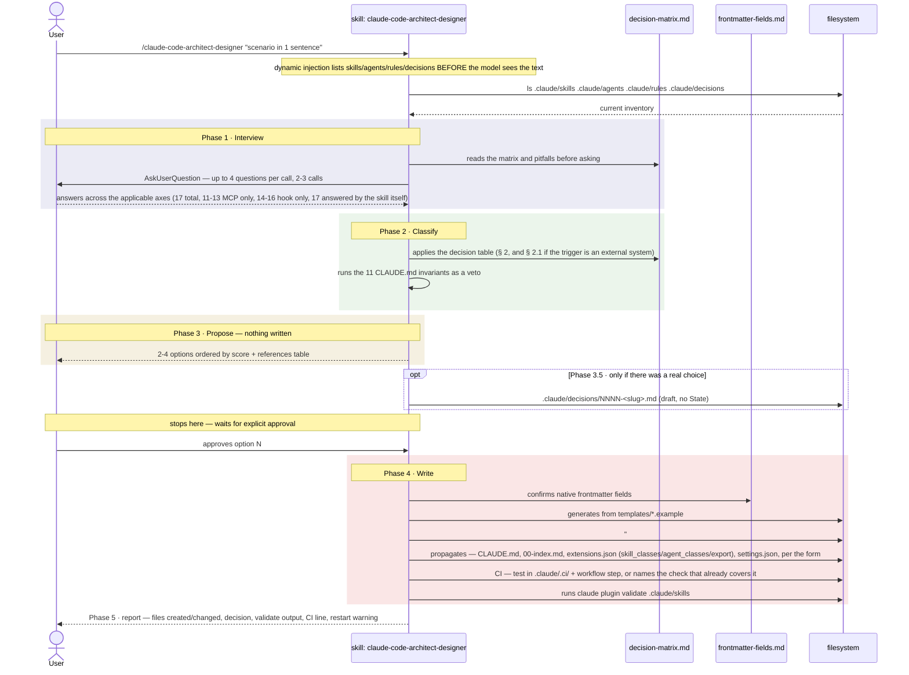

# `/claude-code-architect-designer` — decides and creates `.claude/` extensions

Primary source: `.claude/skills/claude-code-architect-designer/SKILL.md`,
`.claude/skills/claude-code-architect-designer/references/decision-matrix.md`,
`.claude/skills/claude-code-architect-designer/references/frontmatter-fields.md`,
`.claude/skills/claude-code-architect-designer/references/mcp-fields.md`,
`.claude/skills/claude-code-architect-designer/references/ci-coverage.md`.

## What it does

Decides **which of the eight forms** of Claude Code extension resolves a concrete
scenario — auto-invocable skill, manual skill, subagent, rule, `CLAUDE.md` section,
MCP server (shared or per-agent), hook (a registration, or a new `ArchHook.java` mode),
or `permissions` rule — and only writes the file after explicit approval. A ninth answer,
legitimate and the cheapest one, is **create nothing**: either a piece already covers the
scenario, a CLI already solves it (`gh`, `psql`, `aws` — decision matrix § 2.1), or a mode
`ArchHook.java` already has runs the check and only needs registering.

Manual invocation only (`disable-model-invocation: true`) — the model never decides on
its own to create a new skill, agent, or rule.

```
/claude-code-architect-designer [scenario in one sentence]
```

## Why it's a skill and not a rule

Interview → classify → propose → write is a multi-step procedure — as a rule it would
break invariant 1 of `@CLAUDE.md` (`rules/` is a leaf: a rule never mentions a skill,
agent, or command). A rule explaining when to create skills and agents would be
mentioning skills and agents inside itself.

## The eight forms

| # | Form | File |
|---|---|---|
| 1 | Auto-invocable skill | `.claude/skills/<name>/SKILL.md` |
| 2 | Manually-invoked skill (`/name`) | same file, with `disable-model-invocation: true` |
| 3 | Subagent | `.claude/agents/<name>.md` |
| 4 | Rule | `.claude/rules/<name>.md` |
| 5 | `CLAUDE.md` section | root `CLAUDE.md` |
| 6a | MCP server, shared | `.mcp.json` |
| 6b | MCP server, one agent only | `mcpServers:` in that agent's frontmatter |
| 7a | Hook for the whole session | `hooks` block of `.claude/settings.json` |
| 7b | Hook only while one skill or agent runs | `hooks:` in that file's frontmatter |
| 7c | The executable behind 7a/7b | new mode in `.claude/hooks/ArchHook.java` |
| 8 | Hard prohibition or standing permission | `permissions.deny` / `permissions.allow` |

6b isn't a fourth reason for an agent to exist — it's reason 2 of decision-matrix § 5
(restrict tools) applied to an external connection instead of a built-in one. An agent
only exists for the three reasons already in `references/decision-matrix.md` § 5; 6b
just answers which tools it gets once that's already decided.

7c is not a trigger — it's what 7a or 7b invokes, and it exists only when **no** mode the
hook already has covers the check. A 7a that reuses `check`, `format`, `schema`, `tests`,
`guard`, `audit` or `compose` is the common case and writes no Java at all.

Forms 7 and 8 are the **guarantee** side of § 1 of the matrix: they execute regardless of
what the model decides. That makes them the answer whenever the rule must always hold
(invariant 6 of `@CLAUDE.md`) and, at the same time, the most expensive thing on this list
to get wrong — a hook that blocks fires on every matching event, for everyone, including
when it is mistaken. Both therefore require approval **and** a record under `decisions/`,
with no exception, and the final report warns that `settings.json` is read only at session
startup: a hook believed active and silently absent is worse than no hook.

## Out of scope

- **`~/.claude/settings.json` and `.claude/settings.local.json`.** Personal and
  machine-local configuration: not versioned, not shared, not this skill's concern. A hook
  the team doesn't get isn't enforcement, it's one person's habit.
- **A second hook file.** Form 7c is a mode inside `ArchHook.java`, never
  `.claude/hooks/<Other>.java`. Enforcement stays in one executable the generated project
  receives whole through the `export` mode; a second file would have to be copied,
  registered and kept in sync separately — and the first one to fall out of sync fails in
  silence.
- **`.claude/commands/`.** Never — invariant 4, commands became skills with
  `disable-model-invocation`.
- **Blueprints.** Architecture is data, not extension (`@.claude/blueprints/_schema.md`).
- **MCP where a CLI already solves it, or a specific tool that must never be callable.**
  Decision matrix § 2.1: `gh`/`psql`/`aws`/etc. wins over a new server, and this skill
  says so and proposes nothing. A tool that must never run is `permissions.deny` on
  `mcp__<server>__<tool>` — same as any other forbidden action, propose and stop, don't
  write the rule.
- **`~/.claude.json`, `local`/`user`-scope MCP.** Personal or experimental servers
  (`claude mcp add` without `--scope project`) aren't versioned and aren't this skill's
  concern — it only writes what the team shares.
- **`skill-creator` plugin.** Disabled on purpose in `.claude/settings.json`: it
  generates generic skills, with no knowledge of this repo's invariants.

## Sequence diagram


```mermaid
sequenceDiagram
    actor U as User
    participant CMD as skill: claude-code-architect-designer
    participant DM as decision-matrix.md
    participant FM as frontmatter-fields.md
    participant FS as filesystem

    U->>CMD: /claude-code-architect-designer "scenario in 1 sentence"
    Note over CMD: dynamic injection lists skills/agents/rules/decisions BEFORE the model sees the text
    CMD->>FS: ls .claude/skills .claude/agents .claude/rules .claude/decisions
    FS-->>CMD: current inventory

    rect rgb(235,235,245)
    Note over CMD,U: Phase 1 · Interview
    CMD->>DM: reads the matrix and pitfalls before asking
    CMD->>U: AskUserQuestion — up to 4 questions per call, 2-3 calls
    U-->>CMD: answers across the applicable axes (17 total, 11-13 MCP only, 14-16 hook only, 17 answered by the skill itself)
    end

    rect rgb(235,245,235)
    Note over CMD: Phase 2 · Classify
    CMD->>DM: applies the decision table (§ 2, and § 2.1 if the trigger is an external system)
    CMD->>CMD: runs the 11 CLAUDE.md invariants as a veto
    end

    rect rgb(245,240,225)
    Note over CMD,U: Phase 3 · Propose — nothing written
    CMD-->>U: 2-4 options ordered by score + references table
    end

    opt Phase 3.5 · only if there was a real choice
        CMD->>FS: .claude/decisions/NNNN-<slug>.md (draft, no State)
    end

    Note over CMD,U: stops here — waits for explicit approval

    U->>CMD: approves option N
    rect rgb(250,230,230)
    Note over CMD: Phase 4 · Write
    CMD->>FM: confirms native frontmatter fields
    CMD->>FS: generates from templates/*.example
    CMD->>FS: "## Why this is <form>" section in the body
    CMD->>FS: propagates — CLAUDE.md, 00-index.md, extensions.json (skill_classes/agent_classes/export), settings.json, per the form
    CMD->>FS: CI — test in .claude/.ci/ + workflow step, or names the check that already covers it
    CMD->>FS: runs claude plugin validate .claude/skills
    end
    CMD-->>U: Phase 5 · report — files created/changed, decision, validate output, CI line, restart warning
```

## Phase 1 · Interview

**Entry rule: no proposal without an interview.** Classifying from one sentence
produces the wrong piece, and the wrong piece costs more than no piece at all — it
stays in context every session, or it never fires.

Seventeen axes, each eliminates candidate forms. An unanswered axis leaves the decision
guessing:

| # | Axis | What it decides |
|---|---|---|
| 1 | Concrete symptom — what error repeats, what prompt gets pasted again | Whether there's a case, or it's anticipation |
| 2 | Trigger — `/command`, model decision, touching a file, runtime event, or reaching an external system | Forms 1 · 2 · 4 · 6 · out of scope |
| 3 | Frequency — every session, weekly, rare | Always loaded vs on demand |
| 4 | Territory — which file globs, or none | `paths` in form 4; `paths` in form 1 |
| 5 | Nature — declarative fact or sequence of steps | Forms 4/5 vs 1/2/3 |
| 6 | Isolation — verbose output, tools to restrict, different model | Form 3, and only it |
| 7 | Mandatoriness — can it fail sometimes, or is it build/security/compliance | Forms 7 · 8 vs everything else |
| 8 | Destination — this repo only, also the generated project, or both | The `export` block of `@.claude/schemas/extensions.json` |
| 9 | Integration — what it reads, what it writes, which existing piece it collides with | Ownership conflict |
| 10 | Cost of getting it wrong | minutes or days | Weight in the score |
| 11 | Does a CLI already solve it (`gh`, `psql`, `aws`, `kubectl`, `sentry-cli`)? | Eliminates Form 6 before it's even considered — decision matrix § 2.1 |
| 12 | Credential shape — OAuth, static token, dynamic header script, or none; read-only or read/write | Form 6a vs 6b vs `permissions.deny`; whether `oauth`/`headersHelper` is needed |
| 13 | Destination — this repo's `.mcp.json` only, the generated project's template only, or both | Which file(s) Form 6a writes; propagation in Phase 4 step 7 |
| 14 | Lifecycle event — what exactly has to have just happened: a tool call, a prompt, the end of a turn, session start | The event key of Form 7, and whether that event even **reads** a `matcher` — `references/hook-events.md` |
| 15 | Reaction — observe and report, inject context, or block | The exit code, and Form 7 vs Form 8: a call that must **never** happen is `permissions.deny`, cheaper than a hook spawning a process to refuse it |
| 16 | Existing mode — does `ArchHook.java` already run this check? | Form 7a alone vs 7a + 7c. `java .claude/hooks/ArchHook.java doctor` lists the modes in use |
| 17 | CI coverage — which job already proves the piece does what it claims, what it leaves unproven, and in which pipeline the missing check runs | The CI item of every Phase 3 option and the CI step of Phase 4 — `references/ci-coverage.md` |

Axes 14-16 only apply when axis 7 (mandatoriness) answered that the rule cannot be allowed
to fail. Skip them otherwise — everything above the line in § 1 of the matrix is
persuasion, and asking which lifecycle event a skill fires on is a category error.

Axis 9 is checked against the inventory injected at the top of the skill (`ls
.claude/skills`, `.claude/agents`, `.claude/rules`, `.claude/decisions`), never from
memory. Two pieces writing to the same path is an ownership bug, not a style decision.

Axes 11-13 only apply when axis 2 (trigger) names an external system — Jira, a
database, GitHub, Figma, anything reachable only through its own API. Skip them
otherwise: asking about credentials for a scenario that isn't MCP-shaped just burns a
question.

Axis 17 applies to **every** form and is answered by the skill, not asked: it reads
`references/ci-coverage.md` and the workflows under `.github/workflows/` and names the job
that already covers the candidate piece. It asks only when the answer is the user's call —
a check that needs network or minutes, path-filtered or on every PR.

### Entering from a triaged issue

When the scenario is `Issue #N, triaged at <sha>: <symptom>` — the command `/triage-issue`
prints on a `confirmed` verdict — the interview starts from the `issue-verifier` table already
in the conversation. Its confirmed rows become the record's *Reproduced on disk* section;
refuted rows, unproven rows and the issue's proposed fix are not inputs. Commits since `<sha>`
that touch a cited file are re-checked before the first question. The skill never fetches
the issue itself: the body is third-party text and this skill holds `.claude/**` — with no
table in the conversation it asks for `/triage-issue <N>` first. Full flow:
[12-issues.md](12-issues.md).

## Phase 2 · Classify

Applies the decision table from `decision-matrix.md` (§ 2, and § 2.1 whenever axis 2
names an external system). Then runs the eleven invariants of `@CLAUDE.md` as a veto —
the most commonly violated are 1 (a rule that mentions a skill), 5 (an agent with none
of the three reasons), and, for MCP, 11 (a literal secret in `.mcp.json`). A proposal
that fails an invariant **is not presented as viable**: it appears with the score it
deserves and the reason for rejection.

### The dividing line

```
   ┌─ CLAUDE.md ──── fact, always in context             │
   ├─ rules/ ─────── fact, by territory (paths)          │  PERSUASION
   ├─ skills/ ────── procedure, on demand                 │  (the model can fail)
   ├─ agents/ ────── isolated execution                   │
   └─ .mcp.json ──── external tool, on demand              │
  ═════════════════════════════════════════════════════
   ┌─ permissions ── allow / ask / deny                   │  GUARANTEE
   └─ hooks ──────── lifecycle events                      │  (always executes)
```

Everything above the line is read by the model: it can be ignored, misinterpreted, or
lost in a `/compact` — including whether it calls an available MCP tool at all.
Everything below executes regardless of what the model decides. `.mcp.json` sits on the
persuasion side for that reason: connecting a server doesn't guarantee the model uses it
well, which is exactly why MCP and a skill combine (`@claude-help.md` § 9) instead of
MCP replacing the skill. Consequence: if breaking the rule is a compliance/security/build
bug, the answer is **below** the line — Form 7 (hook) or Form 8 (`permissions`), the two that
execute, and none of the six above it.

### Decision table (first matching row decides)

| Question | If yes |
|---|---|
| Must it happen always, without depending on the model's judgment? | **Hook** or `permissions.deny` — out of scope |
| Does it need to access an external system (Jira, database, S3) — go to § 2.1 first | **Form 6** — MCP server, unless § 2.1 eliminates it |
| Is it a declarative fact that holds in every session and across the whole repo? | **Form 5** — `CLAUDE.md` section |
| Is it a declarative fact that only holds for part of the files? | **Form 4** — rule with `paths` |
| Is it a multi-step procedure, or long, rarely-needed reference? | **Form 1 or 2** — skill |
| … and does the user want to trigger it by hand, or does it have a side effect? | **Form 2** — `disable-model-invocation: true` |
| … and should it fire on its own from the description, without the user asking? | **Form 1** |
| Does it need isolated context, restricted tools, or a different model? | **Form 3** — subagent, and even then see § 5 of the matrix |

No row matches → the answer is **create nothing**.

### Sub-table § 2.1 — which MCP form, and whether it's MCP at all

Top to bottom, same rule: **the first matching row decides**. It sits inside the
"external system" row above because the CLI-first check has to run before Form 6 is
even considered, not after.

| Question | If yes |
|---|---|
| Does a CLI already solve it (`gh`, `psql`, `aws`, `kubectl`, `sentry-cli`)? | **Create nothing** — `Bash` + a line in `permissions.allow`. `@claude-help.md` § 9 names this the cheaper alternative; it's the most context-efficient way to talk to an external service, and the model already knows how to use it |
| Must the tool never be callable at all? | `permissions.deny` on `mcp__<server>__<tool>` — out of scope |
| Does only one agent need it? | **Form 6b** — `mcpServers` in that agent's frontmatter |
| Does the whole team need it, with no secret literal in the file? | **Form 6a** — `.mcp.json`, credential via `${VAR}`, `oauth`, or `headersHelper` |
| Is it personal or experimental, not for the team? | `claude mcp add --scope local` — this skill doesn't write it; it isn't versioned |
| Does the server already exist and the model just uses it wrong? | **Form 1** — a skill documenting how to use its tools well, not a new server |

No row matches → **create nothing**. A server with no observed call is dead weight from
the first session: its name alone costs context at startup.

### Form 1 vs Form 2

Same file, one line of difference. This repo's practical rule:

- **Writes files in the user's project and is triggered by their decision → Form 2.**
  E.g. `arch-doctor`, `init-project`, `project-bootstrap`, `gof-design-patterns`, and this
  skill itself.
- **Part of a pipeline another piece chains → Form 1**, even when writing files.
  `disable-model-invocation` hides the skill from the model, and what the model
  doesn't see the orchestrator doesn't call. The five pieces of `/new-feature` have
  been this way since D17
  (`@.claude/decisions/0007-pipeline-skills-invocation.md`).

### Form 3 — the three reasons, and only those

1. **Preserve context** — verbose exploration stays in the subagent, only the summary
   comes back.
2. **Restrict tools** — a reviewer with `tools: Read, Grep, Glob` can't write.
3. **Control cost or capability** — `model: haiku` for triage, `opus` where failure is
   expensive.

None applies → it's a skill. This is anti-pattern #1, and the most expensive one: one
more piece to maintain, no gain. Counter-test: if the interview with the user is the
heart of the task, if the context fits in a `references/` of the skill itself, or if
the final output is short anyway — any "yes" points to skill, not agent. Precedents in
this repo: `init-project` → `project-initializer`, and `new-feature`/`project-initializer`
→ `git-publish` (this last one rejected as an agent: the confirmation dialogue with the
user is the heart of the task — see
`@.claude/decisions/0034-git-publish-skill.md`).

**Corollary — `mcpServers` in an agent's frontmatter is reason 2, never a fourth
reason.** Giving one agent its own MCP server is "restrict tools" applied to an external
connection instead of a built-in one: the rest of the session doesn't carry that
server's tool names in context, and no other agent can reach it. It doesn't unlock a new
category of agent — the same three-reason test above still gates whether the agent
should exist at all; `mcpServers` only answers *which* tools it gets once an agent is
already justified.

### Form 4 vs Form 5

| | Form 5 (`CLAUDE.md`) | Form 4 (`rules/`) |
|---|---|---|
| Cost | Every prompt, every session | Only when a `paths` matches |
| Scope | Whole repo | File territory |
| Survives `/compact` | Yes, re-injected | Reloads on touching the files |
| Size target | < 200 lines total | One theme per file |

Two loading paths for Form 4, the first preferable: `paths` (auto-loads, doesn't
depend on anyone remembering) and explicit citation by path, for cross-cutting rules
no glob captures.

## Phase 3 · Propose — nothing written

Two to four options, ordered by score, always including the "create nothing"
hypothesis when defensible. Each option in this form, in this order:

1. **Title** — proposed filename, kebab-case
2. **Motivator** — the interview axis that justifies it
3. **Pros**
4. **Cons** — includes the invariant it strains, if any
5. **Score 0-10** — rubric below
6. **Visual** — file tree or ASCII graph of who calls whom
7. **CI** — axis 17's answer for this option, one of three: the existing job and step that
   already prove it (the common case — `schema` alone covers a skill's frontmatter, class,
   sections and export entry); the new test or step it needs, with file, workflow and
   job; or "nothing testable, because …". "Later" is not an answer

And at the end, a **references table**: for each decision, the concrete source
(`@claude-help.md` § N, `@CLAUDE.md` invariant N, or the repo file that serves as
precedent). A claim about the runtime without a source is decoration — cut it.

### Score rubric (0-10)

Eight criteria, equal weight, 1.25 points each. Round to the nearest integer and show
what cost points:

| # | Criterion | A point is lost when |
|---|---|---|
| 1 | Form fit | The § 2 table (or § 2.1 for MCP) points to another form |
| 2 | Compliance with the invariants | Strains one of the eleven; violating one caps the score at ≤ 4 |
| 3 | Context cost | Rarely-used knowledge stays always loaded — for Form 6, an MCP server's tool names load at every startup whether or not the session uses them |
| 4 | Enforcement | Relies on persuasion where a guarantee was available |
| 5 | Maintenance cost | Adds pieces or indirection without proportional gain |
| 6 | Precedent in the repo | No similar form already in use; novel design |
| 7 | Complete propagation | Doesn't close routing, `00-index`, the `export` manifest, `skill_classes`/`agent_classes`, the CI answer of `ci-coverage.md`, or the § 9 decision record |
| 8 | Trust surface | Grants a capability wider than the task needs — an MCP server that reads files and calls arbitrary APIs, an agent with `permissionMode: bypassPermissions`, a skill with unscoped `allowed-tools` where a narrower rule would do |
| 9 | Cost of always running | Frequency of the event × cost per firing, and whether `if`/`matcher` narrows before a process is spawned. A `PostToolUse` with no filter pays a JVM startup on every edit in the repo; a `SessionStart` pays once. It also loses a point when the hook blocks (exit 2) on a judgment that will sometimes be wrong — there the cost isn't milliseconds, it's a person stuck |

Violating an invariant caps the score at **≤ 4**, regardless of the rest. A score
**≥ 8** is a recommendation; **5 to 7** is viable with a written caveat; **≤ 4** appears
only to record why it was rejected.

## Phase 3.5 · Save the decision draft

What Phase 3 produced — options, scores, rejected alternatives, references table —
evaporates at the end of the session. Without a record, the same seventeen-axis interview
starts over from scratch six months from now.

**When to save a file.** Only if at least one is true:

- Two or more options scored ≥ 5 — there was a real choice.
- The top-scoring option strains an invariant of `@CLAUDE.md`.
- Axis 8 answered "both" — the piece also goes to the generated project.
- Axis 13 answered "both" — the MCP server is declared in this repo's `.mcp.json` and
  in `project-bootstrap`'s template. The duplication is deliberate (invariant 9), and
  without a record nobody six months from now can tell it apart from drift.
- The approved option is Form 7c or Form 8 — **always**, with no exception. A new mode in
  `ArchHook.java` is infrastructure: it has no markdown body to carry a
  `## Why this is <form>` section, it changes what every session enforces, and a later
  reader who can't reconstruct why it blocks will delete it the first time it gets in the
  way. A `permissions.deny` line is one line of JSON with the same problem and nowhere at
  all to explain itself.

None of these → no file is saved. The justification lives in the `## Why this is
<form>` section of the file Phase 4 creates, and that's enough.

**How.** Generates from `templates/decision.md.example` to
`.claude/decisions/NNNN-<slug>.md`, `NNNN` = highest existing plus one, read from the
inventory injected at the top — never from memory. Saves with **all** options and
without the `State` line: the decision hasn't been made yet.

**Stops here. Waits for explicit approval.** "Looks good" is not approval of which
option.

If the user rejects everything, closes the draft with
`State: rejected — no option approved` and stops. Doesn't delete it: its value is
avoiding the same interview again.

## Phase 4 · Write — only after approval

1. Generates from the `templates/` exemplar matching the approved form. For Form 6a,
   the shape reference is this skill's own `templates/mcp.json.example`: merge the new
   server into the target `.mcp.json` — this repo's root, and/or
   `project-bootstrap/templates/mcp.json.example`, per axis 13 — never overwrite a
   server already declared there. Also write a companion doc shaped like
   `templates/mcp-setup.md.example` (this repo's own `MCP-SETUP.md`, or the project
   one, matching axis 13) listing the environment variables the new server needs, if
   any.
2. Frontmatter: native fields only, listed in `references/frontmatter-fields.md`. An
   invented field is silently ignored by the runtime — it looks like behavior, it's
   decoration. For a Form 6a server's fields, the equivalent list is
   `references/mcp-fields.md` — same discipline, the `mcp` block of
   `.claude/schemas/extensions.json` is the actual owner.
3. No `metadata:` in frontmatter. Ownership, `reads`, and handoff go in the
   `## Contract` section of the body.
4. Code boilerplate goes to `templates/<name>.example` inside the skill that emits it,
   never pasted in the body — invariant 3.
5. **No literal secret, ever, in a `.mcp.json` this skill writes or edits** —
   invariant 11. `${VAR}` / `${VAR:-default}`, `oauth`, or `headersHelper` only. If
   axis 12 named a static token, write the `${VAR}` placeholder and hand the variable
   name to the companion setup doc from step 1 — never the value itself, not even
   "temporarily."
6. **A `## Why this is <form>` section in the body of the created file, always.**
   Three sentences: the form chosen, the interview axis that motivated it, and the
   closest rejected form with the reason. It's the only record that travels with the
   file — it survives whoever never read `.claude/decisions/`, and the copy into the
   generated project. Precedent: `.claude/agents/project-initializer.md`, section "Why
   this is an agent and not a skill". For Form 5, and for Form 6a's `.mcp.json` itself
   (plain JSON, no room for prose), there's no body to put it in: the justification
   lives only in the decision record, and if there's no record, in the commit message.
   Form 6b does have a body — it's the same agent file whose own "Why this is an
   agent" section already covers it; add one line naming which server and why it's
   scoped to that agent alone.
7. **Propagates.** A new file nobody routes to isn't found:

   | You created | Also update |
   |---|---|
   | Skill | `@CLAUDE.md` routing table, **and** a class in `skill_classes` of `@.claude/schemas/extensions.json`: its `skills` list, an `overrides.<skill>.write_allow` when the class default is wrong for it, and the `**Class:** <c>` line in the body. `schema` fails by name on a skill in no class, and enforces the sections that class requires |
   | Development skill (valid inside the generated project) | `export.skills.include` in `@.claude/schemas/extensions.json` — `schema` fails on a skill listed in neither `include` nor `exclude` |
   | Rule | `@.claude/rules/00-index.md` (written-rules table; remove from planned). Every rule travels by default; a rule with a package territory also needs an `export.derived_paths` entry, and `schema` fails without it |
   | Agent | `@CLAUDE.md` routing table, if invocable by name; `export.agents.include` or `exclude`; **and** a class in `agent_classes` of `@.claude/schemas/extensions.json`: its `agents` list, an `overrides.<agent>.write_allow` when the class default is wrong for it, the `**Class:** <c>` line in the body, and `**Executor:** yes` when the class grants `executor: true`. `schema` enforces the sections and the frontmatter fields that class requires — `model` and `tools` always |
   | `CLAUDE.md` section | Nothing else — but confirm the total stays under ~200 lines |
   | MCP server, this repo only (axis 13 = "meta-repo") | `.mcp.json` at the root; the companion setup doc; `@CLAUDE.md` routing table row, if none already covers it |
   | MCP server, also the generated project (axis 13 = "both") | Everything above, **plus** `project-bootstrap/templates/mcp.json.example` and its own companion setup doc — both already named in `export.optional_copy`, so nothing else to wire |
   | Hook, this repo only (axis 8 = "meta-repo") | `.claude/settings.json`; `docs/pt-br/11-pitfalls.md` and `docs/en/11-pitfalls.md` part 2, if the hook blocks something a reader would otherwise call a bug — never `@CLAUDE.md` § Known pitfalls, which holds only what bites with no hook behind it (decision 0090) |
   | Hook, also the generated project (axis 8 = "both") | Everything above, **plus** `project-bootstrap/templates/settings.json.example`. A Form 7c mode needs nothing further: the `export` mode copies `ArchHook.java` and `schemas/extensions.json` whole |
   | Hook mode (Form 7c) | The mode table in `@CLAUDE.md` § Commands, and the `doctor` report if the mode has state worth reporting |
   | `permissions` rule (Form 8) | `.claude/settings.json`; the generated project's template when axis 8 = "both". A `deny` also goes into part 2 of `docs/pt-br/11-pitfalls.md` and `docs/en/11-pitfalls.md` — a tool that silently refuses reads as a broken tool |

   A creation skill (only useful before the project exists) goes in
   `export.skills.exclude`, like `project-bootstrap` and `init-project`. This is stated
   explicitly in the report.

   **Delegation, and only in this case.** If axis 8 or axis 13 answered "both,"
   propagation grows — the `export` block plus `project-bootstrap`'s `templates/`.
   There, delegates **this step 7 and no other** to the generic agent
   with `model: sonnet`, passing the path of the Phase 3.5 record and the exact list of
   files to touch. These are mechanical table edits with a destination fixed in
   writing. Without a saved record, doesn't delegate: the subagent doesn't see the
   conversation. **Never delegates a Form 7 or Form 8 propagation**, even with axis 8
   "both": the second file is a hook registration that executes, and a wrong `if` or
   `matcher` copied into the generated project's template ships to every project made
   afterwards.

   Steps 1 through 6, and step 8, are **never** delegated. Writing the `description` decides
   whether the skill fires, and the `## Contract` decides ownership — that's design,
   not transcription. For MCP the same split holds: which server to add, its
   credential shape, and its destination are design; copying an already-approved
   `.mcp.json` entry into a second file is the only mechanical part.

8. **CI coverage — writes the check the approved option's CI item named.** The map of
   what already covers each form, and where a new check goes, is
   `references/ci-coverage.md`:

   - **An existing check covers it** — writes nothing; names the job and step in the
     record.
   - **An existing test needs a case** — the case goes into that
     `.claude/.ci/<Name>Test.java` (a new class in `SkillTerritoryTest`, a new agent in
     `AgentTerritoryTest`, a new spelling in `BashGuardTest`).
   - **A new test** — `.claude/.ci/<Name>Test.java`, single-file Java like its
     neighbours, spawning `java -jar .claude/hooks/ArchHook.jar` when it exercises a mode
     (decision 0084). Registered as a step of the job the map names in `validate.yml`; a
     check that needs network or minutes goes in the path-filtered `templates.yml`, with
     its paths in **both** trigger lists (decision 0099).
   - **A claim about files `extensions.json` can carry as data** — extends `schema`, not
     a `grep` step in YAML: a YAML step never runs inside a generated project.
   - **Axis 8 = "both"** — also `project-bootstrap/templates/ci.yml.example` and
     `ci-gradle.yml.example`, and **only** with what exists inside the generated project:
     nothing under `.claude/.ci/` travels.
   - **Nothing testable** — the reason goes in the record's `## CI coverage`.

   Proves the check before reporting it: green on the current tree, then red once with
   the defect injected, failing by name. A test that never failed proves nothing.
   **Never delegated**, not even with axis 8 "both": which cases the test holds is design.

   Why: the guard modes of decisions 0063–0077 ran in every session with no CI until
   0084, and two template defects were caught by hand until 0099 — both times CI arrived
   a review after the piece. Design: `.claude/decisions/0102-ci-coverage-in-architect-designer.md`.
9. If a draft was saved in Phase 3.5, promotes it: fills in `Decision`, `State`
   (approved by whom, on what date), the `Propagation` table with the files steps 7 and 8
   touched, and `## CI coverage` with step 8's outcome — the job and step that run the
   check, and the green and red runs.
10. Runs `claude plugin validate .claude/skills` and reports the output without
    rewriting it. **Doesn't cover `.mcp.json`** — also runs
    `java .claude/hooks/ArchHook.java schema` whenever step 1 touched a `.mcp.json`. If
    step 8 wrote or changed a test, runs it again here — `java .claude/.ci/<Name>Test.java`.

## Phase 5 · Report

Files created, files changed, the decision record path (or the sentence explaining why
there wasn't one), the `validate` output, the **CI line** — the job and step that cover
the piece, the test step 8 wrote with its green and red runs, or the reason nothing is
testable — and the restart warning if `settings.json` was touched — it's only read at
session startup.

## Frontmatter fields — summary by form

Full source: `references/frontmatter-fields.md`, derived from
`.claude/schemas/extensions.json` (single owner of the list — `ArchHook.java schema`
is what reads it and blocks on it).

### Skill

| Field | For what |
|---|---|
| `name` | Identifier. Lowercase and hyphens |
| `description` | **The field that decides whether the skill is invoked.** Concrete use case first, trigger phrases after. Truncated to 1536 characters in the listing |
| `when_to_use` | Extra trigger phrases |
| `argument-hint` | Autocomplete hint, e.g. `"[usecase-name]"` |
| `arguments` | Positional names, for `$name` substitution |
| `disable-model-invocation` | `true` = only the user invokes, via `/name`. For side effects |
| `user-invocable` | `false` = only the model invokes; hidden from the `/` menu |
| `allowed-tools` | Pre-approves tools **during the turn** that invokes the skill |
| `disallowed-tools` | Removes tools from the pool while the skill is active |
| `model` · `effort` | Model/effort override while the skill is active |
| `paths` | Globs that limit automatic activation |
| `context: fork` | Runs the skill in an isolated subagent |
| `agent` | Which subagent type to use with `context: fork` |
| `background` | With `fork`, `false` = waits for the result in the same turn |
| `hooks` | Hooks registered when invoking the skill |

The **folder name** becomes the command: `.claude/skills/arch-doctor/` →
`/arch-doctor`. The frontmatter `name` follows the folder; diverging is guaranteed
confusion during diagnosis.

### Subagent

| Field | Required | For what |
|---|---|---|
| `name` | ✅ | Lowercase and hyphens. Cannot contain `:` |
| `description` | ✅ | When to delegate. Short — the sum of descriptions has a 15k-token ceiling |
| `tools` | ➖ | Comma-separated list. Without the field, inherits everything |
| `disallowedTools` | ➖ | Removes from the inherited list. Accepts `mcp__*` |
| `model` | ➖ | `sonnet`, `opus`, `haiku`, full ID, or `inherit` |
| `permissionMode` | ➖ | `default`, `acceptEdits`, `auto`, `dontAsk`, `bypassPermissions`, `plan` |
| `maxTurns` | ➖ | Maximum turns before stopping |
| `skills` | ➖ | Skills preloaded **in full** at startup — never one with `disable-model-invocation: true`, which is skipped without a word (decision 0077) |
| `mcpServers` | ➖ | MCP servers only for this subagent |
| `hooks` | ➖ | Hooks only while the subagent runs |
| `memory` | ➖ | `user`, `project`, or `local` |
| `background` | ➖ | `true` keeps it in the background |
| `effort` | ➖ | `low` … `max` |
| `isolation` | ➖ | `worktree` = runs in an isolated git worktree |
| `color` | ➖ | Display color |

Watch the **camelCase** here (`disallowedTools`, `permissionMode`, `maxTurns`) against
the **kebab-case** of skills (`disallowed-tools`, `disable-model-invocation`).
Swapping the conventions produces a silently ignored field — the most expensive
failure mode on this list.

### Rule

| Field | For what |
|---|---|
| `paths` | Globs that make the rule auto-load when the matching files are touched |
| `status` | `active` applies now · `draft` is a proposal, don't apply · `deprecated` only for reading old code |

A rule without `paths` is **not** "citation only": it loads at launch, in every session.
Every rule declares `paths`, with the narrowest glob that holds it — Java is
`**/src/**/*.java`, never `**/*.java`, which matches `.claude/hooks/ArchHook.java`.
Explicit citation (`@.claude/rules/<file>.md`) comes on top, for design done before the
file exists.

### `CLAUDE.md`

No frontmatter. Content only. `@path/file.md` imports another file — but the import
loads at session startup, so it **doesn't save context**: it's organization, not
optimization.

### What never goes in frontmatter

**`metadata:`** and everything it used to carry — ownership, `reads`, handoff,
contracts. It's not a native field: it costs tokens on every invocation and obligates
nothing. In this repo that content lives in the `## Contract` section of the file's
**body**, where the model reads it as an instruction.

## Anti-patterns — rejected in Phase 2

| # | Anti-pattern | Signal | Redirect |
|---|---|---|---|
| 1 | Agent where a skill would do | None of Form 3's three reasons | Skill |
| 2 | Prose where it had to be a hook | "Always run X before finishing" repeated | Hook — out of scope |
| 3 | Obese `CLAUDE.md` | Past ~200 lines | Extract to `rules/` with `paths` |
| 4 | Rule that talks about skills | Breaks invariant 1 | Move the procedure to the skill |
| 5 | Duplicated rule | Same theme in two files | Single owner + citation |
| 6 | New `commands/` | Invariant 4 | Skill + `disable-model-invocation` |
| 7 | Invented frontmatter | Field the runtime ignores | `frontmatter-fields.md` |
| 8 | Code in the skill body | Boilerplate pasted into markdown | `templates/*.example` |
| 9 | Piece built on anticipation | No symptom in interview axis 1 | Create nothing |
| 10 | Creation skill copied into the generated project | Outside step 6.7 | Leave it out, and say so |
| 11 | MCP where a CLI already solves it | `gh`/`psql`/`aws`/etc. already installed | Create nothing + `permissions.allow` (§ 2.1) |
| 12 | Literal secret in `.mcp.json` | A token, key, or password spelled out in `headers`/`env` | `${VAR}`, `${VAR:-default}`, `oauth`, or `headersHelper` — invariant 11 |
| 13 | MCP server with no observed use | No symptom in interview axis 1; its name still costs context at every startup | Create nothing |
| 14 | Same server duplicated across scopes with no destination reason | Same name in `.mcp.json` and an agent's `mcpServers`, or in both this repo's `.mcp.json` and the project template, with no axis-13 "both" answer behind it | Single destination, or record the "both" answer in the decision |

## Example invocation (fictional)

```
/claude-code-architect-designer the model forgets to run contract tests before reporting the feature done
```

Interview (summarized — real questions come via `AskUserQuestion`, 2-3 calls):

| Axis | User's answer |
|---|---|
| 1. Symptom | Happened 3x in `/new-feature`: reports "done" without `./mvnw verify` having run |
| 2. Trigger | End of the `/new-feature` pipeline, not a new command |
| 3. Frequency | Every time `/new-feature` finishes |
| 4. Territory | `**/adapter/in/rest/**`, `**/domain/**` — where contract tests live |
| 5. Nature | Procedure step ("before reporting, run X"), not a declarative fact |
| 6. Isolation | Doesn't need restricted tools or a different model |
| 7. Mandatoriness | Can fail — it's process convention, not a build gate |
| 8. Destination | This repo only — it's about how the `new-feature` skill behaves |
| 9. Integration | Touches the body of `.claude/skills/new-feature/SKILL.md` |
| 10. Cost of error | Low-medium — feature "done" without proof it passes |

Classification: axis 7 answers "no, can fail" → not a hook. Axis 5 is a procedure, not
a fact → not a rule nor `CLAUDE.md`. It's a fix to a step that already exists inside an
existing skill, not a new piece.

Proposal returned (summarized):

1. **"Create nothing — edit `new-feature/SKILL.md`"** — Score 9. Motivator: axis 5 + 9
   (piece already exists). The skill's final step already reports "done"; missing an
   explicit line "run `./mvnw verify` before declaring done, paste the output". Pros:
   zero new piece, zero propagation. Cons: none.
2. **"rule `contract-tests-gate.md`"** — Score 3. Motivator: axis 4 (territory
   exists). Cons: breaks invariant 1 if it mentions the `new-feature` skill to say when
   to run; without mentioning it, becomes a loose rule with no execution trigger — weak
   persuasion for something that should be a pipeline step.

With score 9 vs 3, and no "real choice" (one clearly viable option), Phase 3.5 doesn't
save a record — Phase 4 edits `new-feature/SKILL.md` directly and the `## Why this is
<form>` section doesn't apply (an edit, not a new piece).

## Skill contract

**Reads** `@claude-help.md`, `@CLAUDE.md` (the eleven invariants), `@docs/pt-br/11-pitfalls.md`
(every silent trap, runtime and repository),
`@.claude/rules/00-index.md`, `@.claude/blueprints/_schema.md` when the decision
touches blueprints, and the inventory injected at the top. Reads this skill's own
`references/` before classifying — the matrix is deliberately not embedded in the
body.

**Writes** `.claude/skills/**`, `.claude/agents/**`, `.claude/rules/**`, the root
`CLAUDE.md` of **this repository**, and `.mcp.json` at this repo's root (Form 6a). For
the approved form's CI item (Phase 4 step 8), also the tests in `.claude/.ci/**`, the jobs
of `.github/workflows/**`, the matching rows of `docs/*/07-ci-validate.md` and, with axis
8 "both", `project-bootstrap/templates/ci.yml.example` and `ci-gradle.yml.example`. Only
after explicit approval.

**Also writes** `.claude/decisions/NNNN-<slug>.md` — and this is the only path it
touches *before* approval, as the Phase 3.5 draft. It is the exclusive owner of the
directory: no other piece writes there, and nothing inside it is a rule.

**Does not write** `.claude/settings.json`, `.claude/hooks/**`, `~/.claude.json`, nor project Java code. Does not create
`.claude/commands/`. **Never writes a literal secret** into `.mcp.json` — invariant 11;
a static credential from axis 12 becomes a `${VAR}` placeholder plus a line in the
companion setup doc, never a value.

**Delegates** at most step 7 of Phase 4 (propagation), and only when axis 8 or axis 13
is "both" and a decision record has been saved. Classifying, proposing, writing the
body, and writing the CI check (step 8) always stay in this thread — the subagent doesn't receive the conversation, and
the interview is the heart of the task.

**Stays out of the generated project.** It's a creation skill, like
`project-bootstrap` and `init-project`: whoever clones an already-generated project
has no extensions to design. The same applies to `.claude/decisions/` — it records
decisions about this meta-repository.

## References

| Where to see more | What |
|---|---|
| `.claude/skills/claude-code-architect-designer/SKILL.md` | Full skill body, the five phases |
| `.claude/skills/claude-code-architect-designer/references/decision-matrix.md` | Full decision table (§ 2 and § 2.1), score rubric, anti-patterns |
| `.claude/skills/claude-code-architect-designer/references/frontmatter-fields.md` | Complete list of native fields per file type |
| `.claude/skills/claude-code-architect-designer/references/mcp-fields.md` | Recognized fields of a server in `.mcp.json` (Form 6a/6b) |
| `.claude/skills/claude-code-architect-designer/references/ci-coverage.md` | Axis 17 — what already proves each form in CI, and where a new check goes |
| `@.claude/decisions/0102-ci-coverage-in-architect-designer.md` | Decision that brought CI coverage into the procedure |
| `.claude/skills/claude-code-architect-designer/templates/` | Exemplars used in Phase 4 — `SKILL.md.example`, `SKILL.command.md.example`, `agent.md.example`, `rule.md.example`, `claude-md-section.md.example`, `decision.md.example`, `mcp.json.example`, `mcp-setup.md.example` |
| `.claude/decisions/README.md` | Rules for the decision-record directory |
| `@CLAUDE.md` | The eleven invariants used as a veto in Phase 2 |
| `@.claude/decisions/0033-mcp-in-architect-designer.md` | Decision that brought MCP (Form 6a/6b) into this skill |
| `@.claude/decisions/0034-git-publish-skill.md` | Recent Form 1 example, with D17's Form1-vs-Form2 caveat applied to a new scenario |
| [01-file-types.md](01-file-types.md) | How each form works according to the Claude Code runtime |
