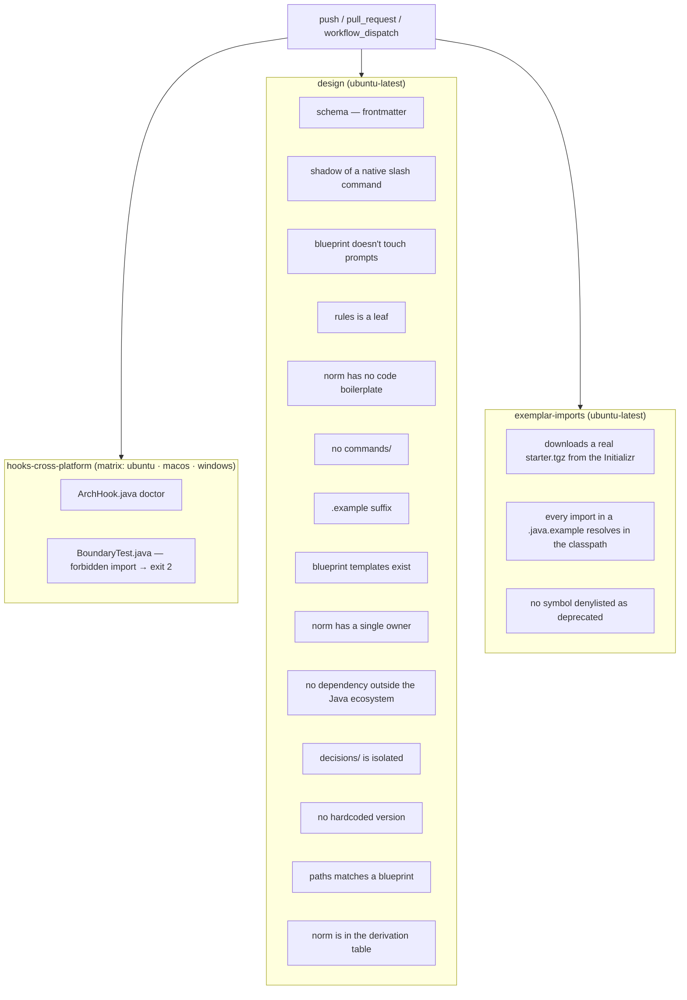

# `validate.yml` — CI for the invariants

Primary source: `.github/workflows/validate.yml`, `.claude/hooks/ArchHook.java`
(`schema()` method), `CLAUDE.md` § Invariants.

## Why it exists

The invariants in `CLAUDE.md` and the norms under `rules/` are prose, not code —
nothing stops an edit from violating one silently. `ArchHook.java check` only guards
the Java boundary of a **generated** project; it never runs against this repository's
own prompt graph. `validate.yml` is what turns each invariant into a deterministic,
repo-wide check on every `push` and `pull_request`, instead of a claim that only holds
as long as whoever writes the next skill remembers it.

## Job diagram



## What each check covers

| Job / step | Verifies | Against what |
|---|---|---|
| `hooks-cross-platform` | `ArchHook.java doctor` and `BoundaryTest` on all three OSes | Decision D8 — "cross-platform" as a fact, not a claim |
| `frontmatter schema` | `java .claude/hooks/ArchHook.java schema` | Invariant 10 — `extensions.json` is the single owner of recognized frontmatter; an invented field or `metadata:` fails loud instead of being silently ignored by the runtime |
| `skill name doesn't shadow a native slash command` | skill folder name against a denylist (`doctor`, `init`, `context`, `memory`, …) | A skill silently replacing a native command instead of erroring |
| `new blueprint doesn't touch prompts` | adding a blueprint leaves `.claude/skills` and `.claude/agents` untouched | Invariant 7 — architectures are data |
| `rules is a leaf of the graph` | no rule mentions "skill", "agent", "subagent" | Invariant 1 |
| `norm contains no code boilerplate` | no `class`/`record`/`interface`/`enum` declaration inside `rules/` | Invariant 3 |
| `no new commands/` | `.claude/commands/` doesn't exist | Invariant 4 |
| `exemplar imports have the .example suffix at the end` | every file under `skills/*/templates/` | Precondition globs that key off the suffix |
| `blueprint-declared templates exist on disk` | every `templates.<role>` in a blueprint resolves to a real file | A blueprint pointing at a renamed or deleted template |
| `each norm has a single owner` | a fixed list of known terms appears in at most one file under `rules/` | Invariant 2 — narrow by construction, see note below |
| `no dependencies outside the Java ecosystem` | no `pip install`, `npm install`, `node `, bare `python` in `.claude/` | Decision D7 |
| `every norm paths matches some blueprint` / `norm is in the bootstrap's derivation table` | a rule's `paths` glob names a package some blueprint declares, and step 6.6 of `project-bootstrap` knows to rewrite it | Gap 8 of `decisions/0024-lessons-learned-001-remediation.md` — a rule that silently never auto-loads |
| `decisions/ doesn't grow paths or enter 00-index.md` | no file in `decisions/` declares `paths:`; none is listed in `rules/00-index.md` | `decisions/` is history, not a rule — see Known pitfalls |
| `no hardcoded Spring/Java version outside decisions/` | no `Spring Boot X.Y` / `Java NN` written as fact in `rules/`, `skills/`, `blueprints/`, `CLAUDE.md` | Invariant 8 — versions are resolved via Spring Initializr, never written from memory. Excludes the `JDK 21+` minimum-requirement line and dated "Tested to compile" notes in exemplars, which record a past verification, not a version to use |
| `exemplar-imports` (whole job) | every `import` in a `.java.example` resolves against JARs from a real `start.spring.io` request, and none uses a name denylisted as deprecated | Gaps 4, 5, 9 of `decisions/0024-lessons-learned-001-remediation.md` — an exemplar that "compiles in the head of whoever wrote it" |

Note on "each norm has a single owner": the check tests a fixed list of literal
phrases (`Constructor injection`, `Zero framework`, `RuntimeException`), not a general
duplication detector. It catches regressions of terms already known to have drifted
once; a new rule added without a new phrase in that list isn't covered.

## What's not here yet

- Invariant 9 (the generated project is self-contained) is only checked manually, via
  the command block at `project-bootstrap/SKILL.md` § 8 ("Verify") — it requires
  generating a real project against the Initializr, and hasn't been automated into CI
  because of that cost.
- `claude plugin validate .claude/skills` — the CLI isn't installed on the GitHub
  Actions runner, and installing it would pull in a dependency outside
  `java`/`git`/`curl` (see `CLAUDE.md` § Dependencies). Run it by hand before opening
  a PR; it's a cheap, complementary check to the `schema` step above, catches
  malformed YAML.

## Running it locally

```bash
# The same commands the `design` job runs, one by one:
java .claude/hooks/ArchHook.java schema
claude plugin validate .claude/skills   # not run in CI — CLI missing on the runner
java .claude/hooks/ArchHook.java doctor
java .claude/.ci/BoundaryTest.java
```

A `git push` without running this first still goes through the local hook
(`settings.json`), but only CI runs the `design` and `exemplar-imports` job steps —
those two have no local hook equivalent.
