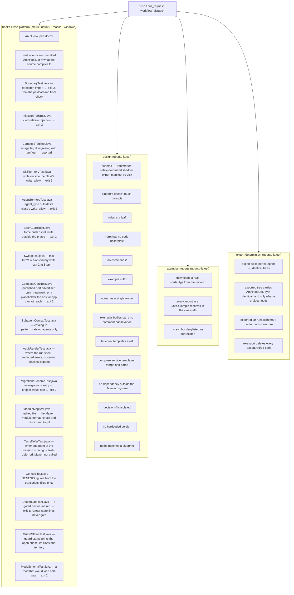

# `validate.yml` — CI for the invariants

Primary source: `.github/workflows/validate.yml`, `.claude/hooks/ArchHook.java`
(`schema()` method), `CLAUDE.md` § Invariants.

## Why it exists

The invariants in `CLAUDE.md` and the norms under `rules/` are prose, not code —
nothing stops an edit from violating one silently. `ArchHook.java check` only guards
the Java boundary of a **generated** project; it never runs against this repository's
own prompt graph. `validate.yml` is what turns each invariant into a deterministic,
repo-wide check on every `push` and `pull_request`, instead of a claim that only holds
as long as whoever writes the next skill remembers it.

## Job diagram


```mermaid
flowchart TD
    T[push / pull_request / workflow_dispatch] --> J1
    T --> J2
    T --> J3
    T --> J4

    subgraph J1["hooks-cross-platform (matrix: ubuntu · macos · windows)"]
        H1[ArchHook.java doctor]
        H0[build --verify — committed ArchHook.jar = what the source compiles to]
        H2[BoundaryTest.java — forbidden import → exit 2, from the payload and from `check <path>`]
        H3[InjectionPathTest.java — cwd-relative injection → exit 2]
        H4[ComposeTagTest.java — image tag disagreeing with src/test → reported]
        H5[SkillTerritoryTest.java — write outside the class's write_allow → exit 2]
        H6[AgentTerritoryTest.java — agent_type outside its class's write_allow → exit 2]
        H7[BashGuardTest.java — force push / shell write outside the phase → exit 2]
        H8[SweepTest.java — this turn's out-of-territory write → exit 2 at Stop]
        H9[ComposeGateTest.java — published port advertised only in-network, or a placeholder the host or app cannot reach → exit 2]
        H10[SubagentContextTest.java — catalog to pattern_catalog agents only]
        H11[AuditRenderTest.java — where the run spent, redacted errors, observer classes skipped]
        H12[MigrationsSchemaTest.java — migrations entry no project would see → exit 2]
        H13[ModuleMapTest.java — edited file → the Maven module format, check and tests hand to -pl]
        H14[TestsDeferTest.java — writer subagent of the session running → tests deferred, Maven not called]
        H15[GenesisTest.java — GENESIS figures from the transcripts, filled once]
        H16[DoctorGateTest.java — a gated doctor line red → exit 1; runner-state lines never gate]
        H17[GuardStatusTest.java — guard status prints the open phase, its class and territory]
        H18[ModsSchemaTest.java — a mod that would load half-way → exit 2]
    end

    subgraph J2["design (ubuntu-latest)"]
        D1[schema — frontmatter, native-command shadow, export manifest vs disk]
        D4[blueprint doesn't touch prompts]
        D5[rules is a leaf]
        D6[norm has no code boilerplate]
        D7[no commands/]
        D8[.example suffix]
        D10[XmlTemplatesTest.java — every *.xml.example parses]
        D16[exemplar bodies carry no comment but Javadoc]
        D9[blueprint templates exist]
        D15[compose service templates merge and parse]
        D10[norm has a single owner]
        D11[no dependency outside the Java ecosystem]
        D12[decisions/ is isolated]
        D13[no hardcoded version]
        D14[paths matches a blueprint]
    end

    subgraph J3["exemplar-imports (ubuntu-latest)"]
        E1[downloads a real starter.tgz from the Initializr]
        E2[every import in a .java.example resolves in the classpath]
        E3[no symbol denylisted as deprecated]
    end

    subgraph J4["export-determinism (ubuntu-latest)"]
        X1[export twice per blueprint → identical trees]
        X2[exported tree carries ArchHook.jar, byte-identical, and only what a project needs]
        X3[exported jar runs schema + doctor on its own tree]
        X4[re-export deletes every export.retired path]
    end
```

## What each check covers

| Job / step | Verifies | Against what |
|---|---|---|
| `hooks-cross-platform` | `ArchHook.java doctor`, `build --verify`, then seventeen tests on all three OSes, every one spawning `java -jar .claude/hooks/ArchHook.jar` — the exact command the registrations run | Decision D8 — "cross-platform" as a fact, not a claim — and decision 0084: a test of the source proves nothing about the jar the hooks launch |
| `committed ArchHook.jar is what the source compiles to` | `build --verify` recompiles under the pinned `hook_build.javac_feature` and compares byte for byte | Decision 0075 — an edit to `ArchHook.java` without a rebuild changes nothing any hook executes. Runs before the tests, so they exercise reviewed bytes |
| `hook blocks forbidden import, from the payload and from argv` | `BoundaryTest.java`, a throwaway project with a `forbidden-imports.txt`: the stdin payload and `check <path>` both exit 2 on a forbidden import, the argv form with stdin left open; a clean file exits 0, a missing one 1 | Decision 0123 — `check <path>` read stdin first, hung until the tool timeout, then passed in silence; the bootstrap's boundary probe reported a ✓ no hook produced (lessons-learned-020 § 3) |
| `format, check and tests hand Maven the module the edited file belongs to` | `ModuleMapTest.java`, throwaway projects with a stub `mvnw` that records its arguments: a file under the root `src/main` or `src/test` of a single-module project reaches `format`, `check` and `tests` as `-pl .`, a multi-module file as `-pl <module>`; a `.java` under `.claude/` and a project with no `pom.xml` never call Maven | Decision 0107, issue #60 — `moduleOf` never looked at the root POM, so those three hooks returned before calling Maven in every single-module project since the first commit, and a hook that does nothing looks like a hook that passed |
| `tests defers while a writer subagent of the session runs, and only then` | `TestsDeferTest.java`, throwaway projects with a stub `mvnw` and a copy of the real `extensions.json`: after `tests agent-start` for an agent whose class has `executor: true`, `Stop` does not call Maven and prints `Tests deferred` — also when a first writer stopped and a second one already started, the chained executor groups of 0130; a read-only agent, an agent no class lists, a writer that already stopped, another session's writer and a marker past `tests.writer_agent_max_minutes` call Maven as before, and so do three groups that all stopped | Decisions 0116 and 0130, issue #76 — a main-thread `Stop` during a background executor ran Maven over its half-written tree and blocked a thread that cannot write `src/`. A marker never written brings that back, one never cleared turns the gate off — both silently |
| `guard bash refuses force pushes and holds shell writes to the phase` | `BashGuardTest.java`, 29 cases: every force-push spelling in `guard.force_push` (`-f`, `-uf`, `--force-with-lease`, `+ref`, `git -C`, `sh -c "…"`) refused, a redirect / `sed -i` outside a design phase's territory refused, a plain `sed`, an unresolvable `$OUT` target and `ls` let through; in `sonar-lessons`' phase, `./mvnw -q` and `gh issue create` let through and the scan redirected to `target/` refused; for `java-spring-boot-developer`, its documented test run logged under `$TMPDIR` and an absolute path outside the project let through, a log under `target/` refused; `sed -i ''`, `-i '' -e`, two `-e` scripts and `--expression=` on a file in the executor's territory let through, the same spellings on a file outside it refused | Decisions 0076, 0117 and 0118. The mode runs before every shell command in every session: it fails expensively in both directions, and the parser is data a JSON edit can change |
| `guard status prints the open phase the cockpit draws` | `GuardStatusTest.java`: no phase prints an empty `phase` and a `null` class, and calling `status` opens nothing; `/claude-code-architect-designer` opens a phase that prints its skill, class `meta` and `.claude/**`; a same-class `Skill` call keeps the class; `deny_markers` come out equal to `mods.deny_markers`; the next prompt empties the phase | Decision 0131 — the `nerviz-cockpit` band draws from this one JSON line, and the mod's own tests can only stub it: a renamed key would empty the band with nothing failing |
| `schema blocks a mod that would load half-way` | `ModsSchemaTest.java`, a throwaway copy of `.claude/`: the shipped mods pass; an unknown event, a gating hook without `.catch`, a `$.http.fetch`, a `$.process.run` of `sh`, a mod the marketplace does not list, a mod `enabledPlugins` leaves off, a mod with no tests, and a `deny_markers` entry no longer in `ArchHook.java` each exit 2 naming the defect; a comment inside a hook is not one; a tree with no `.claude/mods/` is silent | Decision 0131 — every one of those defects is silent at runtime (a skipped hook is a debug-log line), and `claude plugin validate` only runs where the CLI is, the `mods` workflow below |
| `guard sweep reports this turn's writes, never pre-existing dirt` | `SweepTest.java` in a throwaway git repo: a file dirty before the prompt is never named, an out-of-territory write in the turn exits 2, `stop_hook_active` does not block twice, an in-territory write is silent, the `audit` trail written during the turn is not reported while a `Write` to it is still refused, a `/new-feature` → design skill → `git-publish` chain whose spec, partials and executor `src/` write were admitted at tool time is silent with the folder approved since, and a file no tool-time guard saw in that same turn is still named | Decisions 0065, 0105 and 0114 — the sweep is only as good as the `guard prompt` baseline, and a broken baseline fails quietly either way |
| `compose gate blocks a published service no host client can reach` | `ComposeGateTest.java`: `9092:9092` + `PLAINTEXT://kafka:9092` exits 2 naming the advertised-address line, `stop_hook_active` exits 0, a `localhost` listener clears that line, no compose file is silent; a collector with no published port and an `app` without `OTLP_METRICS_ENDPOINT` exit 2 through question 5, while their fixed variants, `SPRING_DATASOURCE_URL` overriding `${DB_URL:…}` and Kafka's host-first default (fixed and variable host ports) stay quiet; in the report form, a datasource whose database or user disagrees with its `postgres` service, or that has no password where the service requires one, is a warning, never a gate line, and the password literal never reaches the output | Decisions 0064, 0110 and 0124. Needs no Docker — the advertised-address and placeholder checks read files |
| `doctor gate fails on every gated line and only on those` | `DoctorGateTest.java` in a throwaway project holding copies of the real `extensions.json`, `ArchHook.java` and `ArchHook.jar`, `CLAUDE_PROJECT_DIR` unset: healthy exits 0 although `CLAUDE_PROJECT_DIR`, `Maven wrapper`, `Compose` and `git HEAD` are red; breaking `Boundaries`, `Schema`, `Hook jar`, `Hooks`, `MCP` or `Audit overrides` exits 1 naming the line; every label of `doctor.gate.labels` must appear in the healthy output; the bare `doctor` exits 0 on `ENFORCEMENT OFF`; an empty list fails closed | Decision 0128 (issue #104). The generated project's `architectural boundaries` job is `doctor gate`; the bare `doctor` only prints, so that job went green on `ENFORCEMENT OFF`. A label is matched by text, so a rename would drop it from the gate in silence |
| `context subagent hands the catalog to pattern_catalog agents only` | `SubagentContextTest.java`: `java-spring-boot-developer` gets a `## Catalog` within `subagent_context.max_chars`; installers and `general-purpose` get nothing | Decision 0077. `SubagentStart` cannot block, so a catalog that stops arriving — or arrives everywhere — is silent |
| `audit renders where the run spent, redacts tool errors, skips what class or project turns off` | `AuditRenderTest.java` in a throwaway project holding a copy of the real `extensions.json`: tool calls per piece (a subagent's own transcript included), the costliest turns, the peak context, each tool error's first line redacted, the ledger fields `audit summary` aggregates, no report for a piece whose class declares `audited: false`, and the project's `audited.json` setting a piece on or off over its class — except `arch-adopt`, fixed off by its own override — with `doctor` naming every bad entry, and a prompt the harness injects (`<agent-message>` hand-back, `<task-notification>`) leaving the run open until the user's next prompt | Decisions 0041, 0085, 0086, 0111, 0119. Every number is parsed from an undocumented transcript layout and a render that throws exits 0 — the report just stops updating; the error line lands in a versioned file, so a token it echoes would leak (invariant 11) |
| `audit genesis fills GENESIS from the transcripts, once` | `GenesisTest.java`, a throwaway `CLAUDE_CONFIG_DIR` with a main and a subagent transcript, and a project with `pricing.json` and a GENESIS with placeholders: Started is the `/init-project` message, turns before it and a tool result quoting the tag do not count, tokens and USD exact; a filled record and an unknown session are refused; an unpriced model is named | Decision 0123 — GENESIS recorded a start after its finish, written by the model from a directory's birth time, and no cost (lessons-learned-020 §§ 4–5) |
| `guard keeps each skill inside its class's territory` | `SkillTerritoryTest.java` runs the `guard` mode over the real `extensions.json` across 50 cases: no phase open restricts nothing, inside and outside the `write_allow`, `agent_type` winning over the open phase — on a write and on a classed agent's `Skill` call, which is neither refused nor allowed to replace the caller's phase (decision 0126) —, the refusal of `Skill(<build>)` while a design phase is open, the callee's narrower territory on a cross-class call, the phase surviving an `Agent` call until the next prompt, a same-class chain (`arch-adopt` → `sonarqube-setup` → `docker-architect`) summing territories — still deny-by-default outside the union —, the `report` class (`sonar-lessons`) held to `docs/lessons-learned/` and refused mid-design, and `transport-security-setup`'s file-level territory: `application.yml`, the one `HstsHeaderFilter` class and the transport IT allowed, any other main class and a key file under `resources` refused, and the `Dockerfile` and `docker/caddy/**` refused until `docker-architect` joins the phase | "Deny by default" is the kind of claim that rots in silence: it holds until one `write_allow` entry is widened by accident. The case that motivated the whole thing — a design run writing `docker-compose.yml`, a file no denylist named — is one of the 50, and so is the chained `sonarqube-setup` refused `pom.xml` before decision 0092 |
| `guard keeps each agent inside its class's territory` | `AgentTerritoryTest.java` runs the same mode over `agent_classes` across 25 cases: each installer inside and outside its narrow list, the single- and multi-module spellings of the same path, the executor reaching the one spec line it closes, the driver writing anything, `issue-verifier` (class `verifier`) refused every in-repo write — by `Write`, by a heredoc, and with the designer's `.claude/**` phase open — while its scratch outside the repository goes through, and an unclassed agent falling back to the caller's phase | Each agent used to promise its territory in prose (`**Does not write:** docker-compose.yml`) while the guard gave all four an unconditional bypass. The promise is data now, and the two blocks that matter most — `archunit-installer` refused `docker-compose.yml`, and refused main source — are cases in this file |
| `hook reports a compose image tag that disagrees with src/test` | `ComposeTagTest.java` builds a throwaway project holding a `docker-compose.yml` and a `DockerImageName.parse(...)` under `src/test`, and requires `ArchHook.java compose` to report the divergence, expand `${VAR:-default}`, and stay quiet when the tags agree | The suite passing against an engine version nobody runs. It runs on all three OSes because question 3 of the `compose` mode compares two files and needs no Docker — which also proves the `src/test/` path match survives Windows' separator |
| `frontmatter schema` | `java .claude/hooks/ArchHook.java schema` | Invariant 10 — `extensions.json` is the single owner of recognized frontmatter; an invented field or `metadata:` fails loud instead of being silently ignored by the runtime. The same mode also requires every `` !`command` `` injection to resolve paths from `${CLAUDE_PROJECT_DIR}` — a relative one reports a file as absent whenever the shell's cwd has drifted — fails a skill folder named after a native slash command (`types.skill.native_commands`; until 0084 a YAML-only step a generated project never ran), and fails a rule without `paths` (`types.rule.required`; decision 0082 — a rule without it loads at launch every session), and fails a `migrations` entry `arch-adopt` would never show — a blueprint id that does not exist, a missing field, a reused id (decision 0104, `MigrationsSchemaTest.java`) |
| `new blueprint doesn't touch prompts` | adding a blueprint leaves `.claude/skills` and `.claude/agents` untouched | Invariant 7 — architectures are data |
| `rules is a leaf of the graph` | no rule mentions "skill", "agent", "subagent" | Invariant 1 |
| `norm contains no code boilerplate` | no `class`/`record`/`interface`/`enum` declaration inside `rules/` | Invariant 3 |
| `no new commands/` | `.claude/commands/` doesn't exist | Invariant 4 |
| `exemplar imports have the .example suffix at the end` | every file under `skills/*/templates/` | Precondition globs that key off the suffix |
| `exemplar bodies carry no comment but Javadoc` | `TemplateCommentsTest.java`: no `*.java.example` (outside `claude-code-architect-designer/`) has a `//` or `/* */` in its body — after the `EXEMPLAR` header, and outside the `// --- ` markers at column 0 — that `checkstyle.xml.example` would reject. It reads the patterns of the `LineComment`, `BlockComment` and `TrailingComment` modules from that template, so the two cannot disagree | Decision 0108 — the executor copies an exemplar's shape, comments included, and 60 templates carried 508 body comments. With the generated project's Checkstyle rejecting them, a comment that returns to a template is a red `check` hook in every project that copies it |
| `XML exemplars are well-formed` | `XmlTemplatesTest.java`: every `*.xml.example` under `.claude/skills/` parses with the JDK's DOM parser; a fragment with no declaration under a synthetic root | Decision 0123 — `logback-spring.xml.example` had its declaration below the EXEMPLAR comment, and every Spring-context test of the generated project went red (lessons-learned-020 § 1) |
| `blueprint-declared templates exist on disk` | every `templates.<role>` in a blueprint resolves to a real file | A blueprint pointing at a renamed or deleted template |
| `issue forms cited by skills exist` | every `.github/ISSUE_TEMPLATE/*.yml` cited in `.claude/skills` exists | A renamed or deleted form: projects already exported fetch it from this repository's HEAD, and `report-issue`'s form step — `sonar-lessons`' publish step in projects exported before decision 0103 — stops in every one of them (decisions 0100, 0103) |
| `compose service templates merge and parse` | every `docker-architect/templates/*-service.yml.example` merged at once into `project-bootstrap`'s base compose, then `docker compose config -q` | Nothing else reads these templates before a generated project's `docker compose up`: a wrong indentation, or a named volume a template uses without declaring (the Kafka and Grafana-stack templates had both shapes of that), surfaced only there. The database templates read `${DB_PASSWORD:?…}` with no default (0124), so the step exports throwaway passwords and fills `{{DB_NAME}}` as `docker-architect` step 4.5 does |
| `each norm has a single owner` | a fixed list of known terms appears in at most one file under `rules/` | Invariant 2 — narrow by construction, see note below. The list gained three terms when `secrets.md` and `transport-security.md` took over wording four other norms used to restate: `forward-headers-strategy`, `reload-on-update` and `A placeholder for a secret has no default` (decision 0122) |
| `no dependencies outside the Java ecosystem` | no `pip install`, `npm install`, `node `, bare `python` in `.claude/` | Decision D7 |
| `every norm paths matches some blueprint` | a rule's `paths` glob names a package some blueprint declares | Gap 8 of `decisions/0024-lessons-learned-001-remediation.md` — a rule that silently never auto-loads. The exempt globs it never checks against a package are read one per line from `export.derived_paths.derived_paths_exempt_globs` in `extensions.json` — the same list `schema` reads, so the two checks cannot disagree, and a glob is matched whole and literally, hyphens included |
| the export manifest matches disk (inside `frontmatter schema`) | every skill and agent on disk is in the `export` block's `include` or `exclude`; every rule whose `paths` names a package has an `export.derived_paths` entry | Invariant 9 — that manifest **is** the copy list that makes the generated project self-contained. These two checks used to grep the prose copy tables of `project-bootstrap` §§ 6.6–6.8; the tables are gone (D54) and `schema` owns the check, so it also fires locally on every edit under `.claude/`. A new norm missing from the manifest breaks nothing at generation time: it breaks for whoever clones the project later and follows a citation to a file that was never copied |
| `decisions/ doesn't grow paths or enter 00-index.md` | no file in `decisions/` declares `paths:`; none is listed in `rules/00-index.md` | `decisions/` is history, not a rule — see [11-pitfalls.md](11-pitfalls.md) |
| `no hardcoded Spring/Java version outside decisions/` | no `Spring Boot X.Y` / `Java NN` written as fact in `rules/`, `skills/`, `blueprints/`, `CLAUDE.md` | Invariant 8 — versions are resolved via Spring Initializr, never written from memory. Excludes the `JDK 21+` minimum-requirement line and dated "Tested to compile" notes in exemplars, which record a past verification, not a version to use |
| `export-determinism` (whole job) | two exports per blueprint produce identical trees; the tree carries `ArchHook.jar` byte-identical to the verified one and nothing only this repo needs; the **exported jar** runs `schema` and `doctor` against its own tree; seeding every `export.retired` path and re-exporting deletes each one | Invariant 9 and decision D54. The retired-path step is decision 0082's rename: without the delete, an updated project keeps a norm nobody owns. The blueprint id is read from the stamp with `sed`, not `python3` — D7 |
| `exemplar-imports` (whole job) | every `import` in a `.java.example` resolves against JARs from a real `start.spring.io` request, and no `.java.example` or `.yml.example` uses a name denylisted as deprecated | Gaps 4, 5, 9 of `decisions/0024-lessons-learned-001-remediation.md`; the `.yml.example` scan and the Kafka serializer entries, `decisions/0106-kafka-string-wire-contract.md`; the denylist's newest entry, `requiresChannel(` — deprecated in the Spring Security generation Boot 4 manages, `redirectToHttps()` replacing it (decision 0122) — an exemplar that "compiles in the head of whoever wrote it" |

Note on "each norm has a single owner": the check tests a fixed list of literal
phrases (`Constructor injection`, `Zero framework`, `RuntimeException`,
`forward-headers-strategy`, `reload-on-update`, `A placeholder for a secret has no
default`), not a general duplication detector. It catches regressions of terms already
known to have drifted once; a new rule added without a new phrase in that list isn't
covered.

## Workflow posture

Four decisions that verify no invariant at all — they are the cost and the surface of
CI itself:

- **`permissions: contents: read`** at the top. No job writes: each one reads the
  checkout and runs `java`. Without it the `GITHUB_TOKEN` inherits the repository
  default, which is write.
- **`concurrency` with `cancel-in-progress`**. `push: [main]` and `pull_request` both
  fire on the same head when a PR branch is pushed; the superseded run is cancelled
  instead of racing the new one to the same conclusion.
- **`timeout-minutes` on every job** — 15 on the two hook/prompt jobs, 30 on
  `exemplar-imports`, which depends on the network. The default is 6h.
- **Actions pinned by commit SHA**, with the tag as a comment beside it. `@v7` is a
  moving ref the action's owner can repoint — a tag pin makes what CI ran
  unreproducible. Bump both together. Both sit on their current major (`checkout`
  v7.0.1, `setup-java` v6.0.1): setup-java v1–v4 are deprecated, and the majors in
  between only tighten things this workflow doesn't use — node24 (needs a runner ≥
  v2.327.1, which GitHub-hosted runners are), the fork-PR checkout block that applies to
  `pull_request_target`/`workflow_run` and not to the `pull_request` trigger here, and
  setup-java v6 dropping the legacy `adopt` distributions, `temurin` being the one used.

The `design` and `exemplar-imports` jobs declare `defaults.run.shell: bash` to get
`pipefail`, which the default shell (`bash -e {0}`) lacks. Per job, never at workflow
level: the `hooks-cross-platform` matrix has a `windows-latest` leg whose default shell
is pwsh.

## The neighbouring workflow: `release.yml`

Primary source: `.github/workflows/release.yml`, `.github/PULL_REQUEST_TEMPLATE.md`
§ Release bump.

`validate.yml` proves that what landed on `main` is correct. `release.yml` answers a
different question: **under what name that state becomes citable**. Every merge into
`main` gets an annotated tag, because whoever adopts the architecture pins a ref — the
marketplace's `.plugin-source.json` and every generated project's provenance stamp hold
exactly that. A merge with no tag is a state nobody can point at.

| Job | When it runs | What it does |
|---|---|---|
| `bump-declared` | every PR event (`opened`, `edited`, `synchronize`, …) | Reads § Release bump from the PR body and requires **exactly one** level ticked: `major`, `minor` or `patch`. Publishes the level as an output |
| `tag` | once, on the `closed` event of a **merged** PR whose base is `main` | Runs `schema` and `doctor` on the merge commit, computes the next semver from the latest tag, then creates and pushes the annotated tag |

Four decisions the file doesn't make obvious:

- **The level lives in the PR body, not in a label or a commit.** The field is mandatory
  in the template and `bump-declared` fails while the PR is open — the decision happens
  at review time, not after the merge, when there is nowhere left to record it.
- **One parser, one file.** The PR check and the tag creation read the same body; two
  regexes in two workflows diverge silently. Hence two jobs of the same `release.yml`,
  the second consuming the first's output.
- **The tag comes from `merge_commit_sha`, not from `main`.** `main` may already carry the
  next merge by the time the job runs. And the job revalidates that commit:
  `validate.yml` passed on the PR head, which is a different tree whenever `main` moved
  underneath — a semantic conflict in `extensions.json` fails there instead of shipping as
  a ref the marketplace can pin.
- **The marketplace is notified, not written.** The last step sends a
  `repository_dispatch` (`source-released`, payload `{ref}`) to
  `nerviz-ai/marketplace`, whose own `sync.yml` runs `./sync.sh vX.Y.Z`,
  sets the plugin version, calls its `validate.yml` on the branch and opens a PR.
  `GITHUB_TOKEN` cannot reach another repository, so the step reads the
  `MARKETPLACE_DISPATCH_TOKEN` secret (fine-grained PAT, that repository only, Contents:
  read and write). Missing, it warns instead of failing: the tag is already pushed.

Two things stay manual on purpose: the GitHub Release, for a ref that deserves more prose
than the message the workflow writes (that message points at the PR), and merging the
marketplace PR — publishing is a decision, not a consequence of merging.

**What makes the field mandatory isn't in the file:** it's `bump-declared` as a required
status check in the branch protection of `main`. Without that, the job fails and the merge
happens anyway.

## The sibling workflow: `templates.yml`

Path-filtered: it runs only when a PR touches the files it tests, because every job downloads
from Maven Central, GitHub or `start.spring.io`. Not a required check — a required check on a
path-filtered workflow stays pending on every PR it skips. Design:
`.claude/decisions/0099-ci-tests-for-verbatim-templates.md`.

| Job | Verifies | Against what |
|---|---|---|
| `checkstyle-configs` | `CheckstyleConfigTest.java`: `checkstyle.xml.example` and `checkstyle-test.xml.example` run on the **latest** Checkstyle release (resolved from Maven Central, `-all` jar from its GitHub release) over three fixtures — a clean file passes both, `record` and `permits` as names fail both with `IllegalIdentifierName`. Plus six comment fixtures, `checkstyle.xml` only: an own-line `//`, a trailing `//`, a `/* */`, a `/** */` inside a body and a `TODO` in Javadoc each fail by their own module; a file holding both exceptions (empty body, tool directive) and the strings `"http://…"` and `"/api/*"` passes; `checkstyle-test.xml` lets the comment through. Plus eleven throw-assertion fixtures, `checkstyle-test.xml` only: ten lambdas with more than one call — one per assertion name `testing.md` § Names and shape lists, a `new` argument, a chained `orElseThrow()`, a two-statement block, a qualified `Assertions.` — each fail with `OneCallInThrowLambda`; a file of one-call shapes (constructor under test, method reference, one-statement block, a `forEach` lambda with two calls) passes. Plus two repeated-literal fixtures: a 5-character literal three times fails `checkstyle.xml` with `MultipleStringLiterals` and passes `checkstyle-test.xml`; a file holding the same literal twice, a 4-character literal three times and a literal three times inside annotations passes `checkstyle.xml` | Decision 0097 — Checkstyle 14's default `format` rejects `var` only; a config relying on it passed four `record` variables with 0 violations, and the config never runs in this repository. Decision 0108 — Javadoc is the only comment in `src/main`. Decision 0113 — the one-call rule for throw-assertion lambdas was a rule line only, and the shape came back in test shapes no template covered. Decision 0120 — "no magic strings" was a norm only; the numbers are Sonar S1192's, which skips test files |
| `java-templates` | `JavaTemplatesTest.java`: every file of `new-feature/templates/commons/` plus the `// --- ` blocks of `JpaEntity.java.example` (`AssignedIdEntity` included) placed into a fresh `start.spring.io` project, then `./mvnw test` over the three `*Test` templates | Decisions 0096 and 0098 — these templates are copied as files, not read as shapes: one that stops compiling breaks `commons-logging-installer` in every project. `exemplar-imports` proves each import exists; this proves the files compile together and the shipped tests pass |
| `ci-it-check` | `CiItCheckTest.java`: reads the `integration tests actually ran` step out of `ci.yml.example` and `ci-gradle.yml.example` and runs it with `bash -eo pipefail` on a fresh `start.spring.io` project per build tool, wired with the IT block of `pom.parent.xml.example` or `build.gradle.parent.example`. With `ForwardedHeadersIT` alone (every test in `@Nested`) the step must pass; with a `GuardedIT` switched off by the Docker `@EnabledIf` guard, it must fail naming the class | Decision 0127 — the step failed every build whose IT used `@Nested` (failsafe writes `Tests run: 0` in the enclosing class's `.txt`; Gradle names the report `<Outer>$<Nested>`) and never caught the guard skip, which is reported as `Skipped: N`, not as zero tests. The step only runs inside the generated project, so nothing here ever saw it |

## The sibling workflow: `mods.yml`

Path-filtered on `.claude/mods/**`, `extensions.json` and itself; not a required check. The
one place in this repository's CI that installs something outside `java`/`git`/`curl`: the
Claude Code CLI, from npm, at `mods.ci_version` — pinned, so a release that changes the mods
API fails the PR that raises it. Nothing a person or a generated project runs needs it
(mods stay in this repository). Design: `.claude/decisions/0131-mods-in-architect-designer.md`.

| Step | Verifies | Against what |
|---|---|---|
| `claude plugin validate` | The marketplace and each mod, read the way the engine reads them; fails on any `gating hook without .catch` line | What `ModsSchemaTest` checks as data, proven against the engine's own parser |
| `claude plugin test` | Each mod's `tests/*.test.ts` against the engine's own `$` — no session, sign-in or network | The TypeScript itself: the band, the spinner, the guard dialog, `/nerviz-doctor` where nothing draws |

## What's not here yet

- Invariant 9 (the generated project is self-contained) is now **half** covered: the
  `schema` step proves the `export` manifest covers the disk, and `export-determinism`
  proves the exported tree is stable and passes its own `schema` and `doctor` — the parts
  whose failure mode was silent.
  That the generated project *actually* compiles and holds no dead path stays a manual
  check, via the command block at `project-bootstrap/SKILL.md` § 8 ("Verify"): it
  requires generating a real project against the Initializr, and that cost hasn't been
  automated. One slice of it is: the sibling workflow `templates.yml` (below) compiles the
  templates a project receives **verbatim** in a fresh Initializr project and runs the tests
  shipped with them.
- `claude plugin validate .claude/skills` — the CLI isn't installed on the GitHub
  Actions runner, and installing it would pull in a dependency outside
  `java`/`git`/`curl` (see `CLAUDE.md` § Dependencies). Run it by hand before opening
  a PR; it's a cheap, complementary check to the `schema` step above, catches
  malformed YAML. (`mods.yml` installs the CLI, but only to test `.claude/mods/`.)

## Running it locally

```bash
# The same commands the `design` job runs, one by one:
java .claude/hooks/ArchHook.java schema
claude plugin validate .claude/skills   # not run in CI — CLI missing on the runner
java .claude/hooks/ArchHook.java doctor
java .claude/.ci/BoundaryTest.java
java .claude/.ci/ModuleMapTest.java
java .claude/.ci/TestsDeferTest.java
java .claude/.ci/InjectionPathTest.java
java .claude/.ci/MigrationsSchemaTest.java
java .claude/.ci/ComposeTagTest.java
java .claude/.ci/SkillTerritoryTest.java
java .claude/.ci/AgentTerritoryTest.java
java .claude/.ci/GenesisTest.java
java .claude/.ci/XmlTemplatesTest.java
java .claude/.ci/GuardStatusTest.java
java .claude/.ci/ModsSchemaTest.java
# mods.yml — a Claude Code CLI at mods.ci_version or later:
claude plugin validate .claude/mods && claude plugin test .claude/mods/nerviz-cockpit
# templates.yml — network, ~1 min with a warm Maven cache:
java .claude/.ci/CheckstyleConfigTest.java
java .claude/.ci/JavaTemplatesTest.java
java .claude/.ci/CiItCheckTest.java
```

A `git push` without running this first still goes through the local hook
(`settings.json`), but only CI runs the `design` and `exemplar-imports` job steps —
those two have no local hook equivalent.
