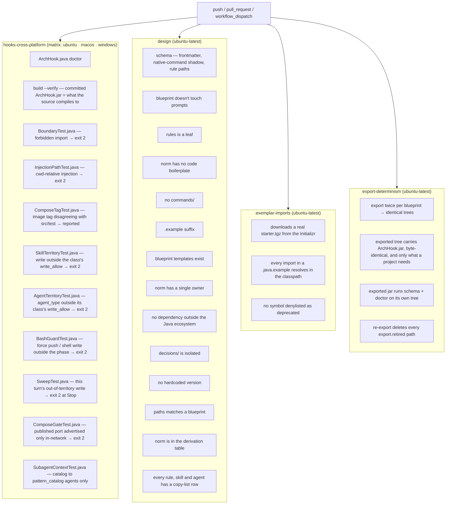

# `validate.yml` — CI for the invariants

Primary source: `.github/workflows/validate.yml`, `.claude/hooks/ArchHook.java`
(`schema()` method), `CLAUDE.md` § Invariants.

## Why it exists

The invariants in `CLAUDE.md` and the norms under `rules/` are prose, not code —
nothing stops an edit from violating one silently. `ArchHook.java check` only guards
the Java boundary of a **generated** project; it never runs against this repository's
own prompt graph. `validate.yml` is what turns each invariant into a deterministic,
repo-wide check on every `push` and `pull_request`, instead of a claim that only holds
as long as whoever writes the next skill remembers it.

## Job diagram


```mermaid
flowchart TD
    T[push / pull_request / workflow_dispatch] --> J1
    T --> J2
    T --> J3
    T --> J4

    subgraph J1["hooks-cross-platform (matrix: ubuntu · macos · windows)"]
        H1[ArchHook.java doctor]
        H0[build --verify — committed ArchHook.jar = what the source compiles to]
        H2[BoundaryTest.java — forbidden import → exit 2]
        H3[InjectionPathTest.java — cwd-relative injection → exit 2]
        H4[ComposeTagTest.java — image tag disagreeing with src/test → reported]
        H5[SkillTerritoryTest.java — write outside the class's write_allow → exit 2]
        H6[AgentTerritoryTest.java — agent_type outside its class's write_allow → exit 2]
        H7[BashGuardTest.java — force push / shell write outside the phase → exit 2]
        H8[SweepTest.java — this turn's out-of-territory write → exit 2 at Stop]
        H9[ComposeGateTest.java — published port advertised only in-network → exit 2]
        H10[SubagentContextTest.java — catalog to pattern_catalog agents only]
    end

    subgraph J2["design (ubuntu-latest)"]
        D1[schema — frontmatter, native-command shadow, rule paths]
        D4[blueprint doesn't touch prompts]
        D5[rules is a leaf]
        D6[norm has no code boilerplate]
        D7[no commands/]
        D8[.example suffix]
        D9[blueprint templates exist]
        D10[norm has a single owner]
        D11[no dependency outside the Java ecosystem]
        D12[decisions/ is isolated]
        D13[no hardcoded version]
        D14[paths matches a blueprint]
        D15[norm is in the derivation table]
        D16[every rule, skill and agent has a copy-list row]
    end

    subgraph J3["exemplar-imports (ubuntu-latest)"]
        E1[downloads a real starter.tgz from the Initializr]
        E2[every import in a .java.example resolves in the classpath]
        E3[no symbol denylisted as deprecated]
    end

    subgraph J4["export-determinism (ubuntu-latest)"]
        X1[export twice per blueprint → identical trees]
        X2[exported tree carries ArchHook.jar, byte-identical, and only what a project needs]
        X3[exported jar runs schema + doctor on its own tree]
        X4[re-export deletes every export.retired path]
    end
```

## What each check covers

| Job / step | Verifies | Against what |
|---|---|---|
| `hooks-cross-platform` | `ArchHook.java doctor`, `build --verify`, then nine tests on all three OSes, every one spawning `java -jar .claude/hooks/ArchHook.jar` — the exact command the registrations run | Decision D8 — "cross-platform" as a fact, not a claim — and decision 0084: a test of the source proves nothing about the jar the hooks launch |
| `committed ArchHook.jar is what the source compiles to` | `build --verify` recompiles under the pinned `hook_build.javac_feature` and compares byte for byte | Decision 0075 — an edit to `ArchHook.java` without a rebuild changes nothing any hook executes. Runs before the tests, so they exercise reviewed bytes |
| `guard bash refuses force pushes and holds shell writes to the phase` | `BashGuardTest.java`, 16 cases: every force-push spelling in `guard.force_push` (`-f`, `-uf`, `--force-with-lease`, `+ref`, `git -C`, `sh -c "…"`) refused, a redirect / `sed -i` outside a design phase's territory refused, a plain `sed`, an unresolvable `$OUT` target and `ls` let through | Decision 0076. The mode runs before every shell command in every session: it fails expensively in both directions, and the parser is data a JSON edit can change |
| `guard sweep reports this turn's writes, never pre-existing dirt` | `SweepTest.java` in a throwaway git repo: a file dirty before the prompt is never named, an out-of-territory write in the turn exits 2, `stop_hook_active` does not block twice, an in-territory write is silent | Decision 0065 — the sweep is only as good as the `guard prompt` baseline, and a broken baseline fails quietly either way |
| `compose gate blocks a published service no host client can reach` | `ComposeGateTest.java`: `9092:9092` + `PLAINTEXT://kafka:9092` exits 2 naming the advertised-address line, `stop_hook_active` exits 0, a `localhost` listener clears that line, no compose file is silent | Decision 0064. Needs no Docker — the advertised-address check reads the file |
| `context subagent hands the catalog to pattern_catalog agents only` | `SubagentContextTest.java`: `java-spring-boot-developer` gets a `## Catalog` within `subagent_context.max_chars`; installers and `general-purpose` get nothing | Decision 0077. `SubagentStart` cannot block, so a catalog that stops arriving — or arrives everywhere — is silent |
| `guard keeps each skill inside its class's territory` | `SkillTerritoryTest.java` runs the `guard` mode over the real `extensions.json` across 13 cases: no phase open restricts nothing, inside and outside the `write_allow`, `agent_type` winning over the open phase, the refusal of `Skill(<build>)` while a design phase is open, the callee's narrower territory, and the phase surviving an `Agent` call until the next prompt | "Deny by default" is the kind of claim that rots in silence: it holds until one `write_allow` entry is widened by accident. The case that motivated the whole thing — a design run writing `docker-compose.yml`, a file no denylist named — is one of the 13 |
| `guard keeps each agent inside its class's territory` | `AgentTerritoryTest.java` runs the same mode over `agent_classes` across 18 cases: each installer inside and outside its narrow list, the single- and multi-module spellings of the same path, the executor reaching the one spec line it closes, the driver writing anything, and an unclassed agent falling back to the caller's phase | Each agent used to promise its territory in prose (`**Does not write:** docker-compose.yml`) while the guard gave all four an unconditional bypass. The promise is data now, and the two blocks that matter most — `archunit-installer` refused `docker-compose.yml`, and refused main source — are cases in this file |
| `hook reports a compose image tag that disagrees with src/test` | `ComposeTagTest.java` builds a throwaway project holding a `docker-compose.yml` and a `DockerImageName.parse(...)` under `src/test`, and requires `ArchHook.java compose` to report the divergence, expand `${VAR:-default}`, and stay quiet when the tags agree | The suite passing against an engine version nobody runs. It runs on all three OSes because question 3 of the `compose` mode compares two files and needs no Docker — which also proves the `src/test/` path match survives Windows' separator |
| `frontmatter schema` | `java .claude/hooks/ArchHook.java schema` | Invariant 10 — `extensions.json` is the single owner of recognized frontmatter; an invented field or `metadata:` fails loud instead of being silently ignored by the runtime. The same mode also requires every `` !`command` `` injection to resolve paths from `${CLAUDE_PROJECT_DIR}` — a relative one reports a file as absent whenever the shell's cwd has drifted — fails a skill folder named after a native slash command (`types.skill.native_commands`; until 0084 a YAML-only step a generated project never ran), and fails a rule without `paths` (`types.rule.required`; decision 0082 — a rule without it loads at launch every session) |
| `new blueprint doesn't touch prompts` | adding a blueprint leaves `.claude/skills` and `.claude/agents` untouched | Invariant 7 — architectures are data |
| `rules is a leaf of the graph` | no rule mentions "skill", "agent", "subagent" | Invariant 1 |
| `norm contains no code boilerplate` | no `class`/`record`/`interface`/`enum` declaration inside `rules/` | Invariant 3 |
| `no new commands/` | `.claude/commands/` doesn't exist | Invariant 4 |
| `exemplar imports have the .example suffix at the end` | every file under `skills/*/templates/` | Precondition globs that key off the suffix |
| `blueprint-declared templates exist on disk` | every `templates.<role>` in a blueprint resolves to a real file | A blueprint pointing at a renamed or deleted template |
| `each norm has a single owner` | a fixed list of known terms appears in at most one file under `rules/` | Invariant 2 — narrow by construction, see note below |
| `no dependencies outside the Java ecosystem` | no `pip install`, `npm install`, `node `, bare `python` in `.claude/` | Decision D7 |
| `every norm paths matches some blueprint` / `norm is in the bootstrap's derivation table` | a rule's `paths` glob names a package some blueprint declares, and step 6.6 of `project-bootstrap` knows to rewrite it | Gap 8 of `decisions/0024-lessons-learned-001-remediation.md` — a rule that silently never auto-loads |
| `every rule, skill and agent has a row in the bootstrap copy list` | every file in `rules/` has a row in § 6.6 of `project-bootstrap/SKILL.md`, and every skill and agent has a row marked ✅ or ❌ in §§ 6.7/6.8 | Invariant 9 — those tables **are** the copy lists that make the generated project self-contained. A new norm missing from § 6.6 breaks nothing at generation time: it breaks for whoever clones the project later and follows a citation to a file that was never copied |
| `decisions/ doesn't grow paths or enter 00-index.md` | no file in `decisions/` declares `paths:`; none is listed in `rules/00-index.md` | `decisions/` is history, not a rule — see Known pitfalls |
| `no hardcoded Spring/Java version outside decisions/` | no `Spring Boot X.Y` / `Java NN` written as fact in `rules/`, `skills/`, `blueprints/`, `CLAUDE.md` | Invariant 8 — versions are resolved via Spring Initializr, never written from memory. Excludes the `JDK 21+` minimum-requirement line and dated "Tested to compile" notes in exemplars, which record a past verification, not a version to use |
| `export-determinism` (whole job) | two exports per blueprint produce identical trees; the tree carries `ArchHook.jar` byte-identical to the verified one and nothing only this repo needs; the **exported jar** runs `schema` and `doctor` against its own tree; seeding every `export.retired` path and re-exporting deletes each one | Invariant 9 and decision D54. The retired-path step is decision 0082's rename: without the delete, an updated project keeps a norm nobody owns. The blueprint id is read from the stamp with `sed`, not `python3` — D7 |
| `exemplar-imports` (whole job) | every `import` in a `.java.example` resolves against JARs from a real `start.spring.io` request, and none uses a name denylisted as deprecated | Gaps 4, 5, 9 of `decisions/0024-lessons-learned-001-remediation.md` — an exemplar that "compiles in the head of whoever wrote it" |

Note on "each norm has a single owner": the check tests a fixed list of literal
phrases (`Constructor injection`, `Zero framework`, `RuntimeException`), not a general
duplication detector. It catches regressions of terms already known to have drifted
once; a new rule added without a new phrase in that list isn't covered.

## Workflow posture

Four decisions that verify no invariant at all — they are the cost and the surface of
CI itself:

- **`permissions: contents: read`** at the top. No job writes: each one reads the
  checkout and runs `java`. Without it the `GITHUB_TOKEN` inherits the repository
  default, which is write.
- **`concurrency` with `cancel-in-progress`**. `push: [main]` and `pull_request` both
  fire on the same head when a PR branch is pushed; the superseded run is cancelled
  instead of racing the new one to the same conclusion.
- **`timeout-minutes` on every job** — 15 on the two hook/prompt jobs, 30 on
  `exemplar-imports`, which depends on the network. The default is 6h.
- **Actions pinned by commit SHA**, with the tag as a comment beside it. `@v7` is a
  moving ref the action's owner can repoint — a tag pin makes what CI ran
  unreproducible. Bump both together. Both sit on their current major (`checkout`
  v7.0.1, `setup-java` v6.0.1): setup-java v1–v4 are deprecated, and the majors in
  between only tighten things this workflow doesn't use — node24 (needs a runner ≥
  v2.327.1, which GitHub-hosted runners are), the fork-PR checkout block that applies to
  `pull_request_target`/`workflow_run` and not to the `pull_request` trigger here, and
  setup-java v6 dropping the legacy `adopt` distributions, `temurin` being the one used.

The `design` and `exemplar-imports` jobs declare `defaults.run.shell: bash` to get
`pipefail`, which the default shell (`bash -e {0}`) lacks. Per job, never at workflow
level: the `hooks-cross-platform` matrix has a `windows-latest` leg whose default shell
is pwsh.

## The neighbouring workflow: `release.yml`

Primary source: `.github/workflows/release.yml`, `.github/PULL_REQUEST_TEMPLATE.md`
§ Release bump.

`validate.yml` proves that what landed on `main` is correct. `release.yml` answers a
different question: **under what name that state becomes citable**. Every merge into
`main` gets an annotated tag, because whoever adopts the architecture pins a ref — the
marketplace's `.plugin-source.json` and every generated project's provenance stamp hold
exactly that. A merge with no tag is a state nobody can point at.

| Job | When it runs | What it does |
|---|---|---|
| `bump-declared` | every PR event (`opened`, `edited`, `synchronize`, …) | Reads § Release bump from the PR body and requires **exactly one** level ticked: `major`, `minor` or `patch`. Publishes the level as an output |
| `tag` | once, on the `closed` event of a **merged** PR whose base is `main` | Runs `schema` and `doctor` on the merge commit, computes the next semver from the latest tag, then creates and pushes the annotated tag |

Three decisions the file doesn't make obvious:

- **The level lives in the PR body, not in a label or a commit.** The field is mandatory
  in the template and `bump-declared` fails while the PR is open — the decision happens
  at review time, not after the merge, when there is nowhere left to record it.
- **One parser, one file.** The PR check and the tag creation read the same body; two
  regexes in two workflows diverge silently. Hence two jobs of the same `release.yml`,
  the second consuming the first's output.
- **The tag comes from `merge_commit_sha`, not from `main`.** `main` may already carry the
  next merge by the time the job runs. And the job revalidates that commit:
  `validate.yml` passed on the PR head, which is a different tree whenever `main` moved
  underneath — a semantic conflict in `extensions.json` fails there instead of shipping as
  a ref the marketplace can pin.

Two things stay manual on purpose: the GitHub Release, for a ref that deserves more prose
than the message the workflow writes (that message points at the PR), and the
marketplace, which pins the ref with `./sync.sh vX.Y.Z` — publishing is a decision, not a
consequence of merging.

**What makes the field mandatory isn't in the file:** it's `bump-declared` as a required
status check in the branch protection of `main`. Without that, the job fails and the merge
happens anyway.

## What's not here yet

- Invariant 9 (the generated project is self-contained) is now **half** covered: the
  `every rule, skill and agent has a row in the bootstrap copy list` step proves the
  tables of §§ 6.6/6.7/6.8 cover the disk — the part whose failure mode was silent.
  That the generated project *actually* compiles and holds no dead path stays a manual
  check, via the command block at `project-bootstrap/SKILL.md` § 8 ("Verify"): it
  requires generating a real project against the Initializr, and that cost hasn't been
  automated.
- `claude plugin validate .claude/skills` — the CLI isn't installed on the GitHub
  Actions runner, and installing it would pull in a dependency outside
  `java`/`git`/`curl` (see `CLAUDE.md` § Dependencies). Run it by hand before opening
  a PR; it's a cheap, complementary check to the `schema` step above, catches
  malformed YAML.

## Running it locally

```bash
# The same commands the `design` job runs, one by one:
java .claude/hooks/ArchHook.java schema
claude plugin validate .claude/skills   # not run in CI — CLI missing on the runner
java .claude/hooks/ArchHook.java doctor
java .claude/.ci/BoundaryTest.java
java .claude/.ci/InjectionPathTest.java
java .claude/.ci/ComposeTagTest.java
java .claude/.ci/SkillTerritoryTest.java
java .claude/.ci/AgentTerritoryTest.java
```

A `git push` without running this first still goes through the local hook
(`settings.json`), but only CI runs the `design` and `exemplar-imports` job steps —
those two have no local hook equivalent.
