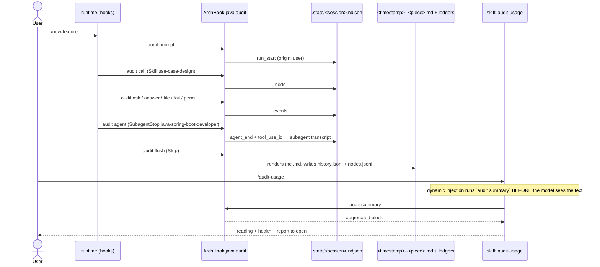

# Audit trail — the `audit` hook, the `guard` hook, and `/audit-usage`

Primary source: `.claude/hooks/ArchHook.java` (`audit()` and `guard()` methods),
`.claude/schemas/extensions.json` (`audit` and `guard` blocks),
`.claude/skills/project-bootstrap/templates/settings.json.example`,
`.claude/skills/audit-usage/SKILL.md`.

## What it is

Two modes of the same hook, both wired **only in the generated project** (the
`settings.json.example` that bootstrap step 7 installs), never in this meta-repo:

| Mode | Question it answers | Blocks? |
|---|---|---|
| `audit` | "What did this run cost, what did it chain, what did it touch, what failed?" | Never |
| `guard` | "Did a design skill try to write under `src/`? Did someone try to edit an approved spec?" | Yes (`exit 2`) |

The `/audit-usage` skill is the trail's reader: it consolidates spend per piece across
runs and points at the report to open. It writes nothing.

## Why it's a hook, not a skill

The decision (`0035`, later extended in `0038`) was settled by axis 7 of the decision
matrix: **it must always happen**, even when the model forgets, the session dies, or
the user hits Ctrl+C. Only a lifecycle event delivers that. A skill that "renders the
report at the end" is persuasion where a guarantee was available — and a run that dies
midway would leave no record at all.

Cost consequence: **zero tokens** to produce the report. No skill or agent body gained
a "record yourself" instruction; the hook reads the events and the transcript.

## The switch

The trail turns on and off by the **existence of the directory** `.claude/audit-usage/`:

- `project-bootstrap` creates the directory in step 7.4 and writes `GENESIS.md` in step
  8.6 (the record of the generation itself, reconstructed from the bootstrap's own data
  — not a hook report, and its header says so).
- Without the directory, every hook phase returns immediately. That's how this
  meta-repo pays nothing for a mode it doesn't use: `.claude/audit-usage/` doesn't
  exist here, and `/audit-usage` correctly reports the trail is off.
- To turn it off in a generated project: delete the directory. To turn it back on:
  `mkdir -p .claude/audit-usage` and make sure `.claude/audit-usage/.state/` is in
  `.gitignore`.

## Wired events (`settings.json.example`)

| Event | Phase | What it records |
|---|---|---|
| `UserPromptSubmit` | `audit prompt` | Opens a run if the prompt is `/<audited skill>`; keeps the last free-form prompt (redacted) to attribute tokens to the piece the model opens next |
| `PreToolUse` `Skill\|Task\|Agent` | `audit call` | Chain node; opens an implicit run (`origin: model`) when none is open |
| `PreToolUse` `AskUserQuestion` / `PostToolUse` `AskUserQuestion` | `audit ask` / `audit answer` | Waiting on the user, discounted from active duration |
| `PostToolUse` `Write\|Edit` | `audit file` | File touched |
| `PostToolUseFailure` | `audit fail` | Tool that failed (rework) |
| `PermissionRequest` / `PermissionDenied` | `audit perm` | Permission requested or denied |
| `SubagentStop` | `audit agent` | End of an agent; its tokens come from the subagent's own transcript |
| `PreCompact` | `audit compact` | Context compaction incident |
| `StopFailure` | `audit stopfail` | Failure while stopping |
| `Stop` | `audit flush` | **Renders the `.md`** from the append-only log and writes the ledger line |
| `SessionEnd` | `audit close` | Closes the open run |

The log of a run in progress is `.claude/audit-usage/.state/<session>.ndjson`
(append-only, gitignored). A `kill -9` during a write loses at most the last line; the
Markdown is always rebuilt from the whole log.

## What gets audited

Any name that resolves to `.claude/skills/<n>/SKILL.md` or `.claude/agents/<n>.md`
**of the project**, invoked by `/command` or by the model's `Skill`/`Agent` call.
Plugin skills (`caveman:*`) and runtime agents (`Explore`, `general-purpose`) fall out
by construction — they have no file. Skills preloaded via `skills:` in an agent's
frontmatter appear under that agent as `pré-carregada`, with no tokens of their own.

Two exceptions, listed in `extensions.json` → `audit.exclude_skills`: `audit-usage` and
`arch-doctor`. They are observers — invoking one **closes** the run in progress (which
is the only way, inside a live session, to get a report that isn't `⏳ em andamento`)
and opens no run of its own. Without that, reading the trail would produce a report
about reading the trail.

## Anatomy of a report

One `.md` per top-level invocation, at `.claude/audit-usage/<timestamp>--<piece>.md`.
An excerpt of a real report, generated in the demo project (the reports are written
in Portuguese):

```text
# 🧾 Auditoria de execução — `/new-feature crie um novo endpoint rest para criacao da entidade account …`

| 🎯 Peça | `/new-feature` · skill |
| 🙋 Origem | usuário — `/comando` |
| ⏱️ Duração | 2h55m35s |
| ⏸️ Espera pelo usuário | 2h44m33s |
| ⚙️ Duração ativa | 11m01s |
| ✅ Status | sucesso |
| 🌿 HEAD | 871d25c → 871d25c |

## 🔗 Encadeamento

/new-feature                                  ████████████████████ 11m01s   100%
├─ 📘 use-case-design (crie um novo endpoint  ████░░░░░░░░░░░░░░░░ 2m17s    21%
├─ 📘 domain-modeling (UC-002)                ██░░░░░░░░░░░░░░░░░░ 1m15s    11%
├─ 📘 rest-api-architect (UC-002)             ███░░░░░░░░░░░░░░░░░ 1m43s    16%
├─ 📘 persistence-architect (UC-002)          ██░░░░░░░░░░░░░░░░░░ 1m06s    10%
├─ 📘 test-architect (UC-002)                 ████░░░░░░░░░░░░░░░░ 2m25s    22%
└─ 🤖 java-spring-boot-developer              ██░░░░░░░░░░░░░░░░░░ 1m12s    11%
     📎 java-patterns (pré-carregada)

## 🧩 Tokens por peça

| Peça | Origem | 🧮 Faturável próprio | ⏱️ Duração |
| `📘 test-architect` | aninhada | 242.813 | 2m25s |
| `🤖 java-spring-boot-developer` | aninhada | 88.517 | 1m12s |
…
```

Sections, in order: header · initial command (redacted, with the original's `sha256`)
· most expensive steps · chain · tokens per piece · aggregate tokens (input, output,
cache read, cache write, billable, estimated cost, cache hit) · permissions added (a
diff of `settings.local.json` between start and end) · rules loaded · files touched ·
rework.

Three design decisions the report states about itself:

- **Rules are inferred, not observed.** No hook event exposes which `rule` entered
  context. The report crosses the files touched against each norm's `paths` and labels
  the section "inferred by territory" — the rules that *should* have loaded.
- **Node duration is attribution by window**: from the node's start to the next node
  at the same depth or shallower, with `AskUserQuestion` waits discounted.
- **Agent tokens come from the subagent's own transcript**; a main-thread skill's
  tokens are the messages from its call to the next piece. Summed, they match the
  aggregate — no double counting.

## Redaction and pricing

- **Redaction is mandatory.** The prompt goes into a versioned file; a token pasted
  into it would be irreversible in git history (invariant 11). The patterns live in
  `extensions.json` → `audit.redact`: `authorization|token|api_key|secret|password` as
  keys, the prefixes `Bearer `, `ghp_`, `github_pat_`, `sk-`, `xoxb-`, `AKIA`, and
  `PRIVATE KEY` blocks.
- **Prices are data with null defaults.** `pricing.json` ships empty and the report
  prints "custo: não configurado" instead of a confident `US$ 0.00` — the same reason
  invariant 8 forbids versions from memory. Fill the file and cost appears per model
  (a subagent on another model is priced at its own rate).

## The ledgers and `audit summary`

| File | One line per | Versioned? |
|---|---|---|
| `history.jsonl` | top-level run (`kind`, `origin`, `status`, `tokens_billable`, `cost_usd`, …) | yes |
| `nodes.jsonl` | piece chained inside a run (`run`, `parent`, `skill`, `tokens_self`, `duration_ms`) | yes |
| `.state/*.ndjson`, `.state/*.prompt.json` | raw event of the run in progress | no |

`java .claude/hooks/ArchHook.java audit summary` aggregates the two ledgers **in the
JVM** and prints a compact block. That block is what `/audit-usage` injects into its
own body — not the raw JSON, which grows without bound and would leave the arithmetic
to the model. Real output from the demo project:

```text
execuções fechadas: 4 · período: 2026-09-17T11:06:26Z → 2026-09-17T17:31:14Z · peças distintas: 10

### Últimas execuções
| # | 🎯 Peça | 🙋 Origem | Status | ⏱️ Duração | 🧮 Faturável | 📁 Arq. | 🔁 Falhas |
| 1 | `Skill(git-publish)` | modelo | ✅ | 41s | 229.493 | 0 | 0 |
| 2 | `/new-feature` | usuário | ✅ | 11m01s | 530.831 | 11 | 0 |
| 3 | `Skill(domain-modeling)` | modelo | ⚠️ | 47m55s | 1.223.409 | 85 | 1 |
| 4 | `/new-feature` | usuário | ⚠️ | 1m39s | 68.633 | 1 | 1 |

### Gasto por peça (tokens próprios — raiz + aninhada, sem dupla contagem)
📘 test-architect                 ███████░░░░░░░░░░░░░░░░░░ 27%  282.316 tok   3× (0 raiz · 3 aninhada)
📘 git-publish                    ██████░░░░░░░░░░░░░░░░░░░ 23%  243.169 tok   2× (1 raiz · 1 aninhada)
📘 domain-modeling                ███░░░░░░░░░░░░░░░░░░░░░░ 11%  109.946 tok   2× (1 raiz · 1 aninhada)
🤖 java-spring-boot-developer     ██░░░░░░░░░░░░░░░░░░░░░░░ 9%   88.517 tok    1× (0 raiz · 1 aninhada)
…

### Saúde
taxa de falha: 2/4 (50%) · pior: 📘 domain-modeling (1/1)

### Abrir
mais recente: `.claude/audit-usage/2026-09-17T17-31-14--git-publish.md`
mais recente com falha: `.claude/audit-usage/2026-09-17T11-11-27--domain-modeling.md`
```

## `/audit-usage` — the reader

| Argument | Does |
|---|---|
| empty | Consolidated view: the block above, plus one line of reading, the piece with the worst failure ratio, and the report to open |
| `last` / `último` | Summarizes the most recent report in up to six lines |
| a skill or agent name | That piece's line + its newest report (a nested piece's report is its parent's) |
| a filename fragment | The single matching report; two or more, list and ask |

What the skill never does: recompute a number the block printed, read `.state/`, edit
or delete reports, invent a price, quote a redacted value.

## Sequence diagram



## The `guard` hook — the two boundaries that stopped being prose

Configuration in `extensions.json` → `guard`:

```json
"design_skills": ["new-feature", "use-case-design", "domain-modeling", "rest-api-architect",
                  "persistence-architect", "messaging-architect", "test-architect"],
"executor_agents": ["java-spring-boot-developer", "archunit-installer", "commons-logging-installer"],
"design_forbidden_paths": ["src/**", "**/src/**"],
"use_cases_dir": "docs/use-cases",
"frozen_statuses": ["approved", "implemented"]
```

| Phase | Event | Effect |
|---|---|---|
| `guard prompt` | `UserPromptSubmit` | Closes the previous phase; opens a design phase if the prompt is `/<design_skill>` |
| `guard call` | `PreToolUse` `Skill\|Task\|Agent` | `Skill(<design_skill>)` opens the phase; `Agent(<executor_agent>)` closes it |
| `guard write` | `PreToolUse` `Write\|Edit` under `**/src/**` or `docs/use-cases/**` | Rule 1: phase open + path in `design_forbidden_paths` + call not from an executor → `exit 2`. Rule 2: a `UC-*` folder whose spec is in `frozen_statuses` → `exit 2`, except the executor's single edit of `status: approved` to `status: implemented` |

Why it exists: a design skill once wrote migrations under `src/`, and a later use case
rewrote the specs of an earlier one — both while the skills forbade it in prose
(`lessons-learned-005`). Reopening a spec that was never implemented is deliberate:
`status: draft` by hand.

**Known pitfall:** `Skill(test-architect)` opens a phase and
`Agent(commons-logging-installer)` closes one. Fired in the same turn, they are two
`PreToolUse` hooks with no ordering guarantee, and the loser blocks every write under
`src/` by the other agent for the rest of the run. That's why `/new-feature` runs the
two in separate turns.

## What `doctor` shows

`/arch-doctor` carries two lines about the trail: `Audit` (how many runs recorded, and
whether `pricing.json` exists) and `Audit rule inference` (a synthetic file matching a
real norm's `paths` — the exact shape that once threw
`ArrayIndexOutOfBoundsException` inside the inference and froze every report from that
point on, silently). Without the directory: `⚪ no .claude/audit-usage/ — execution
trail OFF (optional)`.
