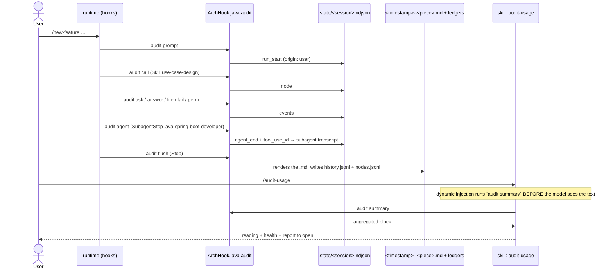

# Audit trail — the `audit` hook, the `guard` hook, and `/audit-usage`

Primary source: `.claude/hooks/ArchHook.java` (`audit()` and `guard()` methods),
`.claude/schemas/extensions.json` (`audit` and `guard` blocks),
`.claude/skills/project-bootstrap/templates/settings.json.example`,
`.claude/skills/audit-usage/SKILL.md`.

## What it is

Two modes of the same hook, both wired **only in the generated project** (the
`settings.json.example` that bootstrap step 7 installs), never in this meta-repo:

| Mode | Question it answers | Blocks? |
|---|---|---|
| `audit` | "What did this run cost, what did it chain, what did it touch, what failed?" | Never |
| `guard` | "Did a design skill try to write under `src/`? Did someone try to edit an approved spec?" | Yes (`exit 2`) |

The `/audit-usage` skill is the trail's reader: it consolidates spend per piece across
runs and points at the report to open. It writes nothing.

## Why it's a hook, not a skill

The decision (`0035`, later extended in `0038`) was settled by axis 7 of the decision
matrix: **it must always happen**, even when the model forgets, the session dies, or
the user hits Ctrl+C. Only a lifecycle event delivers that. A skill that "renders the
report at the end" is persuasion where a guarantee was available — and a run that dies
midway would leave no record at all.

Cost consequence: **zero tokens** to produce the report. No skill or agent body gained
a "record yourself" instruction; the hook reads the events and the transcript.

## The switch

The trail turns on and off by the **existence of the directory** `.claude/audit-usage/`:

- `project-bootstrap` creates the directory in step 7.4 and writes `GENESIS.md` in step
  8.6 (the record of the generation itself, reconstructed from the bootstrap's own data
  — not a hook report, and its header says so).
- Without the directory, every hook phase returns immediately. That's how this
  meta-repo pays nothing for a mode it doesn't use: `.claude/audit-usage/` doesn't
  exist here, and `/audit-usage` correctly reports the trail is off.
- To turn it off in a generated project: delete the directory. To turn it back on:
  `mkdir -p .claude/audit-usage` and make sure `.claude/audit-usage/.state/` is in
  `.gitignore`.

## Wired events (`settings.json.example`)

| Event | Phase | What it records |
|---|---|---|
| `UserPromptSubmit` | `audit prompt` | Opens a run if the prompt is `/<audited skill>`; keeps the last free-form prompt (redacted) to attribute tokens to the piece the model opens next |
| `PreToolUse` `Skill\|Task\|Agent` | `audit call` | Chain node; opens an implicit run (`origin: model`) when none is open |
| `PreToolUse` `AskUserQuestion` / `PostToolUse` `AskUserQuestion` | `audit ask` / `audit answer` | Waiting on the user, discounted from active duration; `audit answer` also keeps each question and its answer — through `audit.redact`, cut at 160 characters — in the report's 💬 Asked section (decision 0094) |
| `PostToolUse` `Write\|Edit\|MultiEdit\|NotebookEdit` | `audit file` | File touched |
| `PostToolUseFailure` | `audit fail` | Tool that failed (rework) |
| `PermissionRequest` / `PermissionDenied` | `audit perm` | Permission requested or denied |
| `SubagentStop` | `audit agent` | End of an agent; its tokens come from the subagent's own transcript |
| `PreCompact` | `audit compact` | Context compaction incident |
| `StopFailure` | `audit stopfail` | Failure while stopping |
| `Stop` | `audit flush` | **Renders the `.md`** from the append-only log and writes the ledger line |
| `SessionEnd` | `audit close` | Closes the open run |

The log of a run in progress is `.claude/audit-usage/.state/<session>.ndjson`
(append-only, gitignored). A `kill -9` during a write loses at most the last line; the
Markdown is always rebuilt from the whole log.

## What gets audited

Any name that resolves to `.claude/skills/<n>/SKILL.md` or `.claude/agents/<n>.md`
**of the project**, invoked by `/command` or by the model's `Skill`/`Agent` call.
Plugin skills (`caveman:*`) and runtime agents (`Explore`, `general-purpose`) fall out
by construction — they have no file. Skills preloaded via `skills:` in an agent's
frontmatter appear under that agent as `preloaded`, with no tokens of their own.

Exceptions, decided by class in `extensions.json` → `skill_classes`, never by a list:
a class that declares `audited: false` leaves no run of its own for any skill it lists.

- **`observer`** — `audit-usage` and `arch-doctor`. Invoking one **closes** the run in
  progress (which is the only way, inside a live session, to get a report that isn't
  `⏳ in progress`) and opens no run of its own. Without that, reading the trail would
  produce a report about reading the trail.
- **`ops`** — `git-publish`. Its own report could only be written after the commit it
  makes, so every publish would end with a dirty tree. Typed as `/git-publish`, it closes
  the run in progress first, so that run's report goes into the commit. Chained inside
  another run it is still a node of that run, with its own tokens.
- **`arch-adopt`** — the one piece-level flag: `audited: false` in its own
  `skill_classes.build.overrides` entry, the other members of `build` stay audited. Its
  whole output is a `git diff` of `.claude/` handed over for review, and its step 1
  refuses a dirty tree; a report of its own would land in that diff after the export.
  Fixed upstream — the project file below cannot turn it back on.

### Per project: `.claude/audit-usage/audited.json`

The one file of `.claude/` a generated project writes for itself. `export` never names it,
so `/arch-adopt` never touches it. Absent → every piece follows its class, as above.

```json
{ "skills": { "report-issue": false, "git-publish": true }, "agents": {} }
```

`false` takes a piece out with the same semantics as `audited: false`; `true` puts back one
its class leaves out — re-enabling `git-publish` or an observer brings back what the
exceptions above avoid, and that is the project's call. First boolean wins: the piece's own
class override (`arch-adopt`), then this file, then the class. `doctor` validates it on its
`Audit overrides` line and fails by name on any key other than `skills`/`agents`, a value
that isn't `true`/`false`, a name with no file in the project, or `arch-adopt`. Decision 0111.

## Anatomy of a report

One `.md` per top-level invocation, at `.claude/audit-usage/<timestamp>--<piece>.md`.
An excerpt of a real report, generated in the demo project. The reports are written in
English since decision 0085; this run predates it, so its labels are shown translated and
its numbers are unchanged. Reports written before 0085 stay in Portuguese on disk:

```text
# 🧾 Execution audit — `/new-feature crie um novo endpoint rest para criacao da entidade account …`

| 🎯 Piece | `/new-feature` · skill |
| 🙋 Origin | user — `/command` |
| ⏱️ Duration | 2h55m35s |
| ⏸️ Waiting for the user | 2h44m33s |
| ⚙️ Active duration | 11m01s |
| ✅ Status | success |
| 🌿 HEAD | 871d25c → 871d25c |

## 🔗 Chain

/new-feature                                  ████████████████████ 11m01s   100%
├─ 📘 use-case-design (crie um novo endpoint  ████░░░░░░░░░░░░░░░░ 2m17s    21%
├─ 📘 domain-modeling (UC-002)                ██░░░░░░░░░░░░░░░░░░ 1m15s    11%
├─ 📘 rest-api-architect (UC-002)             ███░░░░░░░░░░░░░░░░░ 1m43s    16%
├─ 📘 persistence-architect (UC-002)          ██░░░░░░░░░░░░░░░░░░ 1m06s    10%
├─ 📘 test-architect (UC-002)                 ████░░░░░░░░░░░░░░░░ 2m25s    22%
└─ 🤖 java-spring-boot-developer              ██░░░░░░░░░░░░░░░░░░ 1m12s    11%

## 🧩 Tokens per piece

| Piece | Origin | 🧮 Own billable | ⏱️ Duration |
| `📘 test-architect` | nested | 242,813 | 2m25s |
| `🤖 java-spring-boot-developer` | nested | 88,517 | 1m12s |
…
```

Sections, in order: header (with the estimated cost right after the model) · initial command (redacted, with the original's `sha256`)
· longest steps · chain · tokens per piece · aggregate tokens (input, output,
cache read, cache write, billable, estimated cost, cache hit) · where the run spent ·
permissions added (a diff of `settings.local.json` between start and end) · rules
loaded · files touched · rework.

**The last skill a run chains carries its caller's tail.** A main-thread turn belongs to
the last piece that started before it, and the runtime emits no event when an inline skill
ends. So everything the orchestrator does after its last skill, up to the next agent or
skill, lands on that skill's row. In `/new-feature`, that is consolidation, the approval
questions and the pre-flight, all counted under `test-architect`. In the example above,
`test-architect`'s 242,813 tokens include that tail. In a real UC-007 run, about USD 1.47
of the USD 1.91 attributed to it was consolidation. The report's footnote says the same.
Design: `.claude/decisions/0118-skill-model-pin-audit-tail-and-bsd-sed.md`.

**Where the run spent** is read from the same transcripts the tokens come from — the
main one and each subagent's own — so it costs no hook event of its own. It answers what
the token totals cannot: which tools a piece leaned on, which turns were the expensive
ones, and how much context a single request carried. An excerpt, replayed over a real
session transcript:

```text
### 🛠️ Tool calls per piece
| Piece | Calls | By tool | 📏 Peak context |
| `/demo` | 53 | Bash 30 · Read 9 · Edit 8 · Write 4 · AskUserQuestion 2 | 217,617 |

### 💸 Most expensive turns
| # | 🕐 When | Piece | 🧮 Billable | Tools called |
| 1 | 2026-09-30T08:27:45.193Z | `/demo` | 45,752 | Bash |

### 📏 Peak context
Largest single request: **217,617** tokens (input + cache read + cache write) — `/demo` at 2026-09-30T08:41:01.327Z.

## 💬 Asked
| # | Topic | Question | Answer |
| 1 | Contexto | Qual bounded context? | banking |

## 🔁 Rework
| Piece | Tool | × | First line of the error (redacted) |
| `/demo` | `Bash` | 3 | `exit 1 · …` |
```

Four design decisions the report states about itself:

- **Rules are inferred, not observed.** No hook event exposes which `rule` entered
  context. The report crosses the files touched against each norm's `paths` and labels
  the section "inferred by territory" — the rules that *should* have loaded.
- **Node duration is attribution by window**: from the node's start to the next node
  at the same depth or shallower, with `AskUserQuestion` waits discounted.
- **Agent tokens come from the subagent's own transcript**; a main-thread skill's
  tokens are the messages from its call to the next piece. Summed, they match the
  aggregate — no double counting. Tool calls, peak context and tool errors follow the
  same attribution.
- **Peak context is an absolute number.** The model's context window is not written
  from memory, so the report never turns the peak into a percentage.

## Redaction and pricing

- **Redaction is mandatory.** The prompt goes into a versioned file; a token pasted
  into it would be irreversible in git history (invariant 11). The patterns live in
  `extensions.json` → `audit.redact`: `authorization|token|api_key|secret|password` as
  keys, the prefixes `Bearer `, `ghp_`, `github_pat_`, `sk-`, `xoxb-`, `AKIA`, and
  `PRIVATE KEY` blocks. The first line of each tool error goes through the same
  patterns, truncated to 160 characters — an error can echo the command that held the
  token. A failed `Bash` result opens with `Exit code N`; the report joins it with the
  line after it, which is what actually failed.
- **Prices are data, never memory.** `pricing.json` ships filled with the official
  page's rates as of the date in its `$comment`, and cost appears per model (a subagent on
  another model is priced at its own rate). The model id matches exactly —
  `claude-opus-5-5` does not inherit `claude-opus-5`'s price. A model with no price makes
  the total unknown, never a partial sum nor a confident `USD 0.00`, and the cell says
  which one is missing: `— (no price for claude-opus-5-5 in .claude/audit-usage/pricing.json)`.
  The same reason invariant 8 forbids versions from memory.

## The ledgers and `audit summary`

| File | One line per | Versioned? |
|---|---|---|
| `history.jsonl` | top-level run (`kind`, `origin`, `status`, `tokens_billable`, `cost_usd`, `tool_calls`, `tool_calls_self`, `peak_context`, `peak_context_self`, …) | yes |
| `nodes.jsonl` | piece chained inside a run (`run`, `parent`, `skill`, `tokens_self`, `tool_calls`, `peak_context`, `duration_ms`) | yes |
| `.state/*.ndjson`, `.state/*.prompt.json` | raw event of the run in progress | no |

`tool_calls` is a string, `Bash:5,Read:12`, because the ledgers carry strings only. Rows
written before a field existed simply lack it, and every reader treats absent as
unknown, never as zero. Rows written before decision 0085 also carry a Portuguese status
(`✅ sucesso`) and a pt-BR formatted `cost` (`USD 1.234,56`); `audit summary` classifies
the status by its emoji and parses both cost formats, so the old rows need no migration.

`java .claude/hooks/ArchHook.java audit summary` aggregates the two ledgers **in the
JVM** and prints a compact block. That block is what `/audit-usage` injects into its
own body — not the raw JSON, which grows without bound and would leave the arithmetic
to the model. Output from the demo project (labels translated, numbers unchanged; the
`Calls` and `Peak` columns read `—` for runs recorded before they existed):

```text
closed runs: 4 · period: 2026-09-17T11:06:26Z → 2026-09-17T17:31:14Z · distinct pieces: 10

### Latest runs
| # | 🎯 Piece | 🙋 Origin | Status | ⏱️ Duration | 🧮 Billable | 🛠️ Calls | 📏 Peak | 📁 Files | 🔁 Failures |
| 1 | `Skill(git-publish)` | model | ✅ | 41s | 229,493 | — | — | 0 | 0 |
| 2 | `/new-feature` | user | ✅ | 11m01s | 530,831 | — | — | 11 | 0 |
| 3 | `Skill(domain-modeling)` | model | ⚠️ | 47m55s | 1,223,409 | — | — | 85 | 1 |
| 4 | `/new-feature` | user | ⚠️ | 1m39s | 68,633 | — | — | 1 | 1 |

### Spend per piece (own tokens — root + nested, never counted twice)
📘 test-architect                 ███████░░░░░░░░░░░░░░░░░░ 27%  282,316 tok   3× (0 root · 3 nested)
📘 git-publish                    ██████░░░░░░░░░░░░░░░░░░░ 23%  243,169 tok   2× (1 root · 1 nested)
📘 domain-modeling                ███░░░░░░░░░░░░░░░░░░░░░░ 11%  109,946 tok   2× (1 root · 1 nested)
🤖 java-spring-boot-developer     ██░░░░░░░░░░░░░░░░░░░░░░░ 9%   88,517 tok    1× (0 root · 1 nested)
…

### Where the pieces spent (tool calls, top 5 tools · largest single request)
(appears once a run recorded by a hook from decision 0085 on has closed)

### Health
failure rate: 2/4 (50%) · worst: 📘 domain-modeling (1/1)

### Open
most recent: `.claude/audit-usage/2026-09-17T17-31-14--git-publish.md`
most recent with failures: `.claude/audit-usage/2026-09-17T11-11-27--domain-modeling.md`
```

## `/audit-usage` — the reader

| Argument | Does |
|---|---|
| empty | Consolidated view: the block above, plus one line of reading, where the pieces spent, the piece with the worst failure ratio, and the report to open |
| `last` / `último` | Summarizes the most recent report in up to six lines |
| a skill or agent name | That piece's line + its newest report (a nested piece's report is its parent's) |
| a filename fragment | The single matching report; two or more, list and ask |

What the skill never does: recompute a number the block printed, read `.state/`, edit
or delete reports, invent a price, quote a redacted value.

## Sequence diagram


```mermaid
sequenceDiagram
    actor U as User
    participant RT as runtime (hooks)
    participant HOOK as ArchHook.java audit
    participant LOG as .state/<session>.ndjson
    participant MD as <timestamp>--<piece>.md + ledgers
    participant AU as skill: audit-usage

    U->>RT: /new-feature …
    RT->>HOOK: audit prompt
    HOOK->>LOG: run_start (origin: user)
    RT->>HOOK: audit call (Skill use-case-design)
    HOOK->>LOG: node
    RT->>HOOK: audit ask / answer / file / fail / perm …
    HOOK->>LOG: events
    RT->>HOOK: audit agent (SubagentStop java-spring-boot-developer)
    HOOK->>LOG: agent_end + tool_use_id → subagent transcript
    RT->>HOOK: audit flush (Stop)
    HOOK->>MD: renders the .md, writes history.jsonl + nodes.jsonl
    U->>AU: /audit-usage
    Note over AU: dynamic injection runs `audit summary` BEFORE the model sees the text
    AU->>HOOK: audit summary
    HOOK-->>AU: aggregated block
    AU-->>U: reading + health + report to open
```

## The `guard` hook — the three boundaries that stopped being prose

Territory is **data**, in two sibling blocks of `extensions.json`. `skill_classes`: every
skill belongs to one class (`design`, `orchestrator`, `build`, `observer`, `meta`, `ops`), and
the class declares the `write_allow`. `agent_classes`: the same for every agent (`driver`,
`executor`, `installer`), plus the frontmatter fields its class owes and whether it may write
at all. The `guard` block keeps only the rest:

```json
"use_cases_dir": "docs/use-cases",
"frozen_statuses": ["approved", "implemented", "implemented-blocked"]
```

| Phase | Event | Effect |
|---|---|---|
| `guard prompt` | `UserPromptSubmit` | Closes the previous phase; opens one if the prompt is `/<skill>` of any class |
| `guard call` | `PreToolUse` `Skill\|Task\|Agent` | `Skill(<skill>)` opens the phase (never replaced by a skill of the same class); a `Skill` of a `blocked_during_design` class with a `design_phase` open → `exit 2`. An `Agent` call changes nothing |
| `guard write` | `PreToolUse` `Write\|Edit\|MultiEdit\|NotebookEdit`, with no path filter | Rule 1: the write carries an `agent_type` with a class → the path must be in **that agent's** `write_allow`, phase or no phase; otherwise, phase open + path **outside** the active skill's `write_allow` → `exit 2`. Rule 2: a `UC-*` folder whose spec is in `frozen_statuses` → `exit 2`, except three writes: the spec's `status:` line moved along `status_transitions` (`approved` → `implemented` or `implemented-blocked`, and either back to `approved`), a checklist `[ ]` → `[x]` toggle in any of the three frozen states, and the folder's own `CHANGELOG.md` (`frozen_exempt_basenames`) |
| `guard bash` | `PreToolUse` `Bash` | Reads the command for the write shapes in `guard.bash_write_shapes` (`>`/`>>` redirects, `tee`, `sed -i`, `cp`, `mv`…) and applies Rules 1 and 2 to every target it can read literally; a target holding `$`, a backtick or a glob is skipped. A force push in any spelling of `guard.force_push` → `exit 2` |
| `guard sweep` | `Stop` | Diffs the working tree against the baseline `guard prompt` took and runs Rules 1 and 2 over whatever changed that no tool-time guard already admitted, whichever tool wrote it — detection, not prevention; a path git ignores is never swept |

Why it exists: a design skill once wrote migrations under `src/`; a later use case rewrote
the specs of an earlier one; and a design run wrote a `schema-registry` service into
`docker-compose.yml` — all three while the skills forbade it in prose (`lessons-learned-005`,
`lessons-learned-012` §§ 12, 13). The third is why the model is an allowlist and not a
denylist: `docker-compose.yml` is not under `src/**`, and the file that leaks is never the one
somebody listed. Reopening a spec that was never implemented stays deliberate: `status: draft`
by hand.

No phase open means no restriction — a person editing a file by hand is not a skill
overstepping. And `schema` validates the other side of the same data: every `SKILL.md` and
every `.claude/agents/*.md` on disk must sit in exactly one class, carry a `**Class:** <c>`
line in its body, and have the sections its class requires — an agent also the frontmatter
fields (`model` and `tools` always) and no `permissionMode: bypassPermissions`.

**Retired pitfall, kept because the shape recurs.** `Skill(test-architect)` opened a phase
and `Agent(commons-logging-installer)` closed one; fired in the same turn they were two
`PreToolUse` hooks with no ordering guarantee, and the loser blocked every write under `src/`
by the other agent for the rest of the run (138k tokens, zero files written).
`agent_classes` removed the mechanism, not the symptom: a subagent's write is judged by its
own `agent_type`, so no phase reaches it and nothing closes a phase on an `Agent` call. The
lesson that survives is the general one — two independent hook processes in one turn have no
order, so no boundary may depend on which of them ran first.

## What `doctor` shows

`/arch-doctor` carries two lines about the trail: `Audit` (how many runs recorded, and
whether `pricing.json` exists, and ❌ naming each model of `history.jsonl`'s last 15 runs it
does not price) and `Audit rule inference` (a synthetic file matching a
real norm's `paths` — the exact shape that once threw
`ArrayIndexOutOfBoundsException` inside the inference and froze every report from that
point on, silently). Without the directory: `⚪ no .claude/audit-usage/ — execution
trail OFF (optional)`.
