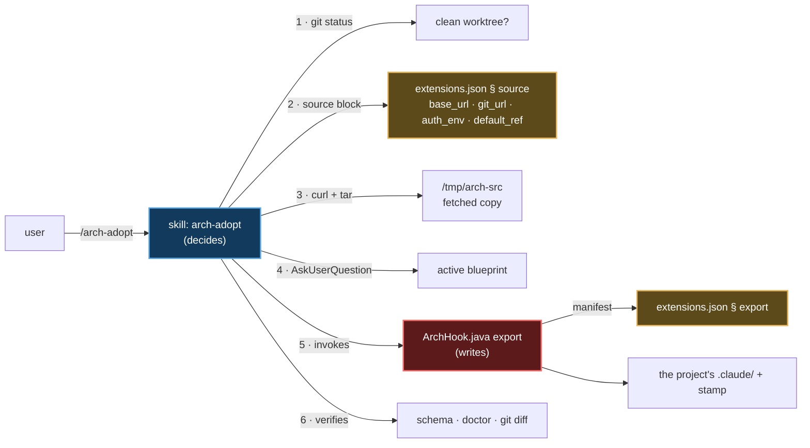

# `/arch-adopt` — installing and updating `.claude/` in an existing project

Primary source: `.claude/skills/arch-adopt/SKILL.md`, `.claude/hooks/ArchHook.java`
(`export` mode), the `source` and `export` blocks of `.claude/schemas/extensions.json`.
Record: `@.claude/decisions/0054-deterministic-export-provenance-plugin.md`.

## What it does

Pulls this architecture into the project the session is rooted at. One operation, two
starting states:

| Starting state | What happens | How the skill knows |
|---|---|---|
| Project never generated by `/init-project`, no `.claude/` of this shape | **Install** | no `.claude/.arch-provenance.json` |
| Project already has this `.claude/` and is behind | **Update** | the stamp exists and names an earlier ref |

Not two commands. The difference is the provenance stamp; the rest of the procedure is the
same.

It is the only creation skill that **travels** into the generated project.
`/init-project`, `project-bootstrap` and `/claude-code-architect-designer` stay out
(`export.skills.exclude`) because they only serve before the project exists. This one stays
because it is how a project updates itself afterwards — including when the plugin that
delivered it is no longer installed on the machine of whoever cloned it.

## The division of labour, and why it exists



**The skill writes no file.** It answers three questions a deterministic mode cannot —
which source, which blueprint, and whether it is safe to write — and then gets out of the
way. Every byte is written by the `export` mode, from a manifest of data.

That split replaced the previous model, where the copy tables lived as prose inside
`project-bootstrap/SKILL.md` §§ 6.6–6.8: a markdown table is copied by a model, row by
row, and the row it forgets breaks nothing at generation time — it breaks for whoever
clones the project later and follows a citation to a file that was never copied.

## The procedure's three guarantees

1. **Refuses a dirty worktree.** Not a git repository, or `git status --porcelain` came
   back non-empty → stop. An update overwrites: `git diff` is how the person reviews it and
   `git checkout` is how they undo it. Without a clean tree neither works. The skill says
   what to run and does **not** commit for them.
2. **None of the four `source` values written from memory.** `base_url`, `git_url`,
   `auth_env` and `default_ref` are data — that is the whole reason they sit in a block.
   Moving from GitHub to a licensing endpoint changes two fields, never the code path that
   consumes them. `auth_env` names an environment variable and never carries its value
   (invariant 11); the header is sent only when the variable is set, so a public repository
   needs no credential.
3. **Provenance is written, not promised.** The `.claude/.arch-provenance.json` stamp
   records ref, sha, blueprint, and the hash of every file written. `/arch-doctor`'s
   `Provenance` line compares those hashes against disk and **names the locally edited
   files before** the next update overwrites them. In a project that already has a stamp,
   run `/arch-doctor` first and put that list in front of the user.

## What travels, and what does not

All of it is the `export` block of `@.claude/schemas/extensions.json` — data, not prose:

| Group | Contents |
|---|---|
| `copy` | `ArchHook.java`, `extensions.json`, the `audit-pricing.json` exemplar |
| `binary_copy` | `ArchHook.jar` — what every hook launches, copied as bytes, never transformed |
| `overwrite` | the project's `settings.json`, from `project-bootstrap`'s template |
| `optional_copy` | `.mcp.json` and the MCP setup doc, when they exist |
| `rules` | every norm in `rules/`, with its `paths` globs rewritten for the active blueprint's packages (`derived_paths`) |
| `skills` | the 14 development skills (`include`); the 3 creation skills stay out (`exclude`) |
| `agents` | `java-spring-boot-developer`, `archunit-installer`, `commons-logging-installer`; `project-initializer` stays out |
| `blueprint_copy` | **only the active blueprint**, never the catalog |
| `ensure_dirs` | `.claude/audit-usage/` — creating the directory is what switches the trail on |
| `gitignore_lines` | `.claude/audit-usage/.state/` and `docs/lessons-learned/` |
| `body_transforms` | cuts citations to `.claude/decisions/` (which do not exist inside a project) and rewrites the sentences that depend on the blueprint |
| `retired` | files this repository renamed or dropped (a rule, the old `java-patterns/` skill), deleted from the target when present — `export` only ever wrote, so without it an adopted project kept both copies |

Two decisions in that manifest that look like inconsistencies and are not:

- **The active blueprint travels; the catalog does not.** Without it, the YAML defining the
  project's architecture would live only in the fetched temporary directory: the stamp
  records the id, the next update reads that id, the source does not have it, and the export
  fails at a point where nobody was ever told to keep a file.
- **`.claude/audit-usage/` is versioned; `docs/lessons-learned/` is not.** The reports
  belong to the commit of the run that produced them. Lessons-learned notes are local, and a
  run that recreates a deleted one writes different text nobody compares.

`ArchHook.java schema` checks that manifest against disk: every skill and every agent must
be in `include` **or** in `exclude` — not listing one is the bug, and the mode fails by
name. A norm with a package territory needs a `derived_paths` entry, or the glob copied
verbatim leaves the rule unloaded, silently.

## Invocation and output (fictional example)

```
/arch-adopt --ref latest-tag --blueprint hexagonal
```

```
✅ updated — blueprint hexagonal, ref v0.9.3 (a1b2c3d)

Source ....... codeload.github.com, fetched at 14:22
Files ........ 136 written · 118 unchanged · 4 overwritten
Warnings ..... none
Schema ....... exit 0
Provenance ... ⚠️ 2 files edited locally since the stamp:
               .claude/rules/persistence.md
               .claude/settings.json

Review: git diff · Undo: git checkout -- .claude
Next: /arch-doctor for the full diagnosis
```

`--source <local path>` bypasses the `source` block entirely and uses a tree on the
machine — that is how an unreleased change is tested.

## The `export` mode by hand

The mode is directly invocable, and it is what the skill calls:

```bash
java .claude/hooks/ArchHook.java export <dest> --blueprint <id> [--ref <label>] [--dry-run]
```

`--dry-run` lists what it would write and writes nothing. Running it twice into the same
destination produces byte-identical trees outside the stamp — determinism verified across
the 7 official blueprints on every change to the manifest.

## What this command does not do

- **Doesn't generate a project.** With no `pom.xml`/`build.gradle`, `/init-project` is what
  you want.
- **Doesn't write business code**, and never touches `src/`.
- **Doesn't write outside `.claude/` itself.** When the build file has no SonarQube scanner,
  its last step chains `sonarqube-setup`, which writes the build file and the workflow under
  its own territory. On an install, run `/reload-skills` first — the skill's directory did
  not exist when the session started.
- **Doesn't commit.** It leaves the tree with the diff ready for review, and says how to
  undo it.
- **Doesn't ask for a blueprint when the stamp already records one** — on an update, the
  active blueprint is a fact of the project, not a fresh question.
