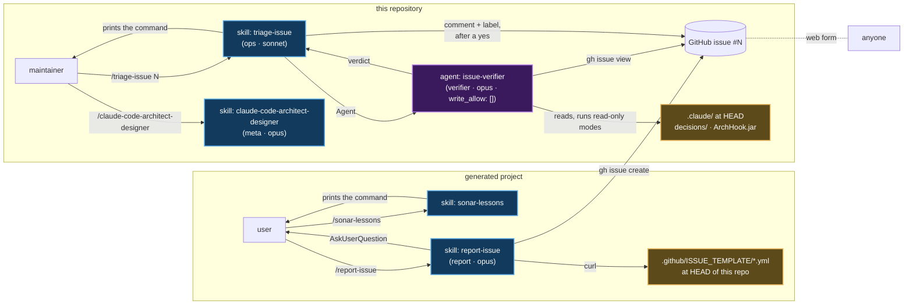
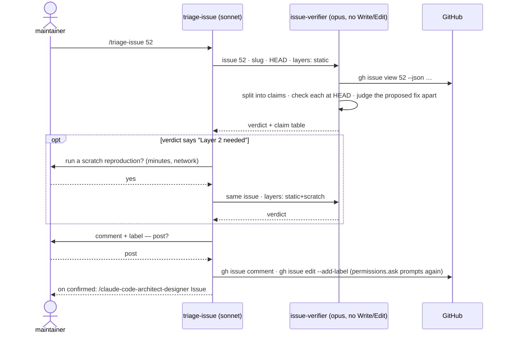

# Issues — `/report-issue` in a generated project, `/triage-issue` here

Primary sources: `.claude/skills/report-issue/SKILL.md`, `.claude/skills/triage-issue/SKILL.md`,
`.claude/agents/issue-verifier.md`, `skill_classes.report` / `skill_classes.ops` /
`agent_classes.verifier` in `.claude/schemas/extensions.json`, `permissions.ask` in
`.claude/settings.json`. Record: `@.claude/decisions/0103-issue-filing-and-skeptical-triage.md`.

## What it solves

A defect in a template, a norm or a hook surfaces in a generated project, but its fix belongs
here: fixing it in the project fixes one project, fixing the owner fixes every project generated
afterwards. Two halves, on two sides of the boundary:

| Side | Command | Who types it | What it does |
|---|---|---|---|
| Generated project | `/report-issue <description \| docs/lessons-learned/file.md>` | the project's user | Files a verifiable, sanitized issue on this repository |
| This repository | `/triage-issue <N>` | the maintainer | Checks every claim of issue `<N>` against `HEAD` before anything changes |

The repository is public, so anyone can file — by the web form or by `/report-issue`. An
issue states a diagnosis and often a fix. **Neither is an input.** Only what was checked
against the code travels on: into the comment the reporter reads, and into the design run
that changes `.claude/`.

## The whole flow



Every arrow that crosses into a manual-only skill is a **person typing a command**:
`sonar-lessons` prints `/report-issue …`, `triage-issue` prints
`/claude-code-architect-designer …`. All three are `disable-model-invocation: true`, so the
model cannot chain them through the `Skill` tool — the only way across is a human. That is
the design, not a limitation: in the generated project, only the user creates an issue; here,
the text of a public issue never reaches the write territory without the maintainer reading
the verdict first.

## `/report-issue` — inside the generated project

| Step | What happens | Stops when |
|---|---|---|
| 1 · Input | A free description, or a file under `docs/lessons-learned/` (a `sonar-NNN.md` goes to the Sonar form) | nothing given after one question |
| 2 · Version | `ref`/`commit`/`blueprint` from `.claude/.arch-provenance.json`; the latest tag through `git ls-remote --tags` | no stamp — not a project from this repository |
| 3 · Form | `bug_report.yml`, `feature_request.yml` or `sonar-lessons.yml`, fetched from this repository's `HEAD` — title prefix, labels and fields come from the form, never from the skill | the form does not answer |
| 4 · Evidence | Bug: entry point, the `.claude/` file that promises the behavior (quoted), the literal output, steps. Feature: one concrete occurrence. Missing items are asked once | still missing after the answer — nothing written |
| 5 · Body | `docs/lessons-learned/<name>.issue.md`, one `### <label>` per form field; privacy pass — no `src/` path, package, class, excerpt, project key or private host | — |
| 6 · Ask | Duplicates found (`gh issue list --search`), the "behind the latest release" warning, the privacy rewrites; *create* / *I'll edit first* / *don't publish* | `gh` not authenticated — the body file is the deliverable |
| 7 · Create | `gh issue create --body-file …`; the outcome goes into the `## Issue` line of the input file | — |

Behind the latest release is a **warning**, not a stop: the defect may still be open here,
and `/arch-adopt` is named as the way to pull the fix if it is not.

`/sonar-lessons` no longer publishes. Its step 6 writes
`not filed yet — /report-issue docs/lessons-learned/sonar-NNN.md` and ends with that command:
the privacy rule and the duplicate search have one owner.

## `/triage-issue` — in this repository



### How the verifier checks a claim

| Kind | Cheapest check that can decide it |
|---|---|
| `file` | Read at `HEAD`, quote `path:line`; `git log <reported ref>..HEAD -- <path>` for *already fixed* |
| `hook` | Run the mode on the input the claim describes (`java -jar .claude/hooks/ArchHook.jar <mode>`), with its own `session_id` |
| `template` | Static first; compiling it is layer 2 |
| `behavior` | What a model did in one run is not reproducible by one run. Static check: does the file the skill reads actually instruct the step, unambiguously? |
| `fix` | Judged apart — invariant it breaks, decision it contradicts, symptom vs owner, guarantee without an observed failure. Never evidence for the symptom |

**Layer 2** — only after the maintainer's yes: an `export` of a generated project into a
scratch directory outside the repository, plus the Initializr starter and a build when the
claim is about compiled code.

### Verdicts

First match wins.

| Verdict | Label | Meaning |
|---|---|---|
| `duplicate` | `duplicate` | Another issue covers the same confirmed symptom |
| `already-fixed` | `triage:already-fixed` | True at the reporter's version, false at `HEAD` — the commit is named |
| `by-design` | `triage:by-design` | A decision record chose this, and the issue brings no fact the record did not weigh |
| `confirmed` | `triage:confirmed` | The core symptom reproduced — by file, mode or build |
| `not-reproduced` | `triage:not-reproduced` | The core symptom was checked and is false at `HEAD` |
| `needs-evidence` | `triage:needs-evidence` | Nothing decisive could be checked; the item that would decide it is named |

`needs-evidence` exists so that a skeptical verifier does not close a real bug because it
failed to reproduce once. The `triage:*` labels are created by hand the first time
(`gh label create`); the skill posts the comment and tells you which label is missing.

### From a confirmed verdict to a design

`triage-issue` prints `/claude-code-architect-designer Issue #N, triaged at <sha>: <core symptom>`.
Type it **in the same session**: the designer takes the verifier's confirmed rows as the
*Reproduced on disk* section of its decision record (the shape of `0101`), and treats refuted
rows, unproven rows and the issue's proposed fix as non-inputs. It never fetches the issue
itself — no table in the conversation, it asks for `/triage-issue <N>` first. Details in
[06-claude-code-architect-designer.md](06-claude-code-architect-designer.md).

## Why it is built this way

| Choice | Reason |
|---|---|
| The issue body is read by an **agent**, not by the skill | In this repository the main thread holds `meta`'s territory (`.claude/**`, `CLAUDE.md`, `.github/**`). An instruction hidden in an issue — an HTML comment is invisible on the web and read in full by the model — would meet a model that can rewrite a hook. Invariant 5, reason 2: restrict tools |
| Class `verifier`, `write_allow: []` | `guard` judges a subagent's writes by `agent_type`, through `Write`, `Edit` and `Bash` alike, whatever phase is open. Proven by `AgentTerritoryTest` |
| `permissions.ask` on `gh issue comment\|edit\|close` and `gh api` | The verifier's `Bash` reaches the network. Every GitHub write prompts a human — including one an issue coaxed out of the agent |
| `triage-issue` on `sonnet` | It relays, asks and publishes; the judgment is the verifier's, on `opus` |
| No GitHub Action | A repository secret, a cost per issue opened by anyone, and a model reading attacker text with a repo token. Revisit once manual triage has run on real external issues |
| `report-issue` refuses a report with no evidence | The other side triages skeptically; a claim nobody can check can only end as `needs-evidence` |

## Report examples

```
✅ Report issue — bug_report.yml · v0.12.0 (8dd87c9) · clean-architecture-single-module · behind v0.12.1

Body ........ docs/lessons-learned/issue-001.issue.md
Duplicates .. none open
Issue ....... https://github.com/ice-lfernandes/claude-spring-architect/issues/52
```

```
✅ Triage #52 — confirmed · checked at abc1234 · layers static

Claims ...... 2 confirmed · 1 refuted · 0 unproven
Fix ......... symptom only
Posted ...... comment + triage:confirmed
Next ........ /claude-code-architect-designer Issue #52, triaged at abc1234: guard bash lets `tee -a` into .claude/rules/ through
```

## Pitfalls

- **`/clear` between `/triage-issue` and the designer** loses the verified table; the designer
  asks for the triage to run again.
- **`settings.json` is read at startup.** The `permissions.ask` lines take effect after
  `claude` restarts.
- **Projects exported before `0103`** still carry the old `sonar-lessons`, which fetches
  `sonar-lessons.yml` itself. The form stays at its path; CI step
  `issue forms cited by skills exist` fails if a form a skill cites disappears.
