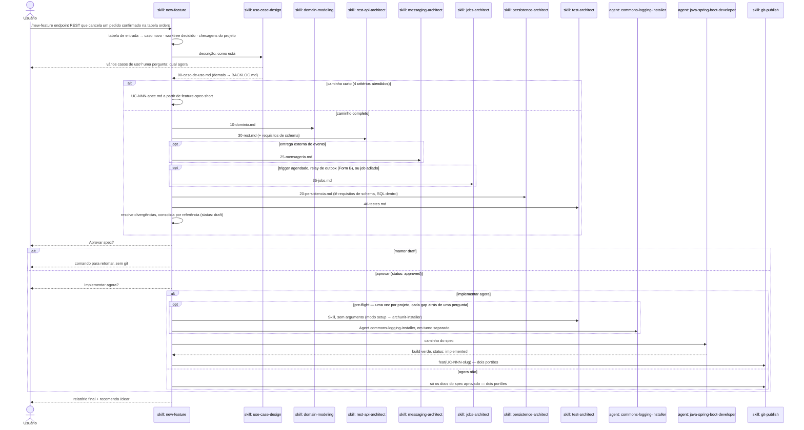

# `/new-feature` — pipeline de design de uma feature

Fonte primária: `.claude/skills/new-feature/SKILL.md`,
`.claude/agents/java-spring-boot-developer.md`, as skills de design (`use-case-design`,
`domain-modeling`, `rest-api-architect`, `messaging-architect`, `jobs-architect`,
`persistence-architect`, `test-architect`) e o modo `guard` de
`.claude/hooks/ArchHook.java`.

## O que faz

Desenha **um caso de uso por execução** e o consolida num único `UC-NNN-spec.md` —
pronto para o agent executor implementar depois que o usuário aprovar. **Este comando só
existe dentro de um projeto já gerado** por `/init-project`: lê `pom.xml`,
`.claude/forbidden-imports.txt` e descobre o package de domínio no projeto real.

Quatro fronteiras valem em toda execução, e nenhuma delas é prosa — o hook `guard`
bloqueia com `exit 2`:

- **Um run escreve só em `docs/`.** Território é allowlist, deny por default: cada skill
  do pipeline só escreve o `write_allow` da classe dela (`skill_classes` em
  `.claude/schemas/extensions.json`). O SQL da migration fica dentro de
  `20-persistencia.md`; todo arquivo em `src/` vem do executor.
- **Um run de design não materializa arquivo nenhum fora de `docs/`.** O `guard` recusa a
  própria *chamada* a uma skill de classe `build` — `docker-architect` incluída — enquanto
  o run está aberto. Serviço de compose que falta é **registrado** na parcial, com o
  comando que o cria.
- **Git só via `git-publish`**, atrás das duas confirmações — em todo fim de fluxo,
  inclusive o sem executor. `git push` é sempre `ask`.
- **Spec aprovado é imutável.** Um caso posterior registra a mudança necessária na
  própria seção `## Impact on approved use cases`, e uma linha no `CHANGELOG.md` da pasta
  de cada caso alterado. O `guard` congela os arquivos — e libera exatamente esse
  `CHANGELOG.md`, então o log que a pasta congelada deve receber é a única escrita que ela
  ainda aceita (`guard.frozen_exempt_basenames`).
- **Uma impact row que adiciona precondição nomeia quem a satisfaz.** Coluna
  `Satisfied by`: um `UC-NNN` aprovado, o próprio caso, ou um caso do backlog **nomeado** —
  e nesse último caso a spec e o relatório final dizem que o caso anterior fica inalcançável
  ponta a ponta até o outro entrar. Sem satisfator, a consolidação para. Fixture que fabrica
  o estado não conta como satisfator.
- **O relatório final carrega três achados que ninguém deve ter de reconstruir:** caso
  aprovado que este run deixou inalcançável, garantia de dedupe delegada a consumidor externo
  sem contrato, e dado pessoal que cruza fronteira em claro com seu destinatário.

## Por que é uma skill manual, não um agent

`new-feature/SKILL.md` documenta a própria decisão: eixo 2 (disparo manual) + eixo 5
(procedural) + eixo 8 (ambos). A forma "agent" foi rejeitada — nenhum dos três motivos
válidos se aplica (contexto, tools, model). `disable-model-invocation: true` impede o
modelo de chamá-la: o usuário digita o comando.

## Entrada — tabela fechada

O argumento é classificado por comando (`grep -E`, `test -d`, `grep '^status:'`), nunca
interpretado. Vale a primeira linha que casar; qualquer outra coisa é erro.

| Entrada | Resultado |
|---|---|
| vazia | lista os casos de uso com o `status` de cada um |
| `UC-NNN-slug`, pasta existe, spec `draft` ou ausente | retoma: só os partials que faltam, depois consolidação |
| `UC-NNN-slug`, spec `approved` | implementa: direto para a delegação ao executor, pulando os passos de design e a consolidação |
| `UC-NNN-slug`, spec `implemented` ou `implemented-blocked` | ❌ já implementado — descreva a mudança como feature nova |
| pasta não existe, mas o `UC-NNN` do argumento tem exatamente uma pasta no disco | ❌ informa o slug real e o status, mais o comando exato — o caso existe, o argumento nomeou errado |
| `UC-NNN-slug`, pasta não existe, número casando com zero ou várias | ❌ não encontrado — descreva a feature para criar |
| contém `UC-` + dígito mas não é exato | ❌ argumento ambíguo |
| texto livre, algum caso ainda aberto | ❌ retome ou aprove antes |
| texto livre, nenhum caso aberto | caso novo — o texto vai como está para `use-case-design` |

Erro imprime o motivo e o uso, e encerra: nenhum efeito colateral depois dele — nenhuma
chamada de skill, escrita ou pergunta. Leitura continua permitida, e é o que deixa um
quase-acerto responder com o slug real em vez de "não encontrado".

## Diagrama de sequência

## Peças e o que cada uma escreve

| Ordem | Skill/Agent | Depende de | Arquivo que produz |
|---|---|---|---|
| 1 | `use-case-design` | — | `00-caso-de-uso.md`, entradas em `BACKLOG.md` — dona de número e slug |
| 2 | `domain-modeling` | 1 | `10-dominio.md` — dona dos nomes de exceção |
| 3 | `rest-api-architect` | 1, 2 | `30-rest.md` — inclusive os requisitos de schema que o transporte cria |
| opcional | `messaging-architect` | 2, se houver entrega externa | `25-mensageria.md` |
| opcional | `jobs-architect` | 1 (trigger agendado), ou Form B da mensageria, ou um job adiado | `35-jobs.md` — tecnologia, trigger/cadência, coordenação entre instâncias, overlap/misfire, propriedade de liga-desliga, métricas de job; dona do schedule do relay de outbox e do job de prune |
| 4 | `persistence-architect` | 1, 2, 3, e mensageria/jobs quando rodaram | `20-persistencia.md` — SQL da migration dentro; lê as tabelas de ferramenta de `35-jobs.md` (`shedlock`, `QRTZ_*`, `BATCH_*`) como requisito de schema e a contagem de réplicas para a estratégia de claim do outbox, quando jobs-architect rodou |
| 5 | `test-architect` | 1–4 | `40-testes.md` |
| — | `new-feature` (consolidação) | todas acima | `UC-NNN-spec.md` |
| 6 | `java-spring-boot-developer` (agent) | spec `approved` | código e migrations em `src/**` |
| — | `git-publish` | fim do fluxo | commit + push, atrás de dois portões |

**Por que REST antes de persistência.** REST gera requisito de schema
(`Idempotency-Key` precisa da tabela compartilhada de chaves); persistência não gera
requisito de REST. Na ordem antiga a tabela era descoberta depois do partial de
persistência escrito, e persistência rodava duas vezes.

`docker-architect` **não** é encadeada pelo pipeline. Um run de design é docs-only: quando
`persistence-architect`, `messaging-architect` ou `test-architect` detecta um serviço que
falta no `docker-compose.yml`, registra a pendência na parcial e reporta o comando
`/docker-architect`, que o usuário roda depois em um prompt próprio. O modo `guard` do
`ArchHook.java` recusa a chamada enquanto a fase de design está aberta —
`.claude/decisions/0058-skill-classes-territory-schema.md`. `java-patterns` viaja
pré-carregado dentro do executor.

## Pre-flight — infraestrutura instalada uma vez, no primeiro "implementar agora"

Antes de delegar ao executor, `new-feature` detecta (por comando, não por suposição)
dois gaps que só importam quando o primeiro `.java` vai ser escrito em `src/`:

| Gap | Como detecta | Instala via |
|---|---|---|
| ArchUnit ausente | `grep -rl "ArchRule\|ArchTest" src/test/` vazio | `Skill(test-architect)` sem argumento — modo setup, que delega a `archunit-installer` (ArchUnit + portão JaCoCo) |
| Classes de logging/máscara ausentes | pasta `commons` inexistente ou só com `package-info.java` | `Agent(commons-logging-installer)` — treze exemplares de `new-feature/templates/commons/` traduzidos para o package real, mais `AutoConfiguration.imports` e as dependências AOP |

Cada gap encontrado vira um `AskUserQuestion` (**Install now** / **Skip for this run**);
nenhum gap, nenhuma pergunta. Os dois podem disparar no mesmo turno — e não podiam antes:
`Skill(test-architect)` abria uma fase de design no hook `guard` e
`Agent(commons-logging-installer)` fechava uma, sem ordem garantida entre os dois
`PreToolUse`, e o perdedor bloqueava toda escrita em `src/` do outro agent (aconteceu: 138k
tokens, zero arquivos escritos). `agent_classes` encerrou o problema: a escrita de um
subagent é julgada pelo `agent_type` dela, então nenhuma fase a alcança e nada mais fecha
fase numa chamada `Agent`.

## Ciclo de vida do spec

| `status:` | Escrito por | Quando |
|---|---|---|
| `draft` | `new-feature` | na consolidação |
| `approved` | `new-feature` | só com aprovação explícita do usuário |
| `implemented` | `java-spring-boot-developer` | com `./mvnw verify` verde |

Defeito de spec encontrado pelo executor num spec aprovado: o usuário muda `status:
draft` à mão, e `/new-feature UC-NNN-slug` retoma e reaprova.

**Um spec aprovado nunca é editado para registrar que outro caso mudou o comportamento
dele.** O caso que altera casos já aprovados — inclusive o que não cria classe de use case
nenhuma, e ainda assim ganha seu próprio `UC-NNN` — escreve uma linha no `CHANGELOG.md`
**da pasta de cada caso alterado**: data, o `UC-NNN` que alterou, e o que mudou. Sem isso, a
imutabilidade protege o texto e perde a história: quem abre `UC-001-register-customer/` não
tem como saber que o comportamento dela mudou em outro lugar. O `guard` congela a pasta; o
changelog é o arquivo separado que registra a mudança sem violar o congelamento.

## Caminho curto

Quando o caso reusa um agregado aprovado, não precisa de tabela, coluna ou migration
nova, nem de exceção nova, nem de pergunta ao usuário, `new-feature` pula os partials e
escreve um spec único em que cada linha cita a fonte — um spec aprovado ou uma regra.

## Regra de precedência na consolidação

| Fato | Quem vence |
|---|---|
| Path, verbo, status HTTP, formato do corpo | `30-rest.md` |
| Tabela, coluna, chave, índice, migration | `20-persistencia.md` |
| Tópico, serialização, garantia de entrega, retry/DLQ do consumidor | `25-mensageria.md` |
| Tabela outbox, suas colunas, query de claim, teto de tentativas/backoff e janela de retenção | `20-persistencia.md` — a mensageria **declara** que o caso precisa de outbox e qual garantia o relay tem de honrar, e nunca um nome de coluna. Uma linha de § 6 nomeando colunas é divergência, e uma decisão de coluna que derrubaria a garantia declarada **para** o pipeline em vez de ser resolvida por precedência |
| Tecnologia de scheduling, trigger e cadência, coordenação entre instâncias, tratamento de overlap/misfire, métricas de job, job de prune | `35-jobs.md` — inclusive o poll interval e a coordenação do próprio relay de outbox, que não moram mais em `20-persistencia.md` |
| Nome do agregado, value object, port, evento | `10-dominio.md` |
| Classe de exceção e `errorCode` | `10-dominio.md` |
| Fronteira do caso de uso, invariantes, situações de erro | `00-caso-de-uso.md` |
| Nome e nível de cada teste | `40-testes.md` |

O spec é consolidado **por referência**: cada bloco traz as decisões finais e o caminho
do partial, nunca a cópia das tabelas. Valores descartados vão para
`## Resolved divergences`.

## Disciplina de custo

Uma execução real custou ~USD 15 para um agregado de dois campos, 70% em cache read: a
alavanca é turnos × tamanho do contexto. Por isso: sem mensagens de progresso entre
passos, escritas independentes no mesmo turno, versões lidas do `pom.xml`, um caso de
uso por execução e `/clear` entre execuções.

## Nota operacional — trabalho longo em background

Um executor em background **não sobrevive à máquina dormir**. Antes de delegar em
background, `new-feature/SKILL.md` manda oferecer manter a máquina acordada
(`caffeinate -i` no macOS) ou rodar na thread principal, que é retomável.

## Entrada em projetos gerados

`/new-feature` viaja para todo projeto gerado por `/init-project` (passo 6.7 do
`project-bootstrap`), junto com o hook `guard` (passo 7). Com `pedidos-api` existindo,
`/new-feature <descrição>` roda **dentro** dele, sem `claude-spring-architect` na
máquina.

Toda execução deixa um relatório em `.claude/audit-usage/` — duração ativa, espera pelo
usuário, tokens por skill encadeada e pelo executor, arquivos tocados, falhas. É assim
que a disciplina de custo acima deixa de ser estimativa: `/audit-usage` mostra qual
peça está comendo o orçamento. Ver [08-audit-usage.md](08-audit-usage.md).
