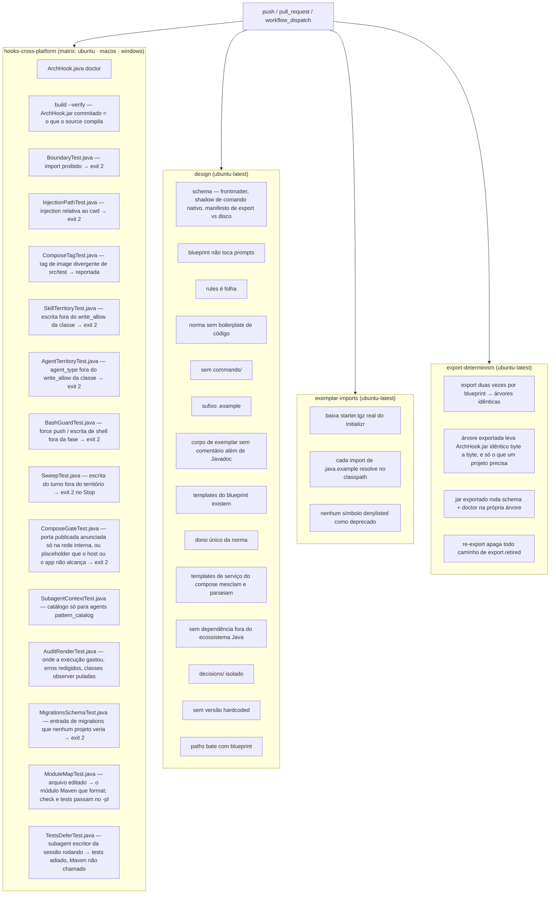

# `validate.yml` — CI dos invariantes

Fonte primária: `.github/workflows/validate.yml`, `.claude/hooks/ArchHook.java`
(método `schema()`), `CLAUDE.md` § Invariantes.

## Por que existe

Os invariantes de `CLAUDE.md` e as normas em `rules/` são prosa, não código — nada
impede que uma edição viole um deles em silêncio. `ArchHook.java check` só guarda a
fronteira Java de um projeto **gerado**; nunca roda contra o próprio grafo de prompts
deste repositório. `validate.yml` é o que transforma cada invariante numa verificação
determinística e cobrindo o repositório inteiro, a cada `push` e `pull_request`, em vez
de uma alegação que só se sustenta enquanto quem escreve a próxima skill lembra dela.

## Diagrama dos jobs



## O que cada verificação cobre

| Job / passo | Verifica | Contra o quê |
|---|---|---|
| `hooks-cross-platform` | `ArchHook.java doctor`, `build --verify` e depois treze testes nas três OSes, todos disparando `java -jar .claude/hooks/ArchHook.jar` — o mesmo comando que os registros rodam | Decisão D8 — "cross-platform" como fato, não alegação — e decisão 0084: testar o source não prova nada sobre o jar que os hooks lançam |
| `committed ArchHook.jar is what the source compiles to` | `build --verify` recompila sob o `hook_build.javac_feature` fixado e compara byte a byte | Decisão 0075 — editar `ArchHook.java` sem rebuild não muda nada que um hook executa. Roda antes dos testes, para que exercitem bytes revisados |
| `format, check and tests hand Maven the module the edited file belongs to` | `ModuleMapTest.java`, projetos descartáveis com um `mvnw` stub que registra seus argumentos: um arquivo sob o `src/main` ou `src/test` da raiz de um projeto single-module chega a `format`, `check` e `tests` como `-pl .`, um arquivo multi-module como `-pl <módulo>`; um `.java` sob `.claude/` e um projeto sem `pom.xml` nunca chamam o Maven | Decisão 0107, issue #60 — `moduleOf` nunca olhava o POM da raiz, então esses três hooks retornavam antes de chamar o Maven em todo projeto single-module desde o primeiro commit, e um hook que não faz nada parece um hook que passou |
| `tests defers while a writer subagent of the session runs, and only then` | `TestsDeferTest.java`, projetos descartáveis com um `mvnw` stub e uma cópia do `extensions.json` real: depois de `tests agent-start` de um agente cuja classe tem `executor: true`, o `Stop` não chama o Maven e imprime `Tests deferred`; um agente só de leitura, um agente sem classe, um escritor que já parou, o escritor de outra sessão e um marcador além de `tests.writer_agent_max_minutes` chamam o Maven como antes | Decisão 0116, issue #76 — um `Stop` da thread principal durante um executor em background rodava o Maven sobre a árvore pela metade e bloqueava uma thread que não pode escrever `src/`. Um marcador nunca escrito traz isso de volta, um nunca apagado desliga o gate — os dois em silêncio |
| `guard bash refuses force pushes and holds shell writes to the phase` | `BashGuardTest.java`, 23 casos: toda grafia de force push de `guard.force_push` (`-f`, `-uf`, `--force-with-lease`, `+ref`, `git -C`, `sh -c "…"`) recusada, redirect / `sed -i` fora do território de uma fase de design recusados, `sed` simples, alvo `$OUT` irresolvível e `ls` liberados; na fase do `sonar-lessons`, `./mvnw -q` e `gh issue create` liberados e o scan redirecionado para `target/` recusado; para o `java-spring-boot-developer`, a rodada de teste documentada com log em `$TMPDIR` e um caminho absoluto fora do projeto liberados, um log em `target/` recusado | Decisões 0076 e 0117. O modo roda antes de todo comando de shell em toda sessão: falha caro nas duas direções, e o parser é dado que uma edição de JSON muda |
| `guard sweep reports this turn's writes, never pre-existing dirt` | `SweepTest.java` num repo git descartável: arquivo sujo antes do prompt nunca é nomeado, escrita fora do território no turno sai 2, `stop_hook_active` não bloqueia duas vezes, escrita dentro do território fica calada, a trilha do `audit` gravada no turno não é reportada enquanto um `Write` nela continua recusado, uma cadeia `/new-feature` → skill de design → `git-publish` cujos spec, parciais e escrita do executor em `src/` foram admitidos em tool-time fica calada com a pasta aprovada depois, e um arquivo que nenhum guard de tool-time viu no mesmo turno continua nomeado | Decisões 0065, 0105 e 0114 — o sweep vale o que vale a baseline do `guard prompt`, e uma baseline quebrada falha calada nos dois sentidos |
| `compose gate blocks a published service no host client can reach` | `ComposeGateTest.java`: `9092:9092` + `PLAINTEXT://kafka:9092` sai 2 nomeando a linha de endereço anunciado, `stop_hook_active` sai 0, um listener `localhost` limpa a linha, sem compose fica calado; collector sem porta publicada e `app` sem `OTLP_METRICS_ENDPOINT` saem 2 pela pergunta 5, e as variantes corrigidas, `SPRING_DATASOURCE_URL` sobrescrevendo `${DB_URL:…}` e o default host-first do Kafka ficam calados | Decisões 0064 e 0110. Não precisa de Docker — as checagens de endereço anunciado e de placeholders leem os arquivos |
| `context subagent hands the catalog to pattern_catalog agents only` | `SubagentContextTest.java`: `java-spring-boot-developer` recebe um `## Catalog` dentro de `subagent_context.max_chars`; installers e `general-purpose` não recebem nada | Decisão 0077. `SubagentStart` não bloqueia, então catálogo que para de chegar — ou chega em todo lugar — é silencioso |
| `audit renders where the run spent, redacts tool errors, skips what class or project turns off` | `AuditRenderTest.java` num projeto descartável com cópia do `extensions.json` real: chamadas de tool por peça (incluindo o transcript próprio de um subagent), os turnos mais caros, o pico de contexto, a primeira linha de cada erro de tool redigida, os campos de ledger que `audit summary` agrega, nenhum relatório para peça cuja classe declara `audited: false`, e o `audited.json` do projeto ligando ou desligando uma peça por cima da classe — exceto `arch-adopt`, desligado fixo pelo próprio override — com o `doctor` apontando cada entrada inválida | Decisões 0041, 0085, 0086, 0111. Todo número é extraído de um layout de transcript não documentado e um render que lança exceção sai com 0 — o relatório só para de atualizar; a linha de erro cai num arquivo versionado, então um token ecoado vazaria (invariante 11) |
| `guard keeps each skill inside its class's territory` | `SkillTerritoryTest.java` roda o modo `guard` sobre o `extensions.json` real em 28 casos: sem fase aberta nada restringe, dentro e fora do `write_allow`, o `agent_type` prevalecendo sobre a fase aberta, a recusa de `Skill(<build>)` com fase de design aberta, o território mais estreito do callee numa chamada entre classes, a fase sobrevivendo a uma chamada `Agent` até o próximo prompt, e um encadeamento da mesma classe (`arch-adopt` → `sonarqube-setup` → `docker-architect`) somando territórios — ainda negação por padrão fora da união —, e a classe `report` (`sonar-lessons`) presa a `docs/lessons-learned/` e recusada no meio de um design | O território ser allowlist é o tipo de alegação que apodrece em silêncio: vale até alguém alargar uma entrada de `write_allow` sem perceber. O caso que motivou tudo — um run de design escrevendo `docker-compose.yml`, arquivo que nenhuma denylist nomeava — é um dos 28, e também o `sonarqube-setup` encadeado que tinha o `pom.xml` recusado antes da decisão 0092 |
| `guard keeps each agent inside its class's territory` | `AgentTerritoryTest.java` roda o mesmo modo sobre `agent_classes` em 25 casos: cada installer dentro e fora da sua lista estreita, as grafias single- e multi-module do mesmo caminho, o executor alcançando a única linha de spec que ele fecha, o driver escrevendo qualquer coisa, o `issue-verifier` (classe `verifier`) recusado em toda escrita no repo — por `Write`, por heredoc, e com a fase `.claude/**` do designer aberta — enquanto o scratch fora do repo passa, e um agent sem classe caindo na fase do chamador | Cada agent prometia o próprio território em prosa (`**Does not write:** docker-compose.yml`) enquanto o guard dava bypass irrestrito aos quatro. A promessa agora é dado, e os dois bloqueios que mais importam — `archunit-installer` recusado no `docker-compose.yml`, e recusado no source principal — são casos deste arquivo |
| `hook reports a compose image tag that disagrees with src/test` | `ComposeTagTest.java` monta um projeto descartável com `docker-compose.yml` e um `DockerImageName.parse(...)` em `src/test`, e exige que `ArchHook.java compose` reporte a divergência, expanda `${VAR:-default}` e fique calado quando as tags batem | A suíte passar contra uma versão de engine que ninguém roda. Roda nas três OSes porque a pergunta 3 do modo `compose` compara dois arquivos e não precisa de Docker — o que também prova que o casamento de `src/test/` sobrevive ao separador do Windows |
| `frontmatter schema` | `java .claude/hooks/ArchHook.java schema` | Invariante 10 — `extensions.json` é o dono único do frontmatter reconhecido; campo inventado ou `metadata:` falha alto em vez de ser ignorado em silêncio pelo runtime. O mesmo modo exige que toda injection `` !`command` `` resolva caminho a partir de `${CLAUDE_PROJECT_DIR}` — uma relativa reporta arquivo ausente sempre que o cwd do shell derivou —, reprova pasta de skill com nome de slash command nativo (`types.skill.native_commands`; até a 0084 um passo só no YAML que projeto gerado nunca rodava) e reprova rule sem `paths` (`types.rule.required`; decisão 0082 — rule sem ele carrega no launch, toda sessão), e reprova entrada de `migrations` que o `arch-adopt` nunca mostraria — blueprint id inexistente, campo faltando, id repetido (decisão 0104, `MigrationsSchemaTest.java`) |
| `new blueprint doesn't touch prompts` | adicionar um blueprint deixa `.claude/skills` e `.claude/agents` intactos | Invariante 7 — arquiteturas são dados |
| `rules is a leaf of the graph` | nenhuma rule menciona "skill", "agent", "subagent" | Invariante 1 |
| `norm contains no code boilerplate` | nenhuma declaração de `class`/`record`/`interface`/`enum` dentro de `rules/` | Invariante 3 |
| `no new commands/` | `.claude/commands/` não existe | Invariante 4 |
| `exemplar imports have the .example suffix at the end` | todo arquivo sob `skills/*/templates/` | Globs de precondição que dependem do sufixo |
| `exemplar bodies carry no comment but Javadoc` | `TemplateCommentsTest.java`: nenhum `*.java.example` (fora de `claude-code-architect-designer/`) tem `//` ou `/* */` no corpo — depois do cabeçalho `EXEMPLAR` e fora dos marcadores `// --- ` na coluna 0 — que o `checkstyle.xml.example` rejeitaria. Lê as regex dos módulos `LineComment`, `BlockComment` e `TrailingComment` do próprio template, então os dois não divergem | Decisão 0108 — o executor copia a forma do exemplar, comentários inclusive, e 60 templates carregavam 508 comentários no corpo. Com o Checkstyle do projeto gerado rejeitando-os, um comentário que volta a um template vira hook `check` vermelho em todo projeto que o copiar |
| `blueprint-declared templates exist on disk` | todo `templates.<role>` de um blueprint resolve a um arquivo real | Blueprint apontando para template renomeado ou apagado |
| `issue forms cited by skills exist` | todo `.github/ISSUE_TEMPLATE/*.yml` citado em `.claude/skills` existe | Form renomeado ou apagado: projetos já exportados o buscam do `HEAD` deste repo, e o passo de formulário do `report-issue` — o de publicação do `sonar-lessons`, nos projetos exportados antes da decisão 0103 — para em todos eles (decisões 0100, 0103) |
| `compose service templates merge and parse` | todo `docker-architect/templates/*-service.yml.example` mesclado de uma vez no compose base do `project-bootstrap`, depois `docker compose config -q` | Nada mais lê esses templates antes do `docker compose up` de um projeto gerado: uma indentação errada, ou um volume nomeado que o template usa sem declarar (os templates de Kafka e da stack Grafana tinham as duas formas disso), só aparecia lá |
| `each norm has a single owner` | lista fixa de termos conhecidos aparece em no máximo um arquivo sob `rules/` | Invariante 2 — estreito por construção, ver nota abaixo |
| `no dependencies outside the Java ecosystem` | nenhum `pip install`, `npm install`, `node `, `python` solto em `.claude/` | Decisão D7 |
| `every norm paths matches some blueprint` | o glob `paths` de uma rule nomeia um pacote que algum blueprint declara | Gap 8 de `decisions/0024-lessons-learned-001-remediation.md` — rule que nunca carrega sozinha, em silêncio |
| o manifesto de export bate com o disco (dentro de `frontmatter schema`) | toda skill e agent em disco está no `include` ou `exclude` do bloco `export`; toda rule cujo `paths` nomeia um pacote tem entrada em `export.derived_paths` | Invariante 9 — esse manifesto **é** a lista de cópia que torna o projeto gerado self-contained. As duas checagens faziam grep nas tabelas de cópia em prosa de `project-bootstrap` §§ 6.6–6.8; as tabelas sumiram (D54) e o `schema` é dono da checagem, então ela também dispara localmente a cada edição em `.claude/`. Uma norma nova ausente do manifesto não quebra nada na geração: quebra para quem clona o projeto depois e segue uma citação para um arquivo que nunca foi copiado |
| `decisions/ doesn't grow paths or enter 00-index.md` | nenhum arquivo em `decisions/` declara `paths:`; nenhum está listado em `rules/00-index.md` | `decisions/` é histórico, não é rule — ver [11-pitfalls.md](11-pitfalls.md) |
| `no hardcoded Spring/Java version outside decisions/` | nenhum `Spring Boot X.Y` / `Java NN` escrito como fato em `rules/`, `skills/`, `blueprints/`, `CLAUDE.md` | Invariante 8 — versão é resolvida via Spring Initializr, nunca escrita de memória. Exclui a linha de requisito mínimo `JDK 21+` e notas datadas de "Tested to compile" em exemplares, que registram uma verificação passada, não uma versão a usar |
| `export-determinism` (job inteiro) | dois exports por blueprint geram árvores idênticas; a árvore leva `ArchHook.jar` idêntico ao verificado e nada que só este repo precisa; o **jar exportado** roda `schema` e `doctor` na própria árvore; semear cada caminho de `export.retired` e re-exportar apaga cada um | Invariante 9 e decisão D54. O passo de retired é o rename da decisão 0082: sem o delete, projeto atualizado fica com norma sem dono. O id do blueprint é lido do stamp com `sed`, não `python3` — D7 |
| `exemplar-imports` (job inteiro) | todo `import` de um `.java.example` resolve contra JARs de uma request real ao `start.spring.io`, e nenhum `.java.example` ou `.yml.example` usa nome na denylist de deprecados | Gaps 4, 5, 9 de `decisions/0024-lessons-learned-001-remediation.md`; a varredura de `.yml.example` e as entradas dos serializers Kafka, `decisions/0106-kafka-string-wire-contract.md` — exemplar que "compila na cabeça de quem escreveu" |

Nota sobre "each norm has a single owner": o teste checa uma lista fixa de frases
literais (`Constructor injection`, `Zero framework`, `RuntimeException`), não um
detector geral de duplicação. Pega regressão de termos que já se sabe terem divergido
uma vez; uma rule nova sem frase nova adicionada a essa lista não é coberta.

## Postura do workflow

Quatro decisões que não verificam invariante nenhum — são o custo e a superfície do
próprio CI:

- **`permissions: contents: read`** no topo. Nenhum job escreve: todos leem o checkout e
  rodam `java`. Sem isso o `GITHUB_TOKEN` herda o default do repositório, que é write.
- **`concurrency` com `cancel-in-progress`**. `push: [main]` e `pull_request` disparam no
  mesmo head quando se empurra um branch de PR; o run superado é cancelado em vez de
  disputar a mesma conclusão.
- **`timeout-minutes` em todo job** — 15 nos dois de hook e prompt, 30 no
  `exemplar-imports`, que depende de rede. O default é 6h.
- **Actions fixadas por commit SHA**, com a tag como comentário ao lado. `@v7` é um ref
  móvel que o dono da action pode reapontar — uma tag torna irreproduzível o que o CI
  rodou. Subir os dois juntos. Ambas estão no major atual (`checkout` v7.0.1,
  `setup-java` v6.0.1): v1–v4 de `setup-java` estão deprecadas, e os majors intermediários
  só apertam o que este workflow não usa — node24 (exige runner ≥ v2.327.1, que os
  runners hospedados no GitHub são), o bloqueio de checkout de PR de fork, que vale para
  `pull_request_target`/`workflow_run` e não para o gatilho `pull_request` daqui, e a
  remoção das distribuições `adopt` legadas no `setup-java` v6, sendo `temurin` a usada.

Os jobs `design` e `exemplar-imports` declaram `defaults.run.shell: bash` para ganhar
`pipefail`, que o shell default (`bash -e {0}`) não tem. Por job, nunca no nível do
workflow: a matriz `hooks-cross-platform` tem uma perna `windows-latest` cujo shell
default é pwsh.

## O workflow vizinho: `release.yml`

Fonte primária: `.github/workflows/release.yml`, `.github/PULL_REQUEST_TEMPLATE.md`
§ Release bump.

`validate.yml` prova que o que entrou em `main` está correto. `release.yml` responde a
outra pergunta: **com que nome esse estado passa a ser citável**. Todo merge em `main`
ganha uma tag anotada, porque quem adota a arquitetura fixa um ref — o
`.plugin-source.json` do marketplace e o selo de procedência de cada projeto gerado
guardam exatamente isso. Um merge sem tag é um estado que ninguém consegue apontar.

| Job | Quando roda | O que faz |
|---|---|---|
| `bump-declared` | todo evento de PR (`opened`, `edited`, `synchronize`, …) | Lê § Release bump do corpo do PR e exige **exatamente um** nível marcado: `major`, `minor` ou `patch`. Publica o nível como output |
| `tag` | uma vez, no `closed` de um PR **merged** com base `main` | Roda `schema` e `doctor` no commit de merge, calcula o próximo semver a partir da última tag e cria e empurra a tag anotada |

Quatro decisões que não são óbvias no arquivo:

- **O nível vive no corpo do PR, não numa label nem num commit.** O campo é obrigatório
  no template e o job `bump-declared` falha enquanto o PR está aberto — a decisão
  acontece na revisão, não depois do merge, quando já não há onde registrá-la.
- **Um parser, um arquivo.** A checagem de PR e a criação da tag leem o mesmo corpo; duas
  regex em dois workflows divergem silenciosamente. Por isso são dois jobs do mesmo
  `release.yml`, e o segundo consome o output do primeiro.
- **A tag nasce do `merge_commit_sha`, não de `main`.** `main` pode já carregar o merge
  seguinte quando o job roda. E o job revalida esse commit: `validate.yml` passou na head
  do PR, que é outra árvore sempre que `main` andou por baixo — um conflito semântico em
  `extensions.json` falha ali em vez de virar um ref que o marketplace pode fixar.
- **O marketplace é avisado, não escrito.** O último step manda um `repository_dispatch`
  (`source-released`, payload `{ref}`) para `claude-spring-architect-marketplace`, cujo
  `sync.yml` roda `./sync.sh vX.Y.Z`, ajusta a versão do plugin, chama o próprio
  `validate.yml` na branch e abre um PR. O `GITHUB_TOKEN` não alcança outro repositório, então
  o step lê o secret `MARKETPLACE_DISPATCH_TOKEN` (PAT fine-grained, só aquele repositório,
  Contents: read and write). Sem ele, o step avisa em vez de falhar: a tag já foi enviada.

Duas coisas continuam manuais, de propósito: o GitHub Release, quando um ref merece mais
prosa do que a mensagem que o workflow escreve (a mensagem aponta para o PR), e o merge do PR
no marketplace — publicar é uma decisão, não consequência de um merge.

**O que torna o campo obrigatório não está no arquivo:** é `bump-declared` como *required
status check* na branch protection de `main`. Sem isso, o job falha e o merge acontece
de todo jeito.

## O workflow vizinho: `templates.yml`

Filtrado por paths: roda só quando um PR mexe nos arquivos que ele testa, porque os dois jobs
baixam do Maven Central, do GitHub ou do `start.spring.io`. Não é required check — um required
check num workflow filtrado por paths fica pendente em todo PR que ele pula. Design:
`.claude/decisions/0099-ci-tests-for-verbatim-templates.md`.

| Job | Verifica | Contra o quê |
|---|---|---|
| `checkstyle-configs` | `CheckstyleConfigTest.java`: `checkstyle.xml.example` e `checkstyle-test.xml.example` rodando no Checkstyle **mais recente** (resolvido no Maven Central, jar `-all` da release no GitHub) sobre três fixtures — arquivo limpo passa nos dois, `record` e `permits` como nome falham nos dois com `IllegalIdentifierName`. Mais seis fixtures de comentário só no `checkstyle.xml`: `//` em linha própria, `//` no fim da linha, `/* */`, `/** */` dentro de corpo e `TODO` em Javadoc falham, cada um pelo seu módulo; um arquivo com as duas exceções (corpo vazio, diretiva de ferramenta) e strings `"http://…"` e `"/api/*"` passa; o `checkstyle-test.xml` deixa o comentário passar. Mais onze fixtures de assertion de exceção, só no `checkstyle-test.xml`: dez lambdas com mais de uma chamada — uma por nome de assertion que `testing.md` § Names and shape lista, um argumento `new`, um `orElseThrow()` encadeado, um bloco de dois statements, um `Assertions.` qualificado — falham com `OneCallInThrowLambda`; um arquivo de formas com uma chamada (construtor sob teste, method reference, bloco de um statement, lambda de `forEach` com duas chamadas) passa | Decisão 0097 — o `format` default do Checkstyle 14 só rejeita `var`; uma config que dependia dele passou quatro variáveis `record` com 0 violações, e a config nunca roda neste repositório. Decisão 0108 — Javadoc é o único comentário em `src/main`. Decisão 0113 — a regra de uma chamada na lambda de assertion de exceção era só uma linha de norma, e a forma voltou em formatos de teste que nenhum template cobria |
| `java-templates` | `JavaTemplatesTest.java`: todo arquivo de `new-feature/templates/commons/` mais os blocos `// --- ` de `JpaEntity.java.example` (`AssignedIdEntity` incluído) num projeto novo do `start.spring.io`, depois `./mvnw test` sobre os três templates `*Test` | Decisões 0096 e 0098 — esses templates são copiados como arquivo, não lidos como forma: um que para de compilar quebra o `commons-logging-installer` em todo projeto. `exemplar-imports` prova que cada import existe; este prova que os arquivos compilam juntos e que os testes enviados passam |

## O que ainda não está aqui

- Invariante 9 (o projeto gerado é self-contained) está coberto **pela metade**: o passo
  `schema` prova que o manifesto de `export` cobre o disco, e `export-determinism` prova
  que a árvore exportada é estável e passa no próprio `schema` e `doctor` — as partes cujo
  modo de falha era silencioso.
  Que o projeto gerado *de fato* compile e não tenha caminho morto continua verificado à
  mão, pelo bloco de comandos em `project-bootstrap/SKILL.md` § 8 ("Verify"): exige gerar
  um projeto de verdade contra o Initializr, e esse custo não foi automatizado. Uma fatia
  foi: o workflow vizinho `templates.yml` (abaixo) compila, num projeto novo do Initializr,
  os templates que o projeto recebe **como arquivo**, e roda os testes que vêm com eles.
- `claude plugin validate .claude/skills` — o CLI não está instalado no runner do
  GitHub Actions, e instalá-lo puxaria uma dependência fora de `java`/`git`/`curl`
  (ver `CLAUDE.md` § Dependencies). Rode à mão antes de abrir um PR; é uma checagem
  barata e complementar ao passo `schema` acima, pega YAML malformado.

## Como rodar localmente

```bash
# Os mesmos comandos que o job `design` roda, um a um:
java .claude/hooks/ArchHook.java schema
claude plugin validate .claude/skills   # não roda em CI — CLI ausente no runner
java .claude/hooks/ArchHook.java doctor
java .claude/.ci/BoundaryTest.java
java .claude/.ci/ModuleMapTest.java
java .claude/.ci/TestsDeferTest.java
java .claude/.ci/InjectionPathTest.java
java .claude/.ci/MigrationsSchemaTest.java
java .claude/.ci/ComposeTagTest.java
java .claude/.ci/SkillTerritoryTest.java
java .claude/.ci/AgentTerritoryTest.java
# templates.yml — rede, ~1 min com cache Maven quente:
java .claude/.ci/CheckstyleConfigTest.java
java .claude/.ci/JavaTemplatesTest.java
```

Um `git push` sem rodar isso antes ainda passa pelo hook local (`settings.json`), mas
só o CI roda os passos do job `design` e `exemplar-imports` — esses dois não têm hook
equivalente local.
