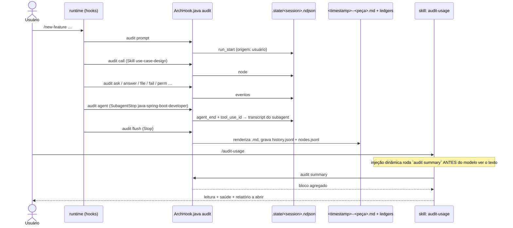

# Trilha de auditoria — hook `audit`, hook `guard` e `/audit-usage`

Fonte primária: `.claude/hooks/ArchHook.java` (métodos `audit()` e `guard()`),
`.claude/schemas/extensions.json` (blocos `audit` e `guard`),
`.claude/skills/project-bootstrap/templates/settings.json.example`,
`.claude/skills/audit-usage/SKILL.md`.

## O que é

Dois modos do mesmo hook, ambos ligados **só no projeto gerado** (o
`settings.json.example` que o passo 7 do bootstrap instala), nunca neste meta-repo:

| Modo | Pergunta que responde | Bloqueia? |
|---|---|---|
| `audit` | "Quantos tokens esta execução gastou, o que ela encadeou, o que tocou, o que falhou?" | Nunca |
| `guard` | "Uma skill de design tentou escrever em `src/`? Alguém tentou editar um spec aprovado?" | Sim (`exit 2`) |

A skill `/audit-usage` é o leitor da trilha: consolida gasto por peça entre execuções
e aponta qual relatório abrir. Ela não escreve nada.

## Por que é hook, e não skill

A decisão (`0035`, depois estendida em `0038`) foi tomada pelo eixo 7 da matriz de
decisão: **precisa acontecer sempre**, mesmo que o modelo esqueça, a sessão morra ou o
usuário dê Ctrl+C. Só um evento do ciclo de vida entrega isso. Uma skill que "renderiza
o relatório no fim" é persuasão onde havia garantia — e uma execução que morre no meio
não deixaria registro nenhum.

Consequência de custo: **zero tokens** para produzir o relatório. Nenhum corpo de skill
ou agent ganhou instrução de "registre-se"; o hook lê os eventos e o transcript.

## O interruptor

A trilha liga e desliga pela **existência do diretório** `.claude/audit-usage/`:

- `project-bootstrap` cria o diretório no passo 7.4 e escreve `GENESIS.md` no passo 8.6
  (o registro da própria geração, reconstruído a partir dos dados do bootstrap — não é
  um relatório do hook, e diz isso no cabeçalho).
- Sem o diretório, cada fase do hook retorna imediatamente. É assim que este meta-repo
  não paga nada por um modo que não usa: aqui `.claude/audit-usage/` não existe, e
  `/audit-usage` reporta corretamente que a trilha está desligada.
- Para desligar num projeto gerado: apagar o diretório. Para religar: `mkdir -p
  .claude/audit-usage` e garantir `.claude/audit-usage/.state/` no `.gitignore`.

## Eventos ligados (`settings.json.example`)

| Evento | Fase | O que registra |
|---|---|---|
| `UserPromptSubmit` | `audit prompt` | Abre uma execução se o prompt é `/<skill auditada>`; guarda o último prompt livre (redigido) para atribuir tokens à peça que o modelo abrir em seguida |
| `PreToolUse` `Skill\|Task\|Agent` | `audit call` | Nó de encadeamento; abre uma execução implícita (`origem: modelo`) se nenhuma está aberta |
| `PreToolUse` `AskUserQuestion` / `PostToolUse` `AskUserQuestion` | `audit ask` / `audit answer` | Espera pelo usuário, descontada da duração ativa; `audit answer` também guarda cada pergunta e a resposta — mascaradas por `audit.redact` e cortadas em 160 caracteres — na seção 💬 Asked do report (decisão 0094) |
| `PostToolUse` `Write\|Edit\|MultiEdit\|NotebookEdit` | `audit file` | Arquivo tocado |
| `PostToolUseFailure` | `audit fail` | Ferramenta que falhou (retrabalho) |
| `PermissionRequest` / `PermissionDenied` | `audit perm` | Permissão pedida ou negada |
| `SubagentStop` | `audit agent` | Fim de um agent; seus tokens vêm do transcript do próprio subagent |
| `PreCompact` | `audit compact` | Incidente de compactação de contexto |
| `StopFailure` | `audit stopfail` | Falha ao parar |
| `Stop` | `audit flush` | **Renderiza o `.md`** a partir do log append-only e grava a linha do ledger |
| `SessionEnd` | `audit close` | Fecha a execução em aberto |

O log de uma execução em andamento é `.claude/audit-usage/.state/<session>.ndjson`
(append-only, gitignored). Um `kill -9` durante uma escrita perde no máximo a última
linha; o Markdown é sempre reconstruído do log inteiro.

## O que é auditado

Qualquer nome que resolva para `.claude/skills/<n>/SKILL.md` ou
`.claude/agents/<n>.md` **do projeto**, invocado por `/comando` ou pela chamada
`Skill`/`Agent` do modelo. Skills de plugin (`caveman:*`) e agents do runtime
(`Explore`, `general-purpose`) ficam de fora por construção — não têm arquivo. Skills
pré-carregadas via `skills:` no frontmatter de um agent aparecem sob esse agent como
`preloaded`, sem tokens próprios.

Exceções, decididas pela classe em `extensions.json` → `skill_classes`, nunca por uma
lista: uma classe que declara `audited: false` não abre run próprio para nenhuma skill dela.

- **`observer`** — `audit-usage` e `arch-doctor`. Invocar um deles **fecha** a execução em
  andamento (que é o único jeito, dentro de uma sessão viva, de obter um relatório que não
  esteja `⏳ in progress`) e não abre execução própria. Sem isso, ler a trilha geraria um
  relatório sobre ler a trilha.
- **`ops`** — `git-publish`. O relatório próprio só poderia ser escrito depois do commit que
  ela faz, então todo publish terminaria com o tree sujo. Digitada como `/git-publish`, fecha
  antes a execução em andamento, e o relatório dessa execução entra no commit. Encadeada
  dentro de outra execução, continua como nó dela, com tokens próprios.
- **`arch-adopt`** — o único flag por peça: `audited: false` na própria entrada de
  `skill_classes.build.overrides`; os outros membros de `build` continuam auditados. Toda a
  saída dele é um `git diff` de `.claude/` entregue para revisão, e o passo 1 recusa tree
  sujo; um relatório próprio cairia nesse diff depois do export. Fixo upstream — o arquivo
  do projeto abaixo não religa.

### Por projeto: `.claude/audit-usage/audited.json`

Um dos dois arquivos de `.claude/` que um projeto gerado escreve para si (o outro é o
`plan-limits.json`, abaixo). O `export` nunca o nomeia,
então o `/arch-adopt` nunca mexe nele. Ausente → cada peça segue a classe, como acima.

```json
{ "skills": { "report-issue": false, "git-publish": true }, "agents": {} }
```

`false` tira a peça da trilha com a mesma semântica de `audited: false`; `true` devolve uma que
a classe deixa de fora — religar `git-publish` ou um observer traz de volta o que as exceções
acima evitam, e é decisão do projeto. Vence o primeiro boolean: o override da própria peça na
classe (`arch-adopt`), depois este arquivo, depois a classe. O `doctor` valida na linha
`Audit overrides` e falha pelo nome com qualquer chave além de `skills`/`agents`, valor que não
seja `true`/`false`, nome sem arquivo no projeto, ou `arch-adopt`. Decisão 0111.

### Por projeto: `.claude/audit-usage/plan-limits.json`

Quantas execuções de uma peça cabem na janela de 5 horas e na semanal de cada plano, como se
nada mais rodasse. A Anthropic não publica limite em tokens nem em dólares — só que o Max dá 5x
ou 20x o uso do Pro por sessão de 5 horas, e que os planos pagos têm limite semanal por cima,
sem multiplicador publicado. Então o orçamento é leitura do próprio projeto, só para o Pro, em
tokens billable — por exemplo, o total que o audit somou quando o `/usage` chegou a 100%:

```json
{ "pro": { "five_hour_tokens": 2000000, "weekly_tokens": 10000000 } }
```

Cada plano é esse orçamento × o multiplicador em `audit.plans` do `extensions.json` (fonte e
data em `audit.plans_source`), ÷ os tokens billable da execução, limitado também pelo relógio — a janela ÷ a
duração ativa, uma atrás da outra. A célula diz qual limite manda (`budget` ou `time`); semanal
de Max é `not published`. Aparece na seção `🪟 Plan windows` de cada relatório e, pela média de
cada peça, no `audit summary`. Ausente → o relatório diz que não há projeção. Como o
`audited.json`, o `export` nunca o nomeia, e o `doctor` valida na linha `Plan limits`: só `pro`,
só `five_hour_tokens` e `weekly_tokens`, número acima de 0 ou `null` — um `five_hour_usd`
escrito antes da decisão 0134 é recusado pelo nome. É uma estimativa: chat e outras sessões
dividem a janela real, e um token pesa igual em todo modelo aqui, o que não vale no plano.
Decisões 0133 e 0134.

## Anatomia de um relatório

Um `.md` por invocação de topo, em `.claude/audit-usage/<timestamp>--<peça>.md`. Desde a
decisão 0085 o hook escreve relatório, ledger e `audit summary` em inglês, como o resto do
`.claude/` gerado. Trecho de um relatório real do projeto de demonstração — a execução é
anterior à 0085, então os rótulos aparecem traduzidos e os números são os originais.
Relatórios gravados antes da 0085 continuam em português no disco:

```text
# 🧾 Execution audit — `/new-feature crie um novo endpoint rest para criacao da entidade account …`

| 🎯 Piece | `/new-feature` · skill |
| 🙋 Origin | user — `/command` |
| ⏱️ Duration | 2h55m35s |
| ⏸️ Waiting for the user | 2h44m33s |
| ⚙️ Active duration | 11m01s |
| ✅ Status | success |
| 🌿 HEAD | 871d25c → 871d25c |

## 🔗 Chain

/new-feature                                  ████████████████████ 11m01s   100%
├─ 📘 use-case-design (crie um novo endpoint  ████░░░░░░░░░░░░░░░░ 2m17s    21%
├─ 📘 domain-modeling (UC-002)                ██░░░░░░░░░░░░░░░░░░ 1m15s    11%
├─ 📘 rest-api-architect (UC-002)             ███░░░░░░░░░░░░░░░░░ 1m43s    16%
├─ 📘 persistence-architect (UC-002)          ██░░░░░░░░░░░░░░░░░░ 1m06s    10%
├─ 📘 test-architect (UC-002)                 ████░░░░░░░░░░░░░░░░ 2m25s    22%
└─ 🤖 java-spring-boot-developer              ██░░░░░░░░░░░░░░░░░░ 1m12s    11%

## 🧩 Tokens per piece

| Piece | Origin | 🤖 Model | 🧮 Own billable | ♻️ Cache read | 💾 Cache write | ⏱️ Duration |
| `📘 test-architect` | nested | … | 242,813 | … | … | 2m25s |
| `🤖 java-spring-boot-developer (group domain)` | nested | … | 88,517 | … | … | 1m12s |
…
```

Seções, na ordem: cabeçalho · comando inicial (redigido, com `sha256` do original) ·
etapas mais longas · encadeamento · tokens por peça · tokens agregados (input, output,
cache read, cache write, faturável, cache hit) · janelas dos planos · onde o run gastou ·
permissões adicionadas (diff de `settings.local.json` entre início e fim) · regras
carregadas · arquivos tocados · retrabalho.

**A última skill encadeada carrega a cauda de quem a chamou.** Um turno da thread principal
pertence à última peça que começou antes dele, e o runtime não emite evento nenhum quando
uma skill inline termina. Por isso tudo o que o orquestrador faz depois da última skill, até
o próximo agent ou skill, entra na linha dela. No fluxo de spec do `/new-feature`, isso é a
consolidação e a pergunta de aprovação, somadas ao `test-architect`. No exemplo acima, os
242,813 tokens do `test-architect` incluem essa cauda; num run real do UC-007, a maior parte
do que foi atribuído a ele era consolidação. O rodapé do relatório diz o mesmo. Uma execução de implementação é uma execução à parte: sai
reportada como `new-feature-implement` (arquivo `<stamp>--new-feature-implement.md`), não como
`new-feature`.
Design: `.claude/decisions/0118-skill-model-pin-audit-tail-and-bsd-sed.md`.

**Onde o run gastou** (`🔎 Where the run spent`) sai dos mesmos transcripts de onde vêm os
tokens — o principal e o de cada subagent —, então não custa evento de hook nenhum.
Responde o que os totais de token não respondem: em quais ferramentas uma peça se apoiou,
quais turnos foram os caros e quanto contexto uma única requisição carregou. Trecho, num
replay sobre o transcript de uma sessão real:

```text
### 🛠️ Tool calls per piece
| Piece | Calls | By tool | 📏 Peak context |
| `/demo` | 53 | Bash 30 · Read 9 · Edit 8 · Write 4 · AskUserQuestion 2 | 217,617 |

### 💸 Most expensive turns
| # | 🕐 When | Piece | 🧮 Billable | Tools called |
| 1 | 2026-09-30T08:27:45.193Z | `/demo` | 45,752 | Bash |

### 📏 Peak context
Largest single request: **217,617** tokens (input + cache read + cache write) — `/demo` at 2026-09-30T08:41:01.327Z.

## 💬 Asked
| # | Topic | Question | Answer |
| 1 | Contexto | Qual bounded context? | banking |

## 🔁 Rework
| Piece | Tool | × | First line of the error (redacted) |
| `/demo` | `Bash` | 3 | `exit 1 · …` |
```

Quatro decisões de desenho que o relatório declara em si mesmo:

- **Regras são inferidas, não observadas.** Nenhum evento de hook expõe qual `rule`
  entrou em contexto. O relatório cruza os arquivos tocados com o `paths` de cada norma
  e rotula a seção "inferred by territory" — as regras que *deveriam* ter carregado.
- **Duração de nó é atribuição por janela**: do início do nó até o próximo nó de mesma
  profundidade ou menor, com espera por `AskUserQuestion` descontada.
- **Tokens de agent vêm do transcript do próprio subagent**; tokens de skill no thread
  principal são as mensagens desde a chamada até a próxima peça. Somados, fecham o
  agregado — sem dupla contagem. Chamadas de ferramenta, pico de contexto e erros seguem
  a mesma atribuição.
- **Pico de contexto é número absoluto.** A janela de contexto do modelo não é escrita de
  memória, então o relatório nunca transforma o pico em percentual.
- **O que inflou o contexto é estimativa** (`📈 What grew the context`). Cada requisição relê o
  contexto inteiro, então o que o resultado de uma chamada acrescentou é pago de novo em cada
  requisição seguinte do mesmo transcript, até uma compactação. Acrescentado = contexto da
  próxima requisição menos o desta e o output dela, dividido entre as chamadas da requisição.
  A seção lista as `audit.growth_top` chamadas mais relidas (peça, tool,
  alvo — o path, ou a primeira linha do comando, redigida —, tokens acrescentados, quantas
  requisições releram, tokens relidos) e, por peça, uma linha por tool. É o que diz se o grupo
  `tests` de um executor gasta lendo código anterior, saída de diagnóstico ou ciclos de
  correção — os totais por peça não dizem (issue #111). Um lembrete do harness cai na chamada
  anterior a ele. Design: `.claude/decisions/0132-audit-per-piece-cache-and-context-growth.md`.

## Redação, e por que tokens

- **Redação é obrigatória.** O prompt vai para um arquivo versionado; um token colado
  nele seria irreversível no histórico do git (invariante 11). Os padrões vivem em
  `extensions.json` → `audit.redact`: `authorization|token|api_key|secret|password` como
  chave, prefixos `Bearer `, `ghp_`, `github_pat_`, `sk-`, `xoxb-`, `AKIA`, e blocos
  `PRIVATE KEY`. A primeira linha de cada erro de ferramenta passa pelos mesmos padrões,
  truncada em 160 caracteres — um erro pode ecoar o comando que carregava o token. Um
  `Bash` que falha começa com `Exit code N`; o relatório junta essa linha com a seguinte,
  que é o que de fato falhou.
- **Tokens, nunca dinheiro.** Todo número é token billable (input + output + cache write),
  com o modelo nomeado por peça. A trilha já precificou isso por um `pricing.json` preenchido
  a partir da página oficial; cada modelo que a Anthropic lançou apagou todo total até alguém
  reler a página — `claude-opus-5-5`, depois `claude-sonnet-5-5` uma semana depois —, um run
  fechado não podia ser re-precificado, e todo cache write saía na taxa de 5 minutos. Um token
  pesa mais num modelo maior, então leia a coluna `🤖 Model` antes de comparar dois runs; em
  dinheiro, quem responde por sessão é o `/cost` do próprio runtime. O próximo `/arch-adopt`
  apaga o `pricing.json` de um projeto. Decisão 0134.

## Os ledgers e o `audit summary`

| Arquivo | Uma linha por | Versionado? |
|---|---|---|
| `history.jsonl` | execução de topo (`kind`, `origin`, `model`, `status`, `tokens_billable`, `tool_calls`, `tool_calls_self`, `peak_context`, `peak_context_self`, `cache_read_self`, `cache_write_self`, `reread_self`, …) | sim |
| `nodes.jsonl` | peça encadeada dentro de uma execução (`run`, `parent`, `skill`, `model`, `detail` — a description da chamada do agent, o grupo de um executor encadeado —, `tokens_self`, `cache_read`, `cache_write`, `reread`, `tool_calls`, `peak_context`, `duration_ms`) | sim |
| `.state/*.ndjson`, `.state/*.prompt.json` | evento bruto da execução em andamento | não |

`tool_calls` é string, `Bash:5,Read:12`, porque os ledgers só carregam strings. Linha
gravada antes de um campo existir simplesmente não o tem, e todo leitor trata ausente como
desconhecido, nunca como zero. Linhas anteriores à decisão 0085 também trazem status em
português (`✅ sucesso`), que o `audit summary` classifica pelo emoji; linhas anteriores à
decisão 0134 trazem `cost`, `cost_usd` e `cost_self_usd`, que nada lê. As linhas antigas não
precisam de migração.

`java .claude/hooks/ArchHook.java audit summary` agrega os dois ledgers **na JVM** e
imprime um bloco compacto. É esse bloco que `/audit-usage` injeta no próprio corpo —
não o JSON cru, que cresce sem limite e deixaria a aritmética para o modelo. Saída do
projeto de demonstração (rótulos traduzidos, números originais; `Calls` e `Peak` saem `—`
para execuções gravadas antes dessas colunas existirem):

```text
closed runs: 4 · period: 2026-09-17T11:06:26Z → 2026-09-17T17:31:14Z · distinct pieces: 10

### Latest runs
| # | 🎯 Piece | 🙋 Origin | Status | ⏱️ Duration | 🧮 Billable | 🛠️ Calls | 📏 Peak | 📁 Files | 🔁 Failures |
| 1 | `Skill(git-publish)` | model | ✅ | 41s | 229,493 | — | — | 0 | 0 |
| 2 | `/new-feature` | user | ✅ | 11m01s | 530,831 | — | — | 11 | 0 |
| 3 | `Skill(domain-modeling)` | model | ⚠️ | 47m55s | 1,223,409 | — | — | 85 | 1 |
| 4 | `/new-feature` | user | ⚠️ | 1m39s | 68,633 | — | — | 1 | 1 |

### Spend per piece (own tokens — root + nested, never counted twice)
📘 test-architect                 ███████░░░░░░░░░░░░░░░░░░ 27%  282,316 tok   3× (0 root · 3 nested)
📘 git-publish                    ██████░░░░░░░░░░░░░░░░░░░ 23%  243,169 tok   2× (1 root · 1 nested)
📘 domain-modeling                ███░░░░░░░░░░░░░░░░░░░░░░ 11%  109,946 tok   2× (1 root · 1 nested)
🤖 java-spring-boot-developer     ██░░░░░░░░░░░░░░░░░░░░░░░ 9%   88,517 tok    1× (0 root · 1 nested)
…

### Where the pieces spent (tool calls, top 5 tools · largest single request)
(aparece quando fecha a primeira execução gravada por um hook a partir da decisão 0085)

### Health
failure rate: 2/4 (50%) · worst: 📘 domain-modeling (1/1)

### Open
most recent: `.claude/audit-usage/2026-09-17T17-31-14--git-publish.md`
most recent with failures: `.claude/audit-usage/2026-09-17T11-11-27--domain-modeling.md`
```

## `/audit-usage` — o leitor

| Argumento | Faz |
|---|---|
| vazio | Visão consolidada: o bloco acima, mais uma linha de leitura, onde as peças gastaram, a peça com pior taxa de falha e o relatório a abrir |
| `last` / `último` | Resume o relatório mais recente em até seis linhas |
| nome de skill ou agent | Linha dessa peça + seu relatório mais novo (o de uma peça aninhada é o do pai) |
| fragmento de nome de arquivo | O único relatório que casa; dois ou mais, lista e pergunta |

O que a skill nunca faz: recalcular um número que o bloco imprimiu, ler `.state/`,
editar ou apagar relatórios, dar preço a um token, citar um valor redigido.

## Diagrama de sequência



## Hook `guard` — as três fronteiras que deixaram de ser prosa

Território é **dado**, em dois blocos irmãos de `extensions.json`. `skill_classes`: cada skill
pertence a uma classe (`design`, `orchestrator`, `build`, `observer`, `meta`, `ops`), e a
classe declara o `write_allow`. `agent_classes`: o mesmo para cada agent (`driver`,
`executor`, `installer`), mais os campos de frontmatter que a classe exige e se ele pode
escrever alguma coisa. O bloco `guard` guarda só o resto:

```json
"use_cases_dir": "docs/use-cases",
"frozen_statuses": ["approved", "implemented", "implemented-blocked"]
```

| Fase | Evento | Efeito |
|---|---|---|
| `guard prompt` | `UserPromptSubmit` | Fecha a fase anterior; abre uma fase se o prompt é `/<skill>` de qualquer classe |
| `guard call` | `PreToolUse` `Skill\|Task\|Agent` | `Skill(<skill>)` abre a fase (nunca troca por outra skill da mesma classe); `Skill` de classe `blocked_during_design` com fase `design_phase` aberta → `exit 2`. Chamada `Agent` não muda nada, nem uma chamada `Skill` que carrega o `agent_type` de um agent com classe: ela não é recusada nem mexe na fase (decisão 0126) |
| `guard write` | `PreToolUse` `Write\|Edit\|MultiEdit\|NotebookEdit`, sem filtro de caminho | Regra 1: a escrita carrega um `agent_type` com classe → o caminho tem que estar no `write_allow` **daquele agent**, com ou sem fase aberta; caso contrário, fase aberta + caminho **fora** do `write_allow` da skill ativa → `exit 2`. Regra 2: pasta `UC-*` cujo spec está em `frozen_statuses` → `exit 2`, exceto três escritas: a linha `status:` do spec movida ao longo de `status_transitions` (`approved` → `implemented` ou `implemented-blocked`, e qualquer um de volta a `approved`), um toggle de checklist `[ ]` → `[x]` em qualquer dos três estados congelados, e o `CHANGELOG.md` da própria pasta (`frozen_exempt_basenames`) |
| `guard bash` | `PreToolUse` `Bash` | Lê o comando atrás das formas de escrita de `guard.bash_write_shapes` (`>`/`>>` redirects, `tee`, `sed -i`, `cp`, `mv`…) e aplica as Regras 1 e 2 a todo alvo que consegue ler literalmente; alvo com `$`, crase ou glob é pulado. Force push em qualquer grafia de `guard.force_push` → `exit 2` |
| `guard sweep` | `Stop` | Compara a árvore de trabalho com o baseline que `guard prompt` tirou e roda as Regras 1 e 2 sobre o que mudou e nenhum guard de tool-time já admitiu, qualquer que seja a tool que escreveu — detecção, não prevenção; caminho que o git ignora nunca é varrido |

Por que existe: uma skill de design escreveu migrations em `src/`; um caso de uso posterior
reescreveu os specs de um anterior; e um run de design escreveu um serviço
`schema-registry` no `docker-compose.yml` — as três coisas enquanto as skills proibiam em
prosa (`lessons-learned-005`, `lessons-learned-012` §§ 12, 13). A terceira é a razão de o
modelo ser allowlist e não denylist: `docker-compose.yml` não está em `src/**`, e o arquivo
que vaza nunca é o que alguém listou. Reabrir um spec nunca implementado continua
deliberado: `status: draft` à mão.

Sem fase aberta não há restrição — uma pessoa editando um arquivo à mão não é uma skill
saindo do território. E `schema` valida o outro lado do mesmo dado: toda `SKILL.md` e todo
`.claude/agents/*.md` no disco tem que estar em exatamente uma classe, declarar
`**Class:** <c>` no corpo e trazer as seções que a classe exige — no caso do agent, também os
campos de frontmatter (`model` e `tools` sempre) e nenhum `permissionMode: bypassPermissions`.

**Armadilha encerrada, mantida porque a forma se repete.** `Skill(test-architect)` abria uma
fase e `Agent(commons-logging-installer)` fechava uma; disparadas no mesmo turno eram dois
hooks `PreToolUse` sem ordem garantida, e o perdedor bloqueava toda escrita em `src/` do outro
agent pelo resto da execução (138k tokens, zero arquivos escritos). `agent_classes` removeu o
mecanismo, não só o sintoma: a escrita de um subagent é julgada pelo `agent_type` dela, então
nenhuma fase a alcança e nada fecha fase numa chamada `Agent`. A lição que sobrevive é a
geral — dois processos de hook independentes no mesmo turno não têm ordem, logo nenhuma
fronteira pode depender de qual deles rodou primeiro.

## O que `doctor` mostra

`/arch-doctor` traz duas linhas sobre a trilha: `Audit` (quantas execuções registradas) e `Audit rule inference` (um arquivo sintético que casa com
o `paths` de uma norma real — a forma exata que uma vez lançou
`ArrayIndexOutOfBoundsException` dentro da inferência e congelou todo relatório dali
em diante, em silêncio). Sem o diretório: `⚪ no .claude/audit-usage/ — execution trail
OFF (optional)`.
