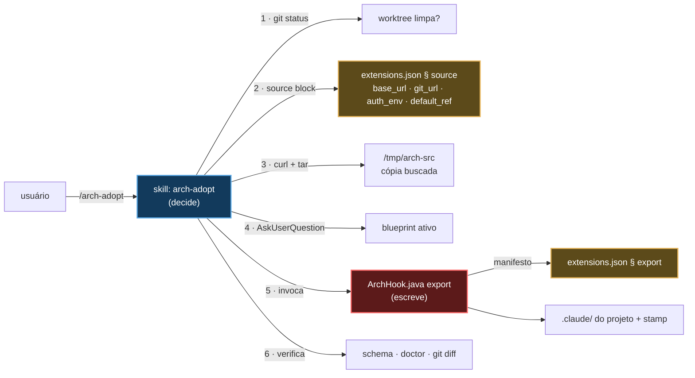

# `/arch-adopt` — instalar e atualizar o `.claude/` em um projeto existente

Fonte primária: `.claude/skills/arch-adopt/SKILL.md`, `.claude/hooks/ArchHook.java`
(modo `export`), blocos `source` e `export` de `.claude/schemas/extensions.json`.
Decisão: `@.claude/decisions/0054-deterministic-export-provenance-plugin.md`.

## O que faz

Traz esta arquitetura para dentro do projeto em que a sessão está aberta. Uma operação,
dois estados de partida:

| Estado de partida | O que acontece | Como a skill sabe |
|---|---|---|
| Projeto nunca gerado por `/init-project`, sem `.claude/` desta forma | **Instala** | não existe `.claude/.arch-provenance.json` |
| Projeto já tem o `.claude/` e está atrasado | **Atualiza** | o stamp existe e aponta para um ref anterior |

Não são dois comandos. A diferença é o stamp de proveniência, e o resto do procedimento é
o mesmo.

É a única skill de criação que **viaja** para dentro do projeto gerado. `/init-project`,
`project-bootstrap` e `/claude-code-architect-designer` ficam fora
(`export.skills.exclude`) porque só servem antes do projeto existir. Esta fica porque é
como um projeto se atualiza depois — inclusive quando o plugin que o entregou não está
mais instalado na máquina de quem clonou.

## A divisão de trabalho, e por que ela existe



**A skill não escreve nenhum arquivo.** Ela responde três perguntas que um modo
determinístico não consegue responder — qual fonte, qual blueprint, e se é seguro
escrever — e sai da frente. Todo byte é escrito pelo modo `export`, a partir de um
manifesto de dados.

Essa separação é o que substituiu o modelo anterior, em que as tabelas de cópia viviam em
prosa dentro de `project-bootstrap/SKILL.md` §§ 6.6–6.8: uma tabela em markdown é copiada
por um modelo, linha a linha, e a linha que ele esquece não quebra a geração — quebra para
quem clona o projeto depois e segue uma citação para um arquivo que nunca foi copiado.

## As três garantias do procedimento

1. **Recusa worktree suja.** Não é repositório git, ou `git status --porcelain` não veio
   vazio → para. Uma atualização sobrescreve: `git diff` é como a pessoa revisa e
   `git checkout` é como desfaz. Sem árvore limpa, nenhum dos dois funciona. A skill diz o
   que rodar e **não** comita por conta própria.
2. **Nenhum dos quatro valores de `source` escrito de memória.** `base_url`, `git_url`,
   `auth_env` e `default_ref` são dados — é por isso que existem num bloco. Trocar o
   GitHub por um endpoint de licenciamento muda dois campos, nunca o caminho de código
   que os consome. `auth_env` nomeia uma variável de ambiente e nunca carrega o valor
   (invariante 11); o header só é enviado quando a variável está setada, então repositório
   público não precisa de credencial.
3. **A proveniência é escrita, não prometida.** O stamp `.claude/.arch-provenance.json`
   registra ref, sha, blueprint e o hash de cada arquivo escrito. A linha `Provenance` do
   `/arch-doctor` compara esses hashes com o disco e **nomeia os arquivos editados
   localmente antes** de a próxima atualização sobrescrevê-los. Em um projeto com stamp,
   rode `/arch-doctor` primeiro e ponha essa lista na frente do usuário.

## O que viaja, e o que não viaja

Tudo isto é o bloco `export` de `@.claude/schemas/extensions.json` — dado, não prosa:

| Grupo | Conteúdo |
|---|---|
| `copy` | `ArchHook.java`, `extensions.json`, o exemplar de `audit-pricing.json` |
| `binary_copy` | `ArchHook.jar` — o que todo hook dispara, copiado como bytes, nunca transformado |
| `overwrite` | o `settings.json` do projeto, do template de `project-bootstrap` |
| `optional_copy` | `.mcp.json` e o doc de setup de MCP, quando existem |
| `rules` | todas as normas de `rules/`, com os globs de `paths` reescritos para os pacotes do blueprint ativo (`derived_paths`) |
| `skills` | as 14 skills de desenvolvimento (`include`); as 3 de criação ficam fora (`exclude`) |
| `agents` | `java-spring-boot-developer`, `archunit-installer`, `commons-logging-installer`; `project-initializer` fica fora |
| `blueprint_copy` | **só o blueprint ativo**, nunca o catálogo |
| `ensure_dirs` | `.claude/audit-usage/` — criar o diretório é o que liga a trilha |
| `gitignore_lines` | `.claude/audit-usage/.state/` e `docs/lessons-learned/` |
| `body_transforms` | corta citações a `.claude/decisions/` (que não existem dentro do projeto) e reescreve as frases que dependem do blueprint |
| `retired` | arquivos que este repositório renomeou ou removeu (uma rule, a antiga skill `java-patterns/`), apagados do alvo quando presentes — o `export` só escrevia, então sem isso um projeto adotado ficava com as duas cópias |

Duas decisões desse manifesto que parecem inconsistências e não são:

- **O blueprint ativo viaja; o catálogo não.** Sem isso, o YAML que define a arquitetura
  do projeto só existiria no diretório temporário buscado: o stamp grava o id, a próxima
  atualização lê esse id, a fonte não o tem, e o export falha num ponto em que ninguém
  foi avisado de guardar arquivo nenhum.
- **`.claude/audit-usage/` é versionado; `docs/lessons-learned/` não é.** Os relatórios
  pertencem ao commit da execução que os produziu. As notas de execução são locais, e um
  run que recria uma nota apagada escreve texto diferente que ninguém compara.

`ArchHook.java schema` verifica esse manifesto contra o disco: toda skill e todo agent
precisa estar em `include` **ou** em `exclude` — não listar é o bug, e o modo falha pelo
nome. Uma norma com território de pacote precisa de entrada em `derived_paths`, ou o glob
copiado literalmente deixa a rule sem carregar, em silêncio.

## Invocação e saída (exemplo fictício)

```
/arch-adopt --ref latest-tag --blueprint hexagonal
```

```
✅ updated — blueprint hexagonal, ref v0.9.3 (a1b2c3d)

Source ....... codeload.github.com, fetched at 14:22
Files ........ 136 written · 118 unchanged · 4 overwritten
Warnings ..... none
Schema ....... exit 0
Provenance ... ⚠️ 2 files edited locally since the stamp:
               .claude/rules/persistence.md
               .claude/settings.json

Review: git diff · Undo: git checkout -- .claude
Next: /arch-doctor for the full diagnosis
```

`--source <caminho local>` ignora o bloco `source` inteiro e usa uma árvore da máquina —
é assim que se testa uma mudança ainda não publicada.

## Modo `export` à mão

O modo é invocável direto, e é o que a skill chama:

```bash
java .claude/hooks/ArchHook.java export <dest> --blueprint <id> [--ref <label>] [--dry-run]
```

`--dry-run` lista o que escreveria e não escreve nada. Rodar duas vezes no mesmo destino
produz árvores byte-identical fora do stamp — determinismo verificado nos 7 blueprints
oficiais a cada mudança do manifesto.

## O que este comando não faz

- **Não gera projeto.** Sem `pom.xml`/`build.gradle`, é `/init-project` que você quer.
- **Não escreve código de negócio**, nem toca `src/`.
- **Não escreve fora do `.claude/` por conta própria.** Quando o build file não tem o
  scanner do SonarQube, o último step encadeia `sonarqube-setup`, que escreve o build file e
  o workflow sob o território dela. Numa instalação, rode `/reload-skills` antes — o
  diretório da skill não existia quando a sessão começou.
- **Não comita.** Deixa a árvore com o diff pronto para revisão, e diz como desfazer.
- **Não pergunta blueprint quando o stamp já registra um** — numa atualização, o
  blueprint ativo é um fato do projeto, não uma pergunta nova.
