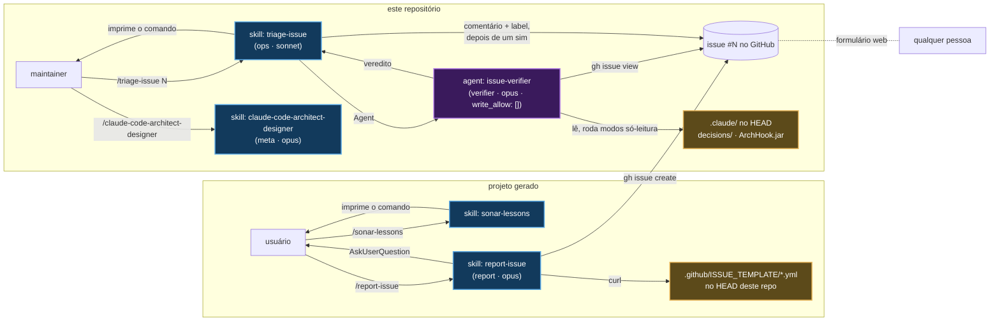
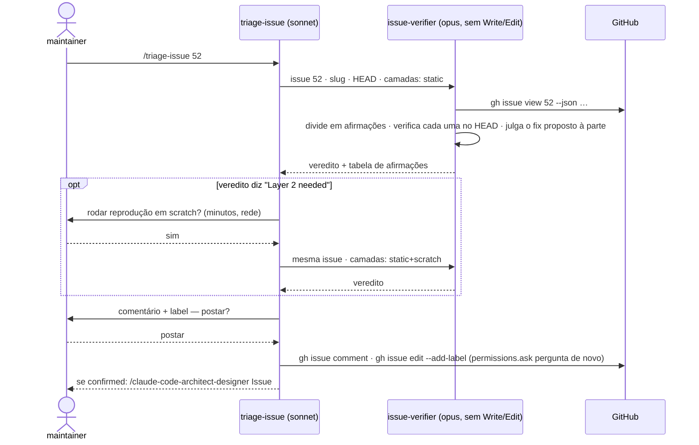

# Issues — `/report-issue` no projeto gerado, `/triage-issue` aqui

Fontes primárias: `.claude/skills/report-issue/SKILL.md`, `.claude/skills/triage-issue/SKILL.md`,
`.claude/agents/issue-verifier.md`, `skill_classes.report` / `skill_classes.ops` /
`agent_classes.verifier` em `.claude/schemas/extensions.json`, `permissions.ask` em
`.claude/settings.json`. Registro: `@.claude/decisions/0103-issue-filing-and-skeptical-triage.md`.

## O que resolve

Um defeito num template, numa norma ou num hook aparece no projeto gerado, mas a correção
pertence a este repositório: corrigir no projeto conserta um projeto; corrigir no dono conserta
todo projeto gerado depois. Duas metades, uma de cada lado da fronteira:

| Lado | Comando | Quem digita | O que faz |
|---|---|---|---|
| Projeto gerado | `/report-issue <descrição \| docs/lessons-learned/arquivo.md>` | o usuário do projeto | Abre neste repositório uma issue verificável e sem dados do projeto |
| Este repositório | `/triage-issue <N>` | o maintainer | Verifica cada afirmação da issue `<N>` contra o `HEAD` antes de qualquer mudança |

O repositório é público, então qualquer pessoa abre issue — pelo formulário web ou pelo
`/report-issue`. Uma issue traz um diagnóstico e, muitas vezes, um fix. **Nenhum dos dois é
entrada.** Só segue adiante o que foi verificado contra o código: no comentário que o autor lê,
e no design que muda `.claude/`.

## O fluxo inteiro



Toda seta que entra numa skill manual é **uma pessoa digitando um comando**: o `sonar-lessons`
imprime `/report-issue …`, o `triage-issue` imprime `/claude-code-architect-designer …`. As três
têm `disable-model-invocation: true`, então o model não as encadeia pelo `Skill` tool — o único
caminho é humano. É o desenho, não uma limitação: no projeto gerado, só o usuário cria issue;
aqui, o texto de uma issue pública nunca chega ao território de escrita sem o maintainer ler o
veredito antes.

## `/report-issue` — dentro do projeto gerado

| Passo | O que acontece | Para quando |
|---|---|---|
| 1 · Entrada | Uma descrição livre, ou um arquivo em `docs/lessons-learned/` (um `sonar-NNN.md` vai para o formulário do Sonar) | nada informado depois de uma pergunta |
| 2 · Versão | `ref`/`commit`/`blueprint` de `.claude/.arch-provenance.json`; a última tag via `git ls-remote --tags` | sem stamp — não é projeto deste repositório |
| 3 · Formulário | `bug_report.yml`, `feature_request.yml` ou `sonar-lessons.yml`, buscado do `HEAD` deste repositório — prefixo do título, labels e campos vêm do formulário, nunca da skill | o formulário não responde |
| 4 · Evidência | Bug: ponto de entrada, o arquivo de `.claude/` que promete o comportamento (citado), a saída literal, os passos. Feature: uma ocorrência concreta. O que falta é perguntado uma vez | ainda falta depois da resposta — nada é escrito |
| 5 · Corpo | `docs/lessons-learned/<nome>.issue.md`, um `### <label>` por campo do formulário; passada de privacidade — sem path de `src/`, pacote, classe, trecho de código, project key ou host privado | — |
| 6 · Pergunta | Duplicatas encontradas (`gh issue list --search`), o aviso de "atrás da última release", as reescritas de privacidade; *criar* / *vou editar antes* / *não publicar* | `gh` sem login — o arquivo do corpo é a entrega |
| 7 · Criação | `gh issue create --body-file …`; o resultado vai para a linha `## Issue` do arquivo de entrada | — |

Estar atrás da última release é **aviso**, não parada: o defeito pode continuar aberto aqui, e
o `/arch-adopt` é citado como o jeito de trazer o fix se não estiver.

O `/sonar-lessons` não publica mais. O passo 6 dele escreve
`not filed yet — /report-issue docs/lessons-learned/sonar-NNN.md` e termina com esse comando: a
regra de privacidade e a busca de duplicatas têm um dono só.

## `/triage-issue` — neste repositório



### Como o verificador checa uma afirmação

| Tipo | A checagem mais barata que decide |
|---|---|
| `file` | Lê no `HEAD`, cita `path:linha`; `git log <ref do autor>..HEAD -- <path>` para *already fixed* |
| `hook` | Roda o modo com a entrada que a afirmação descreve (`java -jar .claude/hooks/ArchHook.jar <modo>`), com `session_id` próprio |
| `template` | Estática primeiro; compilar é camada 2 |
| `behavior` | O que um model fez numa execução não se reproduz com uma execução. Checagem estática: o arquivo que a skill lê manda mesmo fazer o passo, sem ambiguidade? |
| `fix` | Julgado à parte — invariante que quebra, decisão que contradiz, sintoma vs dono, guarantee sem falha observada. Nunca é evidência do sintoma |

**Camada 2** — só depois do sim do maintainer: um `export` de projeto gerado num diretório de
scratch fora do repositório, mais o starter do Initializr e um build quando a afirmação é sobre
código compilado.

### Vereditos

O primeiro que casar vence.

| Veredito | Label | Significado |
|---|---|---|
| `duplicate` | `duplicate` | Outra issue cobre o mesmo sintoma confirmado |
| `already-fixed` | `triage:already-fixed` | Verdade na versão do autor, falso no `HEAD` — o commit é citado |
| `by-design` | `triage:by-design` | Uma decision escolheu isso, e a issue não traz fato que o registro não pesou |
| `confirmed` | `triage:confirmed` | O sintoma central reproduziu — por arquivo, modo ou build |
| `not-reproduced` | `triage:not-reproduced` | O sintoma central foi checado e é falso no `HEAD` |
| `needs-evidence` | `triage:needs-evidence` | Nada decisivo pôde ser checado; o item que decidiria é nomeado |

O `needs-evidence` existe para que um verificador cético não feche um bug real só porque não
reproduziu uma vez. As labels `triage:*` são criadas à mão na primeira vez (`gh label create`);
a skill posta o comentário e diz qual label falta.

### De um veredito confirmado ao design

O `triage-issue` imprime `/claude-code-architect-designer Issue #N, triaged at <sha>: <sintoma>`.
Digite **na mesma sessão**: o designer usa as linhas confirmadas do verificador como a seção
*Reproduced on disk* do registro de decisão (o formato da `0101`), e trata linhas refutadas, não
provadas e o fix proposto como não-entradas. Ele nunca busca a issue sozinho — sem a tabela na
conversa, pede para rodar `/triage-issue <N>` antes. Detalhes em
[06-claude-code-architect-designer.md](06-claude-code-architect-designer.md).

## Por que é assim

| Escolha | Motivo |
|---|---|
| O corpo da issue é lido por um **agent**, não pela skill | Aqui a thread principal tem o território `meta` (`.claude/**`, `CLAUDE.md`, `.github/**`). Uma instrução escondida numa issue — um comentário HTML é invisível na web e lido inteiro pelo model — encontraria um model capaz de reescrever um hook. Invariante 5, motivo 2: restringir tools |
| Classe `verifier`, `write_allow: []` | O `guard` julga as escritas de um subagent pelo `agent_type`, via `Write`, `Edit` e `Bash`, qualquer que seja a fase aberta. Provado pelo `AgentTerritoryTest` |
| `permissions.ask` em `gh issue comment\|edit\|close` e `gh api` | O `Bash` do verificador alcança a rede. Toda escrita no GitHub pede confirmação humana — inclusive uma que a issue tenha arrancado do agent |
| `triage-issue` em `sonnet` | Repassa, pergunta e publica; o julgamento é do verificador, em `opus` |
| Sem GitHub Action | Um secret no repositório, custo por issue aberta por qualquer pessoa, e um model lendo texto de atacante com token do repo. Reavaliar depois que a triagem manual tiver rodado em issues externas reais |
| O `report-issue` recusa relato sem evidência | O outro lado faz triagem cética; uma afirmação que ninguém consegue checar só termina como `needs-evidence` |

## Exemplos de relatório

```
✅ Report issue — bug_report.yml · v0.12.0 (8dd87c9) · clean-architecture-single-module · behind v0.12.1

Body ........ docs/lessons-learned/issue-001.issue.md
Duplicates .. none open
Issue ....... https://github.com/nerviz-ai/nerviz/issues/52
```

```
✅ Triage #52 — confirmed · checked at abc1234 · layers static

Claims ...... 2 confirmed · 1 refuted · 0 unproven
Fix ......... symptom only
Posted ...... comment + triage:confirmed
Next ........ /claude-code-architect-designer Issue #52, triaged at abc1234: guard bash lets `tee -a` into .claude/rules/ through
```

## Armadilhas

- **`/clear` entre o `/triage-issue` e o designer** perde a tabela verificada; o designer pede
  para rodar a triagem de novo.
- **O `settings.json` é lido na inicialização.** As linhas de `permissions.ask` valem depois
  de reiniciar o `claude`.
- **Projetos exportados antes da `0103`** ainda têm o `sonar-lessons` antigo, que busca o
  `sonar-lessons.yml` sozinho. O formulário continua no mesmo path; o step de CI
  `issue forms cited by skills exist` falha se um formulário citado por uma skill sumir.
